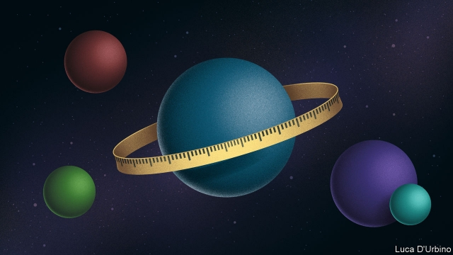

###### Exoplanets

# Astronomers are probing faraway planets with greater sophistication 

 

> print-edition iconPrint edition | Science and technology | Aug 3rd 2019 

IN THE DELUGE of planets found beyond the solar system over the past decade, those of system TOI-270 might not seem special. There are three of them, orbiting a star 73 light-years away. This is neither the closest system known, nor does it contain the most Earthlike exoplanet. It has, though, sent a buzz through astronomy. 

TOI-270 was discovered earlier this year by the Transiting Exoplanet Survey Satellite, TESS, an American instrument launched in 2018. (TOI stands for TESS object of interest.) Its innermost world is a super-Earth, a rocky planet a little bigger than Earth that scurries around its parent star once every three days. Farther out, at orbits of around six and 11 days, are a pair of larger objects known as mini-Neptunes. Having representatives of these two types of planet in a single system is a valuable find. It should help astronomers understand a bit better how different sorts of planet form. 

The proximity of TOI-270 to Earth means that it is within range of instruments such as the Hubble Space Telescope, making detailed follow-up studies possible. These will improve estimates of the planets’ sizes and better calculate their masses—information that will show what they are made of. TOI-270 is thus, in the words of Maximilian Günther, an astronomer at the Massachusetts Institute of Technology (MIT), an “exceptional laboratory” that will help answer some of the biggest questions in the rapidly growing science of exoplanetology. These include: why do planets form in the sizes they do? How does the solar system fit into a wider galactic context? And, is there life beyond Earth? 

Dr Günther does, admittedly, have skin in the game. He is the lead author of the study that describes the new star system, published this week in Nature Astronomy. That publication was timed to coincide with a gathering, in Cambridge, Massachusetts, of astronomers, chemists, biologists, geologists and others to discuss the results of TESS’s first year of operation. 

TESS is a pathfinder. It discovers nearby planetary systems so that other instruments may study them. It locates its quarry by looking for characteristic dips in a target star’s light caused by planets passing in front of that star. So far, it has found 24 planets the existence of which has been confirmed by other means, and a further 1,000 possibles that are waiting to be checked. It is expected to find thousands more, perhaps tens of thousands, over the course of its four-year mission. 

As astronomers have catalogued planets found by TESS and other instruments, they have spotted both patterns and puzzles. There are, for instance, lots of super-Earths and lots of mini-Neptunes. But there is a gap between them. Few planets are known that have between one-and-a-half times and twice the diameter of Earth. 

This so-called “Fulton gap”—named after Benjamin Fulton, a PhD student who noticed it in 2017—could have several explanations. Possibly, planets on either side of the gap are different sorts of object. Super-Earths might be born from dust and rocks, and be kept small by a lack of suitable material from which to grow, while mini-Neptunes, constructed of commoner materials such as ice, can grow much larger. Alternatively, all planets may form in the same way, as mini-Neptunes with rocky Earthlike cores surrounded by thick atmospheres of hydrogen and helium. Some, though, may subsequently have most of their atmospheres blown away by the radiation from their parent star, a process known as photoevaporation. 

In the view of James Owen, an astrophysicist at Imperial College, London, TOI-270 presents a way to test the photoevaporation hypothesis. Comparing planets orbiting different stars is hard, because it is impossible to know how much high-energy radiation they have received in the past from their stellar parents. But all three objects in TOI-270 have had the same history in this regard, so Dr Owen has been able to remove that uncertainty and predict what the minimum masses for the outer planets should now be, if the photoevaporation hypothesis is indeed correct. If all TOI-270’s planets started as mini-Neptunes, he says, the two outermost should now weigh at least 1.8 and 1.3 Earth masses respectively. Planned measurements should soon tell him if he is correct. 

Most of the systems that TESS will catalogue are expected to be orbiting small, red stars known as M-dwarfs. Courtney Dressing, of the University of California, Berkeley, says that planets around these stars could be excellent places for life to develop because M-dwarfs are extremely long-lived and are stable once they reach maturity. They do, however, reach that maturity only after a stroppy adolescence involving intense bouts of activity, regular flares and the release of huge amounts of energy and charged particles. 

All this radiation would be bad for any life that had already developed on a nearby planet, but might, paradoxically, encourage life to emerge in the first place. Some think that ultraviolet light falling on the early Earth provided the energy needed to make the complex organic molecules that were life’s precursors. Mature M-dwarfs do not produce enough ultraviolet for this to happen. But adolescent ones might. 

Back at MIT, Dr Günther has spotted hundreds of flares on M-dwarfs being scrutinised by TESS—some of which made the stars temporarily 30 times brighter than normal. These data, along with measurements from other observatories, provide details of flares’ probable impacts on exoplanetary atmospheres and will allow Drs Günther and Dressing to test their theories. 

TESS will also provide a catalogue of interesting targets, like TOI-270, for study by future missions. One of these, CHEOPS (Characterising Exoplanet Satellite), will be launched this autumn by the European Space Agency, ESA, with the aim of measuring the precise sizes of as many super-Earths and mini-Neptunes as possible. These data, combined with knowledge of objects’ masses, will lead to a better understanding of what particular planets are made of. Gassy planets will have low densities. “Water worlds” will have rather higher ones. Higher still will be the densities of rocky worlds made principally of silicates. The highest of the lot will belong to those planets made mainly of iron. 

After CHEOPS, ESA’s next planet hunter will be PLATO, a bigger version of TESS—so big, indeed, that it will be sensitive enough to look for terrestrial bodies that, like Earth itself, orbit at longer periods around bright sun-like stars. Oliver Shorttle of Cambridge University reckons that, using PLATO and its successors, astronomers are likely, within three or four decades, to have found all the planets in the nearest portion of the galaxy to Earth. And this will allow the $64,000 question to be answered: how propitious are astronomical circumstances for the development of life? 

With an extensive sample of this sort it should be possible to estimate how many Earthlike worlds exist in the galaxy, and what fraction of those are located at a distance from their parent star that might permit liquid water to form on their surfaces. Meanwhile, astronomers and geologists will be scrutinising those examples that have turned up within the range of the telescopes then available, in a bid to understand how their climates work, look for chemical signatures of life, and watch for weather and geological events such as volcanic eruptions. “If we find these alien Edens,” says Dr Shorttle, “how could we not stop and stare?”■ 

