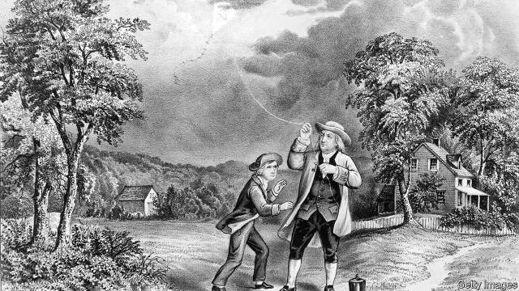

###### Alternative energy sources

# How to wring power from the night air 

 

> print-edition iconPrint edition | Science and technology | Aug 3rd 2019 

SOLAR POWER is all very well, but it is available only during daylight hours. If something similarly environmentally friendly could be drawn on during the hours of darkness, that would be a great convenience. Colin Price, an atmospheric scientist at Tel Aviv University, in Israel, wonders if he might have stumbled across such a thing. As he told a meeting of the International Union of Geodesy and Geophysics, held in Montreal in July, it may be possible to extract electricity directly from damp air—specifically, from air of the sort of dampness (above 60% relative humidity) found after sundown, as the atmosphere cools and its ability to hold water vapour diminishes. 

Dr Price’s apparatus is a pair of concentric metal cylinders. The outer cylinder is earthed while the inner one is not, creating a capacitor. Passing suitably moist air through the inner cylinder causes that cylinder to accumulate electric charge, thus creating a potential difference between the cylinders which could be harnessed to drive a current through an external circuit. 

In effect, and at an extremely small scale (so far, a maximum of just under a volt), Dr Price thinks he has tamed lightning—which is surprising, in a way, because no one truly knows how lightning works. As Dr Price himself observes, “Thunderstorms produce electricity...But if they didn’t know it, theoreticians would never predict lightning to exist on Earth. They might predict clouds forming, but not a 10km-high spark, building in half an hour out of nothing.” 

One thing that is known about lightning, however, is that it requires water to be present in all three states of matter: solid, liquid and vapour. Dr Price suspects that in his experiment the surface of the inner cylinder is taking on the role played in a thunderhead by water’s solid phase, ice. His comparison of different metals’ effectiveness in that role—zinc is best, copper is useless—may help elucidate the details of the process, not only in his putative generator, but also in a natural thunderstorm. 

His hypothesis is that things start when water droplets condense out of the humid air and onto the metal surface. Though water consists mostly of molecules of hydrogen and oxygen (H2O), at any given time a few of those molecules will have broken up spontaneously into positively charged hydrogen ions (H+) and negatively charged hydroxyl ions (OH-). These two types of ion will then move through a droplet at different rates, depending on the nature of the surface to which the droplet is attached, separating the positive and negative charges within that droplet. This charge separation will, in turn, induce a charge on the surface of the cylinder, and thus a potential difference in the capacitor. 

Having established the principle, the question Dr Price now faces is whether he can scale things up to a useful degree. This will involve tinkering with cylinders made from various combinations of metals and metal alloys, and also playing with the configurations of the cylinders with respect to one another. That there actually is, out there, a combination of substance and geometry which will yield useful amounts of electricity is, perhaps, a long shot. But, given the power of lightning itself, it certainly seems worth looking into.■ 
<<<<<<< HEAD

-- 

 单词注释:

1.wring[riŋ]:n. 扭绞, 拧, 挤 vt. 拧, 绞, 扭, 勒索, 折磨, 使痛苦 vi. 蠕动, 扭动, 绞, 扭, 感到痛苦 

2.Aug[]:abbr. 八月（August） 

3.environmentally[]:adv. 有关环境方面 

4.colin['kɔlin]:n. 科林（男子名） 

5.tel[tel]:abbr. 试验仪器清单（Test Equipment List） 

6.Aviv[ɑ:'viv]:n. 大自然的重生 n. (Aviv)人名；(俄)阿维夫 

7.Israel['izreil]:n. 以色列, 以色列后裔, 犹太人 

8.geodesy[dʒi:'ɒdisi]:n. 测地学 [医] 地势, 测地学 

9.geophysic[]:[网络] 地球物理探测 

10.montreal[,mɔntri'ɔ:l]:n. 蒙特利尔（加拿大东南部港市） 

11.extract[ik'strækt]:n. 榨出物, 精汁, 摘录, 选段 vt. (费力地)取出, 采掘, 榨取, 摘录, 吸取 [计] 提取 

12.dampness[]:[建] 湿度, 潮湿 

13.humidity[hju:'miditi]:n. 湿气, 潮湿, 湿度 [计] 湿度 

14.sundown['sʌndaun]:n. 日落, 阔边女帽 

15.diminish[di'miniʃ]:v. (使)减少, (使)变小 

16.concentric[kɒn'sentrik]:a. 同中心的, 同轴的 [医] 同心的, 共心的 

17.cylinder['silindә]:n. 圆筒, 圆筒状物, 汽缸, 柱面 [计] 柱面 

18.capacitor[kә'pæsitә]:n. 电容器 [化] 电容器 

19.suitably['sju:tәbli]:adv. 合适地, 适当地, 相配地 

20.theoretician[.θiәri'tiʃәn]:n. 理论家 

21.thunderhead['θʌndәhed]:n. 雷雨云砧 

22.effectiveness[i'fektivnis]:n. 效力 [经] 有效性, 能行性 

23.elucidate[i'lu:sideit]:vt. 阐明, 说明 

24.putative['pju:tәtiv]:a. 推定的, 被公认的 [法] 被公认的, 推定的, 假定的 

25.hypothesis[hai'pɒθәsis]:n. 假设 [化] 假设 

26.droplet['drɒplit]:n. 小滴 [医] 小滴 

27.spontaneously[]:adv. 自发, 一时冲动, 出自自然, 不依赖人工, 自然产生, 本能, 自动, 自然而优雅 

28.positively[]:adv. 明确地, 肯定地, 无疑地, (非正式)确实地, 真正地 

29.ion['aiәn]:n. 离子 [化] 离子 

30.negatively['ne^әtivli]:adv. 否定地, 消极地 

31.hydroxyl[hai'drɒksi]:n. 氢氧根 [医] 羟[基], 氢氧基 

32.induce[in'dju:s]:vt. 引诱, 招致, 归纳出, 感应 [医] 诱导, 感应 

33.tinker['tiŋkә]:n. 补锅匠, 会做各种修补活计的人 vi. 做焊锅匠, 笨拙的修补 vt. 修补 

34.configuration[kәn.figju'reiʃәn]:n. 结构, 表面配置, 外形, 配置 [计] 配置 
=======
>>>>>>> 50f1fbac684ef65c788c2c3b1cb359dd2a904378

