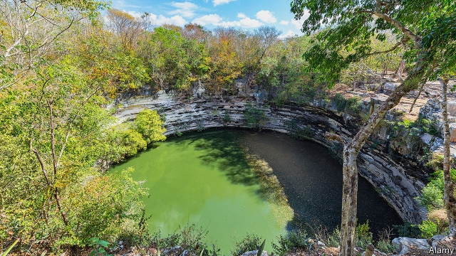

###### Archaeology

# Who did the Maya sacrifice? 

 

> print-edition iconPrint edition | Science and technology | Aug 3rd 2019 

THE SACRED CENOTE, a sink hole in the limestone of the Yucatán peninsula in Mexico, pictured above, looks beautiful. But it holds a dark secret. Between about 600 and 900AD the Mayan inhabitants of the nearby city of Chichén Itzá, believing it to be a gateway to the underworld, filled the pool with sacrificial riches to the gods: gold, jade, incense, pottery—and people. Those victims, judging by their bones, were often young (half being under 18), and, though more often male than female, were well representative of both sexes. 

On the assumption that few of those sacrificed were volunteers, their origin has long been a matter of interest to archaeologists. Some suggest they would have come from afar, perhaps being war captives (as was usually the case with sacrificial victims of the later, Aztec civilisation) or tribute of some sort from conquered lands. Others hypothesise that they were plucked from the local population, perhaps being slaves sold for the purpose by their owners. To try to shed some light on the matter, Douglas Price of the University of Wisconsin, Madison, looked at 40 human teeth recovered from different people cast into the Sacred Cenote. He and his colleagues have just published their results in the American Journal of Physical Anthropology. 

The researchers’ interest was in the isotopic ratios, in the teeth under investigation, of two chemical elements: oxygen and strontium. Atomic nuclei are made of protons and neutrons, known collectively as nucleons. The number of protons defines the element to which an atom belongs, but the number of neutrons may vary, the variants being known as isotopes. Oxygen atoms, for example, have eight protons, but may have eight or ten neutrons, for a total of 16 or 18 nucleons. Similarly, strontium atoms have 38 protons but may have 48 or 49 neutrons, for totals of 86 and 87 respectively. 

Isotopes of an element are chemically identical, but their different weights mean the physical properties of molecules containing them may differ. For instance, because 18O is heavier than 16O, water containing it tends to fall as rain sooner as storms move inland from the sea, so it accumulates preferentially in freshwater sources near coastlines. This means people dwelling near coastlines imbibe more 18O in their water than do those living inland. Similarly, different rocks, because of the details of their formation, contain different mixtures of strontium isotopes, and these are reflected in the soil which forms from those rocks, and thus in the plants (including crops) which emerge from that soil. 

The upshot is that as children grow, and their teeth grow in them, the enamel of those teeth is built from materials reflecting local isotopic ratios. These ratios are sufficiently well known for different parts of Mexico and its neighbours as to permit Dr Price to work out where the owners of the teeth grew up. 

Unfortunately for those hoping for a clear-cut answer to the question of whether people cast into the Sacred Cenote were the spoils of distant wars or locals who had drawn the shortest of short straws, the answer to the question, “Where did they come from?” is, “Anywhere and everywhere”. Dr Price and his team could discern no pattern whatsoever. Their analysis suggested that half of the 40 were locals, around a quarter had come from somewhat farther afield, and the remainder from places hundreds of kilometres away, in what are now western Honduras and Mexico’s central highlands. Nor was there an association between birthplace and age. Children were neither more nor less likely than adults to have been locals. 

A disappointment, then, for those who like their history neat and tidy. How the priests of Chichén Itzá came by victims remains a mystery. All that can be said for sure is that the gods inhabiting the Sacred Cenote were not choosy. Men, women, adults, children, strangers and locals. All seem to have been equally acceptable to sate their lust for blood.■ 
<<<<<<< HEAD

-- 

 单词注释:

1.archaeology[.ɑ:ki'ɒlәdʒi]:n. 考古学 

2.Maya['mɑ:jә]:n. 马雅人, 马雅语 a. 马雅人的, 马雅语的 

3.Aug[]:abbr. 八月（August） 

4.cenote[si'nәuti]:n. 天然井 

5.limestone['laimstәun]:n. 石灰石 [化] 石灰石; 石灰岩 

6.Mayan['mɑ:jәn]:a. 马雅人的, 马雅语的 n. 马雅人, 马雅语 

7.gateway['geitwei]:n. 门, 通路 [计] 网关 

8.underworld['ʌndәwә:ld]:n. 下层社会, 地狱, 下流社会 

9.sacrificial[.sækri'fiʃәl]:a. 牺牲的, 献祭的, 亏本的 

10.riche[]:n. 暴发户 

11.jade[dʒeid]:n. 玉, 翡翠, 老马 a. 绿色的, 玉制的 v. (使)疲倦 

12.incense['inseins]:n. 香, 香气, 奉承 vi. 焚香 vt. 用香焚, 使发怒 

13.archaeologist[.ɑ:ki'ɒlәdʒist]:n. 考古学家 

14.afar[ә'fɑ:]:adv. 由远处, 遥远地 

15.Aztec['æztek]:n. 阿兹特克人, 阿兹特克语 a. 阿兹特克人的 

16.civilisation[,sivilai'zeiʃən;-li'z-]:n. 文明, 文明世界, 文化, 开化, 教化 

17.tribute['tribju:t]:n. 贡物, 礼物, 颂辞 

18.hypothesise[haɪ'pɒθɪsaɪz]:v. （英）假定；设定；假设（等于hypothesize） 

19.douglas['dʌ^lәs]:n. 道格拉斯（男子名）；道格拉斯（英国马恩岛首府） 

20.Wisconsin[wis'kɒnsin]:n. 威斯康星 

21.madison['mædisn]:n. 麦迪逊（姓氏）；麦迪逊（美国城市） 

22.cenote[si'nәuti]:n. 天然井 

23.anthropology[.ænθrә'pɒlәdʒi]:n. 人类学 [医] 人类学 

24.isotopic[,aisәu'tɔpik]:a. 同位素的 [医] 同位的 

25.strontium['strɔnʃiәm]:[化] 锶Sr [医] 锶(38号元素) 

26.proton['prәutɒn]:n. 质子 [化] 质子 

27.neutron['nju:trɒn]:n. 中子 [化] 中子 

28.collectively[]:adv. 集合, 聚合性, 共同, 集体主义, 集团, 集体 

29.nucleon['nju:kliɒn]:n. 核子 [化] 核子 

30.variant['vєәriәnt]:n. 变体, 异体 a. 不同的, 有差别的 [计] 变体型 

31.isotope['aisәutәup]:n. 同位素 [化] 同位素 

32.chemically['kemikli]:adv. 用化学, 以化学方法 

33.preferentially[,prefə'renʃəli]: [医]优先地 

34.freshwater['freʃwɔ:tә(r)]:a. 江河湖泊的, 淡水的 

35.coastline['kәustlain]:n. 海岸线 

36.imbibe[im'baib]:vt. 饮, 吸取, 吸入 vi. 喝, 吸收水分 

37.upshot['ʌpʃɒt]:n. 结果, 结局, (论证的)要点 

38.enamel[i'næml]:n. 珐琅, 瓷釉 vt. 涂以瓷釉, 彩饰 

39.discern[di'zә:n]:v. 辨别, 看清楚, 了解 

40.afield[ә'fi:ld]:adv. 离开着, 偏离着, 在战场上 

41.remainder[ri'meindә]:n. 剩余物, 其他人, 残余, 余数 v. 削价出售(图书) a. 剩余的, 出售削价剩书的 [计] 余数 

42.Honduras[hɒn'djurәs]:n. 洪都拉斯 

43.highland['hailәnd]:n. 高地, 苏格兰高地 

44.les[lei]:abbr. 发射脱离系统（Launch Escape System） 

45.choosy['tʃu:zi]:a. 慎重选择的, 好挑剔的 

46.equally['i:kwәli]:adv. 相等地, 同样地, 平等地 

47.sate[seit]:vt. 充分满足, 过分满意, 使厌腻 

48.lust[lʌst]:n. 贪欲, 欲望, 色欲 vi. 贪求, 渴望, 动淫念 
=======
>>>>>>> 50f1fbac684ef65c788c2c3b1cb359dd2a904378

