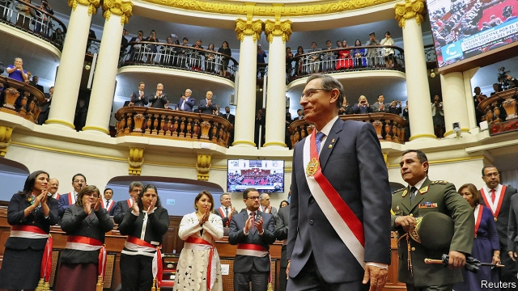

###### Martín’s manoeuvre

# Martín Vizcarra tries to end his presidency early 

 

> print-edition iconPrint edition | The Americas | Aug 3rd 2019 

MARTíN VIZCARRA, Peru’s mild-mannered president, knows how to spring a surprise. As he wound up his 94-minute Independence Day speech to congress on July 28th, he called on lawmakers to end their terms, and his, a year early by voting to hold a general election next April. Peru’s 32m citizens are crying out for “a new beginning”, the president declared. They should decide the country’s destiny “even if this means that all of us have to go”. 

Mr Vizcarra’s gambit is a sign of frustration. He became president 16 months ago, when his predecessor, Pedro Pablo Kuczynski, was forced out of office over allegations that he had helped secure public contracts for Odebrecht, a Brazilian construction firm that has bribed officials and politicians across Latin America. Mr Vizcarra has spent most of that time trying to reform a political and judicial system so rotten that all living former presidents are under house arrest, in jail or trying to avoid that fate. Congress, whose largest party is the opposition Popular Force (FP), has tried to stop him. 

It has not succeeded entirely. Last year congress reluctantly passed four reforms of politics and the judiciary. Three of those were enacted after a referendum in December. They included barring sitting congressmen from being re-elected. In April this year Mr Vizcarra submitted another 12 political reforms. When congress resisted he selected six that he deems vital. His priority is to empower a committee chosen by the supreme court to decide whether a lawmaker charged with a crime would lose immunity from prosecution. Now, congress itself makes that decision. It has so far refused to enact Mr Vizcarra’s proposal and has modified other reform ideas. For example, it has delayed by ten years until 2031 the date for requiring parties to field equal numbers of male and female candidates. 

Until now, Mr Vizcarra has tried to deal with congressional intransigence by submitting his government to votes of confidence. These operate under peculiar rules in Peru. A first government defeat in a presidential term leads to the dissolution of the cabinet and the appointment by the president of a new one. That happened in September 2017, when Mr Kuczynski was still president (and Mr Vizcarra was vice-president). A second would trigger not only the cabinet’s downfall but congressional elections, while leaving the president in office. 

Mr Vizcarra used the leverage this gives him in September last year. Congress voted its confidence in his government, then enacted the first set of reforms he sought. He tried the same tactic in June this year, with less effect. Congress backed the government but thwarted some reforms. Hence Mr Vizcarra’s call for new general elections. 

What will happen now is uncertain. Opposition lawmakers want to get rid of the president without leaving office themselves. Tamar Arimborgo, an FP congresswoman, called him a “dictator” for advocating early elections. His foes could try to impeach him. The vice-president, Mercedes Aráoz, would then take his place. 

But the constitution makes it hard to take out the president in a surgical strike. If Mr Vizcarra resigns, and induces Ms Aráoz to follow, the president of congress would be obliged to call general elections. Mr Vizcarra could call for a third vote of confidence. This would put congress in a quandary. An endorsement of the government would clear the way for the early vote that Mr Vizcarra wants. A no-confidence vote would allow him to call for a new legislative election. In either case, the 130 lawmakers would be out. 

One way or another, Mr Vizcarra and the current congress may well be gone next year. Government ministers argue that the country cannot afford another two years of gridlock. The economy is adrift. GDP expanded by 1.5% in the first five months of 2019, compared with 4.9% in the same period a year ago, according to the central bank. Mr Vizcarra is right to say that Peru needs a functioning government. 

But it is not clear that fresh elections will provide one. More than 20 political parties are registered to put up presidential and congressional candidates. Many have been tarnished by the Odebrecht scandal. FP and APRA, another leading opposition party, have no credible presidential candidates. FP’s founder and leader, Keiko Fujimori, has been in detention since October awaiting trial for accepting illegal contributions from Odebrecht in 2011, when she ran the first of two losing presidential campaigns. APRA’s long-time leader, Alan García, a former president, committed suicide in April this year as he faced arrest for taking bribes from the Brazilian firm.  

Mr Vizcarra does not have a party or a political heir. When Ipsos, a pollster, asked Peruvians recently for their views on 16 politicians, just one had an approval rating of higher than 10%. That was George Forsyth, a former football goalkeeper who since January has been mayor of La Victoria, a district of Lima, Peru’s capital. A third of Peruvians support no politician. Mr Vizcarra’s proposed election, if it happens, would be a leap into the unknown. 

He knows that the way out of Peru’s impasse is better political parties and leaders. Unfortunately, it is being barred by the very system he wants to change. ■ 

