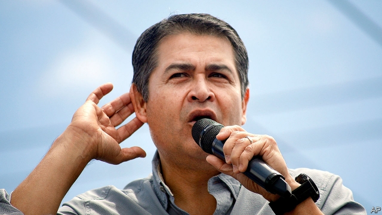
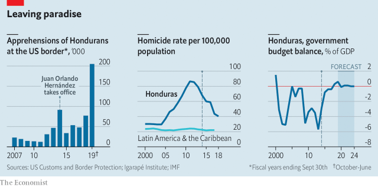

###### Will JOH go?

# The humbling of Honduras’s president, Juan Orlando Hernández 

 

> print-edition iconPrint edition | The Americas | Aug 3rd 2019 

LIKE MOST citizens of Central America’s northern-triangle countries, Hondurans have reasons to flee. Gangs terrorise them. Jobs pay poorly. Many of the half-million Hondurans in the United States urge relatives to come. Since October, Mexican and American border agents have detained a 30th of Honduras’s population. On July 26th Guatemala and the United States signed a safe-third-country agreement, the main aim of which is to oblige Hondurans who wish to seek asylum in the United States to do so in Guatemala first. That is unlikely to stop the exodus. 

Honduras at least has strong leadership, or so it once seemed. Guatemala’s ineffectual president, Jimmy Morales, a former comedian, will soon hand power to the winner of an election to be held on August 11th. El Salvador’s new president, Nayib Bukele, is energetic but has little support in congress. Juan Orlando Hernández, Honduras’s president since 2014, was thought to be the region’s political genius, endowed with a preternatural talent for keeping and wielding power. 

He lived up to that reputation in his first term. Honduras had the world’s highest murder rate when he took office, though it was falling. He lowered it further and curbed cocaine-trafficking with new taxes to pay for more security spending (see chart). He purged corrupt police officers and extradited criminals to the United States. He lengthened the school year and cut the budget deficit. He dealt smartly with crises. A scandal in 2015 prompted demonstrations against his presidency. He quietened them by inviting the Organisation of American States to set up an anti-corruption body, called MACCIH.  

 

Mr Hernández’s Machiavellian masterpiece was to position himself to run for re-election, which was disallowed by the constitution until 2015, and then to win in 2017. But his victory followed a contest marred by breakdowns in ballot counting, suspicions of fraud and the deaths of protesters. That is when his problems began. 

A Gallup poll in May found that 86% of Hondurans believe that the country is on the wrong track, up from 60% in 2017. Mr Hernández’s net approval rating dropped from +31 to -17. The left-wing opposition, which lost the election in 2017, remains convinced that it was stolen. More worrying for the president, his own centre-right National Party (PN) is turning against him. In past elections it has defeated a divided opposition by staying united, says Raúl Pineda Alvarado, a former PN congressman. Now the PN itself is split. 

Many PN politicians think Mr Hernández is betraying them. MACCIH is locking up its members, including the wife of Mr Hernández’s predecessor, Porfírio Lobo. Business people, once friendly to Mr Hernández, grumble about slowing growth, corruption and rising taxes. Middle-class Hondurans pay twice for basic services, through taxes and again by spending money on health and security because the state’s provision is so bad, says Pedro Barquera, the head of the chamber of commerce in the state of Cortés. The attorney-general has accused the army top brass, who are among Mr Hernández’s staunchest allies, of refusing to co-operate with his investigation into the shooting of protesters after the election. That has enraged the generals, who expected the president to protect them as they have protected him. 

Grief may have weakened the president. His sister, Hilda, died in a helicopter crash in 2017. She had managed the government’s communications and was one of the few advisers to whom Mr Hernández listened. His brother, Tony, was arrested in the United States last year on drug-trafficking and weapons charges. He has pleaded not guilty. His trial, which begins in October, could embarrass the president. 

Mr Hernández’s writ no longer runs. In April congress passed reforms to end the practice of paying phantom teachers and health-care workers and to prevent union bosses and politicians from giving jobs to their cronies. The law provoked protests, starting at universities and spreading. People close to Mr Hernández say that PN bigwigs paid for some of the protests. Congress unanimously repealed the law. 

These setbacks have fed speculation that Mr Hernández may not finish his term, which ends in 2022. On June 19th, as protesters prepared to commemorate the ten-year anniversary of Honduras’s last military coup, history nearly repeated itself. The military police refused to carry out “repression” and stayed in their barracks. Lorry drivers, angry about a rise in fuel prices, blocked roads around Tegucigalpa, the capital. Rumours circulated that generals and business people were joining purged police officers to topple the government. 

If Mr Hernández does hang on, he can still do some good. Most important is to ensure that the next election, in which he has promised not to run, is a clean one. It “has to be transparent, with no doubt about the process”, says Roció Izabel Tábora, the finance minister. That will require a new law to overhaul the electoral system that is more ambitious than one being considered. And another test will come before MACCIH’s mandate expires in January. Mr Hernández will face pressure from his party to expel it or weaken its mandate. Hondurans hope he will not. What they want from him in his final years in office is less Machiavelli, and more morality. ■ 

