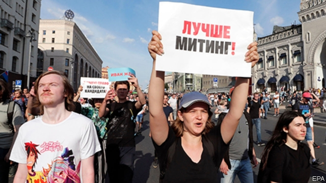
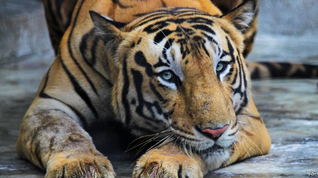

###### Rainforests

# Politics this week 

 

> Aug 3rd 2019 

Russia’s main opposition leader, Alexei Navalny, was taken from prison to hospital to be treated for what the authorities called an allergic reaction but supporters said may have been poisoning. He was later returned to prison, where he is in custody for organising an illegal protest, according to the Kremlin. More than 1,000 people were arrested at a demonstration in Moscow demanding that independent candidates be allowed to stand in a citywide election. More protests are planned. 

Boris Johnson spent a busy first week as Britain’s prime minister. He created a new office to administer lifelong support for veterans of the armed forces; pledged resources for several projects; and promised to open the spending taps for public services. This included a pledge to put 20,000 more police officers on the streets within three years (replacing the officers cut since the Conservatives took power in 2010). 

Next for Mr Johnson was a whistle-stop “Union” tour with visits to Scotland, Wales and Northern Ireland. Brexit loomed in the background. In Northern Ireland Mr Johnson declared that the border “backstop”, which would keep Britain in an EU customs union, is dead. The government committed an extra £2.1bn ($2.6bn) to plan for a no-deal exit. See article. 

Donald Trump announced that Dan Coats would step down as the director of national intelligence. Like most of America’s security chiefs, Mr Coats has had a peppery relationship with the president over their differing assessment of the threats facing America. Mr Trump’s choice to replace him is John Ratcliffe, a supportive Republican congressman who was little known until recently, when, at a congressional hearing, he assailed Robert Mueller’s investigation into Russian influence. See article. 

The latest Democratic debates shed more heat than light on what policies the party will fight the next election on. Joe Biden, the front-runner, was targeted by his colleagues in a bad-tempered clash in which the candidates squabbled over who was the most progressive. See article. 

Diplomats from Iran and five world powers met to try to salvage a deal, signed in 2015, that eased economic sanctions on Iran in exchange for restrictions on its nuclear programme. An Iranian official said his country will continue to reduce its commitments under the deal until the other signatories secure Iran’s interests. America withdrew from the pact last year. 

America imposed sanctions on Iran’s foreign minister, Muhammad Javad Zarif, freezing his assets in America. Mr Zarif “implements the reckless agenda of Iran’s supreme leader”, said Steven Mnuchin, America’s treasury secretary. 

According to reports, American officials revealed that the son of Osama bin Laden, Hamza, who was being groomed to take over al-Qaeda, had died. America played a role in the operation that killed him, though it was unclear when or where it was carried out. 

Princess Haya bint al-Hussein, the estranged wife of the ruler of Dubai, Sheikh Mohammed bin Rashid al-Maktoum, asked England’s High Court for wardship of their two children, as well as a forced-marriage protection order. Princess Haya, thought to be hiding in London, is Sheikh Mohammed’s sixth wife. Two of his daughters have also tried to run away. 

A music festival in Lebanon cancelled an appearance by Mashrou’ Leila, a popular rock band whose lead singer is openly gay. The organisers had come under pressure from Christian groups and conservative politicians, setting off a debate about freedom of expression. The move was intended “to prevent bloodshed”, said the organisers. 

Jihadists allied to Islamic State claimed to have killed or injured 40 soldiers in two attacks in the north-east of Nigeria. In other raids on funerals and villages 65 civilians were killed. Meanwhile, the government banned a Shia Muslim group that had protested against the arrest of its leader in 2015 and against the security forces killing its members. 

Guatemala signed a safe-third-country agreement with America, under which asylum-seekers passing through the Central American country would have to apply for asylum there rather than in the United States. Guatemala’s president, Jimmy Morales, agreed to the arrangement after Donald Trump threatened to impose tariffs if he did not. Courts in both countries are expected to challenge it. See article. 

At least 57 people died in a prison riot in the Brazilian state of Pará. Most of the inmates were killed by asphyxiation caused by a fire, but 16 were decapitated. 

Peru’s president, Martín Vizcarra, proposed holding a general election a year early, in April 2020. This would be a way of ending his deadlock with congress over measures to fight corruption. But congress has little incentive to approve early elections, since its members cannot run for re-election immediately. The plan would also need to be approved in a referendum. See article. 

Authorities in China expressed support for Carrie Lam, Hong Kong’s embattled chief executive, and called for order to be restored in the territory. Police charged 44 people who were arrested at one of the many ongoing protests with rioting, prompting further protests outside police stations. See article. 

The deputy head of the government of Xinjiang, a region in western China, said that more than 90% of the Uighur Muslims detained in camps by the authorities had been sent home. Human-rights groups expressed scepticism. They say more than 1m Uighurs have been interned in an effort to weaken indigenous culture. 

North Korea fired several projectiles into the sea in the direction of Japan on two separate occasions. America and South Korea said they were a new type of short-range missile. North Korea suspended tests of long-range missiles early last year, and last month agreed to restart disarmament talks with America. 

India’s parliament approved a law banning Muslim men from divorcing their wives simply by saying the word talaq three times. Few Muslim countries permit this, and the Supreme Court had declared it unconstitutional. But the opposition held up the measure for a year, arguing that punishing men who divorced their wives in this way by sending them to prison was too harsh. 

 

The government of India said that the country’s tiger population had risen by a third since 2014, to almost 3,000. 
<<<<<<< HEAD

-- 

 单词注释:

1.rainforest['rein'fɔrist]:[生态]雨林 

2.politic['pɒlitik]:a. 精明的, 明智的, 策略的 

3.Aug[]:abbr. 八月（August） 

4.opposition[.ɒpә'ziʃәn]:n. 反对, 敌对, 相反, 在野党 [医] 对生, 对向, 反抗, 反对症 

5.Alexei[]:n. (Alexei)人名；(捷、罗、俄)阿列克谢 

6.Navalny[]:[网络] 纳瓦尔内；瓦尔尼 

7.supporter[sә'pɒ:tә]:n. 支持者, 后盾, 迫随者, 护身织物 [法] 支持者, 赡养者, 抚养者 

8.custody['kʌstәdi]:n. 监护, 拘留, 监禁 [经] 保管, 照顾, 保护 

9.Kremlin['kremlin]:n. 克里姆林宫 [经] 克里姆林宫 

10.demonstration[.demәn'streiʃәn]:n. 示范, 实证 [医] 示教, 实物教授 

11.citywide['siti.waid]:a. 全市的, 全市性的 

12.boris['bɔris]:n. 鲍里斯（男子名） 

13.johnson['dʒɔnsn]:n. 约翰逊（姓氏） 

14.administer[әd'ministә]:vt. 管理, 料理, 执行 vi. 执行遗产管理人的职责, 给予帮助 

15.lifelong['laiflɒŋ]:a. 终身的, 毕生的 

16.pledge[pledʒ]:n. 诺言, 保证, 誓言, 抵押, 信物, 保人, 祝愿 vt. 许诺, 保证, 使发誓, 抵押, 典当, 举杯祝...健康 

17.wale[weil]:n. 隆起的伤痕, 鞭痕, 凸条纹, 精华, 选择 vt. 在...上留下鞭痕, 织成棱纹, 挑选, 撑住 vi. 挑选 

18.Brexit[]:[网络] 英国退出欧盟 

19.loom[lu:m]:n. 织布机, 若隐若现的景象 vi. 朦胧地出现, 隐约可见, 可怕地出现 

20.backstop['bækstɒp]:n. 挡球网, 接球手 [电] 背向停止 

21.EU[]:[化] 富集铀; 浓缩铀 [医] 铕(63号元素) 

22.dan[dæn]:n. 段(柔道、围棋运动员的等级) [建] 小车, 空中吊运车, 杓 

23.peppery['pepәri]:a. 胡椒的, 辛辣的, 很辣的, 急躁的, 易怒的 

24.john[dʒɔn]:n. 盥洗室, 厕所, 嫖客 

25.Ratcliffe[]:n. (Ratcliffe)人名；(英)拉特克利夫 

26.supportive[sә'pɔ:tiv]:a. 支撑, 支承, 资助, 赞助, 支援, 经受, 忍受, 扶养, 证实, 鼓励, 维持, 伴奏 

27.congressman['kɒŋgresmәn]:n. 国会议员, 众议院议员 [法] 国会议会 

28.congressional[kәn'greʃәnl]:a. 会议的, 议会的, 国会的 [法] 代表大会的, 大会的, 议会的 

29.assail[ә'seil]:vt. 攻击, 质问 [法] 攻击, 袭击, 著手解决 

30.Robert['rɔbәt]:[法] 警察 

31.joe[dʒәu]:n. 乔（男子名） 

32.biden[baidən]: [人名] 拜登 

33.clash[klæʃ]:n. 冲突, 撞击声, 抵触 vi. 冲突, 抵触 vt. 使发出撞击声 [计] 对撞 

34.squabble['skwɒbl]:vi. 争吵, 口角 n. 争吵, 口角 

35.diplomat['diplәmæt]:n. 外交官, 有外交手腕的人 [法] 外交家, 外交官, 有权谋的人 

36.Iran[i'rɑ:n]:n. 伊朗 

37.salvage['sælvidʒ]:n. 海上救助, 抢救, 打捞, 抢救出来的财物 vt. 海上救助, 抢救, 打捞, 营救 [计] 文件恢复程序 

38.sanction['sæŋkʃәn]:n. 核准, 制裁, 处罚, 约束力 vt. 制定制裁规则, 认可, 核准, 同意 

39.Iranian[i'reiniәn]:a. 伊朗的, 伊朗语系的 n. 伊朗人, 伊朗语 

40.signatory['si^nәtәri]:n. 协议的签署者, 签约国 a. 签署的, 签约的 

41.pact[pækt]:n. 契约, 协定, 条约 [化] 合同 

42.muhammad[]:n. 穆罕默德 

43.javad[]:[网络] 贾维德 

44.zarif[]:n. (Zarif)人名；(俄)扎里夫 

45.asset['æset]:n. 资产, 有益的东西 

46.reckless['reklis]:a. 不介意的, 大意的, 鲁莽的, 不顾后果的 [法] 不注意的, 粗心大意的, 鲁莽的 

47.steven['sti:vn]:n. 史蒂文（男子名） 

48.treasury['treʒәri]:n. 国库, 宝库, 财政部, 国库券 [经] 库存, 国库, 金库 

49.osama[]:奥萨马 (本拉登的名字) 

50.bin[bin]:n. (贮存谷物等的)容器, 箱子 [计] 二进制, 商业信息网 

51.hamza['hæmzә,'hɑ:mzɑ:]:a. (=hamzah)<阿拉伯>代表闭锁音的符号的 

52.groom[gru:m]:n. 马夫, 新郎, 男仆 vt. 喂马, 使...整洁, 推荐 vi. 打扮, 穿戴 

53.unclear[.ʌn'kliә]:a. 不易了解的, 不清楚的, 含混的 

54.haya[]: [地名] [印度尼西亚] 哈亚 

55.bint[bɪnt]:n. <英><俚><贬>女孩, 女人 

56.estrange[i'streindʒ]:vt. 使疏远, 离间, 使离开 

57.dubai['dju:bai]:n. 迪拜（阿拉伯联合酋长国的酋长国之一）；迪拜港（阿拉伯联合酋长国港市） 

58.sheikh[ʃeik, ʃi:k]:n. 酋长, 王子, 村长, 族长, 教长, 导师, 有威信的丈夫 

59.Mohammed[mu'hæmәd]:n. 穆罕默德(伊斯兰教创始人) 

60.Rashid[]:n. 拉希德（男子名）；拉希德（埃及城市, 位于尼罗河畔） 

61.wardship['wɒ:dʃip]:n. 监护 [法] 监护, 保护, 监督 

62.Lebanon['lebәnәn]:n. 黎巴嫩 

63.leila['li:lә,'lailә]:n. 利拉（女子名） 

64.openly['әjpәnli]:adv. 公开地, 坦率地, 直率地, 公然地 

65.bloodshed['blʌdʃed]:n. 流血 

66.jihadist[]:n. 伊斯兰圣战士 

67.ally['ælai. ә'lai]:n. 同盟者, 同盟国, 助手 vt. 使联盟, 使联合, 使有关系 vi. 结盟 

68.Islamic[iz'læmik]:a. 伊斯兰教的, 穆斯林的 

69.Nigeria[nai'dʒiriә]:n. 尼日利亚 

70.shia[]:n. 什叶；什叶派（等于Shiah） 

71.Muslim['mjzlim; (?@) 'mʌzlem]:n. 伊斯兰教, 伊斯兰教教徒 

72.Guatemala[.gwɑ:tә'mɑ:lә]:n. 危地马拉 

73.asylum[ә'sailәm]:n. 庇护, 收容所 [医] 养育院 

74.jimmy['dʒimi]:n. 铁撬 vt. 撬 

75.morale[mɒ'rɑ:l]:n. 士气, 道德 

76.tariff['tærif]:n. 关税, 关税表, 价格表, 收费表 vt. 课以关税 [计] 价目表 

77.riot['raiәt]:n. 暴动, 喧闹, 放纵 vi. 发动, 暴动, 纵情, 放荡 vt. 浪费, 挥霍 

78.Brazilian[brә'ziljәn]:n. 巴西人 a. 巴西的, 巴西人的 

79.inmate['inmeit]:n. 同住者, 被收容者 [法] 内部的, 接近中心的, 内在的 

80.asphyxiation[æs.fiksi'eiʃәn]:n. 窒息 [医] 窒息 

81.decapitate[di'kæpiteit]:vt. 斩首, 杀头, 开除 [法] 斩首, 杀头, 解雇 

82.vizcarra[]:[网络] 维兹卡拉 

83.deadlock['dedlɒk]:n. 僵局, 停顿 v. (使)停顿, (使)相持不下 [计] 死锁 

84.corruption[kә'rʌpʃәn]:n. 腐败, 堕落, 贪污 [计] 论误 

85.incentive[in'sentiv]:n. 动机 a. 激励的 

86.cannot['kænɒt]:aux. 无法, 不能 

87.referendum[.refә'rendәm]:n. （就重大政治或社会问题进行的）全民公决，全民投票 

88.carrie['kæri]:n. 卡丽（女名, Caroline的昵称） 

89.lam[læm]:v. 打, 鞭笞, 逃脱 n. 逃亡 

90.hong[hɔŋ]:n. （中国、日本的）行, 商行 

91.embattle[im'bætl]:vt. 列阵, 布阵, 整军备战, 严阵以待 

92.ongoing['ɒngәuiŋ]:a. 前进的, 进行的, 不间断的 n. 前进, 发展 

93.Uighur[]:n. 维吾尔族人, 维吾尔语, 维吾尔人 

94.Muslim['mjzlim; (?@) 'mʌzlem]:n. 伊斯兰教, 伊斯兰教教徒 

95.detain[di'tein]:vt. 扣留, 扣押, 耽搁 [法] 拘留, 扣押, 留住 

96.scepticism['skeptisizm]:n. 怀疑论, 怀疑主义 [医] 多疑癖 

97.Uighur[]:n. 维吾尔族人, 维吾尔语, 维吾尔人 

98.indigenous[in'didʒinәs]:a. 本土的, 国产的, 固有的 [医] 原产的, 本土的 

99.Korea[kә'riә]:n. 朝鲜, 韩国 

100.projectile[prә'dʒektil]:n. 发射体, 抛射物 a. 发射的, 投射的 

101.restart[.ri:'stɑ:t]:v. 重新开始, 重新启动 [计] 重新启动 

102.disarmament[dis'ɑ:mәmәnt]:n. 裁军 [法] 裁军, 解除军备 

103.talaq[]:[网络] 离婚；塔拉克 

104.unconstitutional['ʌnkɔnsti'tju:ʃәnәl]:a. 违反宪法的, 不符合宪法的 [法] 违反宪法的, 违宪的, 不合宪法规定的 
=======
>>>>>>> 50f1fbac684ef65c788c2c3b1cb359dd2a904378

