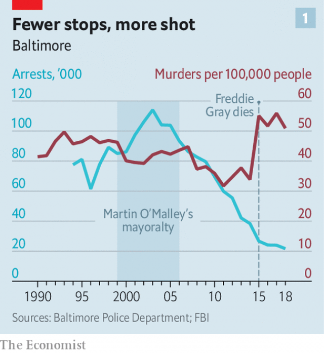

###### City on the brink

# Baltimore needs help to fix its crime problems 

 

> print-edition iconPrint edition | United States | Aug 3rd 2019 

AT SEVEN IN the morning on July 15th, David Caldwell, a 52-year-old phlebotomist, was shot and killed in the methadone clinic on Maryland Avenue where he worked. A little more than halfway through the year, he was the 181st person killed in the city of Baltimore—and the 161st killed by a gun. It was a grisly scene. The suspected shooter, a 49-year-old man demanding methadone, was shot dead in the standoff with police. One officer was also shot, though he is expected to survive. 

Based on historic patterns, Baltimore is on track to have 358 murders by the end of the year. It could exceed the tally in New York—a city with 14 times as many people. The number has passed 300 every year since 2015. That spring Freddie Gray, a 25-year-old black man, died in police custody, and the city exploded in protest. Rioting and looting tore up the city’s poorest neighbourhoods; Victorian row houses were lit by the glow of flames. 

It does not appear to have recovered since. “Unfortunately all the cameras have gone, but the socioeconomic plight of the community has remained,” says Nick Mosby, a Maryland state delegate who was the city councilman for Sandtown-Winchester, the west Baltimore neighbourhood where Freddie Gray lived. It is 96% black; median household income is merely $25,000 and a third of the buildings are vacant or abandoned. It is a place where people buy their groceries in liquor stores protected by bulletproof glass. “Whether it’s west Baltimore or north Philadelphia, urban blight looks like urban blight and it’s as American as apple pie,” says Mr Mosby. 

What beset Baltimore? Left-leaning activists explain the city’s slump by pointing to the legacy of historic segregation—the city pioneered the use of restrictive covenants to prevent blacks from moving to good neighbourhoods—and generations of concentrated poverty, racist policing, crumbling infrastructure and failing schools. All this is true. But none has worsened enough recently to explain the dramatic rise in crime since Gray’s death. “When I think of April 2015, I think about the straw that broke the camel’s back,” says Brandon Scott, the 35-year-old president of the city council. Something else must have happened. 

 

The most prominent candidate-theories focus on the police. The Baltimore Police Department (BPD) had to change after the unrest—its relationship with the community was in a shambles. Marilyn Mosby, the state’s attorney for Baltimore (who is also married to Mr Mosby, the delegate), charged the six officers involved with Gray’s death—but none was convicted. A scathing report from the Department of Justice (DOJ) extensively documented a pattern of racial discrimination and excessive force. In 2017 the department entered a consent decree with a federal court requiring it to reform. 

Some members of the Baltimore police, both former and current, claim that the falling out with city leaders left them feeling without support. So they pulled back, they say—less often getting out of their cars to attempt forceful, proactive enforcement. “The idea of clearing the corner was central to Baltimore,” says Peter Moskos, a former patrol officer in the city who is now a professor of criminology. “But cops said, ‘OK, if you don’t want us to clear the corners, we won’t’.” The data bear this out. In the year before Gray’s death, police were making 3,000 arrests a month. Since then, arrests have dropped 36%. 

But another explanation contends that the more important shock to behaviour after the unrest was not among the police but among Baltimore’s residents. Events like Gray’s death shake community trust—meaning that co-operation with police investigations and even reporting of criminal offences drops. 

In the aftermath of a highly publicised incident in Milwaukee in 2004, when an unarmed biracial man was severely beaten by off-duty white cops, three sociologists found that residents in black neighbourhoods were much less likely to call to report crimes for up to a year afterwards. This coincided with a significant spike in homicides. In Baltimore, there are good reasons to distrust the police. Last year federal prosecutors convicted members of an elite police squad, the Gun Trace Task Force, of widespread corruption. Instead of taking illegal guns off the streets, the unit planted evidence on innocent civilians and robbed drug-dealers and then resold the goods. 

In this account of things, a frequent target of ire is Martin O’Malley, who was mayor of the city from 1999 to 2007 before becoming governor of Maryland, for his policy of aggressive policing to deter violent crime. Mr O’Malley, who still lives in the city, defends his record. He notes that crime declined while he was in office, and that the damning DOJ report only examined conduct after 2010. 

Mr O’Malley gives two reasons why the city is “having to take the same real estate twice”. First, “Baltimore stopped policing the police. Stopped supervising, stopped following up on citizen complaints of discourtesy, excessive force and other things,” he says. Second, the number of cops fell from a high of 3,278 in 2002 to 2,514 today. “One of the most violent cities in America decided to cut its police force by about 25%, and there wasn’t even a whimper of objection from the city council or any of the editorial powers in town,” he says. 

The riots “exposed that sort of soft underbelly in the police department”, says Jason Johnson, a former deputy commissioner for the BPD from 2016 to 2018. “The homicide department has barely enough detectives to solve homicides. It was a kind of awakening to the criminal underground in Baltimore.” Shootings and homicides increased, but there was no increase in the number of detectives, nor any improvements to antiquated technology or dilapidated training headquarters. 

In 2018 only 43% of homicide cases were cleared. “When cases start to pile on top of one another, you have more acts of violence that people are inclined to avenge,” says Daniel Webster, a professor at Johns Hopkins University who led a homicide review for the city. Mr Webster argues that although most people want more cops on the beat, the real need is more resources for serious investigations. 

 

Compounding the problem in Baltimore was a nationwide surge in demand for illicit opioids. For decades, Baltimore has had a serious heroin problem concentrated among poor black people. Today Baltimore has morphed into a drug destination. Officers and residents describe middle-class teenagers and housewives driving in from the suburbs to score drugs. Mr Scott, the city council president, says he finds it ironic that after decades of ignoring heroin epidemics in predominately black cities such as Baltimore, the rest of America is now suffering. 

Nobody really knows how many drug users there are in Baltimore. The most reliable data come from the city morgue. In 2007, opioid overdoses claimed the lives of 256 Baltimoreans—four-fifths from heroin. By 2018, that number had more than tripled to 814 deaths as fentanyl, an extremely potent synthetic opioid, supplanted heroin. Baltimore has the highest opioid fatality rate of any city in the country, twice that of West Virginia, which is the worst-affected state. 

“Business is booming from the drug dealers’ perspective,” says Mr Johnson, the former deputy police commissioner. “And in black-market business, competition usually means violence.” Violent crime in Baltimore, as in every city, involves a small network of people and a clutch of city blocks. Much of it revolves around the drug trade, and avenging past deeds, whether slights or slaughters. Of those murdered in 2018, 84% had previous arrest records—as did 86% of the suspects. 

The problems of crime and addiction are difficult, but they should not be insurmountable. Sadly, Baltimore has endured so much turbulence at its highest echelons of power in recent years that new plans have scarcely had time to be drafted. Since Gray’s death, there have been five police commissioners—some fell foul of the mayor while others fell foul of the law. In May the mayor herself, Catherine Pugh, was forced to resign from office after a scandal involving bulk purchases of her insipid children’s book by companies who did business with the city. She is the second mayor to have to resign in a decade. 

The next mayor will face huge challenges. “We are a city that doesn’t have a transit system, we don’t have fast broadband, we have an ageing water system,” says Seema Iyer of the University of Baltimore. Vacant buildings depress property values, provide places for criminals to hide and scare off prospective businesses. The city’s schools are decrepit. Having stabilised at the time of Freddie Gray’s death, Baltimore’s population is now falling again. 

It is tempting for lawmakers in Annapolis, the state capital, and nearby Washington, to blame the city for its troubles. Corruption and poor policing are certainly unforced errors. People of all political stripes have high hopes for Michael Harrison, the freshly appointed police commissioner from New Orleans, though he will need longer than the now-customary one-year term to change much. Still, many of the forces buffeting Baltimore and its poorest residents are outside its control: history weighs heavily. To dig itself out of its rut, the city will need help. ■ 

