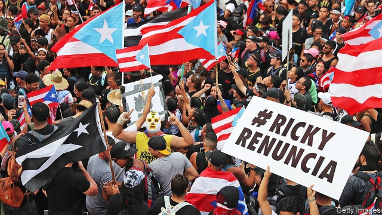

###### What now?

# Puerto Rico faces a succession crisis 

 

> print-edition iconPrint edition | United States | Aug 3rd 2019 

TEÓFILO TORRES sits on a coffin, leaning against a Puerto Rican flag. He is dressed as Pateco, the gravedigger. According to folk history, Pateco buried the dead from Hurricane San Ciriaco, which ravaged the island in 1899. “I already buried Ricky Rosselló,” he says. “This is the coffin for Wanda.” 

“Ricky”, or Ricardo Rosselló, the island’s governor, announced his resignation on July 24th. Wanda Vázquez, the justice secretary, was theoretically next in line, though she says she does not want the job. Then on July 31st Mr Rosselló nominated Pedro Pierluisi, who lost to him in the 2016 primaries, to replace him. As The Economist went to press on August 1st, Mr Pierluisi’s nomination process was just starting and seemed sure to be contested in the legislature. It was unclear who will actually sit in the governor’s mansion next. Mr Rosselló’s resignation, which came after weeks of protests sparked by the leaking of text messages in which he mocked his constituents, has pushed America’s biggest territory into a succession crisis. 

Removing Mr Rosselló was cathartic, but Puerto Rico has deeper problems. It has suffered from years of economic mismanagement, a bloated public sector and high levels of poverty. The island has long failed to capitalise on its many assets, from its natural beauty to the artistic creativity of its people, which was on display in the placards, costumes and music of the protests. Hurricane Maria, which hit in 2017, made things worse, sparking mass emigration to the United States mainland. The government debt, which exceeds $120bn, including pension liabilities, is suffocating. The Washington-appointed Oversight Board has completed two deals to restructure some of the debt this year. 

Mr Rosselló’s departure has focused attention on one of Puerto Rico’s most significant problems. Fuelled by two-party machine politics, corruption has been endemic for generations. Politicians on both sides offer sweetheart deals to their friends in business, which in turn generates the money needed to get elected. “The political system basically created an institutional infrastructure that promotes behaviour which will lead to corruption sooner or later,” explains José Villamil, an economist. 

On July 10th the FBI arrested six individuals, including two members of the administration, for directing $15.5m to favoured businessmen. Douglas Leff, head of the San Juan division of the FBI, told Radio Isla: “It’s going to be a very busy summer for us.” A week later the Centre of Investigative Journalism (CPI, from its Spanish initials), which originally published the leaked messages that led to the governor’s downfall, reported that three of his associates, Elías Sánchez, Carlos Bermúdez and Edwin Miranda, had benefited in various ways from their friendship with Mr Rosselló. All three deny wrongdoing. 

If Mr Pierluisi’s appointment is blocked, finding a better replacement for Mr Rosselló could be hard. Few prominent politicians are free from accusations of corruption. It is not just Ms Vázquez who does not want the job of being governor. Several others have ruled themselves out until Puerto Rico holds elections in 2020. Taking the job is “political suicide”, says Carla Minet, the chief editor of the CPI. 

Whoever becomes governor, they will need to work to dismantle the system of patronage that has built up over years. Apart from the practice of favouring allies with government contracts, politicians have a habit of replacing officials across the government machinery with their own cronies every time there is a transfer of power. That means a loss of expertise each time. 

The new governor will not find things easy. Reform is not always popular, especially in the public sector, which is a sore point for many Puerto Ricans. The protests that helped push out Mr Rosselló could easily restart. Traditionally Puerto Rico’s people have split between those who support statehood and those who are happy to see it remain a commonwealth, under American jurisdiction but with no vote in Congress. But anger with the government has unified both sides. 

For now, the mood on the island is elation. “People are not sleeping any more”, says Gerardo Alvarado León, a reporter for El Nuevo Día, a newspaper, fresh from his first solid night’s sleep in weeks. But when the buzz fades, Puerto Ricans will need to find other ways to keep up the pressure. Ending graft will require deep civic engagement. The creativity shown in the protests will go far. After years of tolerating corruption, Puerto Ricans have decided they will no longer put up with it. They need a leadership which agrees. ■ 
<<<<<<< HEAD

-- 

 单词注释:

1.Puerto[]:n. 垭口, 港口, 山口 n. (Puerto)人名；(西)普埃尔托 

2.rico[]:abbr. 反诈骗腐败组织集团犯罪法（Racketeer Influenced and Corrupt Organizations Act） 

3.Aug[]:abbr. 八月（August） 

4.Torre[]:n. (Torre)人名；(英、法)托尔；(德、西、意、葡、塞)托雷 托尔 托雷 

5.coffin['kɒfin]:n. 棺材, 灵柩 vt. 把...装进棺材 

6.rican[]:adj. 波多黎各岛的(人) n. 波尔图 [网络] 日佳 

7.gravedigger['greivdigә]:n. 挖墓者, 埋葬虫 

8.san[sɑ:n]:abbr. 存储区域网（Storage Area Networking） 

9.ciriaco[]:[网络] 西里亚科 

10.ravage['rævidʒ]:n. 破坏, 蹂躏 v. 毁坏, 破坏, 掠夺 

11.ricky['riki]:n. 里基（男子名, 等于Rick, Rickie） 

12.WANDA['wɔndә]:n. 旺达(f.) 

13.Ricardo[ri'kɑ:dәu]:里卡多(姓氏) 

14.theoretically[.θi:ә'retikli]:adv. 理论上, 理论地 

15.nominate['nɒmineit]:vt. 提名, 任命, 命名 [法] 提名...为候选人, 指定, 推荐 

16.pedro['pi:drәu]:n. 彼得牌戏（一种纸牌戏） 

17.economist[i:'kɒnәmist]:n. 经济学者, 经济家 [经] 经济学家 

18.nomination[.nɒmi'neiʃәn]:n. 提名, 任命, 提名权 

19.legislature['ledʒisleitʃә]:n. 立法机关, 议会, 立法院 [法] 立法机构, 立法机关 

20.unclear[.ʌn'kliә]:a. 不易了解的, 不清楚的, 含混的 

21.mansion['mænʃәn]:n. 大厦, 宅邸 

22.mock[mɒk]:n. 嘲笑, 戏弄, 模仿 a. 假的, 伪造的, 模拟的 adv. 虚伪地 vt. 嘲弄, 模仿, 使失望, 欺骗, 挫败 vi. 嘲弄 

23.constituent[kәn'stitjuәnt]:n. 成分, 选民, 构成物 a. 构成的, 组织的, 选举的 

24.cathartic[kә'θɑ:tik]:n. 泻药, 通便药 a. 通便的, 导泻的 

25.mismanagement[]:n. 管理不善；处置失当 

26.bloat[blәut]:vt. 使膨胀, 腌制, 使自大 vi. 膨胀, 肿起 n. 肿胀病人 

27.sector['sektә]:n. 扇形, 部门, 部分, 函数尺, 象限仪, 段, 区段 vt. 把...分成扇形 [计] 扇面; 扇区; 段; 区段 

28.capitalise['kæpitәlaiz]:vt. 用大写字母写, 用大写字母印, 投资于, 使变为资本, 提供资本给 vi. 利用 

29.asset['æset]:n. 资产, 有益的东西 

30.creativity[.kri:ei'tiviti]:n. 创造力, 创造性 

31.placard['plækɑ:d]:n. 公告, 布告, 小牌, 海报 vt. 公布, 布告, 张帖, 贴海报于 

32.costume['kɒstju:m]:n. 装束, 服装 

33.Maria[mә:'raiә, mә'riә]:n. 玛丽亚（女名） 

34.emigration[.emi'greiʃәn]:n. 移民, 移居外国(或外地) [医] 血细胞渗出 

35.liability[laiә'biliti]:n. 责任, 债务, 倾向 [经] 责任, 义务, 负债 

36.suffocate['sʌfәkeit]:vt. 使窒息, 噎住, 闷熄 vi. 闷死, 窒息, 受阻 

37.oversight['әuvәsait]:n. 勘漏, 失察, 失败, 照料 [经] 监督权 

38.restructure[ri:'strʌktʃә]:vt. 更改结构, 重建, 调整 

39.politic['pɒlitik]:a. 精明的, 明智的, 策略的 

40.corruption[kә'rʌpʃәn]:n. 腐败, 堕落, 贪污 [计] 论误 

41.endemic[en'demik]:n. 地方病 a. 某地(或某些人中)流行的, 地方的 

42.sweetheart['swi:thɑ:t]:n. 心上人, 爱人 vi. 爱慕 vt. 向...求爱 

43.institutional[.insti'tju:ʃәnәl]:a. 制度的, 公共机构的, 学会的 [法] 组织机构的, 制度的, 公共机构的 

44.infrastructure['infrәstrʌktʃә]:n. 基础结构, 基础设施 [经] 基础设施 

45.villamil[]: [地名] [厄瓜多尔、古巴] 比亚米尔 

46.economist[i:'kɒnәmist]:n. 经济学者, 经济家 [经] 经济学家 

47.FBI[]:美国联邦调查局 [经] 美国联邦调查局 

48.douglas['dʌ^lәs]:n. 道格拉斯（男子名）；道格拉斯（英国马恩岛首府） 

49.leff[]:n. [姓氏]列伏; [人名] 莱夫 

50.juan[hwɑ:n]:n. 胡安（男子名） 

51.investigative[in'vestigeitiv]:a. 审查的, 调查的, 好研究的 [法] 调查的, 审查的, 受调查研究的 

52.journalism['dʒә:nәlizm]:n. 新闻业, 报章杂志 [法] 报刊, 新闻业, 新闻出版 

53.cpi[]:[计] 每英寸字符数 [经] 消费者物价指数 

54.originally[ә'ridʒәnli]:adv. 本来, 原来, 最初, 就起源而论, 独创地 

55.downfall['daunfɒ:l]:n. 衰败, 大雨 

56.carlo[]:n. 卡洛（男子名） 

57.edwin['edwin]:n. 爱德温（男子名, 义为繁荣、富有） 

58.miranda[mi'rændә]:n. 米兰达（女子名） 

59.wrongdoing['rɒŋ'du:iŋ]:n. 干坏事, 坏事 

60.replacement[ri'pleismәnt]:n. 归还, 更换, 代替者 [医] 复位, 置换 

61.accusation[ækju:'zeiʃәn]:n. 控告, 指控, 指责 [法] 控告, 起诉, 告发 

62.suicide['sjuisaid]:n. 自杀, 自杀者 v. 自杀 a. 自杀的 

63.carla['kɑ:lә]:n. 卡拉（女子名） 

64.MINET[]:欧洲均式网路 

65.dismantle[dis'mæntl]:vt. 拆除...的设备, 分解, 去除覆盖物 

66.patronage['pætrәnidʒ]:n. 赞助, 恩赐态度, 光顾, 任免权, 保护人的身分 [经] 光顾, 资助, 赞助 

67.ally['ælai. ә'lai]:n. 同盟者, 同盟国, 助手 vt. 使联盟, 使联合, 使有关系 vi. 结盟 

68.machinery[mә'ʃi:nәri]:n. 机器, 机械装置, 机构 [化] 机械 

69.crony['krәuni]:n. 密友, 亲密伙伴, 好朋友 

70.expertise[.ekspә:'ti:z]:n. 专家意见, 专门技术 [法] 专门知识, 专家意见 

71.alway['ɔ:lwei]:adv. 永远；总是（等于always） 

72.rican[]:adj. 波多黎各岛的(人) n. 波尔图 [网络] 日佳 

73.restart[.ri:'stɑ:t]:v. 重新开始, 重新启动 [计] 重新启动 

74.traditionally[]:adv. 传统上；传说上；习惯上 

75.statehood['steithud]:n. 州的状态(或地位) [法] 国家地位, 州的地位 

76.commonwealth['kɔmәnwelθ]:n. 共和国；联邦；国民整体 

77.jurisdiction[.dʒuәris'dikʃәn]:n. 司法权, 审判权, 管辖权 [经] 法律管辖权, 审判权 

78.unify['ju:nifai]:v. 统一, 使成一体 

79.elation[i'leiʃәn]:n. 得意洋洋, 兴高采烈 [医] 得意[洋洋], 高兴 

80.gerardo[]:n. (Gerardo)人名；(法、葡)热拉尔多；(意)杰拉尔多；(西)赫拉尔多；(俄)格拉尔多 

81.alvarado[]:n. (Alvarado)人名；(英、西)阿尔瓦拉多 阿尔瓦拉多 

82.León[]:[地名] 莱昂 ( 墨、尼加、西 ) 

83.el[el]:abbr. 预期损失（Expected Loss） 

84.nuevo[]: [地名] [美国] 努埃沃 

85.buzz[bʌz]:n. 嗡嗡声, 流言 vi. 发出嗡嗡声, 说闲话 vt. 使嗡嗡叫, 散布 

86.graft[grɑ:ft]:n. 嫁接, 贪污 v. 嫁接, 移植, 贪污 

87.civic['sivik]:a. 市的, 市民的, 公民的 [法] 公民的, 市民的, 公民资格的 

88.engagement[in'geidʒdmәnt]:n. 诺言, 约会, 婚约, 交战 [医] 衔接 
=======
>>>>>>> 50f1fbac684ef65c788c2c3b1cb359dd2a904378

