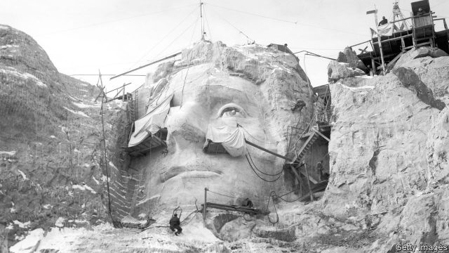

###### Lessons from stone

# The last man to have built Mount Rushmore 

 

> print-edition iconPrint edition | United States | Aug 3rd 2019 

IT WAS THE dust that he hated most. Clouds in the high, thin, South Dakotan air, that choked him as he dangled in a harness on the mountainside. The men wielded jackhammers, drilling holes so sticks of dynamite could be pressed into the rock. Then, as they retreated on a president’s head—for a lunch of meatloaf sandwiches, if lucky—fuses fizzed and granite blasted off below. Few bothered with masks, except when the boss, Gutzon Borglum, came on site. One man snipped a hole in his to let him smoke as he drilled. In any case the damned particles got “into your eyes, ears, hair, nose and worst of all your throat.” 

From 1938 to 1940 Nick Clifford was on Mount Rushmore, first as dogsbody and wood-chopper, then as labourer and winchman. Signed up before he was a man, he suspected they sought out his baseball skills. The chief’s son loved the game and his weekend team needed a pitcher. In the week he enjoyed winching best. For that you perched on one or other president’s skull, taking in a grand view of the Black Hills, and moved others’ harnesses into place. Hourly pay was good for the tail end of the Depression: 50 cents, rising to a heady $1.25 for a skilled sculptor. Work stopped in winter. No one got overtime. 

Some 400 men were on site at some point or other from 1927 to 1941. They blasted 450,000 tons of granite, so the sculptors could reveal the four presidents within. Remarkably no one was killed, despite explosions twice daily, dropped tools, accidents with winches and one terrifying time when the “bucket”—a contraption that hoisted men and gear to the mountain top—hurtled, unrestrained, back to earth. A few died fairly soon afterwards. The wife of one worker suspected silicosis, perhaps worsened by heavy smoking habits. 

Mr Clifford didn’t light up. At 98, the last surviving worker remains relatively hale and won’t retire. Three days each week he attends to visitors at the monument’s gift shop. Always in blue denim shirt and pale baseball cap, he poses for photographs, although Carolyn, his wife, confides he hates cameras. “I couldn’t be better,” he says, but he declines even handshakes from children or much conversation. The inquisitive are told all their questions have already been answered in his book, on sale for $12. It includes a baseball card. 

Most wonder about prosaic matters. Was it hard toil? (Yes.) Was he scared, swaying in the wind by Lincoln’s beard or Teddy Roosevelt’s chin? (No, but he was young and less thoughtful.) Did it get unbearably cold? (Never enough to need long underwear.) To those curious about his place in history, he says little. Would he liken himself to those who laboured at Stonehenge, the pyramids or China’s Great Wall? He hasn’t considered it. 

A ranger addresses one topic he neglects. Mount Rushmore arguably produces the greatest returns of any public project, he tells a small crowd. The grand scheme finished under-budget and earlier than many expected. It cost less than $1m (in 1940s money) and even posted back a $388 surplus to the federal government. The site now draws 2.3m tourists yearly, quite a boon in a rural spot. Visitors may come for centuries yet. After the dust settled, Mr Clifford and his fellow workers left a towering legacy. ■ 
<<<<<<< HEAD

-- 

 单词注释:

1.rushmore[]:n. 拉石茂山 

2.Aug[]:abbr. 八月（August） 

3.Dakotan[dә'kәutәn]:[地质]达科他阶, 达科他州的, 达科他语的, 达科他人的 

4.dangle['dæŋgl]:vi. 摇晃地悬挂着, 追求 vt. 使摇晃地悬挂 n. 悬垂 

5.mountainside['mauntinsaid]:n. 山腹, 山腰 

6.wield[wi:ld]:vt. 挥舞, 运用 

7.jackhammer['dʒækhæmә]:n. 手提钻 

8.dynamite['dainәmait]:n. 炸药 vt. 炸毁, 破坏 

9.meatloaf[mi:t'ləʊf]:n. 烘肉卷 

10.fiz[fiz]:n. 发嘶嘶声, 有泡沫的饮料 v. 作嘶嘶声 

11.granite['grænit]:n. 花岗岩 [化] 花岗岩 

12.bother['bɒðә]:vt. 烦扰, 迷惑 vi. 烦恼, 操心 n. 麻烦, 纠纷, 讨厌的人 

13.gutzon[]: [人名] 格曾 

14.Borglum[]:博格勒姆（人名） 

15.snip[snip]:v. 剪, 剪断, 削减, 删节 n. 剪, (剪刀的)一剪, 不足道的人 

16.damn[dæm]:n. 一点, 诅咒, 丝毫 interj. 该死, 该死的 vt. 诅咒, 罚...下地狱 vi. 指责, 谴责, 骂...该死, 证明...有罪 

17.nick[nik]:n. 刻痕, 缺口, 划痕 vt. 刻痕于, 弄缺, 擦伤 vi. 狙击 

18.clifford['klifәd]:n. 克利福德（男子名） 

19.dogsbody[]:n. 打杂工, 职位低微的人员 

20.winchman['wintʃmәn]:n. 绞车手 

21.pitcher['pitʃә]:n. 有把的大罐, 瓶状体, 投手, 摊贩 

22.winch[wintʃ]:n. 曲柄, 绞车 vt. 用绞盘拉 

23.perch[pә:tʃ]:n. 栖木, 高位, 杆, 河鲈 v. (使)栖息, 就位, 位于, (使)暂歇 

24.skull[skʌl]:n. 头盖骨, 头脑, 好学生 [医] 头颅 

25.hourly['auәli]:a. 每小时的, 以小时计的, 频繁的 adv. 每小时地, 频繁地, 不绝地 

26.heady['hedi]:a. 顽固的, 任性的, 性急的, 猛烈的 

27.sculptor['skʌlptә]:n. 雕刻家 

28.remarkably[ri'mɑ:kәbli]:adv. 显著地, 引人注目地, 非常地 

29.contraption[kәn'træpʃәn]:n. 奇妙的装置, 稀奇古怪的玩意儿, 新发明的玩意儿, 外形奇怪的机器/装置 

30.hoist[hɒist]:n. 升高, 起重机, 推动 v. 升起, 升高, 举起 

31.unrestrained[.ʌnri'streind]:a. 未克制的, 无限制的, 放纵的 [法] 无拘束的, 无限制的:自由的, 过度的 

32.afterwards['ɑ:ftәwәdz]:adv. 然后, 后来 

33.silicosis[,sili'kәusis]:n. 石末沉着病, 硅肺(磨工病), 矽肺 [化] 矽肺 

34.worsen['wә:sn]:vt. 使更坏, 使恶化 vi. 变得更坏, 恶化 

35.hale[heil]:a. 强壮的, 矍铄的, 健壮的 vt. 猛拉, 拖曳 

36.alway['ɔ:lwei]:adv. 永远；总是（等于always） 

37.denim['denim]:n. 斜纹粗棉布, 牛仔布, 劳动布, (非正式)工作服, 工装裤 

38.carolyn[]:n. 卡洛琳（女子名） 

39.confide[kәn'faid]:vt. 吐露, 委托 vi. 信赖 

40.handshake['hændʃeik]:n. 握手 

41.inquisitive[in'kwizәtiv]:a. 好问的, 想知道的, 好追根究底的 

42.prosaic[prәu'zeiik]:a. 散文的, 散文体的, 平凡的 

43.teddy['tedi]:n. 连衫衬裤；泰迪玩具熊 

44.les[lei]:abbr. 发射脱离系统（Launch Escape System） 

45.unbearably[ʌn'beərəblɪ]:adv. 不能忍受地, 无法容忍地; 慌 

46.liken['laikәn]:vt. 比喻, 比拟 

47.Stonehenge['stәunhendʒ]:(英国 Salisbury 平原上的)史前巨石柱 

48.ranger['reinʒә]:n. 王室守林人, 骑警, 漫游者 

49.arguably['ɑ:ɡjuәbli]:adv. 可论证地；可争辩地；正如可提出证据加以证明的那样地 

50.boon[bu:n]:n. 恩惠 

51.legacy['legәsi]:n. 祖先传下来之物, 遗赠物 [经] 遗产, 遗赠物 
=======
>>>>>>> 50f1fbac684ef65c788c2c3b1cb359dd2a904378

