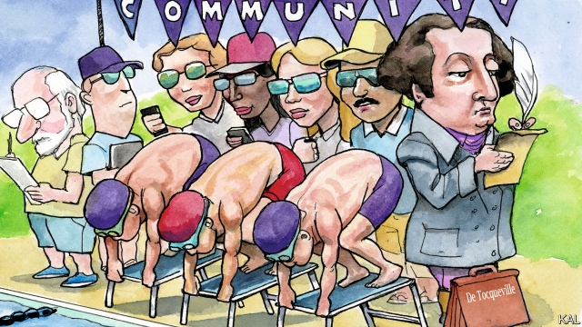

###### Lexington

# What the mighty Dolphins say about America 

 

> print-edition iconPrint edition | United States | Aug 3rd 2019 

THE DOLPHINS contested their final meet of the summer last weekend. It was an away contest—so held at the neighbourhood pool of a different Maryland suburb from Lexington’s own. Yet it was much the same as the dozen meets, home and away, his local swim team had competed in since mid-June. There was an early start, with swimmers aged 6-18 required for warm-up laps by 8am. Swim parents—mostly both parents of each Dolphins swimmer—meanwhile gathered in knee-length shorts and polo shirts to commiserate one another on the early morning scramble. 

Then there was the national anthem—typically sung by a child (because how many adults can manage “and the rockets’ red glare…”?) but this time played by a teenage swimmer on her cello. Several hundred parents and children turned solemnly towards the national flag, hanging limp by the pool, with hands and goggles on hearts. Then, to a burst of pop music and cheesy wisecracks from the announcer, starters, timers and stroke-and-turn judges took their places, and the first row of swimmers took their marks. 

Of the many benefits America has bestowed on your (British) columnist, few beat the Dolphins. The neighbourhood swim team is one of his family’s main shared activities. (The feeling of amused satisfaction as the boys’ hands reach for their hearts during the anthem never fades.) It also affords them superb competition—powered by its local teams, swimming is huge in Maryland; its swimmers won more golds at the 2016 Olympics than Australia. The Dolphins and their home pool on the edge of Washington, DC, are also a source of friendships. Part-funded by a portion of the local property taxes, they are the heart of a community that is surprisingly close-knit given how busy and itinerant its residents are. This makes the Dolphins an example of Tocquevillean America: a nation of strong communities founded on voluntary service. Well-heeled suburbs are where it still thrives. 

That might seem unlikely. American wonks have fretted about declining civic participation since the publication of Robert Putnam’s groundbreaking study, “Bowling Alone”, two decades ago. The main explanations included growing work pressure—mainly because of women’s entry into the workforce—and the decline of social institutions such as mainline protestant churches. And as those factors have proved unremitting, so the decline has continued. Figures released by the Bureau of Labour Statistics suggest a quarter of Americans volunteer for community or charitable endeavours, a proportion that is high by rich-world standards; but America’s lowest level for two decades. Most troublingly, the decline is steepest in small towns and rural areas whose communities were once ironclad. Yet the overall volume of voluntary service has held up, in part because well-educated suburbanites such as your columnist’s neighbours are doing more of it. 

The effort behind the Dolphins illustrates this. The team’s director, Jeff Mascott, estimates that almost all the parents of around 100 swimmers contribute somehow (and he knows who does not). Around 30 have a formal role; a similar number volunteer informally, as timers or by providing meals. The uncommon property-tax arrangement is a huge advantage. Yet the biggest investment in the team is parental time. 

This setup gives rise to a few heroes. When not running the Dolphins—and until recently the local road race, a soccer team and various things at church—Mr Mascott manages a company and four children (his wife is merely a law professor who helps with IT for the Dolphins and sits on the board of the local school foundation). Otherwise, for most of the parents involved volunteering for the Dolphins is not at all altruistic because the benefits are so large. The company of broadly like-minded people is amusing (and could constitute useful networking). As well as being great fun, the team is likewise a lesson for the children in building social capital. For working parents, its daily training sessions are a solution to the long school-holiday. 

The fact that less well-educated Americans have struggled to replace their dwindling Methodist churches and labour unions with neo-Tocquevillean projects like the Dolphins underlines how inadequate income is as a measure of inequality. Social capital is a huge contributor to well-being that more and more Americans are missing out on. This will weigh on their children’s prospects, too. Lacking experience of social institutions, they are less likely to participate in them. It is a sobering comparison with the lucky Dolphins—made worse by the fact that such community activities, though not obviously a cause of inequality, are much less of a solution to it than the earlier social institutions. The churches and unions were far more powerful—and also inclusive and evangelising (though non-whites were often excluded). The swim team is only open to people able to afford the local property prices. 

In other words, American civil society is not so much declining as bifurcating; just as work and educational opportunity is. Privilege and disadvantage are becoming entrenched. That suggests it will be hard to rebuild social capital where it is fading fastest. Its demise is part of a broader story of stagnant wages, poor schools and shaky confidence—which, in turn, will take more than a renewal in local organising to arrest. Yet that is still an important goal. And the vibrant social institutions of privileged Americans should at least be easier to spread around than their other advantages, because they draw on such well-established traditions. 

More than money, they require local leadership and enthusiasm, qualities as old as America. And, as the country’s still-high rates of volunteering show, they remain characteristic of it. For a newcomer to the Tocquevillean tradition, that is the most striking thing about a local effort like the Dolphins. It represents a culture that simply does not exist anything like so vigorously in most other countries. It is America, for richer or poorer, at its best.■ 

