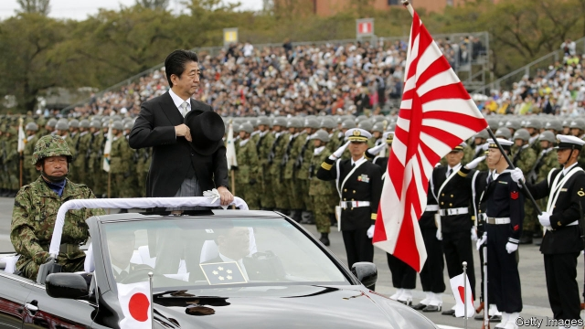

###### What grandfather left undone

# Can Shinzo Abe change Japan’s basic law? 

 

> print-edition iconPrint edition | Asia | Aug 10th 2019 

IN THE 1950s Nobusuke Kishi, then Japan’s prime minister, tried to change the constitution that America had imposed on the country in the aftermath of the second world war. He failed. Now his grandson, Shinzo Abe, Japan’s current prime minister, is trying to do the same before he leaves office by the autumn of 2021. 

Mr Abe’s personal history is not the only reason he is so set on this. For his vocal nationalistic base, it is a passionately held cause. And as one of Japan’s longest-serving prime ministers (the longest, if he remains in power until mid-November) he thinks he has the political clout to do it. 

There are good reasons to try—despite China’s mutterings. (Its state news-agency once said that doing so would be like “releasing the shackles of the nation’s legally tethered military.”) The constitution is out of step with reality. Article 9 commits Japan to pacifism and to abjuring the maintenance of armed forces—which the existence of the country’s Self-Defence Forces (SDF) clearly breaches. This is the most controversial of four areas that Mr Abe’s Liberal Democratic Party (LDP) addressed in recent proposals, even though the recommendation to recognise the existence of the SDF (rather than, say, allow Japan to wage war) is a watered-down version of what many in the LDP would like. The other three areas are upper-house electoral districts, the right to free education and emergency powers for the cabinet. 

If the Japanese want to change their constitution, there is no reason why they shouldn’t. America’s has been altered 27 times since its promulgation in 1788. But Japanese people are proud of their pacifism and keen to stay out of other countries’ affairs. A poll in July by NHK, the national broadcaster, found 29% of people supported any revision compared to 32% opposed to it (the rest were undecided or failed to respond). The numbers diverge when the question focuses on Article 9: an Asahi poll found 33% favourable to amending it and 59% against. 

The opposition is resistant, too. It has talked about the need to revise parts to improve governance, such as the prime minister’s right to dissolve the lower house, or to explicitly add new ideas such as a citizen’s “right to know”. But no major party bar the LDP unreservedly backs changing Article 9. Even Komeito, the LDP’s coalition partner, suggests debate is needed first. 

That makes it hard to see how Mr Abe is to get this done. Changing the constitution requires two-thirds of both the upper and lower houses of the Diet, followed by a majority in a referendum. And Mr Abe lost his coalition’s two-thirds majority in the upper house in elections last month. 

The political calendar is tight, with the change of emperor this year and the Olympics in 2020, and the geopolitical environment is not propitious. America’s calls for allies to help prevent further seizures of ships in the Strait of Hormuz are providing the Japanese with a concrete example of the sorts of conflicts into which their country could be dragged should Article 9 be changed. “The numbers don’t align, voter interest doesn’t align, and the situation in the Middle East doesn’t help,” says Yuki Tatsumi of the Stimson Centre, a think-tank in Washington. 

Mr Abe is moderating his approach. He may shift the emphasis from Article 9 to rights and governance issues that appeal to the opposition, reckons Ms Tatsumi. Yuichiro Tamaki, the head of the Democratic Party for the People, the second-biggest opposition group, agrees that there needs to be a debate. Speaking after the elections, Mr Abe said he hoped for “active discussions”, and emphasised that “constitutional revision is not up to the government, but the Diet”. 

He is pragmatic, but he wants a legacy. Efforts to resolve diplomatic problems left over from the war, such as with Russia, have stalled. The economy, which he pledged to revive, is spluttering. Changing the constitution is a challenge—but no tougher than the others he faces. ■ 
<<<<<<< HEAD

-- 

 单词注释:

1.shinzo[]:[网络] 晋三；爆裂战士战蓝宝；神像 

2.abe[eib]:n. 亚伯（男子名, 等于Abraham） 

3.Aug[]:abbr. 八月（August） 

4.Nobusuke[]:伸介 

5.kishi[]: [地名] [尼日利亚] 基希 

6.aftermath['ɑ:ftәmæθ]:n. 结果, 后果 [法] 后果, 结果 

7.vocal['vәukl]:a. 嗓音的, 声音的, 有声的, 歌唱的 n. 元音, 声乐作品 

8.nationalistic[.næʃәnә'listik]:a. 国家主义的 

9.passionately['pæʃənətlɪ]:adv. 热情地, 激昂地 

10.clout[klaut]:n. 敲击, 破布 vt. 打补钉 

11.muttering[]:[医] 嗫语 

12.shackle['ʃækl]:n. 桎梏, 束缚物 vt. 加枷锁, 束缚 

13.legally['li:gәli]:adv. 法律上, 合法地 [法] 法律上, 合法地, 法定地 

14.tether['teðә]:n. 系绳, 系链, 界限, 范围 vt. 栓, 束缚, 限制 

15.pacifism['pæsifizm]:n. 和平主义, 反战论, 不抵抗主义 [法] 和平主义, 非战主义, 不抵抗主义者 

16.abjure[әb'dʒuә]:vt. 发誓断绝, 公开放弃 [法] 誓绝, 弃绝, 公开放弃 

17.SDF[]:[计] 标准数据格式, 标准分配格式 

18.breach[bri:tʃ]:n. 裂口, 违背, 破坏, 违反, 突破, 破裂 vt. 攻破, 突破 vi. 跳出水面 

19.LDP[]:abbr. 自由民主党（Liberal Democratic Party）；增加标签分发协议（Label Distribution Protocol） 

20.electoral[i'lektәrәl]:a. 选举人的, 选举的, (有关)选举的 [法] 选举的, 选举人的, 由选举人组成的 

21.promulgation[.prәumʌl'geiʃәn]:n. 发布, 公布, 传播 [法] 颁布, 公布, 散播 

22.NHK[]:日本广播协会 

23.broadcaster['brɒ:dkæstә]:n. 播送者, 广播装置, 播种机 

24.undecided[.ʌndi'saidid]:a. 未定的, 不明确的 

25.diverge[dai'vә:dʒ]:vi. 分歧, 岔开 vt. 使岔开 

26.Asahi[]:n. 朝日（公司及其品牌名称） 

27.amend[ә'mend]:vt. 修改, 改善, 改良 vi. 改过自新 

28.opposition[.ɒpә'ziʃәn]:n. 反对, 敌对, 相反, 在野党 [医] 对生, 对向, 反抗, 反对症 

29.governance['gʌvәnәns]:n. 统治, 统辖, 管理 [法] 统治, 管理, 支配 

30.explicitly[]:adv. 明确地；明白地 

31.unreservedly[,ʌnri'z\\:vidli]:adv. 不客气地, 率直地 

32.komeito[]:[网络] 公明党；公民党；政府党 

33.coalition[.kәuә'liʃәn]:n. 结合体, 结合, 联合 [经] 联合, 联盟 

34.referendum[.refә'rendәm]:n. （就重大政治或社会问题进行的）全民公决，全民投票 

35.geopolitical[,dʒi(:)әupә'litikәl]:[计] 地理的 

36.propitious[prә'piʃәs]:a. 顺利的, 适合的, 吉祥的, 慈悲的 

37.ally['ælai. ә'lai]:n. 同盟者, 同盟国, 助手 vt. 使联盟, 使联合, 使有关系 vi. 结盟 

38.seizure['si:ʒә]:n. 捕获, 夺取, 占领, 捕获物, 没收, 充公 [医] 发作; 癫痫发作 

39.Hormuz['hɔ:mәz,hɔ:'mu:z]:霍尔木兹海峡(在伊朗和阿拉伯半岛之间,连接波斯湾[即阿拉伯湾]和阿曼湾) 

40.align[ә'lain]:vi. 排列, 排成一行, 结盟 vt. 使结盟, 使成一行, 校正 

41.voter['vәutә]:n. 选民, 投票人 [法] 选民, 选举人, 投票人 

42.yuki[]:n. 徐怀钰（歌手）；友希（日本人名）；（日）雪 

43.tatsumi[]: [医]氟脲嘧啶，5-氟脲嘧啶[抗代谢抗肿瘤药] 

44.Stimson['stimsn]:斯廷森(姓氏) 

45.Washington['wɒʃiŋtn]:n. 华盛顿 

46.reckon['rekәn]:vt. 计算, 总计, 估计, 认为, 猜想 vi. 数, 计算, 估计, 依赖, 料想 

47.yuichiro[]:[网络] 雄一郎；雄市郎；犹一郎 

48.tamaki[]: [地名] [新西兰] 塔马基; [地名] [日本] 玉城 

49.emphasise[]:vt. 强调, 重读, 加强...的语气, 着重 

50.constitutional[.kɒnsti'tju:ʃәnl]:a. 宪法的, 立宪的, 体质的 [医] 全身的; 体质的 

51.pragmatic[præ^'mætik]:a. 忙碌的, 爱管闲事的, 自负的, 固执己见的, 实际的, 务实的, 国事的, 国务的 [法] 闲断的, 固执己见的, 实用主义的 

52.legacy['legәsi]:n. 祖先传下来之物, 遗赠物 [经] 遗产, 遗赠物 

53.diplomatic[.diplә'mætik]:a. 外交的, 老练的 [法] 外交的, 外交上的, 文献上的 

54.stall[stɒ:l]:n. 厩, 停车处, 牧师职位, 货摊, 托辞, 拖延 vt. 关入厩, 停顿, 推托, 支吾, 使陷于泥中 vi. 被关在厩内, 陷于泥中, 停止, 支吾 

55.pledge[pledʒ]:n. 诺言, 保证, 誓言, 抵押, 信物, 保人, 祝愿 vt. 许诺, 保证, 使发誓, 抵押, 典当, 举杯祝...健康 

56.revive[ri'vaiv]:vt. 使苏醒, 使复兴, 使振奋, 回想起, 重播 vi. 苏醒, 复活, 复兴, 恢复精神 

57.splutter['splʌtә]:n. 喷溅声 vi.vt. 急促而慌乱地说 vi. 发出吐唾沫声 
=======
>>>>>>> 50f1fbac684ef65c788c2c3b1cb359dd2a904378

