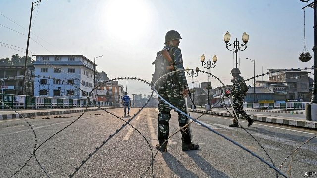
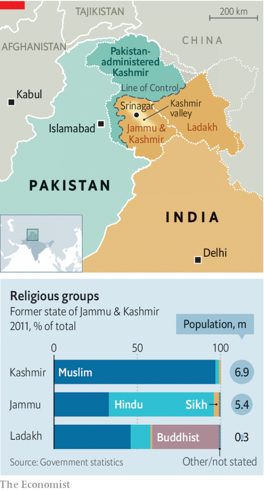

###### Modi’s Kashmir surprise

# India abruptly ends the last special protection enjoyed by Kashmir 

 

> print-edition iconPrint edition | Asia | Aug 8th 2019 

AT ONE FELL swoop, India’s central government has ended the special status enjoyed by Jammu & Kashmir and abolished it as a state. For 70 years it had granted the bitterly disputed Muslim-majority region a modicum of autonomy within India. Late at night on August 4th phone lines, television and internet access were cut and leaders of its political parties put under house arrest. The next morning India’s home minister carried a package of legislation into the upper house of parliament. It proposed a radical reorganisation of the territory. It took the house just 90 minutes to strip it of statehood and divide it into two parts to be ruled from Delhi. Kashmiris had been warned, as had the rest of India. It still caused shock. 

The Hindu-nationalist Bharatiya Janata Party (BJP) led by the prime minister, Narendra Modi, had long argued that Jammu & Kashmir’s special status was an error, dating from soon after India’s independence. Mr Modi’s re-election in May, with an overwhelming majority in parliament, gave him the confidence to correct it—knowing that doing so would anger Pakistan (which also claims the territory) and enrage many Kashmiris. Pakistan duly expelled India’s high commissioner and suspended trade. A curfew imposed on the region on August 5th has kept Kashmiris quiet, for now, as has the presence of thousands of additional Indian troops who have been pouring in since late July, ostensibly to prevent terrorism. 

The former state of Jammu & Kashmir is composed of three main parts: Hindu-majority Jammu, in the foothills; the arid highlands of Ladakh, which has a large Buddhist population; and a sprawling basin with Srinagar at its centre that is home to ethnic Kashmiris, most of whom are Muslims (see map). In 1947, when British rule of the subcontinent ended, the Hindu maharajah of Jammu & Kashmir hesitated to join either of the new countries, Pakistan and India. Those countries soon went to war over the area. A stalemate ended with India occupying two-thirds of the state, and Pakistan controlling the rest. India and Pakistan have kept on fighting over the region. The most recent eruption of large-scale hostilities was in 1999. 

 

Mr Modi has gutted an article of India’s constitution, which was introduced in the 1950s to secure the state’s acquiescence to Indian control. This had decreed that the central government would be responsible only for Jammu & Kashmir’s defence, foreign affairs and communications. Long before Mr Modi came to power, however, Indian governments began whittling away at the state’s autonomy. However it did retain an important privilege: the right to bar non-residents from buying land. That, too, has gone. 

In theory, changing this part of India’s constitution requires a two-thirds parliamentary majority, which the BJP does not quite have. So the party devised an easier way: their man in the president’s chair simply issued an order annulling Kashmir’s special status. That should have required assent from Jammu & Kashmir, too. But since June 2018, when the BJP withdrew from a coalition there, the state had been under direct rule from Delhi. So the rest of India assented on Kashmir’s behalf. That allowed parliament to abolish the state, and split it into two new “union territories” under the centre’s direct rule: one called Jammu & Kashmir and the other, Ladakh. 

The ease with which the state was dissolved will spook some of India’s other regional governments. A challenge has already been filed with the Supreme Court. But there is considerable popular support for Mr Modi’s sleight of hand. Even some parties that are normally fiercely opposed to the BJP have backed him. 

Mr Modi’s ministers have justified the move partly on security grounds. Since 1989 insurgents, some of them backed by Pakistan, and campaigns against them have killed at least 45,000 people in Jammu & Kashmir. The Hindu minority in the valley around Srinagar has been driven out. By the time Mr Modi became India’s prime minister in 2014, the conflict had become less intense. Since then it has steadily escalated. Mr Modi believed that the state’s autonomous status was fuelling anti-India violence. Scrapping it, however, is hardly likely to prove an effective cure. 

Kashmir’s more moderate politicians feel most badly betrayed. On the campaign trail earlier this year, Mr Modi had sworn that he would not “allow Muftis and Abdullahs to divide India”. He was referring to the state’s two most famous political families. Generations of Indian bureaucrats had parleyed with them to try winning over Kashmiris, greasing the wheels with subsidies. The Muftis and Abdullahs often frustrated their handlers in Delhi, but they are not separatists—unlike many more popular leaders. “Our darkest apprehensions have unfortunately come true,” said Omar Abdullah, a former chief minister of the state who was among those placed under house arrest on August 4th. 

Actions that anger Kashmiris can sometimes benefit Mr Modi politically. He has been widely praised in India for his military operations in the region. In September 2016 a day of “surgical strikes” against nearby Pakistani positions achieved little strategically but helped him in elections. It resulted in a patriotic Bollywood movie which was topping the box office when campaigning began for this year’s polls. 

But the long-term consequences of Mr Modi’s action may well be ones he regrets. The animosity he has doubtless intensified among Kashmiris will make the area even more fertile territory for recruitment to Pakistan-backed insurgency. By allowing non-Kashmiris to buy land, he has in effect given a green light to Hindus wanting to move into the Muslim-dominated Kashmir valley. That risks stoking ethnic tensions in the area. The country has a long history of bloody confrontation between adherents of the two religions. The just-abolished state has suffered much of it. Its residents are bracing for more. ■ 

-- 

 单词注释:

1.Kashmir['kæʃmiә]:n. 克什米尔 

2.abruptly[ә'brʌptli]:adv. 突然地, 唐突地 

3.Aug[]:abbr. 八月（August） 

4.swoop[swu:p]:n. 俯冲, 攫取 vt. 抓取 vi. 猛扑, 突然袭击 

5.statu[]:[网络] 状态查看；雕像；特级雪花白 

6.Jammu['dʒʌmu:]:查谟(城市, 位于亚洲查谟和克什米尔的西南) 

7.modicum['mɒdikәm]:n. 少量 

8.autonomy[ɒ:'tɒnәmi]:n. 自治, 自治权 [医] 自主性 

9.reorganisation['ri:,ɔ:gənai'zeiʃən]:n. 重组（等于reorganization） 

10.statehood['steithud]:n. 州的状态(或地位) [法] 国家地位, 州的地位 

11.delhi['deli]:n. 德里（印度城市名） 

12.Kashmiri[kæʃ'miәri]:n. 克什米尔语, 克什米尔人 

13.Bharatiya[]:[网络] 巴拉蒂亚 

14.Janata['dʒʌnətɑ:]:n. （印度）人民团体；人民党（印度联合政党） 

15.bjp[]: [医][=Bence Jones protein]本周（氏）蛋白，凝溶蛋白 

16.narendra[]:[网络] 纳伦德拉；纳兰德；纳然陀 

17.MODI['mәudai]:[计] 模块化光学数字接口 

18.overwhelm[.әuvә'hwelm]:vt. 淹没, 受打击, 制服, 压倒, 使不知所措 [法] 打翻, 倾覆, 覆盖 

19.Pakistan[.pɑ:ki'stɑ:n]:n. 巴基斯坦 

20.enrage[in'reidʒ]:vt. 激怒, 使暴怒 

21.duly['dju:li]:adv. 恰当地, 充分地, 适当地, 及时地 

22.commissioner[kә'miʃәnә]:n. 委员, 理事, 行政长官 [法] 委员, 政府的特派员, 地方地官 

23.curfew['kә:fju:]:n. 晚钟, 打晚钟时刻, 宵禁 [法] 宵禁, 宵禁令 

24.ostensibly[]:adv. 可公开, 显然, 表面, 外表, 诡称, 假装 

25.terrorism['terәrizm]:n. 恐怖主义, 恐怖统治, 恐怖状态 [法] 胁迫, 暴政, 恐怖政治 

26.foothill['futhil]:n. 山麓小丘 

27.arid['ærid]:a. 干燥的, 不毛的 

28.highland['hailәnd]:n. 高地, 苏格兰高地 

29.Ladakh[]:拉达克（地名） 

30.sprawl[sprɒ:l]:vi. 伸开手足躺, 爬行, 蔓生, 蔓延 vt. 懒散地伸开, 使蔓生, 使不规则地伸展 n. 伸开手足躺卧姿势 

31.Srinagar[,sri:'nʌ^ә(r)]:斯利那加[南亚克什米尔西部城市](为印控克什米尔地区首府) 

32.ethnic['eθnik]:a. 人种的, 种族的 [医] 人种的 

33.Muslim['mjzlim; (?@) 'mʌzlem]:n. 伊斯兰教, 伊斯兰教教徒 

34.subcontinent[sʌb'kɒntinәnt]:n. 次大陆 

35.Hindu['hindu:]:a. 印度教教徒的 n. 印度教教徒 

36.maharajah[mɑ:hə'rɑ:dʒə]:n. （印度的）土邦主, 王公（的称号） 

37.stalemate['steilmeit]:n. 僵持状态, 僵局, 陷于困境, 胶着状况 vt. 将...逼和, 使僵持, 使陷入困境 

38.eruption[i'rʌpʃәn]:n. 爆发, 喷出物, 出疹 [化] 喷发 

39.hostility[hɒs'tiliti]:n. 敌意, 敌对, 反对 

40.gut[gʌt]:n. 剧情, 内容, 内脏, 肚子, 海峡, 勇气 vt. 取出内脏, 毁坏...的内部 

41.acquiescence[.ækwi'esәns]:n. 默许, 默认 [法] 默许, 默认 

42.decree[di'kri:]:n. 法令, 判决, 天意 vt. 颁布, 判决 vi. 发布命令 

43.whittle['hwitl]:vt. 逐渐削薄, 削整, 削弱, 削减 vi. 削木头 n. 大刀, 屠刀 

44.parliamentary[.pɑ:lә'mentәri]:a. 国会的, 议会的, 议会制度的 

45.annul[ә'nʌl]:vt. 废除, 宣告无效, 取消 [经] 撤销, 宣告无效 

46.assent[ә'sent]:n. 赞成 vi. 同意 

47.coalition[.kәuә'liʃәn]:n. 结合体, 结合, 联合 [经] 联合, 联盟 

48.spook[spu:k]:n. 幽灵, 鬼 vt. 惊吓, 鬼怪般地出没 vi. 惊吓而逃窜, 受惊 

49.regional['ri:dʒәnәl]:a. 地方的, 地域性的 [医] 区的, 部位的 

50.sleight[slait]:n. 技巧, 诡计, 熟练 

51.fiercely['fiәsli]:adv. 猛烈地, 厉害地 

52.insurgent[in'sә:dʒәnt]:a. 谋叛的, 起义的, 澎湃的 n. 起义者, 叛乱者 

53.les[lei]:abbr. 发射脱离系统（Launch Escape System） 

54.escalate['eskәleit]:vi. 逐步扩大, 逐步升高, 逐步增强 vt. 使逐步上升 

55.scrap[skræp]:n. 碎片, 残余物, 些微, 片断, 铁屑, 吵架 vt. 扔弃, 敲碎, 拆毁 vi. 互相殴打 a. 零碎拼凑成的, 废弃的 

56.mufti['mʌfti]:n. 常服, 便服, 穆夫提(伊斯兰法典说明官) 

57.bureaucrat['bjuәrәukræt]:n. 官僚作风的人, 官僚, 官僚主义者 [法] 官僚, 官僚作风的人 

58.parley['pɑ:li]:n. 会谈, 谈判 vi. 会谈, 谈判 vt. 讲 

59.grease[gri:s]:n. 脂肪, 兽脂, 油脂, 贿赂 vt. 涂脂于, 贿赂 

60.handler['hændlә]:n. 处理者, 操作者, 拳击教练 [经] 管理者 

61.apprehension[.æpri'henʃәn]:n. 理解, 忧惧, 逮捕 [医] 领会 

62.omar['әjmɑ:(r)]:n. 奥马尔（男子名） 

63.Abdullah[,æb'dʌlə]:n. 阿布杜拉（人名） 

64.politically[]:adv. 政治上 

65.surgical['sә:dʒikl]:a. 外科的, 外科医生的, 手术上的 n. 外科病例, 外科病房, 外科手术 

66.Pakistani[.pɑ:ki'stɑ:ni]:a. 巴基斯坦的 n. 巴基斯坦人 

67.strategically[strә'ti:dʒikәli]:adv. 在战略上, 颇策略地 

68.patriotic[.peitri'ɒtik]:a. 爱国的, 有爱国心的 [法] 爱国的, 有爱国心的 

69.bollywood[]:n. 宝莱坞（位于印度孟买的电影制作中心） 

70.animosity[.æni'mɒsiti]:n. 仇恨, 憎恶, 敌意 

71.intensify[in'tensifai]:vt. 加强 vi. 强化 

72.recruitment[ri'kru:tmәnt]:n. 新兵征召 [医] 募集[反应], 募集[现象](生理), 复聪(耳科) 

73.insurgency[in'sә:dʒәnsi]:n. 叛乱状态, 发生暴动 [法] 暴动, 起义, 叛乱 

74.Hindu['hindu:]:a. 印度教教徒的 n. 印度教教徒 

75.stoke[stәuk]:v. 司炉, (使)大吃 

76.bloody['blʌdi]:a. 血腥的, 嗜杀的, 有血的 

77.confrontation[.kɔnfrʌn'teiʃәn]:n. 对抗；对质；面对 

78.adherent[әd'hiәrәnt]:n. 信徒, 追随者 a. 附着的, 发生联系的 

79.brace[breis]:n. 支柱, 曲柄, 支撑, 一对 vt. 紧缚, 支撑, 激励 vi. 打起精神 [计] 花括号 

