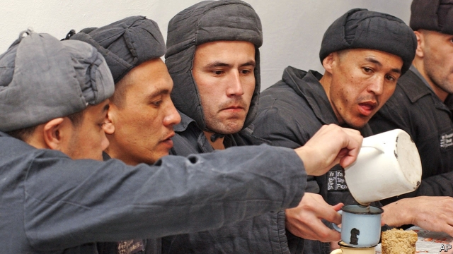

###### Liberalisation in Central Asia

# Uzbekistan’s new president closes Jaslyk prison camp 

 

> print-edition iconPrint edition | Asia | Aug 10th 2019 

UZBEKISTAN’S “YOUTH” camp, Jaslyk in the vernacular, sounds like a children’s holiday camp, but it is a prison where enemies of what was until recently one of the world’s most repressive regimes were isolated and tortured. Now Shavkat Mirziyoyev, Uzbekistan’s reforming president, is shutting it down. 

Jaslyk became synonymous with medieval-style barbarism when two inmates died after immersion in boiling water in 2002—in effect boiled alive. Other political and religious dissidents held there were beaten with iron rods, had their fingernails pulled out and were given electric shocks. Situated in a desert in the Karakalpakstan region, where the temperature ranges from 45°C to -35°C, some 1,400km from the capital, Tashkent, and 180km from the nearest town, Jaslyk—like the Soviet Siberian prison camps on which it was modelled—was impossible to escape from. The local railway station is Barsa Kelmes, which loosely translates as “place of no return”. 

Jaslyk was opened in 1999 by the tyrannical Islam Karimov, who ruled the post-Soviet Central Asian country for a quarter of a century until his death in 2016, after bombings in Tashkent sparked a hunt for dissidents. His successor, Mr Mirziyoyev, has surprised the world by liberalising politically as well as economically: he has freed 50 political prisoners and removed 20,000 citizens from blacklists of people suspected of extremist tendencies, often simply because they were Muslims. 

Mr Mirziyoyev has prohibited the use in court of evidence obtained through torture, in tacit acknowledgment that abuse is rife throughout the penitentiary system, not just at Jaslyk. But the government is shy about facing up to its history: even as it advertises the camp’s closure as a step towards improving the country’s human-rights record, it denies that people were tortured there. 

There is some way to go before the country’s criminal-justice system becomes a beacon for the region. Shadowy espionage cases are still being pursued behind a veil of secrecy in closed courts. Andrey Kubatin, an academic, is serving a prison sentence for passing secrets he insists were in the public domain. Kadyr Yusupov, a former diplomat, is on trial for spying for a foreign power, although he left the foreign service years before the alleged espionage began. Mr Yusupov, who has schizophrenia, was arrested following a failed suicide attempt in the Tashkent metro, raising questions about whether he is psychologically fit to go on trial. 

And then there is Gulnara Karimova, the late president’s daughter, serving a jail sentence on corruption charges as the government seeks to recover her assets from abroad. She has been confined since 2014, before her father died, but has never faced open judicial proceedings. One trial reportedly took place in the kitchen of a house in which she was being held. If Uzbekistan wants to show that it believes in the rule of law, which is so important to investors, it will need to show that even a “robber baron”—as a WikiLeaks cable once dubbed Ms Karimova—gets a fair trial. ■ 
<<<<<<< HEAD

-- 

 单词注释:

1.liberalisation[,libərəlai'zeiʃən, -li'z-]:n. 自由化；开放 

2.Aug[]:abbr. 八月（August） 

3.vernacular[vә'nækjulә]:n. 本地话, 方言 a. 地方的, 用本地语写成的 

4.repressive[ri'presiv]:a. 压抑的, 抑制的, 镇压的 

5.regime[rei'ʒi:m]:n. 政权, 当权期间, 政体, 社会制度, 体制, 情态 [医] 制度, 生活制度 

6.synonymous[si'nɒnimәs]:a. 同义词的, 同义的 

7.barbarism['bɑ:bәrizәm]:n. 野蛮, 未开化 

8.inmate['inmeit]:n. 同住者, 被收容者 [法] 内部的, 接近中心的, 内在的 

9.immersion[i'mә:ʃәn]:n. 沉浸, 专心, 陷入 [医] 浸, 浸渍 

10.dissident['disidәnt]:a. 意见不同的, 持不同政见的 n. 意见不同的人, 持不同政见者 

11.situate['sitjueit]:vt. 使位于, 使处于 

12.karakalpakstan[]:[网络] 卡拉卡尔帕克斯坦；卡拉卡尔帕克斯坦自治共和国；乌兹别克卡拉卡尔帕克斯坦 

13.Tashkent[tæʃ'kent]:塔什干[乌兹别克共和国首都] 

14.siberian[sai'biәriәn]:a. 西伯利亚（人）的；来自西伯利亚的 

15.Barsa[]:巴萨 

16.loosely['lu:sli]:adv. 松弛地, 宽松地, 不紧 

17.tyrannical[tai'rænikl]:a. 暴虐的, 暴君的, 残暴的 

18.Islam['izlɑ:m]:n. 伊斯兰教 

19.karimov[]:[网络] 乌兹别克斯坦总统卡里莫夫；乌兹别克斯坦总统卡西莫夫；卡里莫夫总统 

20.bombing['bɔmiŋ]:n. 轰炸, 投弹 

21.successor[sәk'sesә]:n. 继承者, 接任者 [计] 后继 

22.liberalise['lɪbərəlaɪz]:vt. 使自由化 

23.politically[]:adv. 政治上 

24.blacklist['blæklist]:n. 黑名单 

25.extremist[iks'tri:mist]:[经] 偏激份子 

26.Muslim['mjzlim; (?@) 'mʌzlem]:n. 伊斯兰教, 伊斯兰教教徒 

27.tacit['tæsit]:a. 沉默寡言的, 不苟言笑的, 缄默的 

28.acknowledgment[әk'nɔlidʒmәnt]:n. 承认, 答谢, 认可, 谢礼, 收到的通知, 收到的回音, 谢意 [计] 肯定, 确认认可 

29.rife[raif]:a. 流行的, 盛传的, 充满的 

30.penitentiary[.peni'tenʃәri]:n. 监狱, 收容所, 教养所, 宗教裁判所 a. 用作感化的, 应处监禁的, 教养所的, 收容所的 

31.closure['klәuʒә]:n. 关闭 vt. 使终止 

32.beacon['bi:kn]:n. 烽火, 灯塔 v. 照亮 

33.shadowy['ʃædәui]:a. 有影的, 暗黑的, 朦胧的, 虚幻的 

34.espionage[.espiә'nɑ:ʒ]:n. 间谍活动 [法] 间谍活动, 刺探, 间谍 

35.secrecy['si:krisi]:n. 秘密, 保密 [法] 秘密, 秘密状态, 保密 

36.Andrey[]:n. 安德烈（姓氏） 

37.domain[dәu'mein]:n. 领域, 领土, 产业, 范围 [计] 域, 区域, 支配命令 

38.yusupov[]:[网络] 尤斯波夫；尤苏普夫宫；尤苏普夫公爵 

39.diplomat['diplәmæt]:n. 外交官, 有外交手腕的人 [法] 外交家, 外交官, 有权谋的人 

40.allege[ә'ledʒ]:vt. 宣称, 主张, 提出, 断言 [法] 断言, 指称, 指证 

41.schizophrenia[.skizәu'fri:niә]:n. 精神分裂症 [医] 精神分裂症 

42.suicide['sjuisaid]:n. 自杀, 自杀者 v. 自杀 a. 自杀的 

43.metro['metrәu]:n. 地铁 

44.psychologically[,psaikә'lɔdʒikәli]:adv. 心理上, 从心理学角度 

45.gulnara[]:[网络] 娜拉 

46.corruption[kә'rʌpʃәn]:n. 腐败, 堕落, 贪污 [计] 论误 

47.asset['æset]:n. 资产, 有益的东西 

48.judicial[dʒu:'diʃәl]:a. 法庭的, 公正的, 审判上的, 司法的 [法] 司法的, 审判上的, 法官的 

49.proceeding[prәu'si:diŋ]:n. 进行, 程序, 行动, 诉讼程序, 事项 [化] 会议论文集 

50.reportedly[ri'pɒ:tidli]:adv. 根据传说, 根据传闻, 据报道 

51.Uzbekistan[,uzbeki'stɑ:n]:n. 乌兹别克斯坦 

52.investor[in'vestә]:n. 投资者 [经] 投资者 

53.wikileaks[]: 维基解密 

54.dub[dʌb]:vt. 配音, 轻点, 授予称号, 击 n. 一下击鼓声, 笨蛋 
=======
>>>>>>> 50f1fbac684ef65c788c2c3b1cb359dd2a904378

