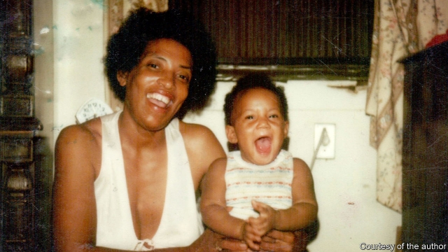
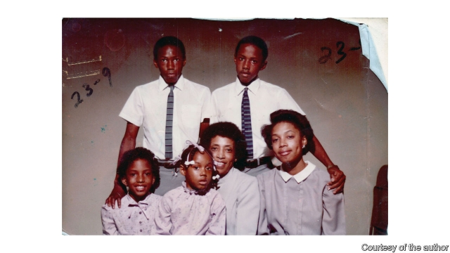

###### Lost in the flood

# A memoir of New Orleans after Hurricane Katrina 

 

> print-edition iconPrint edition | Books and arts | Aug 10th 2019 

The Yellow House. By Sarah Broom. Grove Atlantic; 376 pages; $26. 

SARAH BROOM’S moving memoir does not belong to her alone. She shares the story with her mother, Ivory Mae, and with the house in New Orleans East—razed after Hurricane Katrina struck in 2005—in which Ivory Mae brought up 12 children, of whom the author was the “babiest”. As much amanuensis as protagonist, Ms Broom weaves her memories and her mother’s testimony into a personal, historical and sociological study of African-American life in New Orleans. 

The house was modest, but the book’s territory is broad. “The Yellow House” ranges from Ms Broom’s grandmother’s childhood in the Big Easy to the Californian and Texan cities to which her siblings were displaced after Katrina, and her own stint working at a radio station in Burundi. It combines the most personal details—a sister’s teenage lip-gloss habit, a brother’s beloved bike—with profound questions: “Who has the rights to the story of a place? Are those rights earned, bought, fought and died for?” 

Ms Broom herself left both the Yellow House and New Orleans, though she returned after Katrina. Her book reads less like an assertion of rights than a declaration of love: for her mother, her siblings and their city. She adores the New Orleans of her childhood—not the tourist-filled downtown, but a majority-black, working-class community that is often overlooked, and which her vivid descriptions bring arrestingly to life. In Katrina’s wake, New Orleans East smells like “chitlins, piss, stale water, lemon juice”. After the death of her tall, thin, jazz-loving father, his full life was, she writes, shrunk into an obituary comprising “one short column of newsprint, enough to fit between your pointing finger and thumb.” 

 

Often she combines a childhood observation with adult awareness to disconcerting effect. The police department’s disrespect for her neighbourhood is captured in one stark image: “Our side of Wilson Avenue, the short end, seems a no-matter place where police cars routinely park, women’s heads bobbing up and down in the driver’s seat.” She introduces readers to an alternative urban geography mapped around her family’s lives. “You will pass run-down apartment complexes…where growing up, my brothers made allegiances and enemies…you will see Natal’s Supermarket, which is really only a corner store, where Mom sent me as a kid to buy ‘liver cheese’.” 

This tour of New Orleans stands in critical contrast to the “disaster bus tours” that now haunt neighbourhoods flooded by Katrina. “Imagine”, Ms Broom writes, “that the streets are dead quiet, and you lived on those dead quiet streets, and there is nothing left of anything you owned”—and then tourists appear “in an air-conditioned bus snapping pictures of your personal destruction.” Those “yous” draw readers in, before the bus reminds them that they, like the tourists, are really guests. 

A recurring irony in “The Yellow House” is Ivory Mae’s refusal to invite outsiders into her home. Once a proud host, she grew ashamed of the Yellow House as it aged. “You know this house not all that comfortable for other people,” she constantly reminds her daughter. The house itself may no longer stand, but in her book Ms Broom proudly opens its doors. ■ 

