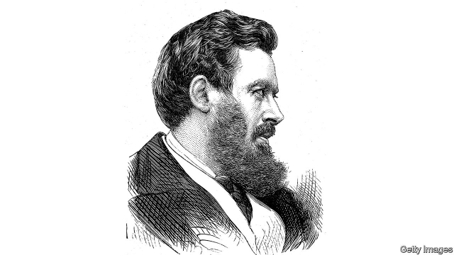

###### Study of a sage

# A new biography of Walter Bagehot, “the greatest Victorian” 

 

> print-edition iconPrint edition | Books and arts | Aug 10th 2019 

Bagehot: The Life and Times of the Greatest Victorian. By James Grant.W.W. Norton; 368 pages; $29.95 and £19.99. 

BEYOND DOUBT, Walter Bagehot was The Economist’s greatest editor. During his 16 years in the job—from 1861 to his death in 1877—he transformed the publication from the mouthpiece of a laissez-faire sect into the voice of mature Gladstonian liberalism. He did this through a combination of natural literary genius and somewhat reluctant networking. He wrote an astonishing proportion of the paper’s articles himself, on an astonishing range of subjects, standing at his desk in his office at 340 Strand, his steel pen flying across the page, producing thousands of words a week. He socialised with everyone who mattered, from intellectual luminaries such as John Stuart Mill and George Eliot to political stars. William Gladstone mentioned him in his diary 125 times. 

Yet The Economist was not enough to absorb all his superabundant energy: the newspaper was then more exclusively devoted to business and finance than it is today, and Bagehot was equally interested in politics and literature. His great book, “The English Constitution”, began as a series of articles for the Fortnightly Review. He was a successful banker who started his career working for his family bank, Stuckey’s, and helped oversee years of uninterrupted growth. He stood unsuccessfully for Parliament several times. He was at work on a projected three-volume history of political economy when he died. 

This is a dazzling range of achievements—and may explain why Bagehot fell down dead at the age of 51. But does it justify the claim first made for him by G.M. Young, the most intelligent historian of Victorian England, and echoed in the title of James Grant’s new book, that he was not just a great editor and great figure about town but also “the greatest Victorian”? 

There are plenty of rivals for this crown, not least Gladstone himself. But Bagehot has a strong claim. He was better than anyone else at expressing the spirit of the age—cocksure, expansive, optimistic, but, beneath the glittering surface, shot through with doubts. He was also at the heart of a silent revolution. In many European countries the bourgeoisie tried to seize power with guns. In Britain it seized power by the force of its intellect. When Bagehot argued, in “The English Constitution”, that the British government was divided into two branches—a dignified aristocratic branch that was primarily there for show and an efficient branch of professional men who did the real ruling—he was in fact describing a revolution in the distribution of power that he had done as much as anyone to bring about. 

Bagehot came from the provincial bourgeoisie. His father was a well-off banker, but hardly the sort of man to rub shoulders with the greatest in the land. His mother suffered from frequent mental breakdowns. His home town of Langport in Somerset was comfortable but out of the way. Rather than Oxford or Cambridge, Bagehot attended University College, London, a new “radical infidel college” designed for people who refused to subscribe to the tenets of the Church of England. 

But the country banker turned journalist felt not the slightest desire to tug the forelock. On the contrary: he dismissed Oxford for turning education into a “narcotic rather than a stimulant”, treated aristocrats as highly paid entertainers who existed to distract the people from the real business of government, and laid down the law on every subject under the sun, from the intricacies of banking to the political merits of Sir Robert Peel (“the powers of a first-rate man and the creed of a second-rate man”). 

Rather than resenting the upstart, the great and the good embraced him, awed by his knowledge of arcane subjects such as finance, dazzled by the bright light of his intellect and by his sparkling prose. E.D.J. Wilson, a journalistic contemporary, judged that, at the height of his powers, he was “an unofficial member of every Cabinet, Conservatives as well as Liberal” and an adviser to every chancellor. 

Mr Grant is a surprising author of a book on a Victorian sage: an American investment-guru-cum-financial-journalist who spends his life watching the markets, rather than a historian who spends it burrowing in the archives. But his book is excellent—built on a lot of study (including time in the archives) and written in a gripping style. Mr Grant is at his best when writing about Bagehot’s financial journalism and indeed his career as a banker. His accounts of the collapse of Overend Gurney, supposedly the Rock of Gibraltar of Victorian finance, and of “Lombard Street”, Bagehot’s book about that debacle, are exemplary. He is skimpier when writing about mid-Victorian politics. “The English Constitution” receives rather less than its due, given its revolutionary thesis and its long-term influence on British constitutional thinking and practice. 

This is very much a warts-and-all portrait, not a hagiography. Mr Grant presents Bagehot as a man rather than just as an editor: as a supplicant who forged a close relationship with James Wilson, the founder of The Economist; as a lover who successfully wooed Wilson’s eldest daughter, Eliza, with perfectly crafted letters; as a husband who ate seven meals a day (“with a snack in the interstices”) and spent beyond his means; as a failed parliamentary candidate, getting barracked as he delivered lofty speeches and even indulging in a bit of bribery, despite denouncing graft in the pages of his newspaper; as an inveterate leg-puller who once wrote a 213-word sentence in praise of the contention that “short views and clear sentences” were the coming thing in English letters. 

Mr Grant recognises that Bagehot had weaknesses as well as strengths. He repeatedly predicted that the South would win the American civil war, in part because the North was led by an incompetent country lawyer—and then effortlessly transformed himself into a fan of Abraham Lincoln when the Union won. He indulged in numerous conflicts of interest—for example advising Gladstone to continue to allow local banks to issue their own currency when he was a substantial shareholder in Stuckey’s, a bank that did just that. Asked to support a petition to found a women’s college of Oxbridge calibre, he demurred on the ground that women were not suited to high-level jobs. Two thousand years hence things might have changed, he said, but at present they would only “flirt with men and quarrel with each other”. 

Bagehot survives these misjudgments with his reputation intact. He does so partly because his glittering prose makes it a pleasure to read even his most mistaken opinions. But he does it too because he was right far more than he was wrong. He was right about the dangers of crowd psychology in both finance and politics. He was right about the importance of “animated moderation” in political life. And he was right that civilisation is a delicate construct that requires skilful—and sometimes cynical—statecraft if it is to be saved from self-destruction. ■ 
<<<<<<< HEAD

-- 

 单词注释:

1.sage[seidʒ]:n. 圣人, 哲人, 鼠尾草属植物 a. 贤明的, 明智的 

2.Walter['wɔ:ltә(r)]:n. 沃尔特（男子名） 

3.Bagehot[ˈbædʒət]:白芝浩；巴杰特（人名） 

4.Victorian[vik'tɔ:riәn]:a. 英国维多利亚女王时代的, 笃信宗教的, 讲究体面的 n. 维多利亚女王时代的英国人 

5.Aug[]:abbr. 八月（August） 

6.jame[]: 灰岩井 

7.norton['nɔ:tәn]:n. 诺顿（男子名）；诺顿公司（美国一软件公司） 

8.mouthpiece['mauθpi:s]:n. 发话筒, 代言人, (电话)送话口 [机] 钳口垫片 

9.sect[sekt]:n. 宗派, 教派 

10.Gladstonian[]:[网络] 格莱斯顿式；格拉斯通式 

11.liberalism['libәrәlizm]:n. 自由主义 

12.strand[strænd]:n. (绳索的)股, 绳, 串, 海滨, 河岸 vi. 搁浅 vt. 使搁浅, 使落后, 使陷于困境, 弄断, 搓 

13.socialise['sәjʃәlaiz]:vt. 使社会化, 使社会主义化, 使适合社会需要 vi. (美)(非正式)参加社交活动, 发生社交往来 

14.luminary['lu:minәri]:n. 发光体, 杰出人物 

15.john[dʒɔn]:n. 盥洗室, 厕所, 嫖客 

16.stuart[stjuәt]:n. 英国斯图亚特王室；斯图尔特（男子名, 等于Stewart） 

17.george[dʒɔ:dʒ]:n. 乔治（男子名）；自动操纵装置；英国最高勋爵勋章上的圣乔治诛龙图 

18.eliot['eljәt]:n. 艾略特（姓氏） 

19.william['wiljәm]:n. 威廉（男子名）；[常作W-][美俚]钞票, 纸币 

20.gladstone['^lædstәun]:n. 一种轻型旅行袋；格拉德斯通, 格莱斯顿（英国政治家） 

21.economist[i:'kɒnәmist]:n. 经济学者, 经济家 [经] 经济学家 

22.superabundant[.sju:pәrә'bʌndәnt]:a. 过多的, 有余的 

23.equally['i:kwәli]:adv. 相等地, 同样地, 平等地 

24.politic['pɒlitik]:a. 精明的, 明智的, 策略的 

25.sery[]:n. (Sery)人名；(俄)谢雷；(科特)塞里 

26.fortnightly['fɒ:tnaitli]:a. 每两星期一次的, 隔周发行的 n. 双周刊 adv. 隔周, 每两星期一次地 

27.banker['bæŋkә]:n. 银行家, 庄家 [经] 银行业者, 银行家 

28.oversee[.әuvә'si:]:vt. 向下看, 了望, 监督, 偷看到 [法] 监察, 监督, 俯瞰 

29.uninterrupted['ʌn.intә'rʌptid]:a. 不间断的, 连续的, 不断的 

30.unsuccessfully[]:adv. 无用；失败地 

31.dazzle['dæzl]:v. (使)眼花, 炫耀 n. 耀眼 

32.GM[]:通用汽车公司, 总经理, 导弹 [经] 通用汽车公司 

33.historian[hi'stɒ:riәn]:n. 历史学家, 记事者 

34.expansive[ik'spænsiv]:a. 扩张性的, 使扩大的, 广阔的 [化] 膨胀的; 可以膨胀的 

35.bourgeoisie[.buәʒwɑ:'zi:]:n. 中产阶级, 资产阶级 

36.intellect['intәlekt]:n. 智力, 出众的才华, 知识分子 [医] 智力, 才智 

37.dignify['dignifai]:vt. 增威严, 使高贵, 故作显贵 

38.aristocratic[æristә'krætik]:a. 贵族的, 主张贵族统绐的, 有贵族气派的 

39.provincial[prә'vinʃәl]:n. 外地人, 粗野的人 a. 省的, 外地的, 偏狭的 

40.breakdown['breikdaun]:n. 崩溃, 故障 [化] 事故; 击穿 

41.Langport[]:[地名] 兰波特 ( 英 ) 

42.somerset['sʌmәsit. -set]:n. 有衬垫的马鞍（独腿者乘坐的） 

43.Oxford['ɒksfәd]:n. 牛津, 牛津大学 

44.Cambridge['keimbridʒ]:n. 剑桥 

45.infidel['infidl]:a. 不信神的, 无信仰的, 异端的 n. 无信仰者, 异教徒, 异端 

46.tenet['tenit]:n. 信条, 教义, 宗旨, 原则 

47.tug[tʌg]:n. 用力拉, 拖曳, 苦干, 挣扎, 绳索 v. 用力拉 

48.forelock['fɒ:lɒk]:n. 额发, 额毛, 销 vt. 用销销住 

49.narcotic[nɑ:'kɒtik]:n. 麻醉药, 镇静剂 a. 麻醉的, 催眠的 

50.stimulant['stimjulәnt]:a. 兴奋性的, 激励的, 鼓舞的 n. 兴奋剂, 酒精饮料 

51.aristocrat['æristәkræt]:n. 贵族 

52.entertainer[.entә'teinә]:n. 表演娱乐节目的人, 演艺人员 

53.distract[dis'trækt]:vt. 转移, 分心, 使发狂 

54.intricacy['intrikәsi]:n. 纷乱, 复杂, 错综 

55.Robert['rɔbәt]:[法] 警察 

56.creed[kri:d]:n. 宗教信条, 教义, 纲领 

57.resent[ri'zent]:vt. 愤恨, 憎恶, 怨恨 

58.upstart['ʌpstɑ:t]:n. 新贵, 暴发户, 自命不凡者 a. 暴富的 

59.awe[ɒ:]:n. 敬畏 vt. 使敬畏 

60.arcane[ɑ:'kein]:a. 神秘的, 晦涩难解的 

61.prose[prәuz]:n. 散文 v. 写散文 a. 散文的, 平凡的 

62.wilson['wilsn]:n. 威尔逊（姓氏） 

63.journalistic[,dʒ\\: nә'listik]:a. 新闻业的, 新闻工作者的, 报刊特有的, 新闻工作的 

64.unofficial[.ʌnә'fiʃәl]:a. 非正式的, 非官方的 [化] 非法定的; 未入药典的 

65.adviser[әd'vaizә]:n. 顾问, 劝告者, 指导教师 [法] 顾问, 劝告者 

66.chancellor['tʃɑ:nsәlә]:n. 大臣, 总理, 首相, 大使馆/领事馆的一等秘书, 司法官, 大学校长 

67.burrow['bʌrәu]:n. 洞穴, 藏身处 vi. 掘洞穴, 躲藏 vt. 掘, 打洞 

68.archive['ɑ:kaiv]:vt. 把...存档 n. 档案馆, 档案文件 [计] 挡案库, 存档 

69.journalism['dʒә:nәlizm]:n. 新闻业, 报章杂志 [法] 报刊, 新闻业, 新闻出版 

70.Overend[]:n. (Overend)人名；(英)奥弗伦 

71.gurney[ˈgɜ:ni]:n. （医院中推送病人用的）轮床； 邮件车 

72.supposedly[sә'pәuzidli]:adv. 想象上, 看上去像, 被认为是, 恐怕, 按照推测 

73.Gibraltar[dʒi'brɒltә]:n. 直布罗陀 

74.lombard['lɔmbәd, 'lʌmbәd]:n. 银行家, 当铺, 银行, 放款者 

75.debacle[dei'bɑ:kl]:n. 崩溃, 大失败 

76.exemplary[ig'zemplәri]:a. 可仿效的, 可做模范的, 惩戒性的, 示范的 [法] 惩罚性的, 警戒性的, 示范的 

77.skimpy['skimpi]:a. 不足的, 吝啬的 

78.les[lei]:abbr. 发射脱离系统（Launch Escape System） 

79.thesis['θi:sis]:n. 论题, 论文 

80.constitutional[.kɒnsti'tju:ʃәnl]:a. 宪法的, 立宪的, 体质的 [医] 全身的; 体质的 

81.hagiography[.hægi'ɒgrәfi]:n. 圣徒传, 圣徒言行录 

82.supplicant['sʌplikәnt]:[法] 恳求者, 哀求者; 恳求, 哀求, 祈求 

83.forge[fɒ:dʒ]:n. 熔炉, 铁工厂 vt. 打制, 锻造, 伪造 vi. 锻造, 伪造 

84.founder['faundә]:n. 创立者, 建立者 vt. 使沉没, 使摔倒, 弄跛, 浸水, 破坏 vi. 沉没, 摔到, 变跛, 倒塌, 失败 

85.eldest['eldist]:a. 最年长的, 排行中第一的 n. 最年长者, 排行中第一者 

86.eliza[]:n. 伊莱扎（女子名, Elizabeth的昵称） 

87.interstice[in'tә:stis]:n. 空隙, 裂缝 [医] 小间隙 

88.parliamentary[.pɑ:lә'mentәri]:a. 国会的, 议会的, 议会制度的 

89.barrack['bærәk]:n. 兵舍, 军营 vt. 使驻兵营内 

90.lofty['lɒfti]:a. 高的, 傲慢的, 崇高的, 高级的, 玄虚的 

91.indulge[in'dʌldʒ]:vt. 纵情于, 使高兴, 放任, 迁就 vi. 沉溺 

92.bribery['braibәri]:n. 贿赂行为, 行贿, 受贿 [经] 行贿, 受贿 

93.denounce[di'nauns]:vt. 告发, 抨击, 谴责 [法] 谴责, 斥责, 告发 

94.graft[grɑ:ft]:n. 嫁接, 贪污 v. 嫁接, 移植, 贪污 

95.inveterate[in'vetәrit]:a. 根深的, 成癖的, 积习的 [医] 慢性顽固性的, 绵延难治的 

96.contention[kәn'teinʃәn]:n. 争论, 争辩, 所持的论点 [计] 争用 

97.incompetent[in'kɒmpitәnt]:a. 无能力的, 无资格的, 机能不全的, 不胜任的 n. 无能力者 

98.effortlessly['efətləslɪ]:adv. 不作努力地, 不费力地 

99.abraham['eibrәhæm, -hәm]:n. 亚伯拉罕（男子名） 

100.Lincoln['liŋkәn]:n. 林肯 

101.shareholder['ʃєә.hәuldә]:n. 股东 [法] 股东, 股票持有人 

102.petition[pi'tiʃәn]:n. 请愿, 诉状, 陈情书, 申请, 祈求, 祷文 v. 正式请求, 恳求, 请愿 

103.Oxbridge['ɔksbridʒ]:n. 牛津和剑桥大学, 牛津或剑桥大学 

104.calibre['kælibә]:n. 口径, 才干, 水准 

105.demur[di'mә:]:vi. 提出异议, 反对, 抗辩 n. 异议, 反对 

106.flirt[flә:t]:n. 卖弄风骚的人, 急动, 急扔 vt. 忽然弹出, 轻快摆动, 挥动 vi. 调情, 玩弄, 摆动, 轻率地对待 

107.misjudgment[]:n. 估计错误；判断错误（等于misjudgement） 

108.intact[in'tækt]:a. 尚未被人碰过的, 原封不动的, 完整的 [医] 完整的, 无伤的 

109.animate['ænimeit]:vt. 使有生气, 赋予生命 a. 有生命的, 有生气的 

110.moderation[.mɒdә'reiʃәn]:n. 缓和, 适度, 温和 [化] 慢化 

111.civilisation[,sivilai'zeiʃən;-li'z-]:n. 文明, 文明世界, 文化, 开化, 教化 
=======
>>>>>>> 50f1fbac684ef65c788c2c3b1cb359dd2a904378

