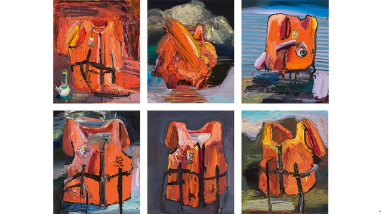
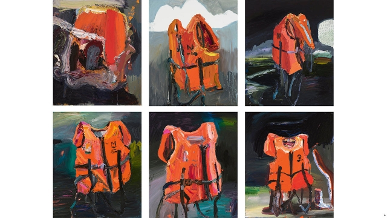

###### Art and activism in Australia

# Ben Quilty’s paintings depict violence, loss and “death jackets” 

 

> print-edition iconPrint edition | Books and arts | Aug 10th 2019 

IF BEN QUILTY, one of Australia’s most famous painters, had followed the advice he was given as a teenager, he might have ended up as an accountant. On a sweltering day in Adelaide at the Art Gallery of South Australia, he drew laughs when he dedicated the first major survey of his 25-year career to a school careers adviser who told him to study economics. “This one’s for you,” he quipped. 

Mr Quilty—who piles paint on his canvases with a cake-icing knife to make gutsy, large-scale works that both charm and challenge his compatriots—has followed an unusual career path. “At a time when the act of painting was seen as having been exhausted, he was one of the few people who remained dedicated” to the craft, says Kit Messham-Muir, a contemporary at Sydney College of the Arts in the 1990s. 

After graduating, Mr Quilty worked as a builder’s labourer and took a course in women’s studies and design, then became a television news editor, splicing together packages from war zones, suburban crime-scenes and natural disasters. His big break came in 2003, when a gallery in Sydney showed a series depicting his car, an LJ Torana—much loved by Australian motorheads and first sold in 1972 (the year before Mr Quilty was born). 

The popular paintings gave him a wide audience and a recurring theme—what Mr Quilty describes as “the debaucherous, shit side of masculinity”. The Toranas were a kind of autobiography, capturing “who I’ve been, my friends, the way I grew up”, and “the crazy rites of passage”—cars, drugs, booze—that young men go in for. “You go flat out, high off your face, facing the windscreen, like you’re all watching a movie, with this incredible danger.” Men need help, Mr Quilty thinks, and a better form of initiation into adulthood, if they are “to become good people”. 

A sense of moral duty has informed much of his art. In 2011 he travelled to Afghanistan as Australia’s official war artist. Afterwards he invited returning soldiers to sit for portraits in his studio in the southern highlands of New South Wales. The paintings are striking images that muse on post-traumatic stress disorder and the psychological costs of combat. 

 

In 2012 Mr Quilty visited Myuran Sukumaran—one of the “Bali Nine”, a group of young Australians convicted of smuggling heroin—in prison in Indonesia. Sukumaran and another man, Andrew Chan, were under sentence of death. Sukumaran had written to ask Mr Quilty’s advice about his own painting; after they met, the prisoner painted 28 self-portraits in a fortnight. Mr Quilty became the public face of a campaign to save the men’s lives. It failed: they were executed by firing squad in April 2015. But scores of Sukumaran’s paintings from his time on death row have since been exhibited across Australia. 

In Mr Quilty’s new show, one wall is covered in paintings of life-jackets. The 12 hazard-orange works (one, “Fereshteh”, is pictured) have been layered thick with paint using the same impasto technique that Frank Auerbach and Francis Bacon deployed. Each square mountain of colour is a memorial to a life lost at sea. “There’s a violence in the way he paints,” says Mr Messham-Muir, now of Curtin University in Perth. Up close, he says, the canvases are “a mash of different colours and textures and paint so thick that you can still smell it.” 

The series arose from a trip Mr Quilty made in 2016 with Richard Flanagan, a Booker prizewinning Australian novelist, to document the refugee crisis in Greece, Lebanon and Serbia. Thousands of life-jackets were scattered on the shore, like neon memento moris. Made from flimsy materials that would never float, they were “death jackets”, Mr Flanagan wrote; tombstones in disguise. In Australia, which was dispatching refugees to a legal limbo on remote islands, Mr Quilty’s paintings are a call for compassion. 

Blurring the line between art and activism can be risky. “There is a danger that he will become such a public figure that he will more or less end up being viewed as a media persona, rather than a serious artist,” says Sasha Grishin of Australian National University. Mr Quilty has duly attracted criticism from the right—a tabloid commentator scorned him as a “politically fashionable” favourite of the left—and from a handful on the left as well. “I’ve been called a bleeding heart like it’s an offence,” Mr Quilty says, shaking his head. 

His show—now relocated to the Gallery of Modern Art in Brisbane, from which it will move to the Art Gallery of New South Wales in Sydney—grapples with violence, trauma and loss. Yet often his paintings have an endearingly witty touch. In “Joe Burger”, a sweetly funny ode to parenting, he casts his infant son as a technicolour chubby-cheeked burger bun. In his “Budgie” series, the yellow and green birds resemble the pompous busts of statesmen. “Bottom Feeders” presents a stark-naked Father Christmas drinking, smoking and peeing on a pot-plant. You need both beauty and humour, Mr Quilty reckons, “if you want to tell stories about the darker side of the human condition”. ■ 

Picture Credit: Fereshteh (group of 12 works) 2016 by Ben Quilty Oil on linen (130cm x 110cm) in memory of Fereshteh. 

