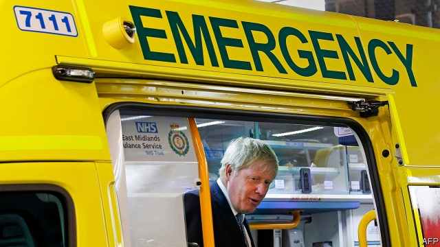

###### Public services

# Boris Johnson gets out his wallet 

 

> print-edition iconPrint edition | Britain | Aug 10th 2019 

IN HIS FIRST speech as the leader of the Conservative Party, Boris Johnson explained his governing philosophy: “Dude, we’re going to energise the country!” His first two weeks in office have seen him do his best to live up to the laugh line. He has criss-crossed the country, leaving a trail of spending commitments in his wake. Live in a left-behind town? He will spruce up your hospital. Based in a growing Northern metropolis? Faster, more frequent trains for you. Concerned by rising violent crime? Worry not: 20,000 extra police officers are on their way. 

Although the government insists there are no plans to call an election, it appears on a collision course with Parliament over Brexit and has a dwindling parliamentary majority—down to just one after defeat by the Liberal Democrats at a by-election in Brecon on August 1st—meaning many expect a vote within the year. The buffet of policies laid out by Mr Johnson suggests he wants to rebuild the electoral coalition the Leave campaign brought together, including not just Tory Brexiteers, but also left-leaning, culturally conservative types in the Midlands and the north (see article). 

Downing Street has attempted to claim that an economic ideology lies behind these announcements, labelling Mr Johnson’s promise of both tax cuts and higher spending as “boosterism” (rather than the more obvious “cakeism”). He has promised £3.6bn ($4.4bn) for 100 poor towns, £2.1bn for the National Health Service and £1.1bn for hiring new police officers. He has voiced support for new railways to join up the north which could cost a whopping £39bn. The flurry of spending commitments provides an indication of how the new prime minister will govern and, perhaps, campaign. 

He has moved quickly to cauterise issues that may harm the Conservatives on the doorstep. The main teachers’ union spent £325,000 at the last election, more than both the UK Independence Party and the Greens, in a successful campaign for more education funding. Mr Johnson has promised to reverse recent school cuts by 2022-23. Health care is one of the few policy areas where the public still trusts Labour more than the Tories. Dominic Cummings, Mr Johnson’s chief adviser, has complained that few Conservative MPs have faced up to the importance of the NHS in British politics. On August 5th the prime minister duly announced plans to renovate 20 hospitals. 

Matt Hancock, the health secretary and an enthusiastic convert to Mr Johnson’s cause, promised he would “make sure that money gets to the front line”, which in this case conveniently includes hospitals in marginal constituencies such as Boston, Stoke and Truro. Although Mr Johnson has promised an additional 20,000 police officers, there will be no proportional increase in the staff who work alongside them, like data analysts or those who work in the courts. Londoners, who twice elected Mr Johnson as mayor, will recognise his fondness for policy announcements that look good splashed across an election poster. 

Many of these announcements then turn out to be less impressive than the headline figure would suggest. As Sally Gainsbury of the Nuffield Trust, a think-tank, has pointed out, £1bn of the £2.1bn announced for the NHS had already been promised (though it was later put on hold). Likewise, half of the fund for poor towns had been set aside by Theresa May, Mr Johnson’s predecessor. Solutions for knottier problems remain in development. An answer to the social-care funding crisis is expected in the autumn. With the exception of the extra police officers, where a new board run by the Home Office will oversee recruitment, the extra money has not been accompanied by reforms to how services are run. 

Most of the money will be spent over the next few years, meaning it will almost certainly be dependent on a successful re-election campaign. In the next few months Brexit is likely to take up the government’s attention, and the Conservatives’ perilous parliamentary position means they will struggle to get much else done. Facing similar obstacles, Mrs May also came to power with bold ambitions to reform the British state. She failed to put them into practice, and it will not be a surprise if Mr Johnson struggles too. ■ 

