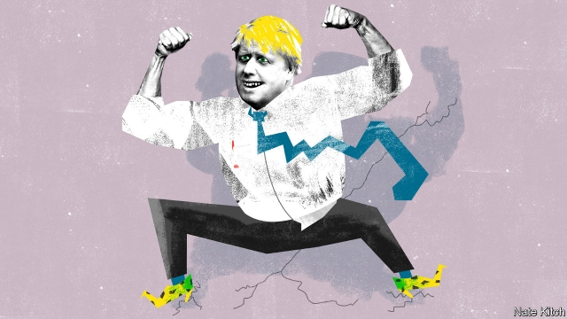

###### Bagehot

# Boris Johnson is looking like Theresa May 2.0 

 

> print-edition iconPrint edition | Britain | Aug 10th 2019 

HISTORICAL PARALLELS with Boris Johnson, Britain’s new prime minister, abound. Mr Johnson’s acolytes compare their leader to Winston Churchill, who also once helped Britain out of a pickle in its relations with Europe. Smart alecs opt for George Canning, a fellow Old Etonian with populist tendencies, who became prime minister in 1827—and died in office after just 119 days. David Lloyd George, a Liberal prime minister whose time in office combined huge constitutional changes, political chicanery and enthusiastic infidelity, also fits. 

Yet the better comparison is with a more recent and less likely prime minister: Theresa May. Mr Johnson and Mrs May are different species. She was determinedly dull, while he is unstoppably jolly. She ascended to the highest office by careful management of a cabinet job, whereas he almost torpedoed his career with a dodgy stint as foreign secretary. Mrs May embodies a strand of curtain-twitching suburban Conservatism. Mr Johnson represents the party’s wing of cavalier public-school bons vivants. Yet these different political animals have strikingly similar strategies. 

Team Johnson has cornered itself on Brexit, painting negotiating red lines with the same enthusiasm as Mrs May. Mr Johnson has promised to take Britain out of the European Union by October 31st, just as Mrs May pledged to do so by March 29th—the missed deadline that, in effect, sealed her fate. Both prime ministers’ Brexit strategies have at their heart the threat that “no deal is better than a bad deal”. Injecting that phrase into the bloodstream of British politics was one of Mrs May’s few successes as a political communicator. Fatally for her, she turned out not really to believe it, chickening out when the possibility of leaving with no deal arrived in March. Mr Johnson’s team in Downing Street have adopted the same mantra, and insist that, unlike her, they will hold their nerve. They may secretly suspect that their promise will never be tested, as Parliament is plotting to force an election rather than allow the country to be dragged out of the EU without a deal. 

The possibility of an election gives rise to the next similarity between the May and Johnson regimes: their serene confidence that a vote will lead to a Conservative victory. The same thinking dominated in the spring of 2017, when Mrs May plotted her snap general election. Such a victory was to be built on Leave-voting constituencies in the Midlands and the north, with voters flocking to the Tories on a pledge of a pure Brexit. Mr Johnson’s electoral pitch is the same. In his first speech as prime minister he spoke of “answering at last the plea of the forgotten people and the left-behind towns”, just as Mrs May pledged to right the “burning injustices” that led to the Brexit vote. When it came to the election, Mrs May framed it as a battle between the people and an establishment determined to thwart their will. If MPs do force an election, Mr Johnson would play a similar tune, with what aides describe as a “people versus the politicians” campaign. 

Even the coverage of their advisers has been similar. Westminster is given to “Life of Brian” syndrome, in which a single bag-carrier is designated as a political messiah. For Mrs May, it was Nick Timothy, a bald Machiavelli who fell out with David Cameron while in government and spent a hiatus from politics composing forthright blogposts, before finding himself in Downing Street. For Mr Johnson, it is Dominic Cummings, a bald Machiavelli who fell out with David Cameron while in government and spent a hiatus from politics composing forthright blogposts, before finding himself in Downing Street. 

Despite their different styles, the presentation of the two prime ministers is oddly familiar. Mr Johnson, who prides himself on his campaigning skills, shuffles between photo opportunities, agreeing only to carefully staged pool interviews, as was Mrs May’s wont. Although Mr Johnson looks comfortable chatting to farmers or petting their livestock in a way that Mrs May never could, the strategy is the same: keep the prime minister away from the press. This should be little surprise. Staffers from CTF Partners, a political consultancy that oversaw Mrs May’s bungled 2017 election, have taken roles in Mr Johnson’s operation. 

That a strategy failed once does not mean it will always fail. Mrs May’s former aides moan that figures such as Philip Hammond, her chancellor, hamstrung the prime minister by refusing to play along with her pantomime preparations for a no-deal Brexit. Mr Johnson’s team has seen off this problem by selecting a cabinet of true Brexit believers and a few former Remainers who have kissed the ring. Labour gained 20 points during the course of the 2017 election campaign, a feat it may struggle to repeat. In calling her snap election, Mrs May looked opportunistic—an ugly trait for a politician whose selling point was a sense of duty. Mr Johnson may be forced into one, or at least look as if he was. Grand political realignments also take time. The 2017 election was called only ten months after the Brexit referendum. Now, after three years of incessant argument, people identify more strongly with their vote in the referendum than with a political party. It may be that the authors of Mrs May’s strategy were merely ahead of their time. 

Yet the May-Johnson approach still suffers from gaping flaws. An election cannot be won with the votes of Leavers alone. Nabbing seats from Labour in pro-Brexit areas is pointless if Remainer seats in London suburbs and university towns are lost. Mr Johnson may frame an election as a plebiscite on Brexit, but it will be voters who decide which topics matter. Mrs May, astonishing as it may now seem, was once wildly popular, entering office with an approval rating of 35. Mr Johnson’s is -7. And whereas Mrs May had options when she became prime minister—a majority, a malleable mandate from the referendum and a public less divided than today—Mr Johnson has none of these. The new prime minister has taken the path of May Mark 2. It is a treacherous one. ■ 

-- 

 单词注释:

1.Bagehot[ˈbædʒət]:白芝浩；巴杰特（人名） 

2.boris['bɔris]:n. 鲍里斯（男子名） 

3.johnson['dʒɔnsn]:n. 约翰逊（姓氏） 

4.theresa[ti'ri:zә]:n. 特丽萨（女子名） 

5.Aug[]:abbr. 八月（August） 

6.abound[ә'baund]:vi. 大量存在, 富于, 充满 

7.acolyte['ækәulait]:n. 侍僧, 助手 

8.winston['winstәn]:n. 温斯顿（姓氏, 男子名） 

9.Churchill['tʃә:tʃil]:n. 邱吉尔 

10.pickle['pikl]:n. 盐卤, 腌汁, 泡菜, 困境, 讨厌鬼 vt. 腌制, 酸洗, 葬送(机会等), 泡 

11.alec['ælik]:n. 亚历克（男子名） 

12.opt[ɒpt]:vi. 选择 

13.george[dʒɔ:dʒ]:n. 乔治（男子名）；自动操纵装置；英国最高勋爵勋章上的圣乔治诛龙图 

14.canning['kæniŋ]:n. 罐头制造 [建] 装罐头 

15.etonian[i(:)'tәunjәn, -niәn]:a. 伊顿公学的, 伊顿公学般的 

16.Populist['pɔpjulist]:n. 民粹派的成员 

17.david['deivid]:n. 大卫；戴维（男子名） 

18.lloyd[lɔid]:n. 劳埃德（男子名） 

19.constitutional[.kɒnsti'tju:ʃәnl]:a. 宪法的, 立宪的, 体质的 [医] 全身的; 体质的 

20.chicanery[ʃi'keinәri]:n. 强词夺理, 狡辩, 欺骗 

21.infidelity[.infi'deliti]:n. 不信神, 无信仰, 背信 

22.les[lei]:abbr. 发射脱离系统（Launch Escape System） 

23.Mr['mistә(r)]:先生 [计] 存储器回收程序, 多重请求 

24.specie['spi:ʃi]:n. 硬币 [经] 硬币 

25.determinedly[dɪ'tɜ:mɪndlɪ]:adv. 坚定地; 坚决地; 决然地; 断然地 

26.unstoppably[]:adv. 无法（使）停下来地 

27.ascend[ә'send]:vi. 上升, 追溯, 登高 vt. 攀登 

28.dodgy['dɒdʒi]:a. 狡猾的, 逃避的, 难弄的 

29.stint[stint]:vt. 节省, 限制, 停止 vi. 节约 n. 吝惜, 节约, 限额 

30.embody[im'bɒdi]:vt. 具体表达, 使具体化 [经] 合并, 具体化, 具体表现 

31.strand[strænd]:n. (绳索的)股, 绳, 串, 海滨, 河岸 vi. 搁浅 vt. 使搁浅, 使落后, 使陷于困境, 弄断, 搓 

32.suburban[sә'bә:bәn]:a. 郊外的, 郊区的, (贬)偏狭的, 土气的, 见识不广的 n. 郊区居民 

33.conservatism[kәn'sә:vәtizәm]:n. 保守, 守旧性, 保守主义, [the]保守党的主张和政策, 保守党 [医] 保守性 

34.cavalier[.kævә'liә]:n. 骑士, 骑手 

35.bon[bɔ:n]:a. （法）好的 

36.vivant[]:[网络] 威万；拉菲尔维凡 

37.strikingly[]:adv. 显著地, 惊人地, 引人注目地 

38.Brexit[]:[网络] 英国退出欧盟 

39.pledge[pledʒ]:n. 诺言, 保证, 誓言, 抵押, 信物, 保人, 祝愿 vt. 许诺, 保证, 使发誓, 抵押, 典当, 举杯祝...健康 

40.inject[in'dʒekt]:vt. 注射, 注入, 使入轨 [医] 注射 

41.bloodstream[]:n. 血流 

42.politic['pɒlitik]:a. 精明的, 明智的, 策略的 

43.communicator[kә'mju:nikeitә]:n. 传播者, 通信装置, 列车内通话装置 

44.fatally['feitәli]:adv. 致命地, 不幸地, 宿命地 

45.mantra['mʌntrә, 'mæn-]:颂歌, 咒语(尤指四吠陀经典内作为咒文或祷告唱念的) 

46.secretly['si:kritli]:adv. 秘密地, 背地里 

47.EU[]:[化] 富集铀; 浓缩铀 [医] 铕(63号元素) 

48.similarity[.simi'læriti]:n. 类似, 类似处 [法] 类似, 相似, 类似事例 

49.serene[si'ri:n]:a. 宁静的, 沉着的, 安详的, 晴朗的 n. 晴朗, 平静 

50.constituency[kәn'stitjuәnsi]:n. 选民, 顾客, 读者 [法] 选区, 全体选民, 选区内的选民 

51.midland['midlәnd]:n. 中部地方, 内地 

52.voter['vәutә]:n. 选民, 投票人 [法] 选民, 选举人, 投票人 

53.Tory['tɒ:ri]:n. 托利党党员, 保守党员, 亲英分子 a. 保守分子的 

54.electoral[i'lektәrәl]:a. 选举人的, 选举的, (有关)选举的 [法] 选举的, 选举人的, 由选举人组成的 

55.plea[pli:]:n. 恳求, 辩解, 抗辩, 诉讼, 请愿, 托词 [法] 抗辩, 申诉案件, 答辩 

56.injustice[in'dʒʌstis]:n. 不公平, 非正义的行为 [法] 不公正, 不公平, 权利侵害 

57.thwart[θwɒ:t]:a. 横放的 vt. 反对, 阻挠, 横过 prep. 横过 adv. 横过 

58.MP[]:国会议员, 下院议员 [计] 宏处理程序, 维护程序, 线性规划, 微程序, 多处理器 

59.aide[eid]:n. 助手, 副官 [计] 数据输入的可说明性 

60.versus['vә:sәs]:prep. 对... [法] 诉, 对, 相形 

61.coverage['kʌvәridʒ]:n. 覆盖的范围, 保险总额, 新闻报导 [化] 可达范围; 覆盖度 

62.adviser[әd'vaizә]:n. 顾问, 劝告者, 指导教师 [法] 顾问, 劝告者 

63.Westminster['westminstә]:n. 威斯敏斯特 

64.brian['braiәn]:n. 布莱恩（男子名） 

65.syndrome['sindrәum]:n. 并发症状, 综合征, 同时存在的事物 [计] 校验子; 并发位 

66.designate['dezigneit]:vt. 指定, 指明, 称呼 a. 已选出而未上任的 

67.messiah[mә'saiә]:n. 弥赛亚 

68.nick[nik]:n. 刻痕, 缺口, 划痕 vt. 刻痕于, 弄缺, 擦伤 vi. 狙击 

69.timothy['timәθi]:n. 梯牧草 [医] 梯牧草, 牛草 

70.bald[bɒ:ld]:a. 秃头的, 光秃的, 单调的, 赤裸的 vi. 变秃 

71.Machiavelli[.mɑ:kjɑ:'veli:]:n. 马基雅弗利 

72.cameron['kæmәrәn]:n. 卡梅伦/隆（男子名） 

73.hiatus[hai'eitәs]:n. 裂缝, 中断, 空隙, 间隙, 裂孔, (稿件)脱字, 漏句 pl. 裂缝, 中断, 空隙, 间隙, 裂孔, (稿件)脱字, 漏句 

74.forthright[fɒ:θ'rait]:adv. 直率地, 直接地, 马上, 立即 a. 直接的, 直率的, 坦白的 n. 直路 

75.blogposts[]:[网络] 博客帖子；部落格帖子；部落格讨论区 

76.dominic['dɔminik]:n. 多米尼克（男子名） 

77.Cumming[]:n. (Cumming)人名；(英)卡明 卡明 

78.oddly['ɒdli]:adv. 奇怪地 

79.shuffle['ʃʌfl]:n. 拖着脚走, 曳步, 混乱, 蒙混, 洗纸牌 v. 拖曳, 马虎地做, 笨手笨脚地穿(脱)衣, 推诿, 洗牌 [计] 混洗 

80.carefully['kєәfuli]:adv. 小心地, 谨慎地 

81.wont[wɒnt]:n. 习惯 a. 惯常的, 易于...的 vi. 习惯 vt. 使习惯于 

82.staffer['stɑ:fә]:n. (一名)职员(尤指编辑或记者) 

83.ctf[]:abbr. certify 证明; certified 有证明的; certificate 证书; combined task force 联合特遣部队 

84.consultancy[]:n. 商量, 协商, 磋商, 会诊, 与...商量, 咨询, 请教, 找(医生)看病, 查阅, 考虑 [经] 咨询业务, 咨询服务 

85.oversee[.әuvә'si:]:vt. 向下看, 了望, 监督, 偷看到 [法] 监察, 监督, 俯瞰 

86.bungle['bʌŋgl]:v. 拙劣地工作, 粗制滥造, 把...搞糟 n. 粗劣, 失误, 笨拙 

87.alway['ɔ:lwei]:adv. 永远；总是（等于always） 

88.philip['filip]:n. 菲利普（男子名） 

89.hammond['hæmәnd]:n. 哈蒙德（美国城市） 

90.chancellor['tʃɑ:nsәlә]:n. 大臣, 总理, 首相, 大使馆/领事馆的一等秘书, 司法官, 大学校长 

91.hamstring['hæmstriŋ]:n. 后腿腱 vt. 切断腿腱使成跛腿, 使瘫痪 

92.pantomime['pæntәmaim]:n. 手势, 哑剧, 舞剧 v. 打手势, 演哑剧 

93.believer[bi'li:vә]:n. 信徒 

94.remainers[]:[网络] 剩余物 

95.feat[fi:t]:n. 壮举, 功绩, 技艺表演 a. 灵巧的, 合适的, 整洁的 

96.trait[treit]:n. 特征, 特性, 一笔, 少许 

97.realignment[,ri:ә'lainmәnt]:n. 重新排列, 改组, 重新组合 [计] 重新调整 

98.referendum[.refә'rendәm]:n. （就重大政治或社会问题进行的）全民公决，全民投票 

99.incessant[in'sesnt]:a. 不断的, 不绝的, 无尽的 

100.gaping['^æpiŋ]:a. 多洞穴的 

101.flaw[flɒ:]:n. 缺点, 裂纹, 瑕疵, 一阵狂风 [化] 划痕; 裂缝; 裂纹 

102.cannot['kænɒt]:aux. 无法, 不能 

103.leaver['li:vә]:n. 离开者（常指学校毕业生） 

104.nab[næb]:vt. 捉住, 逮捕, 抢夺 [电] 国际广播协会的简写 

105.pointless['pɒintlis]:a. 不尖的, 钝的, 不得要领的 

106.remainer[]:[网络] 剩下的 

107.plebiscite['plebisit, -sait]:n. 公民投票, 平民表决 

108.wildly[]:adv. 狂暴地, 激动地, 狂热地, 鲁莽地, 轻率地 

109.malleable['mæliәbl]:a. 有延展性的, 可锻的 [医] 可展的, 易适应的 

110.mandate['mændeit]:n. 命令, 指令, 要求 vt. 委任统治 

111.treacherous['tretʃәrәs]:a. 不可信任的, 危险的, 背叛的, 不可靠的 [法] 奸诈的, 背叛的, 背信弃义的 

