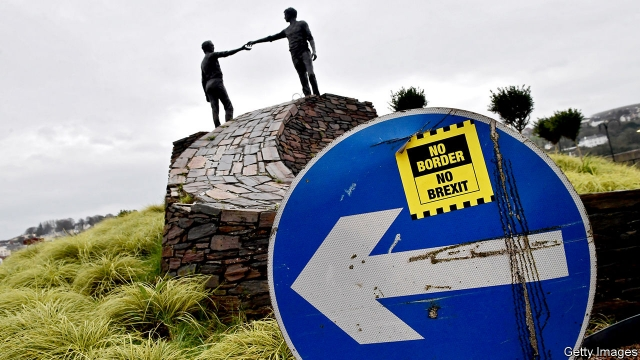

###### Bracing in the border lands

# Brexit or not, Derry will think in all-island terms 

 

> print-edition iconPrint edition | Britain | Aug 10th 2019 

ONLY LAST autumn, Northern Ireland’s second city was eagerly awaiting the opening of a graduate medical school. It was billed as the centrepiece of an urban renewal plan, which over time would improve health care as more doctors stayed in the region. Then came the bad news: the startup was to be postponed until at least the end of 2020. Because of a political impasse that has seen Northern Ireland’s government suspended for more than two years, there was no local minister to sign off the new faculty. It was “bitterly disappointing”, says Paddy Nixon, vice-chancellor of Ulster University (UU), who had masterminded the plan. 

To grasp the anger in Derry, recall that a lack of higher education has been a festering grievance in this mainly Catholic city for over 50 years. In a land of long memories, people still fume over the decision by Northern Ireland’s unionist masters in 1965 to launch the region’s second university not in Derry but in Protestant Coleraine. 

The recent medical snarl-up is one of many bad effects of the collapse of Northern Ireland’s power-sharing administration in January 2017. The damage, in stalled projects and investments, could reach £1bn ($1.2bn) by the end of this year, according to the Confederation of British Industry, a business lobby. Across the region, decisions over schools, health care and waste-water treatment have been postponed. 

Now Brexit, particularly of the no-deal variety, threatens to make matters worse. Households, businesses and students in Derry rely on seamless transport over the adjacent border with the Irish county of Donegal. About 15,000 people in the vicinity cross every day to work or study. The civil service has warned that a no-deal Brexit could cost 40,000 jobs in Northern Ireland. With about 5% of Derry’s population drawing the dole, its unemployment rate is already twice the regional average. Ire over Brexit has helped to fuel a local resurgence of dissident nationalist violence, of which the nastiest sign was the killing of a young journalist, Lyra McKee, in April. 

Yet the mood among the city’s movers and shakers is not uniformly gloomy. On the contrary, people say they want to build on the gains of the past decade. First among those is the habit of seeing Derry not as a remote extremity of Northern Ireland, but as a hub of the whole island’s north-west. “You can either see us a town of 110,000 on the edge of the United Kingdom, or as the linchpin of a region of Ireland that already has 350,000 people and is likely to grow,” says Philip Gilliland, a former president of the Londonderry Chamber of Commerce. 

In many ways, all-Ireland casts of mind are already established. The county of Donegal and the council encompassing Derry and nearby Strabane work in lockstep in areas ranging from libraries to sport. They go on joint missions to America to tout for investment. For the tourist business, Derry’s historic walls and Donegal’s gorgeous beaches are a single product. John Kelpie, Derry council’s chief executive, has argued that the city straddles the two countries, as its outer edges are in the Republic. 

The Irish government thinks in a similar way. Its national development plan, “Project Ireland 2040”, incorporates only one Northern Irish place, Derry. Common sense, rather than nationalist zeal, seems to underlie that decision. Its authors expect Ireland’s population to grow by another million or so and they want the northwest, including Derry, to absorb much of this expansion. 

Some recent initiatives give a hint of what could be possible if the logic of geography were followed through. Altnagelvin, Derry’s main hospital, has a newish radiotherapy unit that treats people from either side of the border. That saves Northern Irish patients a two-hour ride to Belfast, and those in Donegal a much longer hike to Galway or Dublin. 

Improvements to UU’s Derry campus, known as Magee, have been helped along by cross-border ties with the Letterkenny Institute of Technology, which is growing and hopes to morph into a university. Despite the dashing of its medical hopes, Magee has set up research centres in robotics and cognitive data analysis. These outfits will hardly stop talking to their Irish counterparts after Brexit, says Mr Nixon. 

Businesses will draw on the ingenuity which even the existing situation has forced them to hone. Companies already cope with two currencies, two tax regimes and two sets of laws, says Andrew Fleming, managing director of a group of small engineering firms that sell mainly to farmers. His group keeps manufacturing units on both sides of the border, serving clients in each jurisdiction. “We locals are used to working around the border,” he says. “Though for an outside investor, extra hassle could be a huge deterrent.” His firm started in a Donegal village, just south-west of Derry, five generations ago when Ireland was a single political unit under the crown. It has proved resilient through many vicissitudes. 

For all its current and looming woes, Derry still generates pleasant surprises. Who would have predicted its latest cultural export, a globally successful TV series called “Derry Girls”? Set in the 1990s, it gets a laugh out of foul-mouthed schoolgirls, angry nuns, Catholic-Protestant prejudice, bomb alerts and runaway gunmen. Now the city must face Brexit with the same black good humour. ■ 

-- 

 单词注释:

1.brace[breis]:n. 支柱, 曲柄, 支撑, 一对 vt. 紧缚, 支撑, 激励 vi. 打起精神 [计] 花括号 

2.Brexit[]:[网络] 英国退出欧盟 

3.Derry['deri]:n. 民谣, 歌谣 

4.Aug[]:abbr. 八月（August） 

5.eagerly[]:adv. 渴望, 热衷于, 热切 

6.centrepiece['sentәpi:s]:n. 中心装饰品 

7.renewal[ri'nju:әl]:n. 更新, 革新, 复兴, 恢复, 修补, 补充, 继续, 重订, 重申, 续借 [经] 更新, 换新, 重申 

8.startup[]:[计] 启动 

9.impasse['impɑ:s]:n. 难局, 僵局, 死路, 死胡同 

10.paddy['pædi]:n. 稻, 谷, 爱尔兰人, 警察 [法] 警察 

11.nixon['niksn]:n. 尼克松（美国第37任总统） 

12.ulster['ʌlstә]:n. 有带的宽大长外套 

13.uu[]:abbr. 从用户到用户（User to User）；最终用户（Ultimate Use）；解脲支原体 

14.mastermind['mɑ:stәmaind]:n. 优秀策划者, 才子 vt. 指导, 主持, 策划 

15.fester['festә]:vi. 溃烂, 生脓 vt. 使溃烂 n. 脓疮, 溃烂 

16.grievance['gri:vәns]:n. 委屈, 冤情, 苦况 [经] 不满(对雇用条件的) 

17.fume[fju:m]:n. 臭气, 烟, 激怒 vt. 熏 vi. 冒烟 

18.unionist['ju:njәnist]:n. 工会会员, 工联主义者 [法] 工会会员, 工会主义者 

19.Protestant['prɒtistәnt]:n. 新教徒 a. 新教的, 新教徒的 

20.Coleraine[]:n. (Coleraine)人名；(英)科尔雷因 科尔雷恩 

21.stall[stɒ:l]:n. 厩, 停车处, 牧师职位, 货摊, 托辞, 拖延 vt. 关入厩, 停顿, 推托, 支吾, 使陷于泥中 vi. 被关在厩内, 陷于泥中, 停止, 支吾 

22.confederation[kәn.fedә'reiʃәn]:n. 同盟, 联盟, 组织联盟 

23.lobby['lɒbi]:n. 大厅, 休息室, 游说议员者 vi. 游说议员, 游说 vt. 游说 

24.seamless['si:mlis]:a. 无缝的, 无缝合线的 [医] 无缝的 

25.adjacent[ә'dʒeisәnt]:a. 毗连的, 邻近的, 连接的 [机] 相邻的, 邻位的, 交界的 

26.Donegal[,dɔni'ɡɔ:l]:多尼哥 

27.vicinity[vi'siniti]:n. 附近, 邻近, 附近地区, 近处 [法] 附近, 邻近, 附近地区 

28.dole[dәul]:n. 救济品, 失业救济金 vt. 发放救济 

29.regional['ri:dʒәnәl]:a. 地方的, 地域性的 [医] 区的, 部位的 

30.ire[aiә]:n. 忿怒 [电] 美国无线电工程师学会 

31.resurgence[ri'sә:dʒәns]:n. 再起, 复活, 再现 

32.dissident['disidәnt]:a. 意见不同的, 持不同政见的 n. 意见不同的人, 持不同政见者 

33.nationalist['næʃәnәlist]:n. 国家主义者, 民族主义者 

34.Lyra['laiәrә]:n. 天琴座 [医] 琴, 琴形物 

35.McKee[]:n. (McKee)人名；(英)麦基 

36.mover['mu:vә]:n. 移动的人, 原动力, 鼓动者 

37.shaker['ʃeikә]:n. 摇动者, 摇动器, 混和器 [计] 筛选 

38.uniformly['ju:nifɔ:mli]:adv. 一样, 一致, 相同, 一直不变, 一贯, 始终如一, 均质, 一律, 均匀 [计] 均匀地 

39.extremity[ik'stremiti]:n. 极端, 极点, 困境, 绝境 [医] 肢, 端 

40.hub[hʌb]:n. 毂, 木片, 中心 [计] 插座; 插孔; 集线器, 集中器, 连接器, 中继站 

41.linchpin['lintʃpin]:n. 制轮楔, 关键 

42.philip['filip]:n. 菲利普（男子名） 

43.gilliland[]: [人名] [苏格兰人姓氏] 吉利兰 Gilfillan的变体 

44.Londonderry[,lʌndәn'deri]:伦敦德里(英国港市) 

45.encompass[in'kʌmpәs]:vt. 围绕, 完成, 包括, 包含, 环绕, 包围 

46.Strabane[]:[地名] 斯特拉班 ( 美、英 ) 

47.lockstep['lɒkstep]:n. 紧密行进步伐, 因循守旧 

48.tout[taut]:vi. 招徕顾客, 兜售物品 vt. 招徕, 刺探...情报 n. 兜售者, 侦查者 

49.historic[hi'stɒrik]:a. 历史上著名的, 有历史性的 

50.gorgeous['gɒ:dʒәs]:a. 华丽的, 灿烂的 

51.john[dʒɔn]:n. 盥洗室, 厕所, 嫖客 

52.kelpie['kelpi]:n. 马形水鬼(苏格兰民间传说中能诱人自溺或预告人们将溺死) 

53.straddle['strædl]:n. 跨坐, 观望 v. 跨坐, 两腿叉开坐, 观望 

54.incorporate[in'kɒ:pәreit]:a. 合并的, 组成公司的, 一体化的 vt. 吸收, 合并, 使组成公司, 体现 vi. 合并, 混合, 组成公司 

55.underlie[.ʌndә'lai]:vt. 位于...之下, 成为...的基础 

56.newish['nju:iʃ]:a. 尚新的 

57.radiotherapy[.reidiәu'θerәpi]:n. 放射疗法 [医] 放射疗法, 放射治疗 

58.Belfast[.belfɑ:st]:n. 贝尔法斯特 

59.hike[haik]:n. 徒步旅行, 远足, 涨价, 提高 vi. 步行, 徒步旅行, 上升 vt. 使高涨, 拉起 

60.galway[]:n. 戈尔韦（爱尔兰一城市） 

61.Dublin['dʌblin]:n. 都柏林 

62.Magee[]:n. 麦基（男子名） 

63.letterkenny[]: [地名] [爱尔兰] 莱特肯尼 

64.morph[mɔf]:[计] 形态, 词态 

65.robotic[rәu'bɔtik]:a. 自动的；机器人的, 像机器人的 

66.cognitive['kɒgnitiv]:a. 认知的, 认识的 

67.datum['deitәm]:n. 论据, 材料, 资料, 已知数 [医] 材料, 资料, 论据 

68.outfit['autfit]:n. 用具, 配备, 机构 vt. 配备, 供应 vi. 得到装备 

69.counterpart['kauntәpɑ:t]:n. 副本, 复本, 配对物, 相应物 [经] 副本, 正副二份中之一 

70.ingenuity[.indʒi'nju:iti]:n. 心灵手巧, 精巧, 精巧设计 

71.hone[hәun]:n. 磨刀石, 抱怨, 想念 vt. 用磨刀石磨, 磨练 

72.regime[rei'ʒi:m]:n. 政权, 当权期间, 政体, 社会制度, 体制, 情态 [医] 制度, 生活制度 

73.andrew['ændru:]:n. 安德鲁（男子名） 

74.Fleming['flemiŋ]:n. 佛兰芒人, 说佛兰芒语的比利时人 

75.manufacturing[.mænju'fæktʃәriŋ]:n. 制造业 a. 制造业的 

76.client['klaiәnt]:n. 客户, 顾客, 委托人 [计] 客户, 客户机, 客户机程序 

77.jurisdiction[.dʒuәris'dikʃәn]:n. 司法权, 审判权, 管辖权 [经] 法律管辖权, 审判权 

78.investor[in'vestә]:n. 投资者 [经] 投资者 

79.hassle['hæsl]:n. 激烈而持久的争论 vi. 争论 vt. 与...争辩, 使烦恼 

80.deterrent[di'tә:rәnt]:a. 制止的, 威慑的, 遏制的 n. 威慑力量(或因素), 制止物 

81.resilient[ri'ziliәnt]:a. 弹回的, 有弹力的 [医] 回弹的, 回能的 

82.vicissitude[vi'sisitju:d]:n. 变化无常, 变迁, 荣枯, 盛衰 

83.loom[lu:m]:n. 织布机, 若隐若现的景象 vi. 朦胧地出现, 隐约可见, 可怕地出现 

84.woe[wәu]:n. 悲哀, 悲痛, 苦痛 

85.cultural['kʌltʃәrәl]:a. 文化的, 教养的, 修养的 [医] 培养的 

86.globally[]:[计] 全局地 

87.sery[]:n. (Sery)人名；(俄)谢雷；(科特)塞里 

88.schoolgirl['sku:lgә:l]:n. 女学生 

89.nun[nʌn]:n. 修女, 尼姑 

90.runaway['rʌnә.wei]:n. 逃跑, 逃走的人, 逃亡, 压倒性的优胜 a. 逃亡的, 逃走的 

91.gunman['gʌnmәn]:n. 枪手, 持枪的歹徒, 制造枪械者 [法] 持枪歹徒, 持枪抢劫或杀人者, 枪炮工人 

