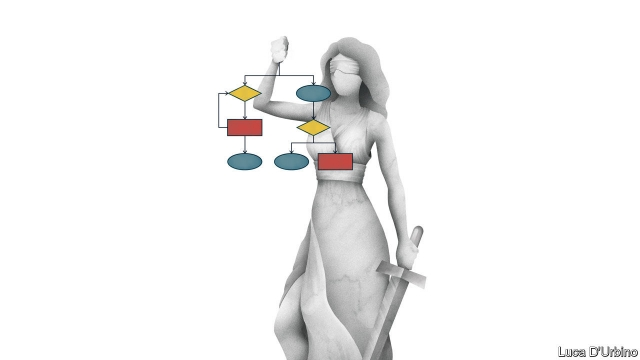

###### Hold on a millisecond

# British ethicists are challenging justice by algorithm 

 

> print-edition iconPrint edition | Britain | Aug 10th 2019 

FOR A TIME, the humans seemed to be winning. The Metropolitan Police’s squad of “super-recognisers” was lauded for its uncanny ability to recall faces in video footage. The officers spotted sex-offenders in crowds of thousands and nabbed a thief who had pinched more than £100,000 ($122,000) of luxury goods. Technology was not nearly as reliable. One of the super-recognisers identified 180 of the 4,000 suspects captured on camera during riots in 2011, whereas software spotted only one. “Computers are no match for the super-recognisers,” boasted the unit’s boss. 

Now the computers are fighting back. Many of the 43 police forces in England and Wales are experimenting with algorithmic technology that could render the copper’s nose redundant. Several use programs to predict where and when crimes are likely to occur. Cambridge University helped Durham Constabulary design an algorithm to estimate the likelihood of a suspect reoffending. It helps the authorities decide whether someone should be granted bail or qualify for rehabilitation as an alternative to prosecution. At least one force is keen to install microphones on “smart lamp-posts” to gather intelligence in crowds. Even the cherished super-recognisers will be outdone once facial-recognition algorithms improve, predicts Rick Muir of the Police Foundation, a think-tank. 

Not everyone is pleased. On July 3rd academics published a critical assessment of Scotland Yard’s pilots of automatic facial-recognition technology, querying their legal basis and casting doubt on whether people caught on camera could be said to have given their informed consent. Judges in Cardiff are weighing the lawfulness of similar trials by South Wales Police. And in June the Law Society, which represents solicitors, raised concerns about the “general and concerning lack of openness or transparency” in the police’s use of algorithms. 

Several wonk shops are being set up to examine the ethics of algorithmic technology, including one at Oxford backed by a £150m donation from Stephen Schwarzman, the boss of Blackstone, a private-equity firm. The Centre for Data Ethics and Innovation, a new government-funded agency, is likely to propose a code of conduct to regulate cops’ use of technology, says Roger Taylor, its chairman, who acknowledges the need to act “very quickly” to close any gaps in oversight. 

Critics make four arguments. First, the technology does not work terribly well. In the pilots in London, only eight of the 42 matches made by facial-recognition software were correct. Second, the systems are a disproportionate response to crime. In an era when data-protection regulations govern the mailing list of a pizza joint, civil-liberties campaigners question why the national police database holds 12.5m images in its gallery—including images of an undisclosed number of people who have neither been charged with an offence nor consented to the use of their pictures. 

Third, it could prove discriminatory. Since some facial-recognition technology is best at identifying white faces, it could throw up more erroneous “matches” for non-white people, making them more likely to be the subject of unwarranted police attention. Finally, it risks compromising the principle that justice must be seen to be done. If suspects cannot understand how an algorithm reached a decision, they might find it harder to challenge. 

Yet none of these hurdles is insurmountable. The technology will improve. Britons already accept lots of surveillance: although most people do not shoplift, they are used to being monitored by CCTV cameras. A poll published in May suggests most Londoners are happy for the police to use facial-recognition software, especially to spot serious criminals. A powerful regulator ought to be able to strike the right balance and allay fears of bias. 

And although humans can give reasons for their decisions, there is plenty of evidence suggesting they are influenced by unconscious biases, points out Lawrence Sherman of Cambridge University. It ought to be easier to scrutinise and challenge the processes of one algorithm than the decisions of thousands of cops and judges. “There’s nothing less transparent than the human mind,” says Mr Sherman. ■ 

-- 

 单词注释:

1.millisecond['mili,sekәnd]:n. 毫秒 [计] 毫秒 

2.ethicist['eθisist]:伦理学家 

3.algorithm['ælgәriðm]:n. 算法 [计] 算法 

4.Aug[]:abbr. 八月（August） 

5.metropolitan[.metrә'pɒlitn]:n. 大都市居民, 都主教, 宗主国的公民 a. 大都市的, 都主教区的, 宗主国的 

6.squad[skwɒd]:n. 班, 小队, 小集团 vt. 编成班 

7.laud[lɒ:d]:n. 赞美, 称赞 vt. 赞美, 称赞 

8.uncanny[.ʌn'kæni]:a. 怪诞的, 可怕的, 离奇的, 神秘的 

9.footage['futidʒ]:n. 英尺长度, 英板尺, (影片的)连续镜头 

10.nab[næb]:vt. 捉住, 逮捕, 抢夺 [电] 国际广播协会的简写 

11.riot['raiәt]:n. 暴动, 喧闹, 放纵 vi. 发动, 暴动, 纵情, 放荡 vt. 浪费, 挥霍 

12.wale[weil]:n. 隆起的伤痕, 鞭痕, 凸条纹, 精华, 选择 vt. 在...上留下鞭痕, 织成棱纹, 挑选, 撑住 vi. 挑选 

13.algorithmic[]:[计] 算法的 

14.redundant[ri'dʌndәnt]:a. 多余的, 过多的, 冗长的 [医] 过多的, 多余的 

15.Cambridge['keimbridʒ]:n. 剑桥 

16.Durham['dә:rәm]:n. 达勒姆郡(英格兰郡名), 短角肉牛 

17.constabulary[kәn'stæbjulәri]:a. 警察的, 警官的 n. 警官队, 警察 

18.reoffend[]: 再犯罪；再犯法 

19.bail[beil]:n. 保释, 拎环, 杓, 栅栏 vt. 保释, 舀水 

20.rehabilitation['ri:(h)ә,bili'teiʃәn]:n. 复原 [医] 复原, 恢复, 康复 

21.prosecution[.prɒsi'kju:ʃәn]:n. 执行, 经营, 起诉 

22.cherish['tʃeriʃ]:vt. 珍爱, 怀有, 爱护 

23.outdo[.aut'du:]:vt. 超越, 胜过, 战胜 

24.rick[rik]:n. 草堆 vt. 把...堆成垛 

25.Muir[]:缪尔 

26.query['kwiәri]:n. 疑问, 疑问号, 质问, 查询 v. 询问, 质问 [计] 查询 

27.cardiff['kɑ:dif]:n. 加的夫（英国港市） 

28.lawfulness['lɔ:flnəs]: 法制, 合法 

29.solicitor[sә'lisitә]:n. (英)律师, 初级律师, (美)法务官, (美)掮客, 游说者, (美)募捐者 [经] 募损者, 律师 

30.openness['әupәnnis]:n. 公开；宽阔；率真 

31.transparency[træns'pærәnsi]:n. 透明, 透明度, 透过性, 透明物, 清晰 [计] 透明性; 透明 

32.wonk[wɔŋk]:[俚]书呆子, 死用功的学生 

33.ethic['eθik]:n. 道德规范, 伦理 

34.Oxford['ɒksfәd]:n. 牛津, 牛津大学 

35.donation[dәu'neiʃәn]:n. 捐赠物, 捐款, 捐赠 [经] 赠品, 捐款, 捐赠 

36.stephen['sti:vn]:n. 斯蒂芬（男子名） 

37.schwarzman[]:[网络] 苏世民；施瓦茨曼；施瓦兹曼 

38.Blackstone[]:n. 百仕通集团（即黑石集团, 全球最大私募基金公司）；布莱克斯通（英国前文化部长）；黑石镇（美国马萨诸塞州的一个镇） 

39.datum['deitәm]:n. 论据, 材料, 资料, 已知数 [医] 材料, 资料, 论据 

40.innovation[.inәu'veiʃәn]:n. 改革, 创新 [法] 创新, 改革, 刷新 

41.roger['rɔdʒә]:interj. 对!, 行!, 好! 

42.taylor['teilә]:n. 泰勒 

43.quickly['kwikli]:adv. 很快地 

44.oversight['әuvәsait]:n. 勘漏, 失察, 失败, 照料 [经] 监督权 

45.terribly['terәbli]:adv. 可怕地, 甚为, 非常 

46.disproportionate[.disprә'pɒ:ʃәnit]:a. 不成比例的 

47.pizza['pi:tsә]:n. 比萨饼 

48.campaigner[kæm'peinә]:n. 从军者, 老兵, 竞选者 

49.undisclosed['ʌndis'klәuzd]:a. 未泄露的, 保持秘密的, 不露真名的, 身分不明的 [法] 身份不明的, 隐名的, 未透露的 

50.discriminatory[di'skriminәtәri; (?@) -tɔ:ri]:a. 有辨识力的, 有差别的 

51.erroneous[i'rәuniәs]:a. 错误的, 不正确的 [法] 错误的, 不正确的 

52.unwarranted[.ʌn'wɒrәntid]:a. 未获保证的, 无保证的, 未经授权的 

53.cannot['kænɒt]:aux. 无法, 不能 

54.hurdle['hә:dl]:n. 障碍, 跳栏, 临时活动篱笆 vt. 用篱笆围, 越过, 克服 

55.insurmountable[.insә'mauntәbl]:a. 难以克服的, 不能超越的 

56.Briton['britәn]:n. 大不列颠人, 英国人 

57.shoplift[]:vi.vt. 入店偷窃商品 

58.CCTV[]:[计] 闭路电视 

59.Londoner['lʌndәnә]:n. 伦敦人 

60.regulator['regjuleitә]:n. 调整者, 校准者, 校准器, 调整器, 标准钟 [化] 调节剂; 调节器 

61.allay[ә'lei]:vt. 使平静, 使缓和 

62.bias['baiәs]:n. 偏见, 斜纹 a. 偏斜的 adv. 偏斜 vt. 使有偏见 [计] 偏流; 偏压; 偏磁; 偏离 

63.biase[]:[网络] 偏差；偏向；偏离 

64.lawrence['lɔrәns]:n. 劳伦斯（男子名） 

65.sherman['ʃә:mәn]:n. 谢尔曼（男子名） 

66.scrutinise[]:vt.vi. 细看, 仔细检查, 审查, 细阅 [经] 详细检查, 细细地看 

67.cop[kɒp]:n. 警官 vt. 抓住 

68.les[lei]:abbr. 发射脱离系统（Launch Escape System） 

