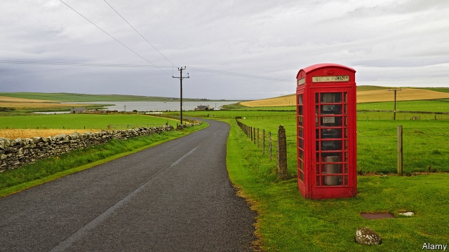

###### Our island Instagram story

# Looking for a 5G signal? Try this remote Scottish island 

 

> print-edition iconPrint edition | Britain | Aug 10th 2019 

THERE ARE no traffic lights on the Orkney islands. Despite having the highest rate of car ownership in Scotland, with 919 vehicles per 1,000 adults, the archipelago is so thinly populated that there is no need for stop signals. Drivers politely make way for each other on the narrow lanes, waving as they pass. The occasional roundabout regulates busier junctions. 

Orkney’s rural nature makes it a pleasure to drive in. But it also makes it a nightmare for mobile connectivity. “By the time something is rolled out to the extremities of the country…it is out of date,” complains James Stockan, the leader of the Orkney Islands Council. That is only a slight exaggeration. The first 4G signal arrived in Kirkwall, Orkney’s biggest settlement, in 2016, nearly four years after it came to urban Britain. Smaller islands, such as Papa Westray, have no 3G coverage, let alone 4G. 

In all, only 35% of Orkney households can make a voice call on all four networks, and 4% can do so on none at all, according to Ofcom, the telecoms regulator. It is worse for data services. Only 18% of premises can access 4G on all four networks and 7% get no signal. Skara Brae, a Neolithic site protected by UNESCO, has no network coverage, forcing tourists to wait until they return to Kirkwall to post pictures to Instagram. 

It is not just social-media addicts who suffer. Farmers have trouble accessing mandatory forms; jobseekers struggle to make applications; civil servants miss out on online training. As mobile networks start to roll out 5G coverage this year, Mr Stockan is keen to avoid the delays of the past. He would like Orkney to “jump over one generation to the next”. 

Such talk of leapfrogging usually focuses on the poor world, where charities and tech firms promise to send balloons and drones to bring the internet to people without landlines. Yet something similar is now under way in Orkney. 5G RuralFirst, a consortium of 30 organisations backed by a £4.3m ($5.2m) government grant and led by Cisco, which makes networking gear, has been running a private 5G network on the island for the past year. Investment by mobile-network operators purely because of consumer demand “is not likely to happen”, says Greig Paul of the University of Strathclyde, which is part of the consortium. RuralFirst is trying to figure out how to make it commercially viable. 

Its main idea is to find local industrial uses for the tech. That is part of the promise of 5G networks in general: not only can they offer much greater speeds, but they are designed to be super-responsive and capable of connecting to many more devices at once. “If we can drive industrial use then there will be more demand, which means more revenue, which means more capacity,” says Mr Paul. 

In the Orkneys, local businesses seem keen. Scapa, a whisky-maker, sees potential in automating bits of production and tracking employees throughout the distillery. Richard Gauld, who runs a small wind farm, says replacing copper wires with 5G would make the local electricity grid safer and more efficient. Out in the Scapa Flow, Richard Darbyshire of Scottish Sea Farms says 5G would offer a more reliable connection from base to barge. That would allow his men to feed fish remotely in bad weather, and support high-definition live video from the salmon pens. 

There are also ideas for ways to cut costs, such as making more efficient use of radio spectrum, using software to do things that typically require hardware, and sharing infrastructure among mobile networks. The biggest expense is access to spectrum, which costs billions at auction. That will soon be less of an obstacle. On July 25th Ofcom announced that it would offer spectrum to local communities for as little as £80 a year. 

The Orkney programme runs until the end of September, after which the consortium will evaluate the business case for 5G in rural areas. “If it works for us, maybe we can offer the service to other small communities that want to have their own 5G cell,” says Greg Whitton, who runs CloudNet, the local internet service provider. Getting online on the island could soon be as easy and speedy as driving around it. ■ 
<<<<<<< HEAD

-- 

 单词注释:

1.Instagram[]:一款图片分享应用 

2.Aug[]:abbr. 八月（August） 

3.orkney['ɔ:kni]:n. 奥克尼群岛；奥克尼（苏格兰东北方群岛） 

4.archipelago[.ɑ:ki'pelәgәu]:n. 群岛, 多岛屿的海 

5.thinly['θinli]:adv. 薄, 细, 瘦 

6.populate['pɔpjuleit]:vt. 使人口聚居在...中, 殖民于, 移民于, 居住于, 定居于 

7.politely[pә'laitli]:adv. 有礼貌地, 文雅地, 客气地 

8.junction['dʒʌŋkʃәn]:n. 连接, 会合处, 交叉点 [医] 接[合]处, 接点.[接]界 

9.nightmare['naitmєә]:n. 梦魇, 恶梦, 可怕的事物(或情景、人物) [医] 梦魇, 恶梦 

10.connectivity[kәnek'tiviti]:[计] 连通性, 连通度 

11.extremity[ik'stremiti]:n. 极端, 极点, 困境, 绝境 [医] 肢, 端 

12.jame[]: 灰岩井 

13.exaggeration[ig.zædʒә'reiʃәn]:n. 夸张, 夸大的事物, 夸大之词 

14.kirkwall[]: [地名] [英国] 柯克沃尔 

15.papa[pә'pɑ:]:n. 爸爸 

16.Westray[]:[地名] 韦斯特雷 ( 加 ) 

17.coverage['kʌvәridʒ]:n. 覆盖的范围, 保险总额, 新闻报导 [化] 可达范围; 覆盖度 

18.Ofcom['ɒfkɒm]:[网络] 英国通信管理局；英国通讯管理局；英国通讯办公室 

19.telecom['telәkɔm]:telecommunication 电信 

20.regulator['regjuleitә]:n. 调整者, 校准者, 校准器, 调整器, 标准钟 [化] 调节剂; 调节器 

21.datum['deitәm]:n. 论据, 材料, 资料, 已知数 [医] 材料, 资料, 论据 

22.premise['premis]:n. 前提, 房屋连地基, 上述各项 vt. 预先提出, 引出, 作为...的前提 vi. 作出前提 

23.skara[]: [地名] [瑞典] 斯卡拉 

24.brae[brei]:n. 斜坡, 山坡 

25.neolithic[.ni:әu'liθik]:a. 新石器时代的 

26.UNESCO[ju:'neskәj]:联合国教育科学及文化组织, 联合国教科文组织 

27.addict[ә'dikt]:vt. 使沉溺, 使上瘾 n. 入迷的人, 上瘾者 

28.mandatory['mændәtәri]:a. 命令的, 托管的 [经] 受托者, 命令者 

29.jobseeker['dʒɔb,si:kә(r)]:n. 求职者 

30.online[]:[计] 联机 

31.leapfrog['li:pfrɒg]:n. 跳背游戏, 竞相提高 vi. 跳背, 交替前进 vt. 跃过 

32.tech[tek]:n. 技术学院或学校 

33.drone[drәun]:n. 雄蜂, 懒惰者, 嗡嗡的声音, 无人驾驶飞机(或船) vi. 嗡嗡作声, 混日子 vt. 低沉地说 

34.landline['lændlain]:n. 输送路线, 地上通讯线, 地平线 [电] 陆线 

35.consortium[kәn'sɒ:tjәm]:n. 协会, 合伙, (国际性)财团 [经] 合作, 联合, 财团 

36.organisation[,ɔ: ^әnaizeiʃən; - ni'z-]:n. 组织, 团体, 体制, 编制 

37.cisco['siskәu]:n. 加拿大白鲑 

38.Greig[]:格雷格（人名） 

39.paul[pɔ:l]:n. 保罗（男子名） 

40.Strathclyde[stræθ'klaid]:斯特拉思克莱德区[英国苏格兰行政区名] 

41.commercially[]:adv. 商业上；通商上 

42.viable['vaiәbl]:a. 能养活的, 能生长发育的 [医] 有活力的, 有生机的 

43.Orkneys['ɔ:kni]:奥克尼郡(英国苏格兰旧郡) 

44.scapa[]:abbr. Society for Checking the Abuses of Public Advertizing <英>制止滥用广告协会 

45.automate['ɔ:tәmeit]:vt.vi. (使)自动化 [计] 自动化 

46.distillery[dis'tilәri]:n. 蒸馏室, 酿酒厂, 酒厂 [化] 酒厂; 造酒厂 

47.richard['ritʃәd]:n. 理查德（男子名） 

48.gauld[]: [人名] [英格兰人姓氏] 高尔德 Galt的变体 

49.grid[grid]:n. 格子, 栅格 [计] 网格 

50.darbyshire[]: [人名] 达比希尔 

51.barge[bɑ:dʒ]:n. 驳船 vt. 用船运输 vi. 蹒跚, 闯入 

52.remotely[]:adv. 极小地, 极细微地 

53.salmon['sæmәn]:n. 鲑鱼, 大麻哈鱼 [医] 鲑 

54.spectrum['spektrәm]:n. 光谱, 范围, 系列 [化] 光谱 

55.typically['tipikәli]:adv. 代表性地；作为特色地 

56.infrastructure['infrәstrʌktʃә]:n. 基础结构, 基础设施 [经] 基础设施 

57.auction['ɒ:kʃәn]:n. 拍卖 vt. 拍卖 

58.les[lei]:abbr. 发射脱离系统（Launch Escape System） 

59.greg[greg]:n. 格雷格（男子名, 等于Gregory） 

60.Whitton[]:n. (Whitton)人名；(英)惠顿 

61.provider[prә'vaidә]:n. 供应者, 供养人, 伙食承办人 [计] 提供器 

62.speedy['spi:di]:a. 快的, 迅速的 [经] 快的, 迅速的 
=======
>>>>>>> 50f1fbac684ef65c788c2c3b1cb359dd2a904378

