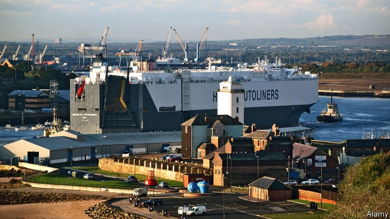
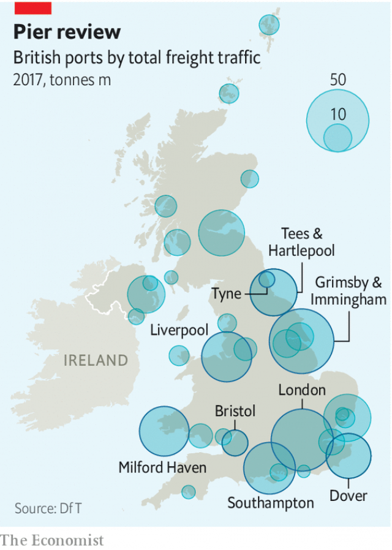

###### Free-for-all

# What free ports can and can’t achieve 

 

> print-edition iconPrint edition | Britain | Aug 10th 2019 

THE VAST, bulbous-bowed Höegh Autoliners car-carrier, with room for 6,500 vehicles, takes up the space of three normal-sized ships in the Port of Tyne. Inside are several thousand shiny new Nissan Leafs, Qashqais and Jukes bound for the continent. Newcastle’s deep-sea port is not the country’s busiest, but because it serves nearby Nissan Sunderland, the biggest carmaking site, it is among the first in line to become one of the government’s swashbuckling new “free ports”. 

Such zones are physically inside a country but legally outside it for customs purposes. As well as zero tariffs, free ports pile on other goodies such as low taxes and loose regulation. The idea is that firms will flock to them. Brexiteers in particular dream of free ports pulling in companies and container ships from everywhere. Boris Johnson, the prime minister, has promised to anoint ten free ports—mostly big harbours and perhaps some airports. On August 2nd Liz Truss, the trade secretary, set up a free ports advisory panel. 

Other countries are fans. Dubai’s Jebel Ali free zone hosts 7,000 global firms. America is dotted with 265 foreign-trade zones. Europe has dozens of free ports. Regulators worry that some are havens for money-laundering or tax evasion—though they are most concerned about facilities where the rich store art and other fancy goods, such as those in Luxembourg, not the type of zone Britain is contemplating. 

If the Port of Tyne became a free port, enthuses Matt Beeton, its chief executive, more firms would move into space currently occupied by weeds and cormorants. Nissan is keen. More business activity would further boost the port’s contribution to the local area, including deprived South Shields. Another policy aim of free ports is to help left-behind places, by generating investment and pulling in economic activity. The old industrial area around the mouth of the river Tees has been preparing since last year to become a free port. 

Yet they are no panacea. On the tariff side, their utility may be tiny. The plan post-Brexit is for Britain to maintain low tariffs on most goods. American foreign-trade zones are supposed to encourage domestic production by letting firms bring in inputs tariff-free (solving the problem of tariff inversion, where finished goods carry a lower tariff than their component parts). But Brexit is unlikely to lead to higher tariffs on inputs than on finished goods, according to a paper by the UK Trade Policy Observatory, which examined World Trade Organisation (WTO) tariff schedules. 

Another, subtler function could be to help Britain navigate WTO tariff rules, notes Meredith Crowley, an economist at Cambridge University who sits on the free ports advisory panel. The country will have to decide between setting tariffs at 10% or at 0% on car parts, for example. Either rate would apply to all countries, including China, meaning a risk of being swamped by Chinese imports. If Britain sets the tariff at 10% it could use free ports to help big manufacturers that use European supply chains. 

A well-known problem with free zones is that they can turn into a domestic beggar-thy-neighbour policy. Cutting taxes in one place encourages firms to leave others. Mr Beeton wants a free port, but to make sure it would not suck activity from the hinterland he wants to draw a bigger boundary and to use supply-chain tracking systems to create a “virtual” free zone. But free ports could still take business away from elsewhere. 

 

Another argument against is that Britain used to have a few until 2012, but no one complained when they were phased out. That was probably because EU state-aid rules prevented them from bringing in truly freewheeling policies on regulation, tax and labour standards. The WTO is less stringent. Mr Johnson’s government may therefore use aggressive supply-side policies to create real free ports, but the Treasury would count the cost. 

Which ports will win the new status? The government wants free ports to help rebalance the economy away from the south-east. Of 30 big ports, 17 are in poor areas, mainly in the north and Wales. They should be at the front of the queue. But the south is home to many ports (see map). It might be hard to overlook Bristol Port, which gave to Mr Johnson’s campaign. Ben Houchen, mayor of Tees Valley, says Teesside should come ahead of Dover. If free ports are the gateway to prosperity, as Ms Truss says, it will be hard to be left out. ■ 
<<<<<<< HEAD

-- 

 单词注释:

1.Aug[]:abbr. 八月（August） 

2.Tyne[tain]:泰恩河[英国英格兰北部] 

3.shiny['ʃaini]:a. 有光泽的, 发光的, 辉煌的, 磨光的, 磨损的 

4.nissan[]:n. 尼桑（日产汽车名） 

5.juke[dʒu:k]:vt. 用假动作诱使 

6.Sunderland['sʌndәlәnd]:森德兰[英国英格兰东北部港市](或译散德兰) 

7.carmaking[]:[网络] 汽车制造 

8.swashbuckling['swɒʃbʌkliŋ]:a. 恃强凌弱的, 虚张声势的 

9.physically['fizikli]:adv. 按自然规律, 完全地, 实际上, 真正地, 身体上地 

10.legally['li:gәli]:adv. 法律上, 合法地 [法] 法律上, 合法地, 法定地 

11.tariff['tærif]:n. 关税, 关税表, 价格表, 收费表 vt. 课以关税 [计] 价目表 

12.goody['gudi:]:n. 身分低微之老妇, 糖果, 姥姥 a. 感伤的, 伪善的 interj. 太好了 

13.Brexiteers[]:支持英国退欧的人（Brexiteer的复数） 

14.boris['bɔris]:n. 鲍里斯（男子名） 

15.johnson['dʒɔnsn]:n. 约翰逊（姓氏） 

16.anoint[ә'nɒint]:vt. 涂油, 施以涂油礼 [医] 涂油膏 

17.liz[]:n. 莉斯（女子名） 

18.truss[trʌs]:vt. 捆绑 n. 捆, 束 

19.advisory[әd'vaizәri]:a. 顾问的, 咨询的, 劝告的 [法] 劝告的, 忠告的, 咨询的 

20.jebel['dʒebl]:n. <阿> 山, 高山 

21.ALI[]:[计] 异步线路接口 

22.regulator['regjuleitә]:n. 调整者, 校准者, 校准器, 调整器, 标准钟 [化] 调节剂; 调节器 

23.haven['heivn]:n. 港, 避难所, 安息所 vt. 安置...于港中, 庇护, 入港 

24.luxembourg['luksәm,bә:^]:n. 卢森堡公国；卢森堡（卢森堡公国首都） 

25.contemplate['kɒntempleit]:vt. 注视, 沉思, 盘算 vi. 冥思苦想 

26.enthuse[in'θju:z]:vt. 使充满热情, 使感兴趣, 使热心 vi. 热心 

27.matt[mæt]:a. 表面暗淡的, 无光泽的, 表面粗糙的, 不光滑的 [医] 无光泽 

28.Beeton[]:比顿（姓氏） 

29.currently['kʌrәntli]:adv. 现在, 当前, 一般, 普通 [计] 当前 

30.cormorant['kɒ:mәrәnt]:n. 鸬鹚, 贪婪的人 a. 贪婪的 

31.deprive[di'praiv]:vt. 剥夺, 使丧失 [法] 剥夺, 剥夺, 夺去 

32.tee[ti:]:n. T字形, T字形之物, 发球区, 球座, 目标 vt. 搁在球座上 a. T字形的 

33.panacea[.pænә'siә]:n. 万能药, 灵丹妙药 [医] 万应药 

34.inversion[in'vә:ʃәn]:n. 倒转, 倒置, 倒装 [化] 反转; 倒反; 反演; 转化 

35.Brexit[]:[网络] 英国退出欧盟 

36.UK[ju: 'kei]:n. 联合王国 

37.observatory[әb'zә:vәtәri]:n. 天文台, 气象台, 了望台 

38.organisation[,ɔ: ^әnaizeiʃən; - ni'z-]:n. 组织, 团体, 体制, 编制 

39.WTO[]:[计] 给操作员送信息 

40.subtl[]:[网络] 隐晦的 

41.navigate['nævigeit]:vi. 航行 vt. 航行于, 驾驶, 操纵, 使通过 

42.Meredith['meridiθ]:n. 梅雷迪思(m.) , 梅瑞狄斯(Edward Robert Bulwer-Lytton 的笔名) 

43.Crowley[]:克罗利 克罗利 

44.economist[i:'kɒnәmist]:n. 经济学者, 经济家 [经] 经济学家 

45.Cambridge['keimbridʒ]:n. 剑桥 

46.hinterland['hintәlænd]:n. 内地, 腹地, 偏僻地区 [经] 腹地 

47.EU[]:[化] 富集铀; 浓缩铀 [医] 铕(63号元素) 

48.freewheeling['fri:'hwi:liŋ]:n. 惯性滑行 a. 惯性滑行的, 随心所欲的 

49.les[lei]:abbr. 发射脱离系统（Launch Escape System） 

50.stringent['strindʒәnt]:a. 迫切的, 严厉的, 银根紧的 [医] 约束的, 紧迫的 

51.treasury['treʒәri]:n. 国库, 宝库, 财政部, 国库券 [经] 库存, 国库, 金库 

52.rebalance[re'bæləns]: 再平衡 

53.wale[weil]:n. 隆起的伤痕, 鞭痕, 凸条纹, 精华, 选择 vt. 在...上留下鞭痕, 织成棱纹, 挑选, 撑住 vi. 挑选 

54.Bristol['bristәl]:n. 布里斯托尔(英国西部港口) 

55.ben[ben]:n. 内室 [医] 贝昂(俗名,一般指辣木Moringa oleifera,有时也指一些不同属的植物) 

56.houchen[]: [人名] 霍钦 

57.Teesside[]:蒂赛德（地区）（地名）（英国） 

58.Dover['dәuvә]:n. 多佛(英国港口) 

59.gateway['geitwei]:n. 门, 通路 [计] 网关 
=======
>>>>>>> 50f1fbac684ef65c788c2c3b1cb359dd2a904378

