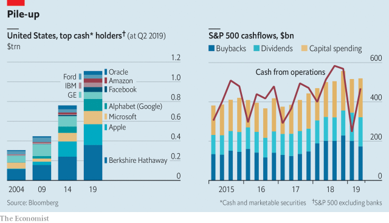

###### Cash in America Inc

# American companies are no cash-hoarders 

 

> print-edition iconPrint edition | Business | Aug 10th 2019 

DO AMERICAN companies buy back too many shares? Or do they cling on to too much cash? Both accusations have been levelled against America Inc. It is hard for both to be true at once. In fact, neither is quite right. Yes, Apple, Berkshire Hathaway and a few other giants sit on piles of idle dosh. But for the top 500 listed firms in total the amount of cash reinvested or returned to shareholders has roughly matched the amount being generated. Those firms that have a shortfall often plug it with cheap borrowed money.■ 

