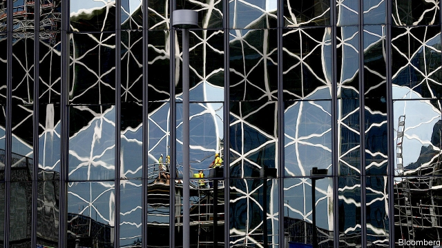

###### Locusts in lederhosen

# Buy-out firms embrace Germany—and vice versa 

 

> print-edition iconPrint edition | Business | Aug 10th 2019 

KKR IS ON a roll in Germany. On July 4th the American private-equity firm announced its takeover of a majority stake in heidelpay, a payment-processing firm. A day later Axel Springer, a giant publisher, said that more than 20% of its shareholders had agreed to sell their shares to KKR, bringing a full takeover by the Americans a step closer. Last year KKR opened an office in Frankfurt. Its European boss is Johannes Huth, a German. Since it entered the country in 1999 it has spent $5bn on buying more than 20 German companies, including Arago, a maker of artificial-intelligence software, Hensoldt, a defence-electronics business, and GfK, a research firm. 

For private-equity companies this marks a turnaround no less profound than those they try to engineer at the businesses they acquire. In 2005 Franz Müntefering, then boss of the Social Democratic Party, described them as “swarms of locusts that fall on companies, stripping them bare before moving on”. These days the locusts are increasingly seen as a force to help companies improve performance (not strip assets) and create jobs (rather than destroying them). KKR says it has increased the workforce of its German, Austrian and Swiss companies by an average of 8% from the moment of purchase to divestment. 

Indeed, rather than fend off KKR’s advances, Mathias Döpfner, Axel Springer’s boss, actively sought it out as an investor. To win employees over to the deal, Mr Döpfner invited Mr Huth to one of his regular staff town-halls. Last month Osram, a struggling maker of lights, said it is fully behind a €3.4bn takeover bid from Bain Capital and Carlyle, two American buy-out behemoths. 

German conglomerates have long been happy to offload unwanted parts to private-equity companies. Siemens sold its dentistry-equipment arm to Permira, a British firm, in 1997. KKR bought Hensoldt from Airbus. Buy-out firms are also becoming an important source of capital for the Mittelstand, the small and medium-sized companies that constitute the German economy’s backbone. Thousands of these enterprises already have private-equity firms among their shareholders. 

This year 250 private-equity fund managers surveyed by PwC, a consultancy, named Germany as Europe’s most promising market by a long way. They are drawn by its stable politics, skilled workforce and steady economic growth. Nine in ten told PwC that Germany will be interesting for private-equity investments in the next five years (one-third as many said the same about Brexit Britain). Eight out of ten said they will increase their German holdings. 

The number and size of private-equity deals in Germany are both smaller than in Britain or America. “The market has matured but remains relatively uncharted,” says Steve Roberts, PwC’s head of private equity in Germany. That leaves more opportunities for the cash-rich locusts to swarm around. ■ 

-- 

 单词注释:

1.lederhosen['leidә,hәuzәn]:n. 皮短裤 

2.versa[]:a. 反的 

3.Aug[]:abbr. 八月（August） 

4.kkr[]:abbr. Korringa-Kohn-Rostoker method 科林加-科恩-罗斯托克法 

5.takeover[]:n. 接管, 接收 [经] 接收 

6.axel['æksәl]:n. （花样滑冰）前外一周半跳 

7.springer['spriŋә]:n. 跳的人 

8.publisher['pʌbliʃә]:n. 出版者, 发行人 [法] 发行人, 出版者, 报刊发行者 

9.shareholder['ʃєә.hәuldә]:n. 股东 [法] 股东, 股票持有人 

10.frankfurt['fræŋkfәt]:n. 牛肉香肠, 猪牛肉混合香肠 

11.Johanne[]:n. (Johanne)人名；(德、丹)约翰妮 

12.huth[]: [人名] 胡思 

13.arago[]:n. (Arago)人名；(西、俄、法)阿拉戈；(日)荒五(名) 阿拉戈 

14.maker['meikә]:n. 制造者, 上帝 [经] 制造者, 出票人 

15.gfk[]:abbr. Gustafsvik 古塔夫斯威克 

16.turnaround['tә:nә.raund]:n. 转向, 回车道, 转变 [化] 小修; 预防(性)修理 

17.les[lei]:abbr. 发射脱离系统（Launch Escape System） 

18.profound[prә'faund]:a. 极深的, 深厚的, 深刻的, 渊博的 

19.franz[frɑ:nts]:n. 弗朗茨（Francis Ferdinand的德文名） 

20.asset['æset]:n. 资产, 有益的东西 

21.Austrian['ɒstriәn]:n. 奥地利人 a. 奥地利的, 奥地利人的 

22.divestment[dai'vestmәnt,di-]:n. (=divesfiture) 剥夺, 夺取 

23.fend[fend]:vt. 击退, 保护, 供养 

24.Mathias[]:n. 马赛厄斯（美国田径运动员） 

25.actively['æktivli]:adv. 活跃地, 积极地 

26.investor[in'vestә]:n. 投资者 [经] 投资者 

27.osram['ɔzrәm]:一个注册商标和全球最大照明制造商之一欧司朗公司的公司名称。 

28.fully['fuli]:adv. 十分地, 完全地, 充分地 

29.bain[]:n. 贝恩（公司名称） 

30.Carlyle[kɑ:'lail]:n. 卡莱尔 

31.behemoth[bi'hi:mɔθ]:n. 庞然大物 

32.conglomerate[kәn'glɒmәrit]:a. 聚成球形的, 砾岩性的 n. 集成物, 混合体, 砾岩 v. (使)凝聚成团 

33.offload['ɔflәjd, ɔf'lәjd; (?@) 'ɔ:flәjd]:v. 卸下, 卸货 

34.unwanted[.ʌn'wɒntid]:a. 没人要的, 不需要的, 多余的 

35.siemen[]:[网络] 西门子贝得 

36.Permira[]:[网络] 珀米拉；帕米拉；公司大股东珀米拉 

37.airbus['eәbʌs]:空中客车 

38.Mittelstand[ˈmɪtlˌstænd]:[网络] 中小型企业；中小企业；德国中小型企业 

39.constitute[kәn'stitjut]:vt. 构成, 组成, 任命 [建] 构造, 组成 

40.backbone['bækbәun]:n. 脊椎, 志气, 骨干, 支柱 [计] 主干网, 主干网点 

41.PWC[]:abbr. 印刷线路卡（Printed Wiring Card） 

42.consultancy[]:n. 商量, 协商, 磋商, 会诊, 与...商量, 咨询, 请教, 找(医生)看病, 查阅, 考虑 [经] 咨询业务, 咨询服务 

43.politic['pɒlitik]:a. 精明的, 明智的, 策略的 

44.Brexit[]:[网络] 英国退出欧盟 

45.holding['hәuldiŋ]:n. 把持, 支持, 保持 [法] 租借地, 占有物, 拥有的财产 

46.uncharted[.ʌn'tʃɑ:tid]:a. 图上未标明的, 未知的 [法] 无人探险过的, 未知的, 海图上未载明的 

47.steve[]:n. 史蒂夫（男子名） 

48.Robert['rɔbәt]:[法] 警察 

49.equity['ekwiti]:n. 公平, 公正 [经] 权益, 产权 

