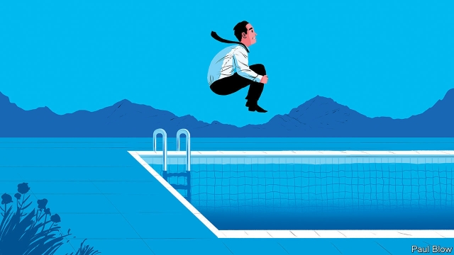

###### Bartleby

# Holidays are good for workers and companies alike 

 

> print-edition iconPrint edition | Business | Aug 8th 2019 

THE SWIMMING trunks have been dug out of the chest of drawers. The beach shoes (still caked with last year’s sand) have been retrieved from the shed. Like tens of millions of others, Bartleby is about to go on his annual holiday. 

A vacation gives workers a chance to recharge their mental batteries. For Bartleby, this means reading books that do not have titles like “Beyond Performance 2.0” (sadly, a genuine example of a management tome). Heading to a new location allows employees to clear their thoughts. After all, there is more to life than spreadsheets and sales forecasts. To misquote Timothy Leary, the 1960s hippie guru, a holiday is time to “turn off and drop out”. 

It also means workers get more sleep by escaping the tyranny of the early-morning alarm. In addition, they no longer suffer the agonies of the daily commute: the cramped railway carriages or gridlocked roads. And best of all, there are no meetings to endure—no need to sit with a vaguely interested expression on your face while time seems to slow to a crawl. In short, holidays reduce stress. And in the long run, stress makes workers less likely to perform well. 

That means going away for at least a week. An extended weekend break, favoured by many Americans, risks adding to the stress, as a high proportion of the vacation period is spent travelling to and from the desired destination. No sooner do you arrive than you have to think about packing for the trip back. 

Although it does lead to congested traffic and crowded airports, there is something to be said for the European tradition of cramming everyone’s holidays into August. The predictability of the season means that companies can adjust their plans accordingly. Even those people who are in the office can enjoy an easier pace of life. Most of their customers and suppliers are on a break so there is not much that anyone can do. 

For those on vacation, the occasional work-related thought might occur when walking quietly along the beach, or through a wood. Often such ideas will be all the more original for being dreamed up in a moment of detachment. Returning to 3,000 unread emails is also not an appealing prospect, so five minutes deleting the detritus while the rest of the family is in the shower seems like a reasonable compromise. Some favour an “out of office” message but such devices can easily generate automated replies that subsequently clog up the in-box. 

The one thing that workers certainly do not need is contact from their managers. Answering the phone to a work-related call should be a complete no-no. Just occasionally, a genuine crisis might require the company to be in contact. In 2007 Bartleby was paddling in the Atlantic next to an analyst from a credit-rating agency receiving frantic messages on his BlackBerry about the collapse of the credit system. But most of the time, executives should really be able to rely on staff who remain in the office. 

Indeed, just as employees need a break from the workplace, companies sometimes need a break from their employees. After a trading scandal at Société Générale, a French bank, in 2008, Britain’s then regulator, the Financial Services Authority, recommended that all traders take a two-week break at some point in the year. The aim was to ensure that any unusual dealing patterns would be discovered while the miscreant was away from their desk. 

Senior managers can also benefit from seeing what happens when their juniors head to the beach. Does office morale improve as soon as a mid-level manager disappears? If so, this suggests that he or she is not running the department well. Does an underling impress when standing in for their boss? In that case, they may be overdue a promotion. 

Some Americans are reluctant to take a long holiday for fear that their employer will find they can easily manage without them. None of that nonsense at The Economist. Ambitious young writers will be eager to fill the vacant space left by this column with insights into the business world. The business editor will be relieved of the need to remove some of this writer’s questionable puns [much appreciated, ed.]. 

Work can be irritating but, as any unemployed person will tell you, it is better than the alternative. It gives purpose to people’s days and, on occasion, can even be fun. But not every day. Some days it is better to be reading a paperback. By a pool, in the sunshine. Enjoy.■ 

