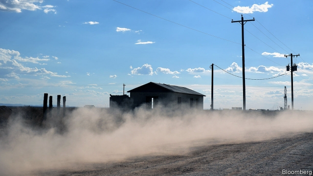
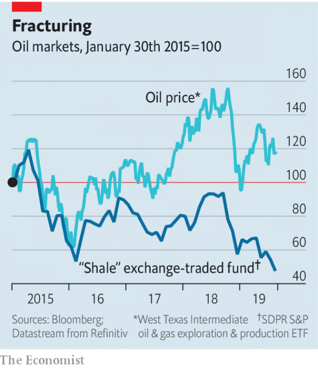

###### Shale sale

# Investors flee the Permian 

 

> print-edition iconPrint edition | Business | Aug 10th 2019 

FOR MORE than a decade investors have waited for America’s shale industry to mature. Ahead of the latest quarterly reports, they wanted to know if firms could produce more oil and rein in spending. For some big producers, the answer was “no”. Many shareholders got tired of waiting. 

The share price of Concho Resources, a firm with operations in Texas’s Permian basin, sank by more than 20% overnight, despite the assurance of a “free cashflow inflection in 2020”. An admission by Whiting Petroleum, which drills mainly in North Dakota and Montana, that it would not meet targets for production wiped more than a third off its market capitalisation over 24 hours. 

Other shale companies, including EOG, Diamondback and Parsley, presented evidence that they could boost output efficiently. Yet an index of American exploration-and-production firms plunged by 12% in the week to August 7th, worse than the market as a whole. 

Because fracking depletes wells quickly, companies must spend more to sustain output. In the past year producers have shown signs of living within their means. On August 6th Diamondback reported that its well costs continued to drop. Consolidation could boost efficiency. Based in part on that logic, shareholders of Anadarko, with big holdings in the Permian, were expected to approve its $38bn acquisition by Occidental Petroleum on August 8th, after The Economist went to press. 

Some attempts at boosting efficiency look counterproductive, however. Drill wells too close together and they produce less oil. The price of gas, which once boosted firms’ profits, briefly fell below zero this spring, when companies were paying customers to take the stuff off their hands amid a supply glut. 

 

The shale industry, whose shares prices used to track that of oil, down by 18% since April, now looks untethered (see chart). “Investors have decided it’s too volatile,” says Bob Brackett of Bernstein, a research firm. So they are diverting capital elsewhere. Occidental’s massively oversubscribed $13bn bond offering on August 6th shows fixed-income investors’ thirst for yield rather than an appetite for shale. 

The energy behemoths have the balance-sheets to buy the wildcatters. But many, like ExxonMobil, have enough land in the Permian to keep them busy. They are in no hurry and, like others, wary of overpaying—reasonable enough in light of shale firms’ falling value. The market has punished recent acquirers, including Concho, which bought RSP Permian last year. Carl Icahn, an activist investor, calls the Anadarko purchase “a travesty” and is trying to sack four of Occidental’s board members. Rumours swirled in 2018 that Royal Dutch Shell would buy a company called Endeavor. No announcement has come. ■ 
<<<<<<< HEAD

-- 

 单词注释:

1.shale[ʃeil]:n. 页岩 

2.investor[in'vestә]:n. 投资者 [经] 投资者 

3.Permian['pә:miәn]:a. 二叠纪的, 二叠纪岩的 n. 二叠纪(岩) 

4.Aug[]:abbr. 八月（August） 

5.shale[ʃeil]:n. 页岩 

6.producer[prә'dju:sә]:n. 生产者, 制作者, 制作人 [化] 发生器; (炉煤气)发生炉; 制气炉; 生产者 

7.shareholder['ʃєә.hәuldә]:n. 股东 [法] 股东, 股票持有人 

8.concho['kɔntʃәj]:n. [解]外耳, [建](教堂东面半圆形室上的)半圆屋顶 

9.assurance[ә'ʃuәrәns]:n. 保证, 把握, 信心, 保险 [经] 保证, 担保, 保险 

10.cashflow['kæʃfləʊ]:vi. 现金流转 

11.inflection[in'flekʃәn]:n. 屈曲, 变调, 音调变化 

12.dakota[dә'kәutә]:n. 达科他（美国过去一地区名, 现分为南、北达科他州） 

13.Montana[mɒn'tænә]:n. 蒙大拿州 

14.capitalisation[,kæpitәlai'zeiʃən;-li'z-]:n. <主英>=capitalization 

15.EOG[]:[医] 眼电流描记法 

16.diamondback['daiәmәndbæk]:a. 有菱形斑纹的 n. 菱背响尾蛇 

17.parsley['pɑ:sli]:n. 皱叶欧芹, 荷兰芹 [医] 绉叶石蛇床 

18.efficiently[i'fiʃәntli]:adv. 生效, 能胜任, 有能力, 效率高, 有效 

19.fracking[]:n. 水力压裂 

20.deplete[di'pli:t]:vt. 耗尽, 使衰竭 [医] 排除, 减少 

21.quickly['kwikli]:adv. 很快地 

22.consolidation[kәn.sɒli'deiʃәn]:n. 巩固, 团结, 合并, 加强 [医] 实变 

23.anadarko[]:[网络] 阿纳达科；纳达科；阿纳达科公司 

24.holding['hәuldiŋ]:n. 把持, 支持, 保持 [法] 租借地, 占有物, 拥有的财产 

25.occidental[.ɒksi'dentәl]:n. 欧美人, 西方人 a. 欧美的, 西方的, 西方国家的 

26.economist[i:'kɒnәmist]:n. 经济学者, 经济家 [经] 经济学家 

27.counterproductive[.kauntәprә'dʌktiv]:a. 反生产的；使达不到预期目标的 

28.les[lei]:abbr. 发射脱离系统（Launch Escape System） 

29.briefly['brifli]:adv. 简短地, 扼要地, 简明地, 简单地 

30.amid[ә'mid]:prep. 在其间, 在其中 [经] 在...中 

31.glut[glʌt]:n. 大量, 供过于求 vt. 使充满, 使吃饱, 过多供应 vi. 吃得过多, 狼吞虎咽 

32.untethered[ʌn'teðə]:vt. 解下拴牛马的绳或链 

33.volatile['vɒlәtail]:a. 挥发性的, 可变的, 不稳定的, 飞行的, 轻快的, 爆炸性的 n. 有翅动物, 挥发物 [计] 易失的 

34.bob[bɒb]:vt. 剪短, 敲击 vi. 振动, 上下跳动 n. 短发, 悬挂的饰品, 浮子, 摆动, 轻敲, 5便士 

35.brackett[]:n. (Brackett)人名；(英)布拉克特 

36.Bernstein[bә:n'stein]:[德]琥珀, 伯恩斯坦(姓氏) 

37.divert[dai'vә:t]:vt. 转移, 使欢娱 vi. 转移 

38.massively[]:adv. 大而重, 厚实, 粗大, 强有力, 结实, 魁伟, 大块, 大量, 大规模, 实心, 块状 [计] 大规模地 

39.oversubscribe[.әuvәsәb'skraib]:vt. 超额认购(公债等), 过量预订 [经] 超额认购(公债等), 订购(某物)过多 

40.behemoth[bi'hi:mɔθ]:n. 庞然大物 

41.wildcatter['waild,kætә(r)]:n. 冒险性企业的发起人 

42.exxonmobil[]:n. 埃克森美孚国际公司 

43.wary['wєәri]:a. 谨慎的, 小心的, 机警的, 周到的, 唯恐的 

44.acquirer[]:[法] 转得人, 取得人, 受让人 

45.RSP[]:可靠流协议 

46.Carl[kɑ:l]:n. 卡尔（男名） 

47.icahn[]: [人名] 伊坎 

48.activist['æktivist]:n. 激进主义分子 

49.travesty['trævisti]:n. 拙劣的模仿作品, 嘲弄, 滑稽模仿 vt. 滑稽地模仿, 歪曲 

50.swirl[swә:l]:n. 漩涡, 涡动 vt. 使成漩涡 vi. 打漩, 盘绕, 眩晕 

51.Dutch[dʌtʃ]:n. 荷兰人, 荷兰语 a. 荷兰的 

52.endeavor[in'devә]:n. 努力, 尽力 vi. 努力, 尽力 
=======
>>>>>>> 50f1fbac684ef65c788c2c3b1cb359dd2a904378

