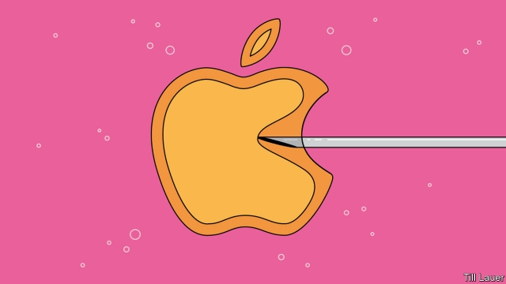

###### Fert perks

# More employers want to help workers make babies 

 

> print-edition iconPrint edition | Business | Aug 10th 2019 

WHEN APPLE and Facebook began paying for employees to freeze their eggs in 2014, this generosity was met with cynicism. Critics dismissed it as another attempt at social engineering from Silicon Valley, no bastion of female-friendliness. Rather than empowering women, they feared, it would press them to delay motherhood; Apple would do better to install child-care facilities at its brand new headquarters. 

Such gripes have not stopped employers from embracing such schemes. Quite the opposite. More than one in four large American companies now pay for some fertility treatment, according to consultants at Mercer; one in 20 covers egg-freezing. In America Bain, a consultancy, KKR, a private-equity firm, and Tesla, a carmaker, pay for unlimited IVF cycles (which can cost $100,000), according to Fertility IQ, an educational site for fertility patients. This week Starbucks said it would raise its fertility cover to $25,000, including for baristas who work over 20 hours a week for more than six months. For part-timers on $12 an hour that can add up to twice their annual salary. 

Most American states still do not require insurers to cover infertility treatment. So companies use the benefits to differentiate themselves. This helps recruit and retain staff, says Jake Anderson-Bialis of Fertility IQ. It found that 62% of workers whose employer had paid in full for IVF said they were more likely to stay in their job. Firms keen to promote “diversity and inclusion” see health plans with IVF or surrogacy as a way to attract LGBT employees. 

Some companies insist that workers try the natural way for a year before they qualify for treatment (to the exclusion of anyone who isn’t a heterosexual in a stable relationship). Others appear to adopt fertility benefits in response to harassment scandals. Under Armour, Uber and Vice added family-friendly policies, including generous fertility perks, following such controversies. 

A lot of this is welcome. But advocates of gender equality are right to point out that some benefits—egg-freezing in particular—look like a distraction. And it is no substitute for eliminating the motherhood-penalty in the workplace.■ 
<<<<<<< HEAD

-- 

 单词注释:

1.fert['fɜ:t]: [医]fertilized 受精的 

2.perk[pә:k]:vi. 昂首, 振作, 举止高傲, 神气活现, 滤煮 vt. 竖起, 打扮, 使振作, 滤煮 n. 小费 

3.Aug[]:abbr. 八月（August） 

4.facebook[]:n. 脸谱网 

5.generosity[.dʒenә'rɒsiti]:n. 慷慨, 宽大 

6.cynicism['sinisizm]:n. 犬儒主义 

7.silicon['silikәn]:n. 硅 [化] 硅Si 

8.bastion['bæstʃәn]:n. 棱堡, 阵地工事 

9.empower[im'pauә]:vt. 授予权力, 允许, 使能够 [法] 授权, 准许, 转委 

10.motherhood['mʌðәhud]:n. 母道, 母性, 母亲们 

11.headquarter[,hed'kwɔ:tә]:vt. 将...的总部设在 

12.gripe[graip]:n. 紧握, 柄, 把手, 控制 vt. 抓紧, 抱住, 使肠痛, 激怒 vi. 肠绞痛, 抱怨 

13.fertility[fә'tiliti]:n. 肥沃, 丰饶, 生产力 [医] 生育力 

14.mercer['mә:sә]:n. 布商, 绸缎商人, 呢绒布商 

15.bain[]:n. 贝恩（公司名称） 

16.consultancy[]:n. 商量, 协商, 磋商, 会诊, 与...商量, 咨询, 请教, 找(医生)看病, 查阅, 考虑 [经] 咨询业务, 咨询服务 

17.kkr[]:abbr. Korringa-Kohn-Rostoker method 科林加-科恩-罗斯托克法 

18.Tesla['teslә]:[电] 特斯拉 

19.carmaker['kɑ:,meikә(r)]:n. 汽车制造商 

20.unlimited[.ʌn'limitid]:a. 无限的, 不受限制的, 无条件的 [经] 无限的, 不定的 

21.ivf[]:abbr. 试管受精（in-vitro fertilization） 

22.fertility[fә'tiliti]:n. 肥沃, 丰饶, 生产力 [医] 生育力 

23.IQ[]:智商, 智力商数 

24.educational[.edju'keiʃәnl]:a. 教育的, 教育性的 

25.starbuck['sta:bʌk]:n. 星巴克（咖啡公司） 

26.barista[bə'rɪstə]:n. 咖啡师；咖啡吧员 

27.insurer[in'ʃuәrә]:n. 保险公司 [法] 保险人, 承保人, 保险公司 

28.infertility[.infә'tiliti]:n. 不肥沃, 不毛 [医] 不育症, 不孕症 

29.differentiate[.difә'renʃieit]:v. 区别, 区分 

30.jake[dʒeik]:a. 满意的, 上等的 n. 乡下佬, 家伙 

31.diversity[dai'vә:siti]:n. 差异, 多样性 [化] 多样性 

32.inclusion[in'kluʒәn]:n. 包含, 内含物 [计] 蕴含 

33.surrogacy[ˈsʌrəgəsi]:n. 代孕 

34.lgbt[.el dʒiː biː 'tiː]:[网络] 同志；跨性别者；双性恋和跨性别 

35.exclusion[ik'sklu:ʒәn]:n. 排除, 除外, 逐出 [医] 排除, 除外, 分离术 

36.heterosexual[.hetәrә'sekʃuәl]:a. 异性的, 异性爱的 n. 异性恋的人 

37.harassment['hærәsmәnt]:n. 困扰, 烦扰, 烦恼 [法] 折磨, 骚扰, 侵扰 

38.armour['ɑ:mә]:n. 甲胄, 装甲, 潜水服 

39.uber['ju:bә]:[医] 乳房 

40.controversy['kɒntrәvә:si]:n. 论争, 辩论, 论战, 争论 [法] 论战, 争论, 争吵 

41.gender['dʒendә]:n. 性 vt. 产生 

42.distraction[dis'trækʃәn]:n. 娱乐, 分心的事物, 分心 [医] 注意力分散, 内脱位, 牙弓过宽 
=======
>>>>>>> 50f1fbac684ef65c788c2c3b1cb359dd2a904378

