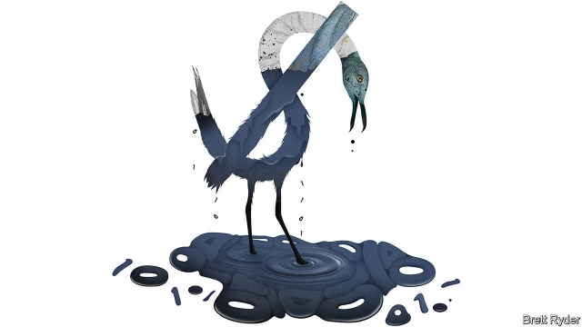

###### Schumpeter

# The Exxon Valdez of cyberspace 

 

> print-edition iconPrint edition | Business | Aug 10th 2019 

IN 1989 the thin-hulled Exxon Valdez supertanker ran aground in Prince William Sound, Alaska, pouring a quarter of a million barrels of oil into the surrounding waters. At the time, it was America’s worst offshore spill, and a huge blow to the reputation of the ship’s owner, Exxon. The firm paid $3bn to clean up the area and settle legal claims, and to improve safety the American government ordered the phasing out of single-hull ships such as Exxon Valdez. All vessels used worldwide by Exxon’s corporate descendant, ExxonMobil, are now double-hulled. But that is not all. The disaster gave rise to a cultlike culture of discipline within ExxonMobil that helped turn it into the profitmaking beast it is today. 

Three decades later, as a result of a relentless surge in cybercrime, digital firms are floundering towards their own Exxon Valdez moment. The latest is Capital One, a big American bank with a market capitalisation of $42bn, which on July 29th revealed that a hacker had stolen personal and financial details of 106m credit-card customers and applicants. Prosecutors allege that over four months Paige Thompson, a 33-year-old software developer, infiltrated a Capital One server hosted on Amazon’s cloud-computing platform through a misconfigured firewall. Bizarrely, the bank did not notice even after the hacker pseudonymously boasted about the heist on social media—until it was tipped off. For a company hitherto seen as one of the most technologically adept in finance, this is a blow. 

The incident has two parallels with the oil industry. Robert Knake, a former White House cyber-security adviser and co-author of “The Fifth Domain”, a new book on the subject, describes the way the hacker penetrated a layer of security called a web-application firewall as a “perfect analogy” to the era of single-hulled oil tankers. Like Exxon Valdez, Capital One should have had more protection. Like the oil companies of old, the bank may have also lacked a culture of safety sufficiently strong to ensure that it relentlessly probed for new vulnerabilities. Both are a reminder that, if data are now more valuable than oil, data breaches bear an unhealthy resemblance to oil spills. Internet firms can learn a lesson or two from hoary old carbon-belchers like ExxonMobil on how to avoid them. 

Exxon Valdez was a watershed moment for Exxon. In 1989 it had already been around for a century. But the disaster led to a full-blown overhaul of the firm’s safety and risk-management culture. In “Private Empire”, a book about ExxonMobil by Steve Coll, the author can barely disguise his astonishment at how far this went. In its offices, desk drawers had to be kept shut lest employees bump into them. Every meeting began with a “safety minute”, akin to a blessing before a meal. Cuts by office paper clips were monitored. Even today its 11-point Operations Integrity Management System—as detailed in its pursuit of safety nirvana as the Buddhist path to enlightenment—is drilled into new recruits, incorporated into performance assessments and shared with contractors and suppliers. For 27 years it has worked remarkably well. 

Corporations can argue that data are trickier to manage than oil. Preventing data breaches is a fiendish game of cat-and-mouse. Companies do not know who their attackers are—criminals? state actors? lone wolves?—or what they want. The hacker only has to be right once to penetrate a system. Defenders have to parry every jab, all the time; one misstep and they lose. Many companies bridle at being held responsible for being the victims of crime or acts of war. 

Still, the oil industry’s experience is instructive. First, the emphasis on ingraining safety in every employee can strengthen the weakest link in cyber-security: the individual. In “The Fifth Domain” Mr Knake and Richard Clarke argue that companies deploying ever more sophisticated anti-hacking technology cannot eliminate “Poor Dave”, the guy in every organisation who can’t resist a phishing email. Studies show that employees are often, by accident or intentionally, the main cause of successful cyber-attacks. Wise firms fake phishing emails to flush out the Daves. 

Oil firms’ insistence on their supply chains speaking the same language, and loudly, on safety is also worth emulating. Hackers increasingly infiltrate large corporations by first penetrating the defences of smaller suppliers and piggybacking on the communications systems which link the two. This is made easier by the fact that many firms treat hacks like gonorrhoea, an embarrassing affliction no one wants to admit even if speaking about it would stop its spread. Some call it a tragedy of the cyber-commons. 

Third, the near-death experience suffered by BP after the Deepwater Horizon oil disaster in 2010 shows how data can turn from an asset into a crushing liability. It ended up costing the British firm more than $50bn. Its reputation has yet to recover fully. 

For now, the costs of a data breach look absurdly light by comparison. Capital One says its recent hack will cost it up to $150m this year, mainly in extra customer support. Ignoring potential fines, that is less than $1.50 per victim—and a tenth of the bank’s latest quarterly profits. Equifax, a credit-scoring firm, recently agreed to pay up to $700m to resolve lawsuits and other claims after data of nearly 150m clients were hacked. IBM Security, a consultancy, puts the average cost of a data breach worldwide at $150 per victim. Messrs Knake and Clarke think it should be more like $1,000 to spur the investment needed to prevent losses. 

Governments are indeed getting tougher. Last month Britain’s proposed fining British Airways £183m ($222m) after data about 500,000 passengers were stolen. That marks the first big penalty linked to the EU’s newish data-protection rules. The airline said it would appeal. It may yet convince regulators it is not to blame. But as with Exxon or BP, that argument may wear thin with regulators and consumers. Companies which trade in data—ie, most big ones these days—had better get ahead of the problem. ■ 

-- 

 单词注释:

1.Schumpeter[]:n. 熊彼特（美籍奥匈帝国经济学家, 当代资产阶级经济学代表人物之一） 

2.Exxon['ɛksan]:n. 艾克森石油公司 

3.Valdez[væl'di:z]:瓦尔迪兹[美国阿拉斯加州南部港市] 

4.cyberspace[]:[计] 空间, 网控空间 

5.Aug[]:abbr. 八月（August） 

6.supertanker['sju:pәtæŋkә]:n. 超级油轮, 巨大油轮 

7.aground[ә'graund]:adv. 搁浅地, 地面上 

8.william['wiljәm]:n. 威廉（男子名）；[常作W-][美俚]钞票, 纸币 

9.Alaska[ә'læskә]:n. 阿拉斯加州 

10.corporate['kɒ:pәrit]:a. 社团的, 合伙的, 公司的 [经] 团体的, 法人的, 社团的 

11.descendant[di'sendәnt]:n. 后裔, 子孙 a. 传下的, 下降的 

12.exxonmobil[]:n. 埃克森美孚国际公司 

13.cultlike[]:[网络] 邪教 

14.profitmaking[]:un. 营利 adj. 赢利的；能赚钱的 n. 盈利性的 [网络] 赚钱营利；获利；以盈利为目的 

15.relentless[ri'lentlis]:a. 无情的, 冷酷的, 残酷的 

16.surge[sә:dʒ]:n. 巨涌, 汹涌, 澎湃 vi. 汹涌, 澎湃, 颠簸, 猛冲, 突然放松 vt. 使汹涌奔腾, 急放 [计] 电压尖峰 

17.cybercrime[]:n. 网络犯罪 

18.flounder['flaundә]:vi. 挣扎, 折腾；错乱地做事或说话 

19.capitalisation[,kæpitәlai'zeiʃən;-li'z-]:n. <主英>=capitalization 

20.hacker['hækә]:[计] 计算机窃贼, 计算机新技术挑战者, 黑客 

21.prosecutor['prɒsikju:tә]:n. 实行者, 告发者, 公诉人 [法] 原告, 起诉人, 检举人 

22.allege[ә'ledʒ]:vt. 宣称, 主张, 提出, 断言 [法] 断言, 指称, 指证 

23.paige[]:n. 佩奇（姓名） 

24.thompson['tɔmpsn]:n. 汤普森（姓） 

25.developer[di'velәpә]:n. 开发者 [计] 显影器 

26.infiltrate[in'filtreit]:vt. 使浸润, 使潜入, 使渗入 vi. 渗入 n. 渗透物 

27.server['sә:vә]:n. 服伺者, 上菜用具, 发球员 n. 服务器 [计] 服务器, 服务器启动程序, 服务台程序 

28.misconfigured[]:[网络] 配置错误 

29.firewall[]:[计] 放火墙, 隔离 

30.bizarrely[bɪ'zɑ:lɪ]: 古怪地; 怪诞地 

31.pseudonymously[]:以假名方式地 匿名地 

32.heist[haist]:n. 强夺, 拦劫, 抢劫 vt. 强夺, 拦劫, 抢劫 

33.hitherto[.hiðә'tu:]:adv. 迄今, 至今 

34.technologically[teknә'lɔdʒikәli]:adv. 技术上地；科技地 

35.adept[ә'dept]:a. 熟练的, 老练的, 巧妙的 n. 能手, 内行 

36.Robert['rɔbәt]:[法] 警察 

37.knake[]:[网络] 刀 

38.adviser[әd'vaizә]:n. 顾问, 劝告者, 指导教师 [法] 顾问, 劝告者 

39.domain[dәu'mein]:n. 领域, 领土, 产业, 范围 [计] 域, 区域, 支配命令 

40.analogy[ә'nælәdʒi]:n. 相似, 类似 [计] 模拟 

41.relentlessly[]:adv. 不仁慈, 严酷, 无情, 坚韧, 不懈, 不屈不挠 

42.probe[prәub]:n. 探索, 调查, 探针, 探测器 v. 用探针探测, 调查, 探索 

43.vulnerability[.vʌlnәrә'biliti]:n. 易受伤, 易受责难, 易受伤部位 [医] 易损性 

44.reminder[ri'maindә]:n. 提醒的人, 暗示 [经] 催单 

45.datum['deitәm]:n. 论据, 材料, 资料, 已知数 [医] 材料, 资料, 论据 

46.breach[bri:tʃ]:n. 裂口, 违背, 破坏, 违反, 突破, 破裂 vt. 攻破, 突破 vi. 跳出水面 

47.resemblance[ri'zemblәns]:n. 相似处, 类似, 肖像 

48.hoary['hɒ:ri]:a. 灰白的, 陈旧的 [医] 灰发的, 白发的 

49.watershed['wɒtәʃed]:n. 流域, 分水岭 [医] 分水界, 分水岭 

50.overhaul[.әuvә'hɒ:l]:vt. 分解检查, 翻修, 精细检查, 彻底革新 n. 分解检查, 精细检查, 大检修 

51.steve[]:n. 史蒂夫（男子名） 

52.coll[]:n. 胶原；胶质（等于colloid） 

53.astonishment[ә'stɒniʃmәnt]:n. 惊异, 惊愕, 使人惊异的事物 

54.bump[bʌmp]:n. 撞击, 肿块 vt. 碰撞 vi. 撞, 颠簸而行 

55.akin[ә'kin]:a. 同类的, 同族的, 同源的 

56.clip[klip]:n. 修剪, 夹子, 回形针, 剪下来的东西 vt. 修剪, 痛打, 夹牢, 剪报 vi. 剪报 

57.integrity[in'tegriti]:n. 正直, 廉正, 完整 [计] 完整性 

58.nirvana[nә:'vɑ:nә]:n. 天堂 

59.incorporate[in'kɒ:pәreit]:a. 合并的, 组成公司的, 一体化的 vt. 吸收, 合并, 使组成公司, 体现 vi. 合并, 混合, 组成公司 

60.contractor['kɒntræktә]:n. 立契约的人, 承包商 [化] 承包者; 承包工厂 

61.supplier[sә'plaiә]:n. 供应者, 供给国, 供应商 [化] 承制厂; 供应厂商 

62.remarkably[ri'mɑ:kәbli]:adv. 显著地, 引人注目地, 非常地 

63.tricky['triki]:a. 狡猾的, 机敏的 

64.fiendish['fi:ndiʃ]:a. 恶魔似的 

65.attacker[ә'tækә]:n. 攻击者 

66.lone[lәun]:a. 孤单的, 孤立的, 单身的, 寂寞的 

67.defender[di'fendә]:n. 防卫者, 防护者, 辩护者 [法] 辩护人, 保护人 

68.parry['pæri]:vt. 挡开, 回避, 闪避的回答 n. 挡开, 回避, 闪避的回答 

69.jab[dʒæb]:v. 刺, 戳, 猛击 n. 刺, 戳, 猛击 

70.misstep[.mis'step]:n. 踏错, 错误, 失策 [法] 失足, 过失, 失策 

71.bridle['braidl]:n. 马勒, 约束 [医] 系带, 约束 

72.instructive[in'strʌktiv]:a. 有益的, 增进知识的 

73.ingrain[in'grein]:vt. 给原纱染色, 使根深蒂固 a. 原纱染色的, 根深蒂固的 n. 原纱染色, 固有品质 

74.richard['ritʃәd]:n. 理查德（男子名） 

75.clarke[]:n. 克拉克（姓氏） 

76.deploy[di'plɒi]:v. 展开, 配置 

77.sophisticate[sә'fistikeit]:n. 久经世故的人, 精于...之道的人 vt. 篡改, 曲解, 使变得世故, 掺合, 弄复杂 vi. 诡辩 

78.cannot['kænɒt]:aux. 无法, 不能 

79.dave[deiv]:n. 戴夫（男子名） 

80.organisation[,ɔ: ^әnaizeiʃən; - ni'z-]:n. 组织, 团体, 体制, 编制 

81.phishing[ˈfɪʃɪŋ]: 网络仿冒 

82.intentionally[]:adv. 故意地, 有意地 

83.fake[feik]:n. 假货, 欺骗, 诡计 a. 假的 vt. 假造, 仿造 vi. 伪装 

84.daves[]: [人名] 戴夫斯 

85.insistence[in'sistәns]:n. 坚持, 坚决主张 

86.emulate['emjuleit]:vt. 效法, 尽力赶上, 同...竞争 [计] 仿真 

87.piggyback['pi^ibæk]:a. 背着的, 在背肩上的 adv. 背着, 在背肩上 

88.hack[hæk]:n. 劈, 砍, 砍痕, 出租车, 干咳, 晒架, 鹤嘴锄 vt. 劈, 砍, 出租, 用旧 vi. 劈, 砍, 干咳, 驾驶出租车 a. 出租的 

89.gonorrhoea[,^ɔnә'ri:ә]:n. 淋病 

90.affliction[ә'flikʃәn]:n. 苦恼, 折磨, 苦恼的事由 

91.bp[]:[化] 碱基对 

92.deepwater['di:p,wɔ:tә(r)]:a. 深海的,海洋上的,靠近海洋的 

93.asset['æset]:n. 资产, 有益的东西 

94.liability[laiә'biliti]:n. 责任, 债务, 倾向 [经] 责任, 义务, 负债 

95.fully['fuli]:adv. 十分地, 完全地, 充分地 

96.absurdly[әb'sә:dli]:adv. 荒谬地, 荒唐地, 愚蠢地 

97.les[lei]:abbr. 发射脱离系统（Launch Escape System） 

98.equifax[]:[网络] 可飞；艾可飞；可飞公司 

99.lawsuit['lɒ:sju:t]:n. 诉讼 [法] 诉讼, 诉讼案件 

100.client['klaiәnt]:n. 客户, 顾客, 委托人 [计] 客户, 客户机, 客户机程序 

101.IBM[]:美国国际商用机器公司 [计] 国际商用机器公司 

102.consultancy[]:n. 商量, 协商, 磋商, 会诊, 与...商量, 咨询, 请教, 找(医生)看病, 查阅, 考虑 [经] 咨询业务, 咨询服务 

103.Messrs['mesәz]:[法][pl. ](=Messieurs)各位(先生) 

104.airway['єәwei]:n. 空中航线, 风道 [医] 导气管 

105.penalty['penәlti]:n. 处罚, 刑罚, 罚款, 罚球, 报应, 不利结果, 妨碍 [经] 罚金(款), 违约金 

106.newish['nju:iʃ]:a. 尚新的 

107.regulator['regjuleitә]:n. 调整者, 校准者, 校准器, 调整器, 标准钟 [化] 调节剂; 调节器 

