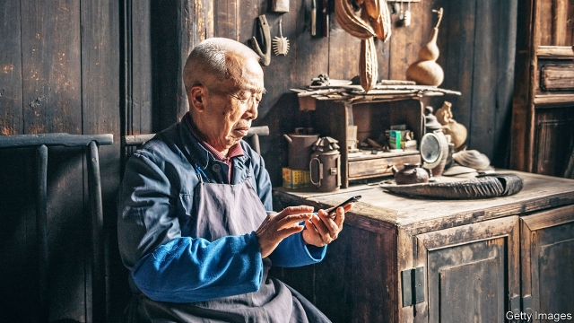

###### Silver screens

# The elderly are the next big growth market for Chinese tech firms 

 

> print-edition iconPrint edition | Business | Aug 10th 2019 

SOON AFTER dinnertime, Xiangyang Park in central Shanghai transforms into a ballroom. Loudspeakers pump out old pop songs as elderly folk sway under the plane trees. A picture of geriatric nostalgia—until you meet Ms Shi and Mr Zhou, a couple in their 70s whose enthusiasm for the waltz is matched only by that for their smartphones. Mr Zhou reads online novels. Ms Shi watches far-flung Chinese parks come alive with their own group dancing on Huoshan, a short-video app favoured by teens. Both love WeChat, a messaging app. “I can go without food, but not without my smartphone,” Ms Shi confesses. 

She and her husband remain unusual. Less than one in three Chinese over 50 reported owning a smartphone in 2016, the latest year for which the Pew Research Centre, a think-tank, has data, half the share in America. A survey by the Chinese Academy of Social Sciences and Tencent, which owns WeChat, found that only 17% frequently paid for purchases with mobile phones; close to half had never done so. 

Tech companies want to lure more Ms Shis and Mr Zhous online—and take a bigger slice of the 7trn yuan ($1trn) that Chinese seniors are expected to spend on consumer goods in 2020. To tech firms, the disconnectedness of China’s 250m-odd old, or 18% of the population, is an opportunity. Unlike the young, whose fragmented attention is fought over by thousands of apps, retirees are up for grabs. And once on the internet, they splurge. In 2017 JD.com, a big e-commerce firm, found that they spent 2.3 times as much as the average user. Their typical deposit in Yu’E Bao, an online cash-management service controlled by Alibaba, a giant internet firm, is 7,000 yuan compared with 4,000 yuan across all ages. 

Early adopters may be better-off than a typical senior, rattled when shops refuse cash. But startups see rich pickings. “I Have A Partner”, a grey-dating app, debuted last year with bold fonts and voice messaging for slow typists. Tangdou Guangchang Wu (“Jelly Bean Square Dance”), which started out posting dance videos (with filters to iron out wrinkles), aspires to be a one-stop shop for the old. It reports over 200m downloads since its launch in 2015. 

The big generalists hope to lock the oldies in early. The over-60s use four-fifths of their mobile data on WeChat, against 7% for those aged 18-35. In 2017 Tencent made a video of old-timers rapping about their confusion over tech to encourage children to set their parents up with WeChat Helper, an app assistant. People over 55 are now WeChat’s fastest-growing cohort. Last year Taobao, Alibaba’s online emporium, introduced a “pay-for-me” option for elderly customers to use with family members. The site broadcasts daily over 1,000 live-streaming shows aimed at them. Ele.me, a food-delivery service bought by Alibaba last year, is trialling meal and medicine deliveries for the elderly, and one-off help with things like changing light bulbs. With the over-60s’ share of the population expected to double to one-third by 2050, there is wisdom in this strategy.■ 

