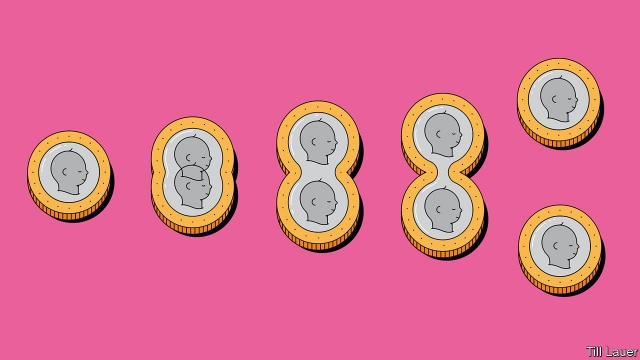

###### Seed capital

# The fertility business is booming 

 

> print-edition iconPrint edition | Business | Aug 10th 2019 

BRIGHT-BLUE letters greet women at Trellis, an egg-freezing studio in New York. “It’s up to each of us to invent our own future,” they enjoin. No baby pictures here, of the sort that adorn joyless waiting rooms at traditional fertility clinics. Instead the client-experience manager, Casy Tarnas, invites visitors to grab a charcoal-coloured “fertility-friendly juice”. Turkish-cotton robes await. If this feels like a spa rather than surgery, that is the idea. Egg-freezing, which promises to preserve young women’s healthy eggs until they are ready to start a family, is supposed to be “an empowering experience”. 

The fertility business has always peddled hope to people who struggle to conceive naturally. It still does, extending the promise to singles and same-sex couples as social norms shift, and increasingly—as in the case of Trellis—to the much larger clientele of young women who wish to postpone childbearing while they pursue a career or await “the one”, and are therefore likelier to need help when they do eventually want babies. Data Bridge, a research firm, predicts that by 2026 the global fertility industry could rake in $41bn in sales, from $25bn today. Today one in 60 in America is born thanks to in vitro fertilisation (IVF) and other artificial treatments. In Denmark, Israel and Japan the figure is more than one in 25—and rising. In China revenues could double to over $7bn by 2023, according to Frost & Sullivan, a data firm. Add high operating margins—of around 30% in America for a $20,000 round of IVF—plus the recession-proof nature of the desire for offspring, and investors are understandably excited. 

In 2018 fertility firms received $624m from venture capitalists and private-equity firms, compared with less than $200m in 2009, according to Pitchbook, a data provider. In June Jinxin Fertility raised $360m in an initial public offering, the first on the Hong Kong Stock Exchange for a Chinese fertility firm. The market capitalisation of Vitrolife, a listed Swedish company, has tripled since 2015, to $2bn. 

The money is flowing not just into treating infertility (as IVF clinics do) but also preserving fertility (egg-freezing clinics) and, even further removed from conception, diagnosing if either treatment or preservation might be needed one day (tests and trackers). Of these, infertility treatment is the most mature, though the landscape remains fragmented 41 years after the first IVF baby was born. 

In America and Europe consolidation is now afoot. Private-equity firms think they can cut costs, acquire more patient data and build brands, as they have done with dental clinics. Last month Impilo, a Nordic investment firm which already owned the Fertility Partnership, a big British provider, agreed to buy VivaNeo, which has clinics in Austria, Germany and the Netherlands. China, where between 2006 and 2016 the number of fertility clinics ballooned from 88 to 451, could be next. Everywhere, clinics are bolting on pricey new services, from testing embryos for genetic problems to surgically wounding the womb to encourage the embryo to implant itself. 

The second type of fertility business—preservation—was spawned by more recent breakthroughs in flash-freezing sex cells, which dramatically increased the survival rates of frozen sperm and eggs after thawing. Egg-freezing clinics purport to sidestep a dilemma faced especially by women who wait beyond their mid-thirties, when egg cell deterioration can accelerate, to have a baby. Traditionally such women could improve their chances by buying young, healthy eggs from donors, or accept longer odds with their own eggs. Egg-freezing lets young, healthy women donate to their future selves. 

The procedure mushroomed in America after the American Society for Reproductive Medicine removed the “experimental” label from it in 2012. In 2017 nearly 11,000 American women froze their eggs, 24% more than the previous year, according to the Society for Assisted Reproductive Technology. In Britain the number of frozen-egg cycles doubled between 2013 and 2016, to 1,321. Egg-freezers claim margins similar to IVF; some may already be profitable. 

Although preservation services are mostly aimed at women, firms are also eyeing men. Geneva-based Legacy (“The only life investment you’ll make”) sends a return sperm-collection container by mail, analyses it and, for a hefty premium, stores it in a Swiss nuclear bunker. Since January thousands of men have bought the $99 “Dadi kit” from Dadi, a company in Brooklyn (“Store your sperm, stop the clock”). They include a surprising number of men preparing for a vasectomy, though the average customer is a 31-year-old millennial who has realised that “men too have a biological clock”, says Tom Smith, the founder. 

The babies of the fertility business offer diagnostics. Firms like Everlywell and Modern Fertility send users a kit, costing about $160 apiece, to collect a finger-prick of blood or a drop of spit, which is then analysed for hormonal signs of potential problems. Celmatix, another startup, offers a pricier test to identify genetic markers associated with fertility problems. 

All fertility businesses stir controversy. Last year Pacific, a fertility clinic in San Francisco, and the Cleveland Medical Centre, in Ohio, lost many eggs and embryos to faulty storage. CHA Fertility, in Los Angeles, has been accused of implanting the wrong embryos, which led to the birth mother having to give up twins who were genetically related to two other couples. Peiffer Wolf, an American law firm representing several families involved in similar cases, says the industry, which can face fewer rules in America than nail salons, urgently needs some. 

Clinics in America and beyond are also accused of playing up success. Like motorists and asset managers, most claim above-average results. As for their newfangled extras, the British regulator, which uses a traffic-light system to grade 11 popular IVF add-ons, has yet to give one a green light, meaning it is both safe and effective. The newer breeds of fertility firm are similarly criticised for misleading customers. In fact, existing egg-preservation techniques are expensive, invasive, often ineffective—and regularly oversold. 

In Britain just 41 “ice babies” were born in 2016 using the mother’s own frozen eggs, not nearly enough for reliable statistics, so egg-freezers often cite success rates from defrosted eggs of donors, an unrepresentatively young, healthy sample. Prelude, an American company which recently merged into a bigger venture offering treatment and preservation, promises, improbably, to help families have “as many healthy babies as they want, whenever they want”. Extend Fertility, another American firm, advertises egg-freezing “for the price of a healthy snack”. Celmatix claims that its tests help people “dramatically improve their chances of conceiving”. Modern Fertility concedes it cannot predict the future, but offers a “fertility timeline” that some customers may treat as a bespoke egg timer. Some startups give Instagram influencers subsidised treatments in exchange for touting the service to millennial followers. 

None of which dampens the fertility industry’s appeal to women, men—or investors. Many will be disappointed: prospective parents, because too many of them will still, despite fertility businesses’ promises, be unable to conceive; and, with nothing like the emotional toll, those pouring money into these firms. But the methods—and providers’ prospects—are bound to improve with time. With luck, the capital currently flowing into research on reproduction, a surprisingly mysterious aspect of human biology, will hasten the process. ■ 

