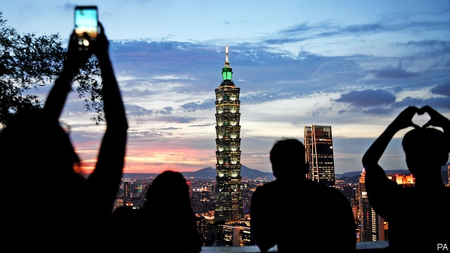

###### Backpacking backtrack

# China is trying to browbeat Taiwan by keeping its tourists away 

 

> print-edition iconPrint edition | China | Aug 10th 2019 

ON THE AFTERNOON of July 31st youngsters in dozens of Chinese cities raced to government offices, pursuing a precious commodity. Earlier that day the authorities had announced that from midnight they would no longer issue the passes that allow mainland tourists to visit Taiwan independently, without having to join a tour. A 25-year-old newlywed from the eastern province of Zhejiang, who uses the nickname Yuyi, says she got a permit just before the cut-off. Now she wonders whether, given rising tensions between China and Taiwan, it might be wiser to junk the September getaway on the island that she and her husband have been planning. 

China has long used carrots and sticks to persuade Taiwan’s people to accept its demand for “peaceful reunification”. But the sudden suspension of the solo-travel programme, launched eight years ago, was still a surprise. A spokesperson for China’s government blamed Taiwan’s ruling Democratic Progressive Party (DPP), which abhors the idea of unification. He said it had “incited hostility towards the mainland”. Tsai Ing-wen, Taiwan’s president, retorted that China had made “a big strategic mistake” and that its decision would irk both mainlanders and Taiwanese. 

Visitors from China accounted for just over one-quarter of Taiwan’s tourist arrivals in the first half of this year. About 40% of them were individual travellers. Taiwanese travel agents predict that the Chinese government’s new policy could cut visitor numbers by up to 700,000 over the next six months, costing the tourism industry around $900m in revenue. Barclays, a bank, says the policy could cost Taiwan sums equal to 0.2% of GDP (the Taiwanese government has predicted that its economy will grow by nearly 2.2% this year). There will be intangible costs, too. Research suggests that independent travellers tend to leave with a better impression of Taiwan than those who visit in groups. 

All this will leave a mark, but it is no crushing blow. Taiwan is much less reliant on mainland tourists than it was five years ago, when they made up two-fifths of all visitors. That is in part because of restrictions China began imposing on group travel shortly before Ms Tsai’s inauguration in 2016. It is also because Taiwan has lately pushed hard to attract visitors from elsewhere. Tourist arrivals reached a record 11.1m last year, mainly because of a surge of travellers from South-East Asian countries. 

China is angry with Ms Tsai for rejecting its overtures, and with America for being nice to her. It complained bitterly about her two recent stopovers in America, where she spoke at Columbia University and hobnobbed with foreign diplomats. It raged about the Trump administration’s decision last month to approve a long-negotiated arms deal with Taiwan worth about $2.2bn. But it is probably most annoyed by Ms Tsai’s loud support in recent weeks for anti-government protesters in Hong Kong. She says they have “legitimate concerns”. 

By stemming the flow of tourists, China may be trying to warn Taiwanese voters of what could happen if they re-elect Ms Tsai and support other politicians like her in presidential and legislative elections in January—Taiwan’s economy is heavily reliant on China’s. The biggest opposition party, the Kuomintang (KMT), supports friendlier ties with the mainland and made big gains in regional elections last November. China’s leaders would like it to vanquish the DPP in next year’s polls. But Ms Tsai’s support for Hong Kong’s democrats has helped her once-dismal ratings to rebound. She could even keep her job. 

In an attempt to capture some of her newfound support, the KMT’s presidential candidate, Han Kuo-yu, is trying to sound a bit more sceptical about China (earlier in the year some Taiwanese criticised him for a chummy meeting with mainland officials in Hong Kong, ostensibly to promote trade). Mr Han is the mayor of the southern port of Kaohsiung. Fan Shih-ping of Taiwan National Normal University says the city will suffer disproportionately from China’s block on tourism—Kaohsiung has tended to be popular with solo tourists because it is easily reached by train. But the KMT appears to have decided not to make political hay out of China’s decision to cut the flow. 

China will doubtless have more tricks to play in the run-up to January’s polls. Having already poached five of Taiwan’s diplomatic allies in the three years since Ms Tsai came to power, it may try to peel off at least one more. In the past China has called off military exercises around the strait in advance of Taiwanese elections, for fear of provoking a backlash at the ballot box. Andrew Yang, a former defence minister, thinks that this time China may step up its drills, partly because it has lots of new kit it wants to try out. Taiwan has accused the mainland of trying to influence the island’s politics by spreading “fake news” through social media. But how much any of this will work is hotly debated in Taiwan. It may be that such efforts will deter voters from supporting radical anti-China politicians (Ms Tsai is relatively restrained in her approach to the mainland). But the unrest in Hong Kong has shown that even in a place where it has many levers, China can struggle to get its political way. ■ 
<<<<<<< HEAD

-- 

 单词注释:

1.backpack['bækpæk]:n. 远足用的背包；双肩背包, 背包 

2.backtrack['bæktræk]:vi. 返回, 退走, 撤退, 放弃 [化] 回溯 

3.browbeat['brajbi:t]:vt. 对...吹胡子瞪眼睛, 吓唬 

4.taiwan['tai'wɑ:n]:n. 台湾 

5.Aug[]:abbr. 八月（August） 

6.commodity[kә'mɒditi]:n. 农产品, 商品, 有用的物品 [经] 商品, 货物, 日用品 

7.independently[.indi'pendәntli]:adv. 独立地, 自立地 

8.newlywed['nju:liwed]:n. 新(婚的)人, 新婚夫妇 

9.nickname['nikneim]:n. 绰号, 昵称 vt. 给...取绰号, 叫错名字 [计] 绰号 

10.yuyi[]:[网络] 豫；鸭梨山大王；暖汐 

11.getaway['^etә,wei]:n. 逃走, 起步 

12.reunification[,ri:ju:nifi'keiʃәn,ri:,ju:-]:n. 使重新统一, 使重新团结 

13.spokesperson['spәukspә:sn]:n. 发言人, 代言人 

14.DPP[]:[计] 数字并行处理机 [化] 微分脉冲极谱法 

15.abhor[әb'hɒ:]:vt. 憎恶, 痛恨, 回避, 拒绝 

16.unification[.ju:nifi'keiʃәn]:n. 统一, 联合, 一致 [医] 连结; 统一 

17.hostility[hɒs'tiliti]:n. 敌意, 敌对, 反对 

18.tsai[]:n. 蔡（姓氏） 

19.retort[ri'tɒ:t]:n. 反驳, 顶嘴, 蒸馏器, 曲颈甑 vi. 反驳, 回嘴, 反击 vt. 反击, 反驳, 蒸馏 

20.irk[ә:k]:vt. 使厌倦, 使苦恼 

21.mainlander[ˈmeɪnlændə]:n. 本土人, 大陆人 

22.taiwanese[,taiwɑ:'ni:z, -'ni:s]:a. 台湾人的；台湾的 

23.traveller['trævlә]:n. 旅行者 [经] 旅行商 

24.barclay['bɑ:kli]:n. 巴克利（姓氏, 男子名） 

25.intangible[in'tændʒәbl]:a. 难以明了的, 无形的 [经] 无形的 

26.les[lei]:abbr. 发射脱离系统（Launch Escape System） 

27.reliant[ri'laiәnt]:a. 依赖的, 信赖的 

28.inauguration[i,nɔ:^ju'reiʃәn]:n. (美)总统就职, 开幕仪式, 就职典礼, 开始, 开辟, 开创, 为...举行开幕式 [法] 就职, 就职典礼, 创造 

29.surge[sә:dʒ]:n. 巨涌, 汹涌, 澎湃 vi. 汹涌, 澎湃, 颠簸, 猛冲, 突然放松 vt. 使汹涌奔腾, 急放 [计] 电压尖峰 

30.overture['әuvә.tʃuә]:n. 主动表示, 事件的开端, 序言, 提议, 提案, 初步交涉 vt. 提议, 为...奏前奏曲 

31.stopover['stɒp.әuvә]:n. 中途停留 

32.Columbia[kә'lʌmbiә]:n. 哥伦比亚 

33.hobnob['hɒbnɒb]:vi. 过从甚密, 共饮, 交谈 n. 共饮, 交谈 

34.diplomat['diplәmæt]:n. 外交官, 有外交手腕的人 [法] 外交家, 外交官, 有权谋的人 

35.protester[]:n. 抗议者, 持异议者, 拒付者 [经] 反对者 

36.hong[hɔŋ]:n. （中国、日本的）行, 商行 

37.kong[kɔŋ]:n. 含锡砾石下的无矿基岩；钢 

38.legitimate[li'dʒitimәt]:a. 合法的, 正当的, 婚生的 vt. 认为正当, 立为嫡嗣, 使合法 

39.voter['vәutә]:n. 选民, 投票人 [法] 选民, 选举人, 投票人 

40.presidential[.prezi'denʃәl]:a. 总统制的, 总统的, 首长的, 统辖的 [法] 总统的, 议长的, 总经理的 

41.legislative['ledʒislәtiv]:n. 立法机构 a. 立法的, 有立法权的 

42.opposition[.ɒpә'ziʃәn]:n. 反对, 敌对, 相反, 在野党 [医] 对生, 对向, 反抗, 反对症 

43.kuomintang['kwәumin'tæŋ]:n. (中国)国民党 

44.kmt[]:abbr. 中国国民党（Kuo Min Tang） 

45.regional['ri:dʒәnәl]:a. 地方的, 地域性的 [医] 区的, 部位的 

46.vanquish['væŋkwiʃ]:vt. 打败, 征服, 克服 [法] 征服, 战胜, 击败 

47.democrat['demәkræt]:n. 民主人士, 民主主义者, 民主党党员 [经] 民主党 

48.rating['reitiŋ]:n. 等级, 额定功率, 责骂 [经] 等级评定 

49.rebound[ri'baund]:vi. 弹回, 返回, 产生事与愿违的结果 vt. 使弹回, 使返回 n. 反弹, 返回, 篮板球, 振作 rebind的过去式和过去分词 

50.newfound['nju:fajnd]:a. 新发现的 

51.han[hæn]:n. 汉朝；汉民族 

52.criticise['kritisaiz]:v. 批评, 吹毛求疵, 非难 

53.chummy['tʃʌmi]:a. 亲密的, 很友好的 

54.ostensibly[]:adv. 可公开, 显然, 表面, 外表, 诡称, 假装 

55.kaohsiung[]:n. 高雄 

56.disproportionately[]:adv. 不匀称, 不相称 

57.solo['sәulәu]:n. 独奏, 独唱, 单独表演 a. 单独的, 独奏的, 独唱的 vi. 放单飞 

58.poach[pәutʃ]:vt. 水煮(蛋), 偷猎, 侵入, 窃取 vi. 偷猎, 陷入泥中 

59.diplomatic[.diplә'mætik]:a. 外交的, 老练的 [法] 外交的, 外交上的, 文献上的 

60.ally['ælai. ә'lai]:n. 同盟者, 同盟国, 助手 vt. 使联盟, 使联合, 使有关系 vi. 结盟 

61.provoke[prә'vәuk]:vt. 激怒, 惹起, 诱导 [法] 刺激, 煽动, 激怒 

62.backlash['bæklæʃ]:n. 后冲, 强烈反对 [电] 反撞, 逆栅流 

63.ballot['bælәt]:n. 投票, 投票用纸, 抽签 vi. 投票, 抽签 vt. 投票选出, 拉选票 

64.andrew['ændru:]:n. 安德鲁（男子名） 

65.yang[jɑ:ŋ,jæŋ]:n. 杨（姓氏） 

66.kit[kit]:n. 装备, 工具箱, 成套工具 [计] 成套部件; 成套零件 

67.politic['pɒlitik]:a. 精明的, 明智的, 策略的 

68.fake[feik]:n. 假货, 欺骗, 诡计 a. 假的 vt. 假造, 仿造 vi. 伪装 

69.hotly['hɒtli]:adv. 暑热地, 激烈地, 热心地 

70.deter[di'tә:]:vt. 制止, 吓住, 威慑 
=======
>>>>>>> 50f1fbac684ef65c788c2c3b1cb359dd2a904378

