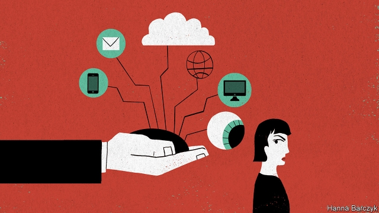

###### Chaguan

# Huawei is trying to solve a hard problem 

 

> print-edition iconPrint edition | China | Aug 10th 2019 

ON BALANCE, it seems implausible that a committee—let alone a committee run by grey-suited Communist Party commissars—could design anything as odd as the new research campus of Huawei, the Chinese telecommunications giant. Comprising 12 replica European “towns” spread across lush subtropical hills near the southern city of Dongguan, the campus houses 18,000 scientists, designers and other boffins in turreted German castles, Spanish mansions and Italian palazzi, connected by an antique-style red train. Staff canteens include Illy espresso bars and French bistros. A herd of bronze rhinoceroses grazes by the river that divides faux Verona from ersatz Heidelberg. It is not hard to see why the campus is a stop on tours that Huawei has started offering to foreign journalists in recent months. Impressive, mad and a bit tacky, the research campus is a suggestive bit of evidence. Perhaps Huawei may just be what it claims to be, at least when it comes to decisions about architecture: a privately held company guided by the ambitions and quirks of its billionaire founder, Ren Zhengfei, a former military engineer and Europhile history buff. 

After 30 years spent largely shunning publicity, Huawei has turned into one of the world’s chattier high-technology firms, inviting journalists into once-secret research laboratories and smartphone assembly lines. The reasons for all this choreographed openness are straightforward. Huawei, whose worldwide revenues exceeded 720bn yuan ($102bn) in 2018, stands accused by Trump administration officials and members of Congress of being variously owned, subsidised or at least controlled by the Chinese state, with notably close links to the army and intelligence services. American officials accuse Huawei of stealing technology from American and other foreign rivals. They scoff at claims that the firm is owned by its own employees in a benign sort of shareholding co-operative, and that its Communist Party committee is tasked with nothing more sinister than staff training and welfare. The secretary of state, Mike Pompeo, has spent months touring the globe, urging allies not to allow Huawei to help build their 5G mobile telecommunications networks, with mixed success. In May Huawei’s reputation landed it on the American Commerce Department’s “entity list” of firms that may threaten national security. 

Step back a bit, and the company’s woes are an early sighting of a conundrum with no easy solution. Technological advances are expanding the list of products and services that require a lifelong commitment of trust between clients and suppliers, from chips that keep aeroplanes aloft, to devices that control electrical power grids. At the same time, globalisation has built supply chains linking countries that do not much like each other. The problem is acute when those chains connect America, a country used to setting its own technical and security standards, to China, an uneasy mix of trade partner, commercial competitor and ideological rival. 

Broadly speaking, when Chaguan visited the firm’s headquarters this week, senior Huawei officers advanced two different solutions to the problem of high-tech globalisation in a low-trust age. Only one of those solutions is very persuasive. 

That persuasive idea is to treat distrust in global supply chains as a technical challenge, rather than a political one. In this model, distrust can never be eliminated but may be mitigated. A Huawei executive with experience in African and European markets, where the firm’s products are seen as robust and cheap, draws an analogy with the “ABC” approach to cyber-security, meaning: “Assume nothing. Believe nobody. Check everything.” Huawei high-ups praise Britain and other European countries for applying a risk-management approach to the task of building such infrastructure as wireless networks, involving common standards for security and transparency with which all companies are invited to comply, and lots of third-party verification. The organising principle is that no product should be either trusted or distrusted unconditionally, simply on the basis of its country of origin. 

Huawei’s second, unpersuasive solution involves trying to convince outsiders that, given the right written and verbal assurances from the state, firms from China can, as it happens, be trusted not to help Chinese spies steal secrets. Thus Huawei bosses note assurances from the Chinese foreign ministry that no law exists that could make Chinese firms install backdoors in digital devices, for spies to use. Asked about national-security laws requiring firms to assist Chinese intelligence services, they retort that such laws do not apply outside China’s borders. A company executive grumbles that Western sceptics seem to doubt that China is run according to the rule of law. At times, a cultural gap in perceptions is detectable. Huawei veterans recall their firm’s early years, when state-owned enterprises bullied private businesses, and on occasion lobbied government officials to deny Huawei the right to seek overseas business. China is so much more open now, such veterans say, lamenting that outsiders cannot see this, or prefer to focus on remaining differences with the West. 

Alas, it is not credible to claim that promises or laws bind the Communist Party and its security apparatus. The party explicitly claims “absolute leadership” over courts, calling judicial independence a Western error. Then there is the exceptional size of China’s visible machinery of repression and surveillance. Given that security services in every country tend to be like icebergs, with still-larger hidden parts, it is reasonable to be exceptionally wary of China’s. 

A more convincing approach would see Huawei admit that China is different and concede that some party commands cannot be defied. That agreed, Huawei could then focus on making high-tech products and systems designed for use in a world of low or non-existent trust. Huawei bosses cannot make that argument, because party leaders would be incensed. Those turreted castles are impressive. But outside those manicured grounds is China.■ 

-- 

 单词注释:

1.huawei[]: 华为 

2.Aug[]:abbr. 八月（August） 

3.implausible[im'plɒ:zәbl]:a. 难以置信的, 不象真实的 

4.telecommunication['telikәmju:ni'keiʃәn]:n. 电讯, 远距离通讯, 无线电通讯 [计] 远程通信, 电信 

5.replica['replikә]:n. 复制品 [计] 目录分区复制 

6.lush[lʌʃ]:a. 苍翠繁茂的, 多青草的, 丰富的 n. 酒, 酒鬼 v. 饮 

7.subtropical[sʌb'trɒpikl]:a. 亚热带的 [医] 亚热带的 

8.dongguan[]: 东莞 

9.designer[di'zainә]:n. 设计者, 谋划者, 制图者 [计] 设计员 

10.boffin['bɒfin]:n. 研究员, 科学工作者 

11.turreted['tʌritid]:a. 有角塔的, 有锥形螺旋状壳阶的 

12.mansion['mænʃәn]:n. 大厦, 宅邸 

13.palazzi[]:n. 邸宅 [网络] 宫殿；帕拉齐；帕拉兹 

14.illy['ili]:adv. 不完美地；困难的；不善地, 坏地 

15.espresso[e'spresәu]:n. （用汽加压煮出的）浓咖啡 

16.bistro['bistrәu]:n. 小酒馆, 夜总会 

17.graze[greiz]:n. 吃草, 放牧, 擦伤, 轻擦 v. (使)吃草, 放牧, 轻擦, 擦伤 

18.faux[fәu]:a. （法）假的；人造的 

19.verona[vi'rәunә]:n. 维罗那（意大利城市） 

20.ersatz[eә'zɑ:tz]:n. 代用品 

21.Heidelberg['haidlbә:^]:海德尔堡[德意志联邦共和国西南部城市] 

22.tacky['tæki]:a. 发粘的, 破烂的, 俗丽的 

23.suggestive[sә'dʒestiv]:a. 提示性的, 影射的, 暗示的 [医] 暗示的 

24.privately[]:adv. 秘密地；私下地 

25.quirk[kwә:k]:n. 古怪举动, 俏皮话, 急转 

26.billionaire[.biljә'nєә]:n. 亿万富翁 

27.founder['faundә]:n. 创立者, 建立者 vt. 使沉没, 使摔倒, 弄跛, 浸水, 破坏 vi. 沉没, 摔到, 变跛, 倒塌, 失败 

28.REN[]:[计] DOS内部命令:更改文件名 [医] 肾 

29.Zhengfei[]:[网络] 钟晓东 

30.Europhile[]:亲欧分子 

31.buff[bʌf]:n. 暗黄色, 暗黄色皮革, 人的皮肤 vt. 擦亮, 使柔软 a. 暗黄色的 

32.shun[ʃʌn]:vt. 避开, 规避, 避免 

33.publicity[pʌb'lisiti]:n. 名声, 宣传, 公开场合 [经] 宣传, 广告 

34.chatty['tʃæti]:a. 饶舌的, 爱讲闲话的 

35.smartphone[]:n. 智能手机 

36.choreograph['kɒriәgrɑ:f]:v. 设计舞蹈动作 

37.openness['әupәnnis]:n. 公开；宽阔；率真 

38.variously['veәriәsli]:adv. 各种各样, 种种, 不同, 多方面, 多才多艺, 许多, 各个, 个别, 杂色, 彩色 

39.subsidise[]:vt. 给...补助金, 津贴, 资助 

40.notably['nәjtbәli]:adv. 显著地, 著名地, 尤其, 特别 

41.scoff[skɒf]:n. 嘲笑, 愚弄, 笑柄, 食品 v. 嘲笑, 嘲弄, 贪吃, 狼吞虎咽地吃 

42.benign[bi'nain]:a. 善良的, 良性的 [医] 良性的 

43.shareholding['ʃεә.hәuldiŋ]:n. 股权 

44.sinister['sinistә]:a. 不吉利的, 凶恶的, 左边的 [医] 左的 

45.mike[maik]:vi. 偷懒, 游手好闲 n. 休息, 游手好闲, 扩音器, 话筒 

46.pompeo[]:n. (Pompeo)人名；(意)蓬佩奥 

47.ally['ælai. ә'lai]:n. 同盟者, 同盟国, 助手 vt. 使联盟, 使联合, 使有关系 vi. 结盟 

48.entity['entiti]:n. 实体, 实存物, 存在 [计] 实体 

49.woe[wәu]:n. 悲哀, 悲痛, 苦痛 

50.conundrum[kә'nʌndrәm]:n. 谜语, 难题 

51.technological[.teknә'lɒdʒikl]:a. 技术的 [经] 工艺的, 技术的 

52.lifelong['laiflɒŋ]:a. 终身的, 毕生的 

53.client['klaiәnt]:n. 客户, 顾客, 委托人 [计] 客户, 客户机, 客户机程序 

54.supplier[sә'plaiә]:n. 供应者, 供给国, 供应商 [化] 承制厂; 供应厂商 

55.chip[tʃip]:n. 屑片, 薄片, 碎片 vt. 削, 切, 削成碎片, 使摔倒, 凿 vi. 削下屑片 [计] 孔屑; 组件; 晶片; 芯片 

56.aloft[ә'lɒft]:adv. 在高处, 在上 

57.grid[grid]:n. 格子, 栅格 [计] 网格 

58.globalisation[,gləubəlai'zeiʃən]:n. 全球化, =globalization 

59.ideological[.aidiә'lɒdʒikәl]:a. 意识形态的, 空想的 [法] 思想的, 思想上的, 意识形态的 

60.broadly['brɒ:dli]:adv. 宽广地, 明白地, 无礼貌地 

61.headquarter[,hed'kwɔ:tә]:vt. 将...的总部设在 

62.persuasive[pә'sweisiv]:a. 有说服力的, 劝诱的, 劝导性的 

63.distrust[dis'trʌst]:n. 不信任 vt. 不信任 

64.mitigate['mitigeit]:vt. 温和, 缓和, 减轻 [医] 缓和, 减轻 

65.robust[rәu'bʌst]:a. 健康的, 强健的, 要用力气的, 坚定的, 粗野的 [计] 健壮性 

66.analogy[ә'nælәdʒi]:n. 相似, 类似 [计] 模拟 

67.ABC['eibi:'si:]:预定章程, 美国广播公司, 澳大利亚广播公司, 字母表, 基础知识 [计] 记帐预算计价系统, 通用插件板计算机, 美国广播公司, 自动编码系统 

68.infrastructure['infrәstrʌktʃә]:n. 基础结构, 基础设施 [经] 基础设施 

69.transparency[træns'pærәnsi]:n. 透明, 透明度, 透过性, 透明物, 清晰 [计] 透明性; 透明 

70.comply[kәm'plai]:vi. 顺从, 依从 [法] 遵守, 承诺, 照做 

71.verification[.verifi'keiʃәn]:n. 证实, 查证, 证明属实 [计] 验证 

72.unconditionally[ˌʌnkən'dɪʃənəlɪ]:adv. 无条件地 

73.unpersuasive[ʌnpә'sweisiv]:a. 无说服力的 

74.outsider[' aut'saidә]:n. 外人, 局外人, 非会员, 外行, 门外汉, 比赛中获胜可能性不大的选手 [经] 外船公司 

75.verbal['vә:bl]:a. 用言辞的, 言语的, 口头的, 逐字的, 动词的 [医] 言语的, 口述的 

76.assurance[ә'ʃuәrәns]:n. 保证, 把握, 信心, 保险 [经] 保证, 担保, 保险 

77.backdoor[.bæk'dɒ:]:a. 秘密的 

78.retort[ri'tɒ:t]:n. 反驳, 顶嘴, 蒸馏器, 曲颈甑 vi. 反驳, 回嘴, 反击 vt. 反击, 反驳, 蒸馏 

79.grumble['grʌmbl]:n. 怨言, 满腹牢骚 vi. 抱怨, 发牢骚, 发隆隆声 vt. 抱怨 

80.sceptic['skeptik]:n. 怀疑论者 

81.cultural['kʌltʃәrәl]:a. 文化的, 教养的, 修养的 [医] 培养的 

82.perception[pә'sepʃәn]:n. 知觉, 感觉, 领悟力, 获取 [医] 知觉 

83.detectable[di'tektәbl]:a. 可察觉的, 易发现的 [计] 可检测的 

84.bully['buli]:n. 欺凌弱小者, 土霸 vt. 威胁, 恐吓, 欺负 vi. 欺负 a. 特好的, 第一流的 adv. 十分 

85.lobby['lɒbi]:n. 大厅, 休息室, 游说议员者 vi. 游说议员, 游说 vt. 游说 

86.oversea['әuvә'si:]:adv. 海外, 向国外, 向海外, 国外 a. 外国的, 在国外的, 在海外的, 舶来的 

87.lament[lә'ment]:n. 悲叹, 悔恨, 恸哭, 挽歌, 悼词 vt. 哀悼 vi. 悔恨, 悲叹 

88.cannot['kænɒt]:aux. 无法, 不能 

89.ala['eilә]:n. 翼, 翅 [化] 丙氨酸 

90.credible['kredәbl]:a. 可信的, 可靠的 [法] 可信的, 可靠的 

91.explicitly[]:adv. 明确地；明白地 

92.judicial[dʒu:'diʃәl]:a. 法庭的, 公正的, 审判上的, 司法的 [法] 司法的, 审判上的, 法官的 

93.exceptional[ik'sepʃәnәl]:a. 例外的, 异常的, 特别的 

94.machinery[mә'ʃi:nәri]:n. 机器, 机械装置, 机构 [化] 机械 

95.repression[ri'preʃәn]:n. 抑制, 压抑, 制止 [医] 压抑, 抑制 

96.surveillance[sә:'veilәns]:n. 监视, 监督 [电] 侦测 

97.iceberg['aisbә:g]:n. 冰山, 冷冰冰的人 

98.exceptionally[]:adv. 特殊地；异常地；例外地 

99.wary['wєәri]:a. 谨慎的, 小心的, 机警的, 周到的, 唯恐的 

100.concede[kәn'si:d]:vt. 承认, 退让 vi. 让步 

101.defy[di'fai]:vt. 藐视, 挑衅, 使落空 n. 挑战 

102.incense['inseins]:n. 香, 香气, 奉承 vi. 焚香 vt. 用香焚, 使发怒 

103.manicure['mænikjuә]:n. 修指甲术, 修指甲, 修指甲师 vt. 修指甲, 修剪 

