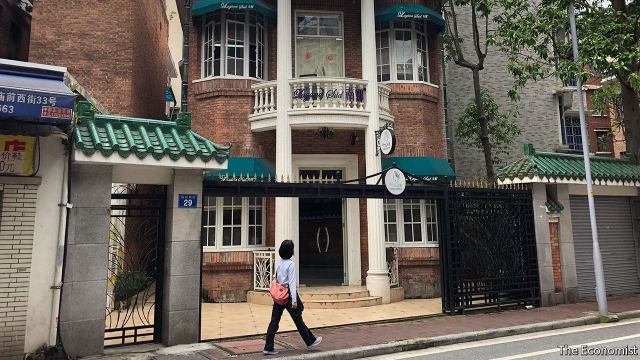

###### Old buildings, new chic

# In China’s old urban neighbourhoods, conservationists sometimes win 

 

> print-edition iconPrint edition | China | Aug 10th 2019 

IN A LEAFY street close to a busy underground station in the southern city of Guangzhou, two middle-aged women sit in a booth giving out hand-drawn local maps to passers-by. These feature cartoon-style images of churches and other grand architectural relics of the city’s pre-Communist past. Nearby, giggling youngsters take pictures of each other outside one such edifice: a European-looking villa, its high garden wall topped with ornate green tiles. There are few foreign visitors. The hand-drawn maps are all in Chinese. It is young locals who are drawn to this neighbourhood of large three- or four-storey houses built in the 1920s and 1930s in Western and Chinese styles (one is pictured). Its tree-lined lanes dotted with cafés and art galleries have become fashionable hangouts. 

The area, known as Dongshan, is close to central Guangzhou, the capital of the southern province of Guangdong. It was built by the families of Cantonese who moved to America in the late 19th and early 20th centuries. Many old neighbourhoods in China have been bulldozed to make way for new development. Dongshan is an example of how some are being saved, and even turning chic. 

The survival of Dongshan’s old buildings owes much to growing public interest in preserving urban heritage—not merely the few structures that the government designates as important. Activists have been taking up the cause, and some developers have begun to support their efforts. 

Much of the credit for protecting Dongshan goes to an NGO founded by Yang Huahui, a primary-school teacher who grew up there. Fearing it would be demolished, he organised his students to make a website about the area’s history. This won a national prize and drew the attention of the local planning bureau. Now many of Dongshan’s buildings have plaques showing they are protected. Some display QR codes providing links to their history. Many original residents still live there. Official permission is needed for any renovation work. 

Mr Yang calls his organisation a “culture promotion association”. It is one of the few of its kind in China that has succeeded in registering as an NGO (the Communist Party is suspicious of activist groups). Its 60-odd volunteers visit old districts and gather oral histories. They also draw attention to buildings in danger of demolition. “We go there straight away, take photos, and tell the government departments there’s a problem,” says Mr Yang. 

Officials have long recognised the tourism potential of the colonial-style buildings on Guangzhou’s Shamian island and a nearby river front close to which foreigners first began trading in the 18th century. They are realising that other old districts—foreign-connected or not—have value, too. Xiguan, a residential area that was home to wealthy merchants before the foreigners arrived, now has several local-history museums. Many of its buildings have been listed as protected. Nearby, a stretch of distinctive colonnaded “shop houses”, built in the late 19th and early 20th centuries, is being refurbished. It includes a network of alleyways, known as Yongqing Fang, which has been turned into a leisure zone. One popular attraction is a museum devoted to the late martial-arts actor Bruce Lee in a house where his family lived in the 1940s. It is a sign of growing interest in pre-Communist history. Last year China’s leader, Xi Jinping, toured the area. 

Some redevelopments cause problems for residents. Many people in Yongqing Fang were moved to make way for the new zone. Some buildings were demolished. The same happened in Shanghai’s Xintiandi district—a pioneer of such redevelopment. That area, which includes the site of the party’s first meeting in 1921, is now ultra-trendy. Shanghai has recently pledged to preserve 90% of its (few) surviving 1920s and 1930s residential lanes. While some areas have been revived, “demolition continues apace”, says Patrick Cranley of Historic Shanghai, a heritage group. 

Enthusiasm for old districts has been fuelled by television dramas set in the years before the Communists seized power in 1949. Young people like to take selfies in front of buildings redolent of that era. But Ying Zhou of the University of Hong Kong says local officials do not always recognise the importance of authenticity or retaining original features. “Often the bricks are new fakes, the history is concocted,” she says. ■ 

-- 

 单词注释:

1.chic[ʃi:k]:n. 漂亮, 别致的款式 a. 漂亮的, 别致的 

2.conservationist[,kәnsә'veiʃәnist]:n. 自然资源保护论者 

3.Aug[]:abbr. 八月（August） 

4.leafy['li:fi]:a. 叶茂盛的, 多叶的, 叶状的 

5.guangzhou['ɡwɑ:ŋ'dʒəu]:n. 广州（广东省省会） 

6.architectural[.ɑ:ki'tektʃәrәl]:a. 有关建筑的, 建筑学的 

7.relic['relik]:n. 遗物, 遗迹, 纪念物, 遗风, 残留物 

8.giggle['gigl]:v. 吃吃地笑, 咯咯地笑 n. 咯咯笑, 傻笑 

9.villa['vilә]:n. 别墅 

10.ornate[ɒ:'neit]:a. 装饰的, 华丽的 

11.tile[tail]:n. 砖瓦, 瓷砖, 瓦片 vt. 铺以瓦, 铺以瓷砖 [计] 平铺 

12.hangout[]:n. 常去的地方, 聚集处 

13.Cantonese[.kæntә'ni:z]:n. 广东人, 广东话 

14.bulldoze['buldәuz]:vt. 强迫, 用推土机推平/削平, 用推土机清除, 压倒, 威胁 

15.designate['dezigneit]:vt. 指定, 指明, 称呼 a. 已选出而未上任的 

16.activist['æktivist]:n. 激进主义分子 

17.developer[di'velәpә]:n. 开发者 [计] 显影器 

18.ngo[]:abbr. 民间组织；非政府组织（Non-Governmental Organization） 

19.yang[jɑ:ŋ,jæŋ]:n. 杨（姓氏） 

20.demolish[di'mɒliʃ]:vt. 毁坏, 破坏, 粉碎 

21.plaque[plɑ:k]:n. 匾, 饰板, 名牌, 勋章, 胸襟饰物, 血小板 

22.QR[]:[计] 商, 二次余数 

23.renovation[.renәu'veiʃәn]:n. 革新, 刷新, 修理 [化] 改建 

24.organisation[,ɔ: ^әnaizeiʃən; - ni'z-]:n. 组织, 团体, 体制, 编制 

25.promotion[prәu'mәuʃәn]:n. 晋级, 创建, 增进 [经] 推广, 推销, 促进 

26.demolition[.demә'liʃәn]:n. 破坏, 毁坏, 撤销 [经] 拆毁(除,破坏) 

27.shamian[]:[网络] 荔湾区；更多 

28.Xiguan[]:膝关 

29.residential[.rezi'denʃәl]:a. 住宅的, 与居住有关的 [法] 有关居住的, 房产的:居所的, 适于居住的 

30.distinctive[di'stiŋktiv]:a. 有特色的, 出众的 

31.colonnaded[.kɒlә'neidid]:a. 有列柱的, 有柱廊的 

32.refurbish[.ri:'fә:biʃ]:vt. 再磨光, 刷新 

33.alleyway['æliwei]:n. 小巷, 窄街, 走廊 

34.fang['fæŋ]:n. 尖牙, 犬牙 [医] 牙根, 尖牙, 蛇类毒牙 

35.Bruce[bru:s]:n. 布鲁斯 

36.lee[li:]:n. 背风处, 避风处, 下风处, 保护, 庇护 a. 避风的, 背风的, 下风的, 保护的 

37.redevelopment[]:n. 再开发；重点恢复 

38.xintiandi[]:[网络] 上海新天地；耿培吉；鼎泰丰 

39.pledge[pledʒ]:n. 诺言, 保证, 誓言, 抵押, 信物, 保人, 祝愿 vt. 许诺, 保证, 使发誓, 抵押, 典当, 举杯祝...健康 

40.revive[ri'vaiv]:vt. 使苏醒, 使复兴, 使振奋, 回想起, 重播 vi. 苏醒, 复活, 复兴, 恢复精神 

41.apace[ә'peis]:adv. 快速地, 急速地 

42.patrick['pætrik]:n. 帕特里克（男子名） 

43.Cranley[]:n. (Cranley)人名；(英)克兰利 

44.historic[hi'stɒrik]:a. 历史上著名的, 有历史性的 

45.heritage['heritidʒ]:n. 遗产, 祖先遗留物, 继承物 [医] 遗传性 

46.selfies[]:[网络] 自拍照 

47.redolent['redәulәnt]:a. 芬芳的, 有...香味的, 令人想起...的 

48.ying[]:abbr. Yinglish （在美国讲的）搀杂意第绪语词语的英语，意第绪式英语（的） 

49.zhou[dʒәj]:n. 周（中国姓氏）；周朝（中国古代王朝） 

50.hong[hɔŋ]:n. （中国、日本的）行, 商行 

51.kong[kɔŋ]:n. 含锡砾石下的无矿基岩；钢 

52.alway['ɔ:lwei]:adv. 永远；总是（等于always） 

53.authenticity[.ɒ:θen'tisiti]:n. 可靠性, 真实性 [经] 确实性, 真实性 

54.fake[feik]:n. 假货, 欺骗, 诡计 a. 假的 vt. 假造, 仿造 vi. 伪装 

55.concoct[kәn'kɒkt]:vt. 调合, 捏造, 编造 [建] 调制, 混合 

