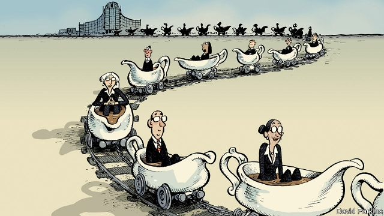

###### All aboard the gravy train

# A consulting firm founded by an outgoing commissioner tests the rules 

 

> print-edition iconPrint edition | Europe | Aug 10th 2019 

COME NOVEMBER 1ST, 17 of the 28 European commissioners, one per EU member state, will be thumbing through their Rolodexes in search of their next job. (The rest have either been nominated for another term or won seats in the European Parliament.) Germany’s outgoing commissioner, Günther Oettinger, has wasted no time. At the end of July news broke that he had founded a political-consulting firm in Hamburg, where he plans to work after leaving office. 

Mr Oettinger’s foray into political consulting has provided a test case for rules on commissioners’ post-term activities, which were recently revamped by the current European Commission president, Jean-Claude Juncker. The rules were tightened after his predecessor, José Manuel Barroso, who presided over the commission at the peak of the Greek sovereign-debt crisis, accepted a non-executive role at Goldman Sachs, an investment bank that is said to have profited from disguising the extent of Greece’s debt. 

The passage leading from the Berlaymont building, the commission’s headquarters in Brussels, into political advisory work for corporate clients is well-trodden. One-third of the commissioners who served during Mr Barroso’s second presidential term took up lucrative positions at corporate giants, including ArcelorMittal, Volkswagen and Bank of America Merrill Lynch. One of them, Neelie Kroes, a former commissioner for competition and digitalisation, now sits on the public-policy advisory board of Uber, after having criticised Germany’s court-imposed ban of the taxi-hailing app while in office. 

Both Mr Barroso and Ms Kroes took up their corporate positions following an 18-month embargo on lobbying work prescribed by the code of ethics for commissioners. Under Mr Juncker’s new rules, this cooling-off period has been extended to two years for commissioners and three for the president. This is still a short spell by the standards of some countries. Many admire the Canadian system, which prohibits ministers and MPs from lobbying for five years after leaving office. 

More troubling is the proviso that the cooling-off period applies only to matters related to a commissioner’s former portfolio. Corporate Europe Observatory, a campaign group, claims this is an artificial distinction, because commissioners discuss major policy decisions among themselves before assuming collective responsibility. It is also unclear how this rule would be applied to Mr Oettinger. He is currently responsible for the EU’s budget, which funds all areas of the bloc’s activity. 

Transparency International, a good-governance watchdog, points to another problem. Under current rules, deciding whether Mr Oettinger’s consulting venture breaches the code of ethics will fall to the other sitting commissioners, his longtime colleagues, a few of whom may be exploring similar opportunities. Mr Juncker has requested a purely advisory opinion from a three-person ethics committee, but it has been appointed by the commissioners themselves. Commissioners are unlikely to be deterred by existing sanctions, which range from a public rap on the knuckles to losing their EU pension of around €55,000 ($62,000) a year. They can expect a lot more than that in the corporate world. ■ 

