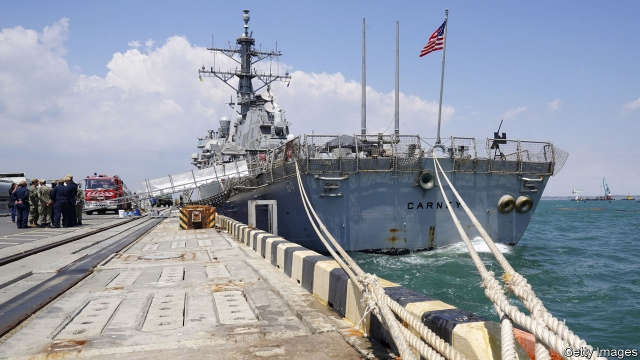
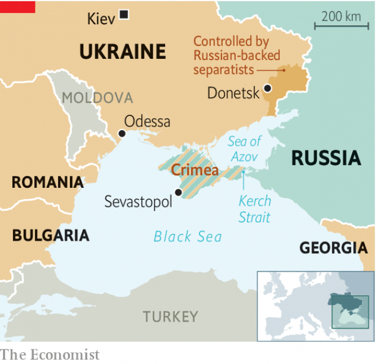

###### Gunboat diplomacy

# America and its allies are helping Ukraine to get its sea legs back 

 

> print-edition iconPrint edition | Europe | Aug 10th 2019 

DRIFTING GENTLY, USS Carney floats in the Black Sea. Two Russian warships and the odd dolphin lurk nearby. Then the order is given: “Release the killer tomato.” Several warships line up alongside the 9,000-tonne destroyer, as though at a shooting gallery. A gigantic inflatable cube, garishly true to its name, is hoisted over the edge of Carney into the still waters. The frigate Hetman Sahaydachniy, the pride of Ukraine’s navy, takes the first potshots. On Carney’s bridge, a young sailor seated at a screen with arcade-style joysticks unleashes a burst of fire from the ship’s remote-controlled cannon. HMS Duncan, a British destroyer, goes next. The balloon shrivels as shells thump into the water. The tomato is duly squashed. 

The target practice is part of the annual Sea Breeze exercise, led by America and Ukraine, now in its 19th iteration. The exercise posits that the nefarious state of Blackland, a behemoth to the east, is fuelling an insurgency in Maroonland, a breakaway province of Roseland. Ukraine, America, Romania, Bulgaria and Georgia play the good guys. One of NATO’s standing fleets, led by a Canadian frigate, stands in for the foes. The scenario requires little imagination. Since Russia’s annexation of Crimea and invasion of eastern Ukraine in 2014, 13,000 people have died. Four Ukrainian soldiers died in a rocket attack on August 6th. 

That war explains why Ukraine’s naval contribution to the drills has thinned out in recent years. Ukraine’s navy, which was headquartered in the Crimean port of Sevastopol, lost three-quarters of its personnel and warships virtually overnight. In the wardroom of Hetman Sahaydachniy, a Ukrainian officer gestures to a silver plaque which documents the ship’s eight captains since 1993. Two names have been scratched out. “They were traitors,” says the officer bitterly. “One of them was appointed chief of the navy. The next day we realised he had defected to Russia. It was a blow to the head.” Another setback came last November when Russia rammed and seized two Ukrainian gunboats and a tug attempting to enter the Sea of Azov, a body of water shared between them. 

Ukraine is now rebuilding. Its short-term goal is a “mosquito fleet” of small, agile and affordable vessels to deter Russia in coastal waters, rather than big and expensive warships for the high seas. Two shiny new patrol boats, bristling with guns, sat in Odessa’s harbour on the country’s naval day on July 7th. Stepan Poltorak, Ukraine’s new minister of defence, and Vice-Admiral Lisa Franchetti, commander of America’s Europe-based Sixth Fleet, clambered into one and cruised off. That is a vital relationship for Mr Poltorak. In the past four years 92% of Ukraine’s military assistance has come from America. This includes two patrol boats presented in 2018, with another pair due shortly. America is also beefing up Ukrainian naval facilities east of Odessa to take larger foreign warships. 

 

However, Ukraine needs more than arms. Its military culture prefers top-down orders and centralised planning to the initiative and autonomy favoured in NATO armed forces. “We still see remnants of the Soviet command structure,” says a Swedish officer who is mentoring the Ukrainians in the operations centre of the exercise. “We’re trying to teach an old dog new tricks.” He says that corruption seems to be down and the work ethic up. In past years, the operations room would shut down in the afternoon. “Some saw it as a vacation down here.” Now it runs around the clock, with Ukrainian officers doing more of the heavy lifting. 

American and European support for Ukraine reflects a wider Western concern about the balance of power in the Black Sea. Russia had sent only one new warship to its Black Sea fleet between 1991 and 2014, says Dmitry Gorenburg, an expert at the Centre for Naval Analyses, a think-tank, leaving it “barely functional”. But since the seizure of Crimea Russia has put the fleet on steroids, adding half a dozen new submarines, three frigates and a slew of missile-toting boats. It has also stuffed Crimea full of missiles, including the S-400 air-defence system, making it far riskier for foreign ships and planes in wartime. 

That is changing. Carney’s visit to the Black Sea was the fifth by an American warship this year. Ships from NATO’s standing fleets spent 120 days there in 2018, up from 39 in 2014 and 80 in 2017. There is a limit to such naval shows of force; the Montreux Convention, which dates back to 1936, sets caps on the number, tonnage and length of stay of foreign warships in the Black Sea. But there is pushback on land, too. In June the Pentagon announced a fresh $250m in military aid for Ukraine, bringing the total to $1.5bn over the past five years. In July America moved Reaper surveillance drones from Poland to Romania, putting the whole Black Sea within reach. And from October a Romanian will serve as NATO’s deputy secretary-general—the first official from a Black Sea littoral state to do so in nearly five decades. Those are comforting thoughts for Ukraine’s sailors. ■ 

