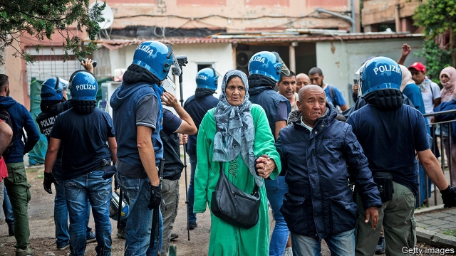

###### Turning into a trickle

# Migrant arrivals in Italy have tumbled 

 

> print-edition iconPrint edition | Europe | Aug 10th 2019 

ABDUL AZIZ, a tall, strongly built young man, falls silent and looks down. He has been describing how the Taliban spread their influence through his part of the tribal areas bordering Afghanistan. His father defied them. “They killed my father,” he says, tears welling up in his eyes. 

The 24-year-old Pakistani farmer is standing in the courtyard of Malala Yousafzai House, a few hundred metres from the border between Italy and Slovenia. The house, a former revenue-guard barracks, is an initial reception centre for Italy’s unnoticed migrants: the thousands who enter the country by slipping across the heavily wooded nearby frontier after a gruelling journey from Asia that sometimes takes years. Abdul Aziz’s most frightening moment was on the Iranian-Turkish border when he came under fire. “They shoot people there,” he says. 

Once in the Balkans, migrants become counters in a game of snakes-and-ladders: Slovenian police who catch people trying to go across the country send them back down to Croatia, where they are once more expelled, to either Serbia or Bosnia. Undeterred, most of them simply turn round and try again. Marco Albanese, who runs the centre for the Italian Consortium of Solidarity (ICS), an NGO, says some people he has taken in have been pushed back across a frontier 15 times. 

While Italy’s deputy prime minister and interior minister, Matteo Salvini, has focused attention on the arrival by sea of mostly sub-Saharan African migrants on the southern coast, larger—though still modest—numbers have been entering the country from the other end. Mr Salvini’s policy of closing Italy’s ports to NGOs’ rescue boats has helped more than double support for his party, the Northern League. But his achievement is less significant than he makes out. The previous, centre-left government had already drastically reduced the number of arrivals from the Mediterranean, and some still manage to get to Italy, usually on fishing boats or yachts. According to the International Organisation for Migration, a UN body, in the year to July 20th, 3,365 people had reached Italy’s southern shores. 

At the ICS’s headquarters in Trieste, its president, Gianfranco Schiavone, says that over the same period his organisation alone took in 1,192 people—most of them from Pakistan, Afghanistan and Iraq. That was almost double the number in the first seven months of 2018. In June, the increase prompted Mr Salvini to talk of building a wall (the frontier is, however, a not inconsiderable 230km, or 140 miles, long). “We’ll launch mixed patrols with the Slovenians in July but, if the flow of migrants doesn’t stop, then extreme evils require extreme remedies,” he declared. 

The ICS is not the only voluntary group receiving migrants in the area, and Mr Schiavone notes that their combined total of perhaps 2,000 arrivals so far this year takes no account of the many who seek to avoid all contact with either NGOs or the authorities for fear of being registered in Italy. Under the EU’s so-called Dublin Regulation, asylum-seekers are the responsibility of the first country to record their presence. “Invisible migrants”, as Mr Schiavone calls them, try to slip unnoticed through Italy to countries with more of their compatriots, or to richer countries with better job opportunities and welfare provision. But even among those who are registered in Italy, many still prefer to leave for other EU member states. 

That explains a second migrant flow that has passed almost unnoticed: that of the dublinati, as they are known in Italy. These are migrants who were registered in Italy, moved on to other EU states, were picked up and returned to Italy. 

At dusk, in the shadow of Rome’s hyper-modern Tiburtina railway station, volunteers from another NGO, Baobab Experience, have just finished doling out food from a makeshift soup-kitchen to scores of Africans who are starting to bed down in the open. There was until recently an encampment on a nearby disused bus park where the migrants could pitch tents, but it was broken up on Mr Salvini’s orders. Most of the migrants are without papers. Some have dodged registration. Others have failed in their bid for asylum. Many are heading north. But not all: one man, who declined to give his name, said he had been caught without papers in France and returned to Italy. Andrea Costa of Baobab Experience says that in the previous 12 months the number of dublinati turning up at the soup-kitchen has increased tenfold. 

According to the EU, there were 6,351 transfers to Italy last year. But that was less than a tenth of the number Italy was actually asked to take back. As Matteo Villa, of Italy’s Institute for International Political Studies, wrote in an article for Politico, a website, “Once migrants move to another EU country…it is very hard to send them back.” Many go to ground after being stopped. Officials in the country of arrival (Italy, in this case) can use bureaucracy to slow the process. And after six months the migrants become the responsibility of their new host state, giving a strong incentive for foot-dragging. 

According to Mr Salvini’s own ministry, more than a quarter of a million immigrants who have entered the EU since 2015 through Italy (out of a total of around 480,000) have already been found in other member states, having somehow managed to cross borders ostensibly closed by France, Austria and Switzerland. He and other Italian politicians rail incessantly at the Dublin regime, arguing that it places an unfair burden on the EU’s frontier nations and that what is needed is a comprehensive system for the redistribution of migrants. In fact, despite Mr Salvini’s rhetoric, the “burden” is quietly shifting itself. ■ 

