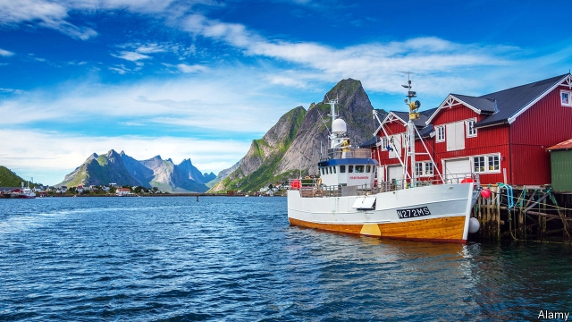

###### Cod awful

# Norway has haddock enough of fish smugglers 

 

> print-edition iconPrint edition | Europe | Aug 10th 2019 

AT MOST INTERNATIONAL borders the authorities look for anything they think smells fishy: drugs, weapons, cigarettes or alcohol. In Norway they also look for fish. This summer, Norwegians are worrying that tourists are depleting their crystal-clear waters and smuggling their catch out of the country. 

Popular prejudice says that the typical fish-smuggler is a beer-bellied German. But new statistics show that Ukrainians, Czechs, Poles, Lithuanians and Belgians are the true scoundrels. Border guards seized eight tonnes of illegal catch from vehicles driven by people from those countries in the first six months of this year. 

Visitors to Norway are allowed to take home 10kg of their catch (salmon, trout and char are not counted), and double that if they fish with a licensed tourist company. The current bout of turistfisk  activity, as the phenomenon is known, suggests many are going far past that limit. In recent weeks officials have caught dozens of cars and motorhomes laden sometimes with 100kg or more of fish, mainly cod. 

Officials refuse to be drawn on whether the smugglers are simply enthusiastic holidaymakers, or part of a bigger racket. But the fact that some of those caught in the trawl have been exporting fillets ready for consumption rather than fresh fish suggests they may be organised, and are trying to evade Norway’s systems of licences and controls for commercial fishing. 

In an attempt to stop the piscine flow, spot-checks have increased, says Geir Pollestad, a Centre Party MP and chairman of the Norwegian parliament’s committee for business and industry. Prosecutors have also doubled the fines for smuggling. 

Norwegians increasingly see tourists as a problem, not a boon. Cruise ships bring thousands to tiny villages at the heads of hitherto pristine fjords. Nusfjord, in the northern archipelago of Lofoten, has already set a limit of two tourist coaches a day. “We’ve had enough of people coming here and leaving nothing but shit and pollution,” says one resident. A growing number of politicians support a tourist tax. The idea would be to raise money while deterring those tourists who strain infrastructure but spend no money. Now that tourists are after precious Norwegian fish, perhaps parliament will bite.■ 

