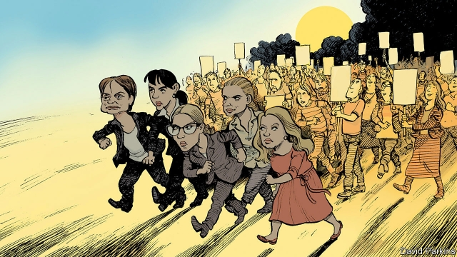

###### Charlemagne

# The eastern summer 

 

> print-edition iconPrint edition | Europe | Aug 10th 2019 

EUROPE IS PREPARING to mark 30 years since the fall of communism. On August 19th Angela Merkel will travel to Sopron. With Viktor Orban, Hungary’s authoritarian prime minister, she will commemorate the anniversary of a peace protest on the border between Hungary and Austria that helped chisel the first chink in the Iron Curtain. The event will have a grotesque quality: a German chancellor celebrating the rebirth of democracy alongside a leader who is systematically dismantling democratic institutions in his country. And it will doubtless lift the curtain on an autumn of commentary lamenting the failed promise of 1989. Expect doleful references to Europe’s new east-west cleavage and sardonic asides about the predicted “end of history”. 

The images from Sopron will not do central and eastern Europe justice. Democracy and liberal values have indeed come under attack in the region. The Economist Intelligence Unit (a sister of The Economist) finds that since 2006 democracy has deteriorated more there than in any other part of the world. And yet there have been quite a few glints of hope—especially in the past few months. 

The prelude to this “eastern European summer” came in March with the election of Zuzana Caputova, a liberal anti-corruption campaigner, as president of Slovakia. She has since stood up for independent judiciaries and publicly rebuked Mr Orban’s illiberal abuses in neighbouring Hungary. April brought a presidential election in North Macedonia in which nationalists were defeated by the Social Democrats, who had just settled a long-running dispute with Greece over the country’s name in order to pave the way for EU membership. And May brought wins for pro-European moderates in the Latvian and Lithuanian presidential elections. 

Slightly further afield, in June a re-run of the Istanbul mayoral election put an opponent of President Recep Tayyip Erdogan at the helm of Turkey’s largest city, confirming that the autocratic leader’s grip on the country is faltering and prompting breakaways from his political party. Czechs protested in the largest demonstrations since the fall of communism—some 250,000 marched in Prague—after Andrej Babis, the prime minister, was charged with fraud and appointed a crony as justice minister. Protests also burst onto the streets of Moldova, where an “anti-oligarch” coalition ultimately ousted Vladimir Plahotniuc’s crooked regime, and onto the streets of Georgia in opposition to Russia’s ongoing occupation of parts of the country. In July, across the Black Sea, Romanians and Bulgarians also staged demonstrations: the former over police incompetence and the latter over cronyism in the judiciary. Ukraine’s parliamentary election delivered the only absolute majority in its post-communist history for Volodymyr Zelensky, a former comedian promising to tackle corruption and to anchor the country to the West. 

Now Moscow is centre-stage. On July 27th some 20,000 people took to the streets, the largest demonstration there since 2012. Vladimir Putin’s approval ratings are sinking. So are real wages. The surge of patriotism that followed Mr Putin’s annexation of Crimea, part of Ukraine, has faded. And Muscovites are bridling at an upcoming election in which non-approved independent candidates will be barred from the ballot. Another protest on August 3rd saw thousands return to the streets, despite the threat of arbitrary beatings and imprisonment. One major figure in the Russian opposition is Lyubov Sobol, an anti-corruption campaigner. Women are at the heart of many of the rebellions against the strongmen. Ms Sobol, who has now been arrested, and Ms Caputova are two. Others include Canan Kaftancioglu, a leading force in the Turkish opposition; Laura Kovesi, a Romanian graft-buster set to become the EU’s first public prosecutor; and Barbara Nowacka, who led women’s protests against reactionary social reforms in Poland. 

To be sure, this is no new 1989. The encouraging protests and election results mostly concern local issues—though they have common factors, such as lots of young people and a pro-EU bent. Poland’s election, set for October 13th, will probably see the governing populists triumph. Mr Orban is going nowhere. Mr Babis is still riding high in the polls. It is far from clear that Mr Zelensky will break from Ukraine’s oligarch-dominated past. In Russia and Turkey change is most likely to come from shifts within the ruling party, albeit ones that may be catalysed by street protests. 

And yet the events of this summer prove many of the western European clichés about eastern Europe wrong. States scarred by communism are not incapable of producing strong civil-society movements. Slavs and Turks do not have some innately “Asiatic” preference for authoritarian leadership. Nothing lasts forever. History never ended. 

Eastern Europe’s liberal marchers and voters deserve more support from the continent’s west. While protesters on the streets of Moscow are being beaten and countries like Ukraine and Georgia are striving for independence, Germany is embracing NordStream2, an unnecessary gas pipeline tailored to the Kremlin’s geopolitical and financial interests. Meanwhile Mrs Merkel and Emmanuel Macron are pouring cold water on North Macedonia’s hopes of joining the EU. The union spends far too much of its budget on misguided priorities like farm subsidies, and not enough on supporting independent media and civil-society organisations on its fringes. Dissenting voices in countries like the Czech Republic, Romania and Turkey receive scant coverage from western European politicians and journalists. That should change. 

To assume eastern Europe is all Orbans, Erdogans and Putins is to do the region a grave injustice. This summer has proved that eastern Europe is in fact teeming with democrats and liberals willing to put their own interests on the line for their cause. If the EU stands for anything, if it truly values the promise of 1989, it will stand by them. ■ 

-- 

 单词注释:

1.Charlemagne['ʃɑ:lә'mein]:查理曼大帝(742-814, 世称 Charles the Great或Charles I, 768-814为法兰克王, 800-814为西罗马帝国皇帝) 

2.Aug[]:abbr. 八月（August） 

3.angela['ændʒilә]:n. 安吉拉（女子名） 

4.merkel[]: [人名] 默克尔; [地名] [美国] 默克尔 

5.Sopron[]:n. (Sopron)人名；(俄)索普龙 

6.Viktor[]:维克托（人名） 

7.orban[]: [人名] 奥尔班 

8.authoritarian[ɒ:.θɒri'tєәriәn]:a. 独裁的, 独裁主义的 

9.commemorate[kә'memәreit]:vt. 纪念 

10.Hungary['hʌŋgәri]:n. 匈牙利 

11.Austria['ɒstriә]:n. 奥地利 

12.chisel['tʃizәl]:n. 凿子 v. 凿, 刻, 雕凿, 欺骗 

13.chink[tʃiŋk]:n. 裂口, 裂缝, 弱点, 叮当声 vt. 使叮当响 vi. 堵裂缝, 叮当响 

14.grotesque[grәu'tesk]:n. 奇异风格, 怪异图案 a. 奇怪的, 可笑的 

15.chancellor['tʃɑ:nsәlә]:n. 大臣, 总理, 首相, 大使馆/领事馆的一等秘书, 司法官, 大学校长 

16.rebirth[.ri:'bә:θ]:n. 再生, 复活, 新生 

17.systematically[.sisti'mætikli]:adv. 有系统地, 有组织地, 有条理地 

18.dismantle[dis'mæntl]:vt. 拆除...的设备, 分解, 去除覆盖物 

19.commentary['kɒmәntәri]:n. 注释, 评论, 说明 [法] 注释, 评注, 评论 

20.lament[lә'ment]:n. 悲叹, 悔恨, 恸哭, 挽歌, 悼词 vt. 哀悼 vi. 悔恨, 悲叹 

21.doleful['dәulful]:a. 悲哀的, 忧郁的, 阴沉的 

22.cleavage['kli:vidʒ]:n. 劈开, 裂片, 分裂 [化] 解理 

23.sardonic[sɑ:'dɒnik]:a. 嘲笑的, 冷笑的, 讥讽的 [医] 痉笑的 

24.economist[i:'kɒnәmist]:n. 经济学者, 经济家 [经] 经济学家 

25.deteriorate[di'tiәriәreit]:v. (使)恶化 

26.glint[glint]:n. 闪光, 一闪 vi. 闪耀, 闪闪发光, 反射, 迅速移动 vt. 使发光, 使闪光 

27.prelude['prelju:d]:n. 前奏, 序幕, 序诗, 前奏曲 vi. 作为前奏 vt. 作为...的开头 

28.zuzana[]:[网络] 健身教练祖札娜；张虹；捷克的正妹祖札娜 

29.campaigner[kæm'peinә]:n. 从军者, 老兵, 竞选者 

30.Slovakia[slәu'vækiә]:n. 斯洛伐克 

31.judiciary[dʒu:'diʃiәri]:a. 司法的, 法院的, 法官的 n. 司法部, 司法系统, 法官 

32.rebuke[ri'bju:k]:n. 指责, 谴责, 非难 vt. 斥责, 指责, 制止 

33.illiberal[i'libәrәl]:a. 狭隘的, 无教养的, 吝啬的 

34.presidential[.prezi'denʃәl]:a. 总统制的, 总统的, 首长的, 统辖的 [法] 总统的, 议长的, 总经理的 

35.Macedonia[,mæsi'dәunjә]:n. 马其顿 

36.nationalist['næʃәnәlist]:n. 国家主义者, 民族主义者 

37.democrat['demәkræt]:n. 民主人士, 民主主义者, 民主党党员 [经] 民主党 

38.EU[]:[化] 富集铀; 浓缩铀 [医] 铕(63号元素) 

39.membership['membәʃip]:n. 会员的资格, 全体会员, 会员数目 [法] 会员资格, 成员资格, 会籍 

40.Latvian['lætviәn]:a. 拉脱维亚的 n. 拉脱维亚人, 拉脱维亚语 

41.Lithuanian[.liθju:'einiәn]:n. 立陶宛人 a. 立陶宛的, 立陶宛人的, 立陶宛语的 

42.afield[ә'fi:ld]:adv. 离开着, 偏离着, 在战场上 

43.Istanbul[.istæn'bu:l]:n. 伊斯坦布尔 

44.mayoral['mєәrәl]:a. 市长的 

45.recep[]:n. (Recep)人名；(土)雷杰普 

46.tayyip[]:[网络] 塔伊普 

47.erdogan[]:[网络] 埃尔多安；土耳其总理埃尔多安；艾尔多安 

48.helm[helm]:n. 舵, 驾驶盘, 枢机, 头盔 vt. 给...掌舵, 指挥, 给...戴头盔 

49.autocratic[.ɒ:tә'krætik]:a. 独裁的, 专制的 

50.falter['fɒ:ltә]:vt. 支吾地说 vi. 支吾, 蹒跚地走 n. 颤抖, 支吾, 踌躇 

51.breakaway[]:n. 脱离, (美)(非正式)一碰就散开/脱落的, 分裂 

52.Czech[tʃek]:n. 捷克人, 捷克语 a. 捷克的, 捷克语的, 捷克人的 

53.demonstration[.demәn'streiʃәn]:n. 示范, 实证 [医] 示教, 实物教授 

54.andrej[]:n. (Andrej)人名；(捷、塞、波)安德烈 

55.Babis[ˈbɑ:bi:z]:n. 巴比教徒 [网络] 巴维斯；巴布派 

56.fraud[frɒ:d]:n. 欺骗, 欺诈, 诡计, 骗子 [经] 欺诈, 舞弊, 骗子 

57.crony['krәuni]:n. 密友, 亲密伙伴, 好朋友 

58.Moldova[mɔl'dɔvɑ:]:n. 摩尔多瓦 

59.coalition[.kәuә'liʃәn]:n. 结合体, 结合, 联合 [经] 联合, 联盟 

60.oust[aust]:vt. 逐出, 罢黜, 剥夺, 驱逐 [法] 驱逐, 剥夺, 免职 

61.Vladimir[vlɑ'dimɪr]:n. 弗拉基米尔（古罗斯弗拉基米尔-苏兹达里公国的古都） 

62.crook[kruk]:n. 钩, 弯曲部分, 坏蛋 vt. 使弯曲, 诈骗 vi. 弯曲 

63.regime[rei'ʒi:m]:n. 政权, 当权期间, 政体, 社会制度, 体制, 情态 [医] 制度, 生活制度 

64.Georgia['dʒɒ:dʒjә]:n. 乔治亚州 

65.opposition[.ɒpә'ziʃәn]:n. 反对, 敌对, 相反, 在野党 [医] 对生, 对向, 反抗, 反对症 

66.ongoing['ɒngәuiŋ]:a. 前进的, 进行的, 不间断的 n. 前进, 发展 

67.Romanian[ru:'meiniәn]:n. 罗马尼亚人, 罗马尼亚语 a. 罗马尼亚的 

68.bulgarian[bʌl'ɡεәriәn]:n. 保加利亚人；保加利亚语 

69.incompetence[in'kɔmpitәns]:n. 不胜任, 不够格, 不合格, 不适合, 无能力, 不熟练, 无资格 [医] 机能不全, 闭锁不全, 关闭不全 

70.cronyism['krәjniizəm]:n. 任人唯亲 

71.parliamentary[.pɑ:lә'mentәri]:a. 国会的, 议会的, 议会制度的 

72.volodymyr[]:[网络] 昊宇 

73.zelensky[]:[网络] 泽伦斯基 

74.comedian[kә'mi:djәn]:n. 喜剧演员 

75.tackle['tækl]:n. 工具, 复滑车, 滑车, 装备, 扭倒 vt. 固定, 处理, 抓住 vi. 扭倒 

76.corruption[kә'rʌpʃәn]:n. 腐败, 堕落, 贪污 [计] 论误 

77.rating['reitiŋ]:n. 等级, 额定功率, 责骂 [经] 等级评定 

78.surge[sә:dʒ]:n. 巨涌, 汹涌, 澎湃 vi. 汹涌, 澎湃, 颠簸, 猛冲, 突然放松 vt. 使汹涌奔腾, 急放 [计] 电压尖峰 

79.patriotism['peitriәtizm]:n. 爱国心, 爱国精神, 爱国主义 

80.annexation[ænek'seiʃәn]:n. 合并, 附加, 附加物 [法] 兼并, 侵吞, 附加物 

81.Crimea[krai'miә]:n. 克里米亚, 克里米亚半岛 

82.ukraine[ju(:)'krein]:n. 乌克兰（原苏联一加盟共和国, 现已独立） 

83.Muscovite['mʌskәvait]:n. 莫斯科人 [化] 白云母 

84.bridle['braidl]:n. 马勒, 约束 [医] 系带, 约束 

85.upcoming['ʌp.kʌmiŋ]:a. 即将来临的, 即将出现的 

86.ballot['bælәt]:n. 投票, 投票用纸, 抽签 vi. 投票, 抽签 vt. 投票选出, 拉选票 

87.beating['bi:tiŋ]:n. 打, 挫败, 搏动 [化] 打浆 

88.imprisonment[im'priznmәnt]:n. 监禁, 下狱, 坐牢 [法] 监禁, 徒刑, 拘禁 

89.lyubov[]:[网络] 柳博芙 

90.sobol[]: [人名] 索博尔 

91.strongman[ˈstrɒŋmæn]:n. 大力士 

92.canan[]:n. (Canan)人名；(土)贾南；(英)卡南 

93.Turkish['tә:kiʃ]:n. 土耳其语 a. 土耳其的, 土耳其人的, 土耳其语的 

94.laura['lɔ:rә]:n. 劳拉（女子名） 

95.Romanian[ru:'meiniәn]:n. 罗马尼亚人, 罗马尼亚语 a. 罗马尼亚的 

96.prosecutor['prɒsikju:tә]:n. 实行者, 告发者, 公诉人 [法] 原告, 起诉人, 检举人 

97.barbara['bɑ:bәrә]:n. 芭芭拉（女子名） 

98.reactionary[ri'ækʃәnәri]:n. 反动分子 a. 反动的, 反动主义的, 反对改革的 

99.Poland['pәulәnd]:n. 波兰 

100.Populist['pɔpjulist]:n. 民粹派的成员 

101.albeit[ɔ:l'bi:it]:conj. 尽管, 虽然 

102.catalyse[ˈkætəlaɪz]:v. 催化, 促成 

103.incapable[in'keipәbl]:a. 无能力的, 不能的 [机] 不能行的, 耐不住的 

104.slav[slɑ:v, slæv]:a. 斯拉夫人的；斯拉夫语的 

105.Turk[tә:k]:n. 土耳其人, 土耳其马 

106.innately[]:adv. 天赋地；与生俱来的 

107.asiatic[,eiʃi'ætik]:n. 亚洲人 

108.marcher[]:n. 边界地区居民, 行进者, 游行者, 行军者 

109.voter['vәutә]:n. 选民, 投票人 [法] 选民, 选举人, 投票人 

110.protester[]:n. 抗议者, 持异议者, 拒付者 [经] 反对者 

111.strive[straiv]:vi. 努力, 奋斗, 斗争 

112.geopolitical[,dʒi(:)әupә'litikәl]:[计] 地理的 

113.Mr['mistә(r)]:先生 [计] 存储器回收程序, 多重请求 

114.emmanuel[i'mænjuәl]:n. 以马内利（耶稣基督的别称）；伊曼纽尔（男子名, 等于Immanuel） 

115.macron['mækrәn]:n. 长音符号 

116.misguide[mis'gaid]:vt. 误导 

117.organisation[,ɔ: ^әnaizeiʃən; - ni'z-]:n. 组织, 团体, 体制, 编制 

118.fringe[frindʒ]:n. 边缘, 端, 流苏, 穗, 初步 vt. 加穗于, 加饰边于 a. 边缘的, 附加的 

119.dissent[di'sent]:n. 异议 vi. 持异议, 不同意 

120.Czech[tʃek]:n. 捷克人, 捷克语 a. 捷克的, 捷克语的, 捷克人的 

121.Romania[rәu'meinjә]:n. 罗马尼亚 

122.scant[skænt]:a. 不充分的, 不足的 vt. 减少, 吝啬, 限制, 藐视, 忽略 

123.coverage['kʌvәridʒ]:n. 覆盖的范围, 保险总额, 新闻报导 [化] 可达范围; 覆盖度 

124.orban[]: [人名] 奥尔班 

125.erdogan[]:[网络] 埃尔多安；土耳其总理埃尔多安；艾尔多安 

126.putin['putin]:n. 普京（人名） 

127.injustice[in'dʒʌstis]:n. 不公平, 非正义的行为 [法] 不公正, 不公平, 权利侵害 

128.teem[ti:m]:vi. 充满, 充足, 倾注 vt. 倒出 

