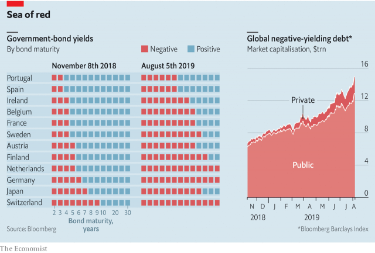

###### Under water

# As yields turn negative, investors are having to pay for safety 

 

> print-edition iconPrint edition | Finance and economics | Aug 10th 2019 

PENGUINS ON A melting icecap must choose between budging up tighter and taking the plunge. Institutional investors such as pension funds and insurers now face a similar unappealing choice, with ever-fewer safe assets that do not lose them money. According to an index calculated by Bloomberg, a quarter of the bonds issued by governments and companies worldwide are now trading at negative yields. Creditors holding $15trn-worth of securities will make a loss if they hold them to maturity (see chart). 

Yields on many European government bonds turned negative in the mid-2010s as central banks engaged in quantitative easing—colossal bond-purchase programmes. By 2015, 40% of the continent’s sovereign bonds offered negative yields. But as economies perked up, central banks changed course. By November 2018 many European bonds were back above sea level. 

Now many have gone negative once again. France’s ten-year bonds have been flirting with negative yields for two months; they went below zero three weeks ago and stayed there. Ireland followed on August 5th. Fiscally conservative countries like Austria and the Netherlands are well past that point. Spain and Portugal may soon follow, says Iain Stealey of JPMorgan Chase’s asset management division. Germany’s entire yield curve is already submerged. 

As the trade war between America and China intensifies, investors are taking refuge in government bonds, pushing yields down. Meanwhile central banks, fearing a global downturn, are cutting interest rates. Mario Draghi, the president of the European Central Bank, recently hinted that it might ease policy after the summer. 

Central banks have failed to pep up inflation, which has hovered well below the 2% or so targeted by most ratesetters in the rich world. Investors do not think that central banks are on track to nudge inflation up any time soon. Five-year forward swaps, which track investors’ expectations on the matter, currently predict inflation of 0.9% in Europe and 1.7% in America. This contributes to depressed bond yields. Inflation erodes the purchasing power of bonds’ future cash flows, so the higher expectations of future inflation are, the higher the yield investors will demand, and vice versa. 

For now American investors still have somewhere to take refuge. Though yields on ten-year American government bonds have collapsed from their 3.25% peak last November, they are still positive, at 1.71%. Their 30-year equivalent yields 2.25%. That is not much comfort for European investors, who must pay around 3% to hedge against dollar swings. If the Fed eases faster than the ECB—and it has more room to do so—the narrower gap between American and European interest rates would make hedging cheaper, though it would also mean there was less point in buying American. Those investors who already had, however, would stand to gain.■ 

