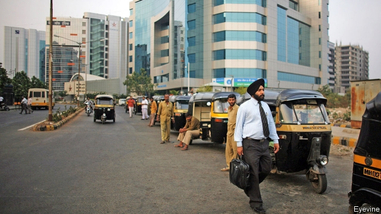

###### On the way to Wall Street

# Core elements of the global banking industry are moving to India 

 

> print-edition iconPrint edition | Finance and economics | Aug 10th 2019 

FINANCIAL CENTRES, like delicate plants, thrive in the right conditions. Those include a vibrant private sector, banks that direct capital based on the prospect for profit, analysts with direct access to companies and investors, openness to foreign people and institutions, and business-friendly, consistent laws. For good measure, throw in the cultural amenities that attract the sorts of employees who could choose to live anywhere. 

India is not such a place. Its laws are many and perplexing; its domestic markets, inefficient and politicised. Though saving is unrewarding, capital is still costly for entrepreneurs. International firms are mostly limited to cross-border activities. It often scores badly on quality of life. 

So it is hardly surprising that although tiny Hong Kong and Singapore are globally renowned centres of finance, Mumbai, India’s financial capital, features low on most rankings. But the country is nonetheless becoming an essential hub for international banks. India is often their second-largest place of employment after their home country, and becoming ever more important for their innovation efforts. 

India has long received other countries’ outsourced jobs. Some of those are unsophisticated, such as answering phones or processing forms. Many, however, rely on Indian universities’ remarkable ability to turn out engineers in great numbers, and computing firms’ ability to use them to solve complex problems. Such tasks may be dismissed as “back-office”. But they are at the heart of modern finance. 

In recent years banks have become global networks that link apps on smartphones, workstations used for sales, and sophisticated programs used to manage compliance and allocate capital. Systems that once merely updated balances now determine financial-product marketing—whom to send offers to, when to increase credit limits and when to adjust charges. For banks all over the world, many such tasks are now done in India. 

Even tasks that would seem to require the personal touch—a trusted adviser pitching a deal to the boss of a client firm, say—may rely on a fact-sheet compiled by an Indian research team overnight. The only things that cannot be done in India are client meetings, says Tuhin Parikh, a senior executive at Blackstone. Since 2014 the buy-out firm has nearly quadrupled the amount of property it leases in India to international financial firms, from 690,000 square feet (64,000 square metres) to 2.7m. 

India’s growing prowess in finance contrasts with its weakness in manufacturing. That is despite constant government intervention, most recently through the “Make in India” campaign launched in 2014 by the prime minister, Narendra Modi. The main difference is that financial firms, unlike manufacturers, are able to avoid many of India’s impediments: a maze of permissions and tariffs that control production, laws supposed to protect low-wage workers that instead discourage hiring, and wretched transport and communications networks. The towers that house international financial firms have dedicated phone and high-speed internet connections, generators to provide backup power and global standards of fire safety. 

Goldman Sachs’s new campus in Bangalore cost $250m. Once inside, a visitor feels he has been transported to the company’s New York headquarters (the same architect designed both). Both have similar amenities, such as subsidised fitness and child-care facilities, as well as a medical office. The number of people Goldman employs in Bangalore has risen from 291 in 2004 to 5,000. And India itself now provides expats, with more than 700 Indians on transfers to the firm’s offices elsewhere. 

In the past few years UBS has opened three new centres in India. The most recent, in the western city of Pune, is in a building shared by Credit Suisse and Alliance and Northern Trust, a stone’s throw from others occupied by Barclays and Citi. Between Mumbai and Pune UBS now has 4,000 employees. A sophisticated recruiting effort looks beyond recent graduates to tap émigrés who might be tempted back home by the right opportunity. 

Among the recent hires are a group of women returning to work after years away to care for children or ageing parents. Their careers have included stints at banks, rating agencies and a global pharmaceutical company, with expertise in risk analysis, quality control and product management. UBS’s research department hires staff with expertise in cloud computing, statistics, machine learning and automation. They have contributed to recent reports using, for example, web-scraping tools to understand trends in the pricing of air-conditioning, geospatial technology to map bank branches and population density, and analysis of corporate filings to map cross-shareholdings of corporations and uncover their vulnerability to a credit crunch. 

UBS is perhaps unusually committed to innovation in India. But any large bank with operations in the country is making significant efforts in similar ways. With hindsight, given its prowess in computer engineering, all this will look obvious. But bankers say they have been startled by how fast India, notwithstanding its local challenges, has become an intellectual force that is now shaping their global futures. ■ 

-- 

 单词注释:

1.Aug[]:abbr. 八月（August） 

2.vibrant['vaibrәnt]:a. 振动的, 战栗的, 响亮的, 活跃的 

3.sector['sektә]:n. 扇形, 部门, 部分, 函数尺, 象限仪, 段, 区段 vt. 把...分成扇形 [计] 扇面; 扇区; 段; 区段 

4.analyst['ænәlist]:n. 分析者, 精神分析学家 [化] 分析员; 化验员 

5.investor[in'vestә]:n. 投资者 [经] 投资者 

6.openness['әupәnnis]:n. 公开；宽阔；率真 

7.cultural['kʌltʃәrәl]:a. 文化的, 教养的, 修养的 [医] 培养的 

8.amenity[ә'mi:niti]:n. 便利设施, 适意, 礼仪 [法] 舒适, 方便, 优雅 

9.perplex[pә'pleks]:vt. 使困惑, 使复杂化, 使为难 [法] 困惑, 使复杂化, 使纠缠不清 

10.politicise[pɒ'lɪtɪsaɪs]:vt. 使政治化, 使具有政治性; 使对政治有兴趣 

11.unrewarding[ˌʌnrɪˈwɔ:dɪŋ]:a. 无报酬的, 不值得做的 

12.entrepreneur[.ɒntrәprә'nә:]:n. 企业家, 主办人 [经] 承包商, 企业家 

13.hong[hɔŋ]:n. （中国、日本的）行, 商行 

14.kong[kɔŋ]:n. 含锡砾石下的无矿基岩；钢 

15.Singapore[.siŋgә'pɒ:]:n. 新加坡 

16.globally[]:[计] 全局地 

17.renowned[ri'naund]:a. 有名的, 有声誉的 

18.mumbai[]:n. 孟买（印度城市） 

19.ranking['ræŋkiŋ]:n. 等级, 地位 a. 上级的, 头等的, 超群的 

20.nonetheless[,nʌnðә'les]:conj. 然而, 尽管, 不过 adv. 不过, 仍然, 尽管如此, 然而 

21.hub[hʌb]:n. 毂, 木片, 中心 [计] 插座; 插孔; 集线器, 集中器, 连接器, 中继站 

22.innovation[.inәu'veiʃәn]:n. 改革, 创新 [法] 创新, 改革, 刷新 

23.outsourced[autˈsɔ:st]:v. 外购（指从外国供应商等处获得货物或服务）； 外包（工程）( outsource的过去式和过去分词 ) 

24.unsophisticated[.ʌnsә'fistikeitid]:a. 不懂世故的, 单纯的, 不精细的, 纯洁的 

25.computing[kәm'pju:tiŋ]:[计] 计算 

26.APP[]:[计] 应用, 应用程序; 相联并行处理器 

27.smartphones[]: 智能手机（smartphone的复数） 

28.workstation['wә:k.steiʃәn]:n. 工作站 [计] 工作站 

29.sophisticate[sә'fistikeit]:n. 久经世故的人, 精于...之道的人 vt. 篡改, 曲解, 使变得世故, 掺合, 弄复杂 vi. 诡辩 

30.compliance[kәm'plaiәns]:n. 遵从, 顺从, 屈从 [化] 柔顺; 顺应 

31.update[ʌp'deit]:vt. 更新, 使现代化 n. 更新 [计] 更新 

32.adviser[әd'vaizә]:n. 顾问, 劝告者, 指导教师 [法] 顾问, 劝告者 

33.client['klaiәnt]:n. 客户, 顾客, 委托人 [计] 客户, 客户机, 客户机程序 

34.cannot['kænɒt]:aux. 无法, 不能 

35.parikh[]:[网络] 帕里克；帕力克 

36.Blackstone[]:n. 百仕通集团（即黑石集团, 全球最大私募基金公司）；布莱克斯通（英国前文化部长）；黑石镇（美国马萨诸塞州的一个镇） 

37.quadruple['kwɒdrupl]:a. 四倍的, 四重的, 四部分组成的 n. 四倍 vt. 使成四倍 vi. 成为四倍 

38.lease[li:s]:n. 租约, 租期, 租 vt. 出租, 租出, 租得 

39.prowess['prauis]:n. 英勇, 勇敢, 超凡技术 

40.manufacturing[.mænju'fæktʃәriŋ]:n. 制造业 a. 制造业的 

41.intervention[.intә'venʃәn]:n. 插入, 介入, 调停 [经] 干预 

42.narendra[]:[网络] 纳伦德拉；纳兰德；纳然陀 

43.MODI['mәudai]:[计] 模块化光学数字接口 

44.maze[meiz]:n. 迷宫, 迷惘 vt. 使迷惘, 使混乱, 迷失 

45.tariff['tærif]:n. 关税, 关税表, 价格表, 收费表 vt. 课以关税 [计] 价目表 

46.wretched['retʃid]:a. 可怜的, 不幸的, 卑鄙的 

47.dedicate['dedikeit]:vt. 献出, 贡献 

48.backup['bækʌp]:n. 倒车, 后退, 后援, 支持, 阻塞 vt. 做备份 a. 候补的, 支持的 [计] 备份; DOS外部命令:通常使用于将硬磁盘上指定的文件复制到软盘上 

49.goldman[]:n. 高曼（姓氏） 

50.Bangalore[,bæŋ^ә'lɔ:]:n. 炸药桶 

51.york[jɔ:k]:n. 约克郡；约克王朝 

52.headquarter[,hed'kwɔ:tә]:vt. 将...的总部设在 

53.subsidise[]:vt. 给...补助金, 津贴, 资助 

54.fitness['fitnis]:n. 适合, 合宜, 合理, 恰当, 健康 [医] 适合性, 适应性 

55.expat[ˈeksˈpeɪt]:v. 逐出国外; 脱离国籍; 放逐; 移居国外 n. 亡命国外者 

56.UB[]:[计] 上限 

57.pune[]:n. 普纳（印度西部城市） 

58.Suisse[swi:s]:<法> = Switzerland 

59.alliance[ә'laiәns]:n. 联盟, 联合 [法] 同盟, 联盟, 联姻 

60.barclay['bɑ:kli]:n. 巴克利（姓氏, 男子名） 

61.citi[]:n. 花旗集团 

62.stint[stint]:vt. 节省, 限制, 停止 vi. 节约 n. 吝惜, 节约, 限额 

63.pharmaceutical[,fɑ:mә'sju:tikәl]:a. 药学的, 制药的, 药用的, 药物的, 药剂师的, 药师的 n. 药品, 成药, 药剂 

64.expertise[.ekspә:'ti:z]:n. 专家意见, 专门技术 [法] 专门知识, 专家意见 

65.statistic[stә'tistik]:n. 统计量 a. 统计的, 统计学的 

66.geospatial[]:n. 地理空间 

67.corporate['kɒ:pәrit]:a. 社团的, 合伙的, 公司的 [经] 团体的, 法人的, 社团的 

68.filing['failiŋ]:n. 锉, 琢磨, 锉屑 [计] 编档; 文件编排 

69.vulnerability[.vʌlnәrә'biliti]:n. 易受伤, 易受责难, 易受伤部位 [医] 易损性 

70.crunch[krʌntʃ]:v. 嘎吱嘎吱的咬嚼, 压碎, 嘎吱嘎吱地踏过 n. 咬碎, 咬碎声 

71.hindsight['haindsait]:n. 枪的表尺, 事后聪明 

72.banker['bæŋkә]:n. 银行家, 庄家 [经] 银行业者, 银行家 

73.notwithstanding[.nɒtwiθ'stændiŋ]:adv. 虽然, 尽管 prep. 尽管 conj. 虽然 

