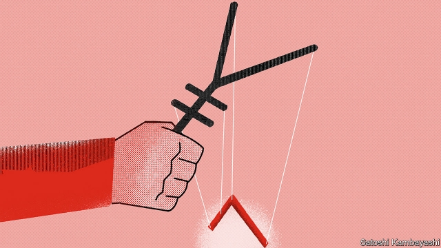

###### Buttonwood

# How yuan-dollar became the world’s most closely watched asset price 

 

> print-edition iconPrint edition | Finance and economics | Aug 8th 2019 

A  PRINCIPLE FOLLOWED by traders who speculate on short-term movements in market prices is “cut your losses early”. This doctrine finds expression in the stop-loss—an order to sell a security, such as a company share, automatically when it hits a predetermined price. People being people, stop-loss orders tend to cluster at salient levels, such as whole or round numbers. They might instruct a broker to sell the pound at $1.20, say, or sell Apple at $200. 

The round-number fetish is a strange one. But when a situation is uncertain (and financial markets are always uncertain) arbitrary numbers or thresholds are often charged with great meaning. And few have had the significance of seven yuan per dollar. So when the yuan broke through seven on August 5th, it prompted a violent sell-off in stocks and a rally in bonds. That was followed by a formal charge by the US Treasury that China was manipulating its currency. 

On the face of it, that looks like an overreaction. If things were fine when the yuan was at 6.99, why did all hell break loose when it reached 7.01? Odder still is the idea that a currency that has only fairly limited use outside China is suddenly a prime mover in global capital markets. Yet China’s heft in the world economy has made it so. The yuan-dollar exchange rate is now the world’s most watched asset price. And “seven” mattered simply because people had come to believe that it did. 

To understand why, go back four years. Until August 2015 the yuan had been closely tied to the dollar. Since then its external price has been set by officials each day, ostensibly by reference to a basket of currencies. The idea is that the yuan’s value should somewhat reflect market forces. The outcome is that the yuan has moved in a limited range against the dollar, capped at seven. Were the yuan to surge, it would hurt China’s exports; were it to plummet, the dollar debts of Chinese firms would loom larger. A large fall would intensify an ever-present fear: devaluation and capital flight. 

The yuan is still a long way from being a free-floating currency. It is further away still from being a global one to rival the dollar. It is not a straightforward business to buy and sell yuan. Traders joke that it is less liquid than the shares of Alibaba, a giant Chinese e-commerce firm, which is listed in New York. Yet despite the constraints, the waxing and waning of the yuan’s value has had a growing influence on the foreign-exchange market and on asset prices more generally. 

This is in large part because the currencies of economies that do a lot of trade with China have tended to move in tandem with the yuan. Its clout owes much to China’s weight in the global economy, but also to its gravity in export markets. When the yuan moves, it imparts news about global trade. The message is quickly picked up by the currencies of other export-oriented economies, not only in Asia but in Europe too. 

It is not wholly surprising, then, that President Donald Trump’s trade war with China has bled into a conflict over the yuan-dollar exchange rate. Reports from China in recent months suggested that it had become a sticking point in the stalled trade negotiations. The governor of China’s central bank even dropped a public hint in June that there was no red line at seven. America’s treasury secretary, Steven Mnuchin, countered that if China gave up supporting the yuan, it might be interpreted as an attempt to weaken it. That is one reason why crossing seven caused such a fuss. 

But there are others. The yuan-dollar exchange rate has become a gauge of global risk appetite. A weak yuan is often associated with weakness in a host of other important currencies, including the euro. The result is a strong dollar. That in turn squeezes global credit, because many countries and companies beyond America’s borders borrow in dollars. One consequence is slower global GDP growth. Another is that money tends to flow out of riskier sorts of securities, such as stocks and emerging-market bonds, into safer assets such as Treasury bonds. 

Arbitrary numbers often take on a life of their own in financial markets. China bears some blame in this instance. It has a penchant for control and opaque policymaking. Left to their own devices, investors start to impute greater significance to key thresholds. Officials follow their lead. The markets had become used to the yuan trading in a familiar range. It is not clear what the new rules are. The only thing that is certain is that yuan-dollar remains the asset price to watch.■ 

-- 

 单词注释:

1.buttonwood['bʌtnwʊd]: 美洲悬铃木 

2.asset['æset]:n. 资产, 有益的东西 

3.Aug[]:abbr. 八月（August） 

4.trader['treidә]:n. 商人, 商船 [经] 交易者, 商船 

5.speculate['spekjuleit]:vi. 深思, 推测, 投机 [经] 投机 

6.doctrine['dɒktrin]:n. 教条, 学说 [医] 学说 

7.predetermine[.pri:di'tә:min]:vt. 预先决定, 预先查明 [经] 预定的, 先定的 

8.cluster['klʌstә]:n. 串, 丛, 群, 簇 vi. 成串, 丛生 vt. 使聚集 [计] 簇 

9.salient['seiliәnt]:a. 显著的, 突出的, 跳跃的 n. 凸角, 突出部分 

10.broker['brәukә]:n. 掮客, 经纪人 [经] 经纪人, 掮客 

11.fetish['fi:tiʃ]:n. 物神, 偶像, 迷信 [医] 恋物对象 

12.alway['ɔ:lwei]:adv. 永远；总是（等于always） 

13.threshold['θreʃәuld]:n. 门槛, 入口, 开端, 阈 [计] 阈; 阈值 

14.rally['ræli]:n. 重振旗鼓, 集合, 群众集会, 跌停回升 v. 重整旗鼓, 集合, 恢复精神, 团结, 挖苦, 嘲笑 

15.treasury['treʒәri]:n. 国库, 宝库, 财政部, 国库券 [经] 库存, 国库, 金库 

16.manipulate[mә'nipjuleit]:vt. 操纵, 利用, 操作, 巧妙地处理, 假造 

17.overreaction[]:[经] 反应过度 

18.odder[ɔdə]:a. 奇怪的( odd的比较级 ); 临时的; 奇数的; 不固定的 

19.mover['mu:vә]:n. 移动的人, 原动力, 鼓动者 

20.heft[heft]:n. 重量, 影响, 重要性 vt. 举起试重量, 举起 vi. 称重量 

21.ostensibly[]:adv. 可公开, 显然, 表面, 外表, 诡称, 假装 

22.surge[sә:dʒ]:n. 巨涌, 汹涌, 澎湃 vi. 汹涌, 澎湃, 颠簸, 猛冲, 突然放松 vt. 使汹涌奔腾, 急放 [计] 电压尖峰 

23.plummet['plʌmit]:n. 测深锤, 铅坠 vi. 垂直落下 

24.loom[lu:m]:n. 织布机, 若隐若现的景象 vi. 朦胧地出现, 隐约可见, 可怕地出现 

25.intensify[in'tensifai]:vt. 加强 vi. 强化 

26.devaluation[,di:vælju'eiʃәn]:n. 降低价值, 贬值 [经] 贬值 

27.les[lei]:abbr. 发射脱离系统（Launch Escape System） 

28.alibaba[]:n. 阿里巴巴（公司名） 

29.york[jɔ:k]:n. 约克郡；约克王朝 

30.constraint[kәn'streint]:n. 强制, 约束 [计] 约束 

31.wane[wein]:n. 减少, 衰微, 败落, 亏缺, 月亏 vi. 变小, 亏缺, 衰落, 消逝, 退潮 

32.tandem['tændәm]:adv. 一前一后地, 纵排地 a. 纵排的, 串联的 n. 纵列两匹马拉的马车, 前后纵列的两匹马, 串座双人自行车 

33.clout[klaut]:n. 敲击, 破布 vt. 打补钉 

34.impart[im'pɑ:t]:vt. 给予, 传授, 告知 

35.quickly['kwikli]:adv. 很快地 

36.stall[stɒ:l]:n. 厩, 停车处, 牧师职位, 货摊, 托辞, 拖延 vt. 关入厩, 停顿, 推托, 支吾, 使陷于泥中 vi. 被关在厩内, 陷于泥中, 停止, 支吾 

37.negotiation[ni.gәuʃi'eiʃәn]:n. 谈判, 磋商, 交涉 [经] 谈判, 协商 

38.treasury['treʒәri]:n. 国库, 宝库, 财政部, 国库券 [经] 库存, 国库, 金库 

39.steven['sti:vn]:n. 史蒂文（男子名） 

40.fuss[fʌs]:n. 大惊小怪, 小题大作, 忙乱 vi. 无事自扰, 焦急, 焦燥, 忙乱 vt. 使激动, 使烦燥 

41.euro['juәrәu]:n. 欧元（欧盟的统一货币单位） 

42.risky['riski]:a. 危险的 

43.penchant['pә:ŋʃә:ŋ]:n. 爱好, 嗜好 

44.opaque[әu'peik]:n. 不透明物 a. 不透明的, 不传热的, 不传导的, 阴暗的 [计] 白底 

45.policymaking['pɔlәsi,meikiŋ]:[法] 政策制定者, 决策人 

46.investor[in'vestә]:n. 投资者 [经] 投资者 

47.impute[im'pju:t]:vt. 归罪, 使负责, 嫁祸于 

