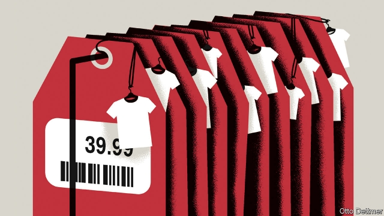

###### Free exchange

# Prices for many goods do not move the way economists think they should 

 

> print-edition iconPrint edition | Finance and economics | Aug 8th 2019 

TWO YEARS ago British chocoholics felt the pinch from the decision to leave the European Union. As sterling tumbled, global firms selling to the British market faced the same production costs as before, but got less money for each sweet sold. Rather than raise the price per chocolate, some chose to shrink the chocolate per price. The famous peaks on a bar of Toblerone grew conspicuously less numerous (though Mondelez, the bar’s maker, said Brexit was not the cause). Other products suffered the same “shrinkflation”: toilet rolls and toothpaste tubes became smaller. The threat of Brexit made the phenomenon more visible, but it is surprisingly common. Statisticians and policymakers need to take note. 

Every first-year economics student quickly becomes familiar with charts of supply and demand, which place price on one axis and quantity on the other. Given a drop in demand, the charts show, firms can either sell fewer items at the prevailing price or cut prices to prop up sales. But online retailing, which makes it easier to collect fine-grained price data, reveals how poorly textbook models reflect real-world market dynamics. The prices of consumer goods, it turns out, behave oddly. 

A forthcoming paper by Diego Aparicio and Roberto Rigobon of the Massachusetts Institute of Technology helps make the point. Firms that sell thousands of different items do not offer them at thousands of different prices, but rather slot them into a dozen or two price points. Visit the website for H&M, a fashion retailer, and you will find a staggering array of items for £9.99: hats, scarves, jewellery, belts, bags, herringbone braces, satin neckties, patterned shirts for dogs and much more. Another vast collection of items cost £6.99, and another, £12.99. When sellers change an item’s price, they tend not to nudge it a little, but rather to re-slot it into one of the pre-existing price categories. The authors dub this phenomenon “quantum pricing” (quantum mechanics grew from the observation that the properties of subatomic particles do not vary along a continuum, but rather fall into discrete states). 

Just as surprising as the quantum way in which prices adjust is how rarely they move at all. Retailers, Messrs Aparicio and Rigobon suggest, seem to design products to fit their preferred price points. Given a big enough shift in market conditions, such as an increase in labour costs, firms often redesign a product to fit the price rather than tweak the price. They may make a production process less labour-intensive—or shave a bit off a chocolate bar. 

Central banks are starting to see the consequences. Inflation does not respond to economic conditions as much as it used to. (To take one example, deflation during the Great Recession was surprisingly mild and short-lived, and after nearly three years of unemployment below 5%, American inflation still trundles along below the Federal Reserve’s target rate of 2%.) In its recently published annual report the Bank for International Settlements, a club of central banks, mused that quantum pricing and related phenomena help account for such trends. 

But firms’ aversion to increasing prices may be as much a consequence of limp inflation as a contributor to it. When the price of everything rises a lot year after year, as in the 1970s and 1980s, firms can easily adjust the real, inflation-adjusted cost of their wares without putting off shoppers. A 5.5% jump in the cost of a pint after years of 5% increases does not send beer drinkers searching for other pubs in the way that a 0.5% hike after years of no change might. Thus falling inflation can make prices “stickier”. To compensate, firms instead find other ways to impose costs on buyers—such as making products smaller or lower-quality. 

Labour markets are affected, too. Wages are notoriously sticky, especially downwards. In a world of low inflation, the ability to trim pay by raising wages less than inflation is lost to firms, with serious macroeconomic consequences. Economists blame sticky wages for causing unemployment during recessions. Facing reduced demand, firms that cannot cut pay to maintain margins while slashing prices instead reduce output—and sack workers. 

But nimble firms have other options: the employment version of shaving a bit of chocolate from the bar. Some cut costs by boosting output per worker, often by driving workers harder. Tellingly, growth in output per worker now tends to fall in booms and rise during busts, precisely the opposite of the pattern 40 years ago, when inflation was high. Firms can respond to market pressures by reducing the benefits available to workers; Asda, a supermarket, recently announced plans to slash British workers’ holiday allowances. Or they can offer workers more tortuous schedules. Research published in 2017 suggests that being able to vary workers’ hours from week to week is worth at least 20% of their wages. On the flipside, during good times firms often opt to reward workers with office perks and one-off bonuses, rather than pay rises that cannot easily be clawed back during downturns. 

If it happens on a sufficiently large scale, the practice of tweaking quality in lieu of price could play havoc with essential economic data. Statistical agencies do their best to account for changing product quality, but if adjustments are unexpectedly common or subtle then muted inflation figures could easily be concealing a more turbulent economic picture. Central banks watching for big swings in inflation or wage growth as a sign of trouble could be reacting to figures that bear far less relation to business conditions than they used to. 

What’s more, the substitution of quality for price as firms’ main way of responding to changing market conditions weakens the case for keeping inflation low and stable. Inflation makes relative prices less informative, economists reckon, making it harder to decide what to buy and how to spend. Rather than clarity, low inflation has brought a different sort of confusion: one of shrinking chocolate bars and lost holidays. ■ 
<<<<<<< HEAD

-- 

 单词注释:

1.economist[i:'kɒnәmist]:n. 经济学者, 经济家 [经] 经济学家 

2.Aug[]:abbr. 八月（August） 

3.chocoholic[ˌtʃɔkəˈhɔ:lik]:n. 嗜食巧克力的人, 吃巧克力上瘾的人 

4.sterling['stә:liŋ]:n. 英国货币, 标准纯银 a. 英国货币的, 标准纯银的, 含标准成分的 

5.les[lei]:abbr. 发射脱离系统（Launch Escape System） 

6.toblerone[]:n. 三角巧克力 

7.conspicuously[kən'spɪkjʊəslɪ]:adv. 显著地, 超群地 

8.Mondelez[]:[网络] 蒙大利兹；蒙迪里斯 

9.maker['meikә]:n. 制造者, 上帝 [经] 制造者, 出票人 

10.Brexit[]:[网络] 英国退出欧盟 

11.statistician[.stæti'stiʃәn]:n. 统计员, 统计学家 [经] 统计家 

12.policymaker['pɔlisi.meikә]:n. 政策制定者；决策人 

13.quickly['kwikli]:adv. 很快地 

14.prop[prɒp]:n. 支柱, 支持者, 倚靠人, 道具, 螺旋桨 vt. 支撑, 维持 

15.online[]:[计] 联机 

16.datum['deitәm]:n. 论据, 材料, 资料, 已知数 [医] 材料, 资料, 论据 

17.poorly['puәli]:adv. 贫穷地, 不充分地, 贫乏地 a. 身体不舒服的 

18.oddly['ɒdli]:adv. 奇怪地 

19.forthcoming['fɒ:θ'kʌmɑŋ]:a. 即将来临的 n. 来临 

20.diego[]:n. 迭戈（男子名） 

21.aparicio[]:[网络] 阿帕里西奥；西班牙；阿帕里希奥 

22.Roberto[]:n. 罗伯托（人名） 

23.Massachusetts[.mæsә'tʃu:sits]:n. 麻萨诸塞州 

24.slot[slɒt]:n. 水沟, 细长孔, 硬币投币口, 缝, 狭槽, 狭通道, 位置, 一档(广播节目等) vt. 开槽于, 把...纳入机构 [计] 槽; 存储槽 

25.retailer['ri:teilә]:n. 零售商人, 传播的人 [经] 零售商 

26.stagger['stægә]:n. 蹒跚, 踌躇 vi. 蹒跚, 犹豫 vt. 使摇摆, 使踌躇, 交错, 错开 a. 交错的, 错开的 

27.array[ә'rei]:n. 排列, 衣服, 大批, 军队 vt. 布署, 打扮, 排列 [计] 数组; 阵列 

28.jewellery['dʒu:әlri]:n. 宝石, 贵重饰物, 珠宝, 宝石饰物, 受珍视的人/物, 宝贝, 有价值的人/物 

29.herringbone['heriŋbәun]:n. 鲱鱼鱼骨, 交叉缝式, 人字形 a. 人字形的 v. (使)成人字形 

30.brace[breis]:n. 支柱, 曲柄, 支撑, 一对 vt. 紧缚, 支撑, 激励 vi. 打起精神 [计] 花括号 

31.satin['sætin]:n. 缎子 a. 绸缎做的, 缎子一般的, 光滑的 

32.patterned[]:a. 被组成图案的 

33.nudge[nʌdʒ]:n. 用肘轻推, 推动, 讨厌家伙 

34.dub[dʌb]:vt. 配音, 轻点, 授予称号, 击 n. 一下击鼓声, 笨蛋 

35.quantum['kwɒntәm]:n. 量, 量子 [计] 量子 

36.subatomic['sʌbә'tɔmik]:a. 逊原子的, 原子内的, 比原子更小的 [化] 亚原子的 

37.continuum[kәn'tinjuәm]:n. 连续统一体, 连续统, 闭联集 [化] 连续区; 连续谱; 连续介质 

38.discrete[dis'kri:t]:a. 不连续的, 离散的 [计] 离散的 

39.Messrs['mesәz]:[法][pl. ](=Messieurs)各位(先生) 

40.redesign[,ri:di'zain]:[化] 重新设计 

41.tweak[twi:k]:n. 拧, 扭, 焦急 vt. 扭, 开足马力 

42.inflation[in'fleiʃәn]:n. 胀大, 夸张, 通货膨胀 [化] 充气吹胀; 膨胀 

43.deflation[di'fleiʃәn]:n. 放气, 缩小, 通货紧缩 [医] 放气, 解除气胀 

44.recession[ri'seʃәn]:n. 后退, 凹处, 衰退, 归还 [医] 退缩 

45.inflation[in'fleiʃәn]:n. 胀大, 夸张, 通货膨胀 [化] 充气吹胀; 膨胀 

46.trundle['trʌndl]:n. 小车轮, 脚轮, 滚动 vi. 滚动, 移动, 投球 vt. 使滚动, 使移转 

47.muse[mju:z]:n. 沉思, 冥想 v. 沉思, 冥想, 若有所思地凝望或说 

48.aversion[ә'vә:ʃәn]:n. 厌恶, 讨厌的事, 讨厌的人 [医] 厌恶, 移转, 移位 

49.limp[limp]:n. 跛行 a. 柔软的, 无力的, 软弱的 vi. 跛行 

50.contributor[kәn'tribjutә]:n. 贡献者, 捐助者, 赠送者, 投稿者 [法] 捐助人, 捐赠人, 投搞人 

51.ware[wєә]:n. 物品, 器具, 货物, 商品, 陶器 vt. 留心, 小心 a. 知道的, 意识到的, 留神的 

52.shopper['ʃɒpә]:n. 购物者 [经] 顾客, 购物的人 

53.drinker['driŋkә]:n. 饮者, 酒徒 

54.hike[haik]:n. 徒步旅行, 远足, 涨价, 提高 vi. 步行, 徒步旅行, 上升 vt. 使高涨, 拉起 

55.notoriously[]:adv. 臭名昭著的, 声名狼藉的 

56.downwards['daunwәdz]:adv. 向下 

57.macroeconomic[-mik]:n. 整体经济 

58.recession[ri'seʃәn]:n. 后退, 凹处, 衰退, 归还 [医] 退缩 

59.cannot['kænɒt]:aux. 无法, 不能 

60.slash[slæʃ]:v. 猛砍, 乱砍 n. 猛砍, 乱砍, 删减 [计] 斜线 

61.nimble['nimbl]:a. 敏捷的, 伶俐的, 聪明的 

62.tellingly['teliŋli]:adv. 有效地；显著地 

63.bust[bʌst]:n. 半身像, 胸部, 失败, 殴打 vt. 使爆裂, 使破产 vi. 爆裂, 破产 [计] 操作错 

64.precisely[pri'saisli]:adv. 精确地, 明确地, 刻板地, 拘泥地, 正好, 恰恰, 对, 正是如此, 确实如此, 不错 

65.Asda[]:n. 阿斯达（超市名字） 

66.tortuous['tɒ:tʃuәs]:a. 扭曲的, 弯曲的, 转弯抹角的, 欺骗的 [医] 纡曲的, 弯曲的 

67.flipside[]:n. 另一面；反面 

68.opt[ɒpt]:vi. 选择 

69.perk[pә:k]:vi. 昂首, 振作, 举止高傲, 神气活现, 滤煮 vt. 竖起, 打扮, 使振作, 滤煮 n. 小费 

70.downturn['dauntә:n]:n. (尤指经济方面的)衰退, 下降趋势 [电] 低迷时期 

71.lieu[lu:]:n. 场所 

72.havoc['hævәk]:n. 大破坏, 蹂躏 vt. 严重破坏 

73.unexpectedly[]:adv. 想不到的, 突然的, 意外的, 出乎意料的 

74.subtle['sʌtl]:a. 敏锐的, 精细的, 狡猾的, 稀薄的, 灵巧的, 微妙的 [医] 锐敏的; 精细的 

75.substitution[.sʌbsti'tju:ʃәn]:n. 代替, 替换, 代替物 [计] 置换 

76.informative[in'fɒ:mәtiv]:a. 提供消息的, 见闻广博的 

77.reckon['rekәn]:vt. 计算, 总计, 估计, 认为, 猜想 vi. 数, 计算, 估计, 依赖, 料想 

78.clarity['klærәti]:n. 清楚, 明晰 [化] 透明度; 透明性; 清晰性 
=======
>>>>>>> 50f1fbac684ef65c788c2c3b1cb359dd2a904378

