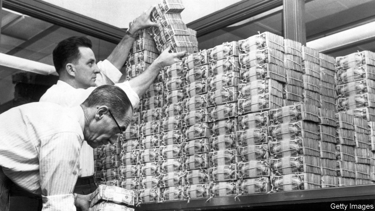

###### Overdue

# The Fed says it will build a real-time interbank payments system 

 

> print-edition iconPrint edition | Finance and economics | Aug 10th 2019 

IN SEVERAL countries—Britain, say, or Sweden—bank transfers are more or less instant. The moment your wages leave your employer’s bank account, they arrive in your own, giving you the wherewithal to pay the bills and feed the family. But America is far behind. Transfers can take days to clear, landing many Americans—chiefly those who can least afford additional expense—with hefty overdraft fees or pushing them towards payday lenders charging high interest rates. In an age when millennials can split a drinks tab on their smartphones before leaving the bar, this almost beggars belief. 

The Federal Reserve wants to speed things up. On August 5th it said that it would build a faster-payments system, as central banks have in other countries. But not, alas, instantly. FedNow, its proposed service, will not start before 2023. Covering all of America’s 10,000 banks and other depository institutions will take even longer. 

In fact, America already has a real-time payments system. The Clearing House (TCH), which is owned by 25 big banks, has been running one since 2017. Between them, says Steve Ledford of TCH, the 16 banks that have so far joined the system hold just over half of the accounts from which payments can be made. TCH is pushing for near ubiquity next year. 

So why does the Fed want its own? First, it is not convinced that TCH’s system will ever connect to all the country’s tiny banks. Mr Ledford says that TCH’s plan is to reach smaller banks through the technology companies that provide their computing systems. Second, it fears that without competition prices will be too high, quality too low and innovation too slow. (The TCH has promised not to discriminate against small banks. It charges sending banks a flat 4.5 cents and receiving ones nothing.) Third, it worries that a single service will create a “single point of failure”. Doubling up will make the whole system safer. 

Big banks told the Fed, in a recent consultation, not to bother. Even by considering its own system, it was delaying the adoption of faster payments by more banks. Randal Quarles, the Fed’s vice-chair in charge of supervision, evidently agrees. When the five governors on the Fed’s board voted to back FedNow, he was the sole dissenter. He said he saw no “strong justification for the Federal Reserve to…crowd out innovation when viable private-sector alternatives are available.” 

Smaller banks, which for years have been urging the Fed to build a system, are delighted to be promised a choice. “The private sector has a product but not the reach,” says Cary Whaley of the Independent Community Bankers of America, a trade group. “The public sector has all the reach but not yet the product.” (Most of America’s 4,900 community banks have assets of less than $1bn; the country’s biggest lenders weigh in at $2trn-plus.) 

Aaron Klein of the Brookings Institution, a think-tank in Washington, argues that the Fed has not gone far enough. Five years is too long to get its new system up and running, he says. Meanwhile, the banks will still be pulling in overdraft fees. He adds that the Fed should also have obliged banks to let customers draw funds as soon as they are deposited. 

Last month Chris Van Hollen, a Democratic congressman, and Senator Elizabeth Warren, one of the Democratic candidates for the presidency in 2020, introduced a bill that would amend the Expedited Funds Availability Act of 1987 to force banks to do just that. Time is money, goes the adage. That’s even more true for struggling Americans than for rich ones. ■ 

