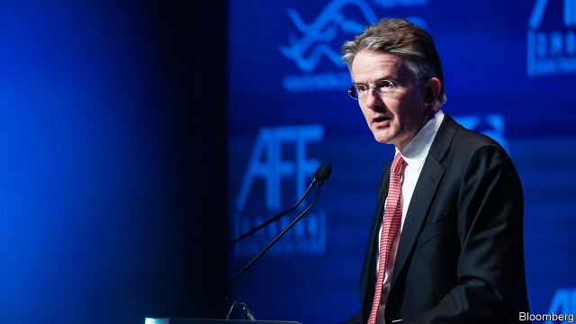

###### Chipped away

# The surprising departure of HSBC’s chief executive 

 

> print-edition iconPrint edition | Finance and economics | Aug 10th 2019 

MARK TUCKER and John Flint always seemed an unlikely double act at the top of HSBC, Britain’s biggest bank. Mr Tucker’s first profession was football—he was on the books of Wolverhampton Wanderers, now a Premier League club—and you imagine he was robust in the tackle. He never made the first team, but instead became a star in the insurance business. He captained Britain’s Prudential and AIA, a big Asian life insurer, before transferring to HSBC, as chairman, in 2017. 

The wiry Mr Flint, by contrast, completes triathlons and was an HSBC lifer, joining from university in 1989. He climbed the ranks in HSBC’s time-honoured way, running the retail and wealth-management division before becoming chief executive in February 2018. 

On August 5th, to general surprise, HSBC declared that Mr Flint was standing down after just 18 months. Noel Quinn, the head of commercial banking, will take interim charge. The bank’s tradition has been to appoint its chief executives from within—Mr Flint’s predecessor, Stuart Gulliver, ran the bank for the last seven of his 38 years on the staff—but it will look externally as well as internally for a permanent replacement. 

At first blush, Mr Flint’s ousting looks harsh. On the same day as it announced his departure, HSBC reported that its net income in the first half of 2019 had risen by 18.1%, to $9.9bn. Its return on tangible equity (RoTE), a standard measure of profitability, was a respectable 11.2%. In Asia, where it made almost four-fifths of its pre-tax profit, revenue grew by 7%. Not everything is rosy—the American business is flagging and will miss its RoTE target for next year—but all in all the record looks decent. Moreover, Mr Tucker told analysts that there was no disagreement about a strategy that was revised only in June 2018. Nor, despite the contrast in their characters, was there a clash of personalities. 

So why did Mr Flint have to go? Although results are heading in the right direction, Mr Tucker thinks progress should have been brisker. He also sees more difficult times ahead and evidently believes that Mr Flint is not the man to lead HSBC through them. Lower global interest rates—the Federal Reserve cut its benchmark rate on July 31st for the first time in more than a decade—are not good for banks. The geopolitical outlook is dicey too. Trade wars are not good for trade specialists like HSBC, and a Sino-American trade war is especially worrisome for a bank with Hong Kong and Shanghai in its name and its marrow. The board, Mr Tucker said, had decided that “a change was needed to make the most of the significant opportunities ahead of us”. Mr Quinn, he added pointedly, will bring “pace, ambition, decisiveness”. 

Mr Flint may perhaps count himself unlucky. At Standard Chartered, another British bank with an Asian centre of gravity, the chief executive has so far had four years to knock the institution into shape. But Mr Tucker has brought an unwonted impatience to HSBC. It may just be for the best. ■ 

-- 

 单词注释:

1.chip[tʃip]:n. 屑片, 薄片, 碎片 vt. 削, 切, 削成碎片, 使摔倒, 凿 vi. 削下屑片 [计] 孔屑; 组件; 晶片; 芯片 

2.Aug[]:abbr. 八月（August） 

3.tucker['tʌkә]:n. 打横褶的人, 打褶装置 vt. 使疲倦, 使筋疲力尽 

4.john[dʒɔn]:n. 盥洗室, 厕所, 嫖客 

5.flint[flint]:n. 打火石, 燧石, 极硬的东西 [化] 燧石 

6.alway['ɔ:lwei]:adv. 永远；总是（等于always） 

7.hsbc[]:abbr. 汇丰银行（Hong Kong and Shang Hai Banking Corporation） 

8.Wolverhampton['wjlvә,hæmptәn]:伍尔弗汉普顿[英国英格兰中西部城市] 

9.wanderer['wɒndәrә]:n. 漫游者, 流浪者, 徘徊者 

10.robust[rәu'bʌst]:a. 健康的, 强健的, 要用力气的, 坚定的, 粗野的 [计] 健壮性 

11.tackle['tækl]:n. 工具, 复滑车, 滑车, 装备, 扭倒 vt. 固定, 处理, 抓住 vi. 扭倒 

12.prudential[pru:'denʃәl]:a. 审慎的, 精明的, 起咨询作用的 

13.AIA[]:[经] 美国建筑师协会 

14.insurer[in'ʃuәrә]:n. 保险公司 [法] 保险人, 承保人, 保险公司 

15.wiry['waiәri]:a. 金属线制的, 瘦长结实的 [医] 弦样的(指脉搏) 

16.triathlon[trai'æθlɔn]:n. 〈体〉三项全能运动 

17.lifer['laifә]:n. 无期徒刑者, 职业军人 [法] 无期徒刑犯 

18.Noel[nәu'el]:n. 圣诞节, 圣诞颂歌 

19.Quinn[]:n. 奎恩（姓氏） 

20.interim['intәrim]:a. 暂时的, 临时的, 间歇的 n. 过渡时期 

21.predecessor[.predi'sesә]:n. 前任, 先辈, 前身 [医] 初牙, 前辈, 祖先 

22.stuart[stjuәt]:n. 英国斯图亚特王室；斯图尔特（男子名, 等于Stewart） 

23.Gulliver['^ʌlivә(r)]:n. 格利佛(《格利佛游记》的主人公) 

24.externally[]:adv. 在外部, 外表上, 从外面, 在外面, 从外部 

25.internally[in'tәnәli]:[计] 内部的 

26.replacement[ri'pleismәnt]:n. 归还, 更换, 代替者 [医] 复位, 置换 

27.blush[blʌʃ]:vi. 脸红, 羞愧 vt. 弄成红色 n. 脸红 

28.oust[aust]:vt. 逐出, 罢黜, 剥夺, 驱逐 [法] 驱逐, 剥夺, 免职 

29.tangible['tændʒәbl]:n. 可触知的东西, 有形资产 a. 可触摸的, 有实体的, 非相像的, 有形的, 明确的 

30.equity['ekwiti]:n. 公平, 公正 [经] 权益, 产权 

31.rote[rәut]:n. 机械性的背诵, 死记硬背 

32.profitability[.prɒfitә'biliti]:n. 收益性, 利益率 [经] 可获利润率 

33.respectable[ri'spektәbl]:a. 值得尊重的, 人格高尚的, 相当数量的 n. 品格高尚的人 

34.tucker['tʌkә]:n. 打横褶的人, 打褶装置 vt. 使疲倦, 使筋疲力尽 

35.analyst['ænәlist]:n. 分析者, 精神分析学家 [化] 分析员; 化验员 

36.clash[klæʃ]:n. 冲突, 撞击声, 抵触 vi. 冲突, 抵触 vt. 使发出撞击声 [计] 对撞 

37.evidently['evidәntli]:adv. 明显地, 根据现有证据来看 

38.benchmark[]:[计] 基准程序; 基准 

39.geopolitical[,dʒi(:)әupә'litikәl]:[计] 地理的 

40.dicey['daisi]:a. 不确定的, 危险的, 冒险性的 

41.worrisome['wʌrisәm]:a. 令人烦恼的, 麻烦的, 劳碌命的 

42.hong[hɔŋ]:n. （中国、日本的）行, 商行 

43.kong[kɔŋ]:n. 含锡砾石下的无矿基岩；钢 

44.marrow['mærәu]:n. 髓, 骨髓, 精华, 活力, 配偶 [医] 髓(尤指骨髓) 

45.pointedly[]:adv. 指向地；尖锐地 

46.decisiveness[dɪˈsaɪsɪvnəs]: 果断性 

47.charter['tʃɑ:tә]:n. 特许状, 执照, 宪章 vt. 特许, 发给特许执照 

48.unwonted[.ʌn'wʌntid]:a. 不习惯的, 不寻常的, 非惯常的 

49.impatience[im'peiʃәns]:n. 性急, 难耐, 焦急, 急躁 

