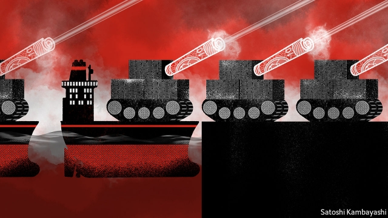
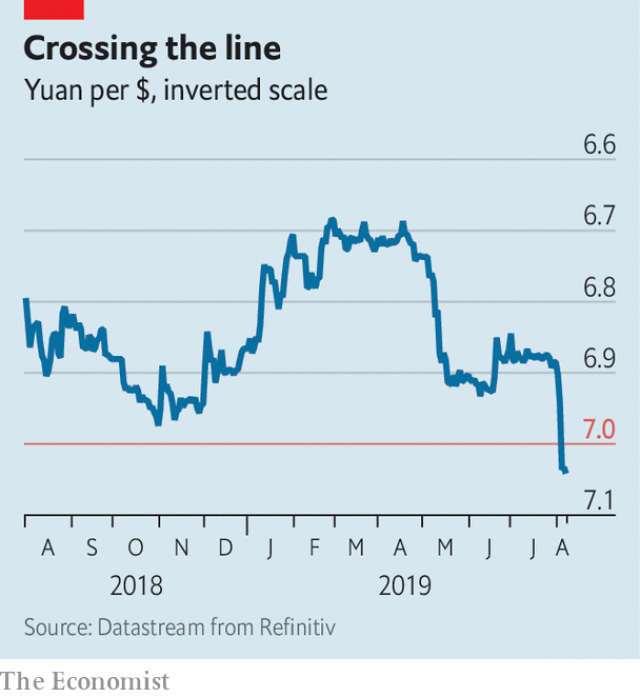

###### The guns of August

# The trade war escalates, and the fog of war descends 

 

> print-edition iconPrint edition | Finance and economics | Aug 8th 2019 

CARL VON CLAUSEWITZ, the Prussian military theorist, never wrote about currency wars. But some policymakers see them in his terms: as the continuation of trade politics by other means. That, at least, is how the Trump administration views China’s decision on August 5th to let its currency weaken past seven yuan to the dollar for the first time since 2008. Though arbitrary, that threshold has assumed huge symbolic importance among traders, economic officials and fund managers (see Buttonwood). They were left stunned. 

America’s Treasury quickly branded China a “currency manipulator”, a charge it has not levelled against any country for 25 years. China, in the Americans’ view, was cheapening its currency to gain an unfair edge in retaliation for President Donald Trump’s surprise announcement four days earlier that he would impose new tariffs of 10% on roughly $300bn of Chinese goods. 

This marked the end of investors’ hopes for a peaceful summer. At the end of July the Federal Reserve had cut interest rates to guard against a slowdown in America’s respectable growth rate, and trade tensions had “returned to a simmer”, as Jerome Powell, the Fed’s chair, noted with satisfaction. But after the yuan’s move America’s stockmarket suffered its worst day this year. Emerging-market currencies, including the Brazilian real, Indian rupee and South African rand, fell. The price of Brent crude oil tumbled below $60 a barrel and safe havens, such as gold, rallied. The same search for safety pushed American ten-year government bond yields to 1.7%, as investors bet that the Fed would be forced to slash interest rates further to prevent a recession. The Reserve Bank of New Zealand cut its benchmark interest rate by twice as much as expected, citing “heightened uncertainty” and “historically low” global bond yields. The Australian dollar fell to its lowest level in a decade. 

In matters of war and peace, countries must prepare for the worst. But precautions can look like provocations. In allowing the yuan to fall, China signalled it is prepared for a protracted trade war. It let the yuan weaken in response to the threat of tariffs much as a floating currency would. Otherwise it would have needed to defend an arbitrary line against the dollar every time America turned belligerent. Its move nonetheless makes further belligerence more probable. Mr Trump is now unlikely to change his mind about the new tariffs before they kick in on September 1st. 

 

Both sides blame the other for starting the fight. China has raised tariffs only in response to America’s. But America sees its combative economic diplomacy as a belated response to decades of intellectual-property theft and other misdeeds. Each side’s attempt to get even looks to the other like one-upmanship. China views a weaker yuan as a reasonable response to Mr Trump’s trade duties; Mr Trump, according to the Wall Street Journal, sees those tariffs as retaliation for China failing to commit to buy more American farm goods. 

The irony is that Chinese purchases of American soyabeans and pork were already rising, and the government was offering buyers exemptions from some tariffs. But after Mr Trump’s new tariff threat it has reportedly told state-owned companies not to buy American farm goods after all. Thus Mr Trump’s tariffs may have caused the decision they were designed to punish. 

Whatever the cause of the new levies, what might be their effect? Some of America’s existing tariffs (of 25% on roughly $250bn-worth of merchandise) had been imposed on Chinese goods that American importers can buy elsewhere. That minimised the harm to American buyers and maximised the harm to China’s exporters, which lost business to close rivals elsewhere. Indeed, according to Goldman Sachs, other Asian countries have filled around half of the gap created by the previous round of tariffs. 

The next round of tariffs will hit goods for which China has fewer competitors. That should make it harder for American buyers to switch suppliers. Nonetheless the new tariffs’ direct impact could reduce China’s growth by at least 0.3 percentage points in 2020, according to UBS, to below 6% for the first time since 1990. 

To support a slowing economy, China’s government has already cut taxes, increased infrastructure spending and relented in its campaign to restrain credit growth. But it is reluctant to boost the property market, which helped pull the economy out of previous slowdowns, points out Andrew Batson of Gavekal, a research firm. House prices have risen mercilessly and developers have accumulated worrying levels of debt. China, in short, wants to keep growth stable, stand up to America in the trade war and constrain excesses in the housing market. It is becoming harder to do all those things at once. 

The damage to America’s economy is less tangible. A survey by the Federal Reserve Bank of Atlanta suggested that tariffs and trade-war uncertainty had hurt private investment by 1.2% (and manufacturing investment by over 4%). The unease has also made it harder for the Fed both to preserve stable growth and to raise interest rates to more normal levels. That will give it less room to act if the economy flounders for other reasons. 

In a tweet, Mr Trump called on the Fed to respond to China’s weakening currency. Although the dollar is technically the responsibility of America’s Treasury, the Fed’s decisions have a profound influence over its value. It does not take orders from the president and treats the exchange rate with benign neglect. But if the uncertainties of the trade war inflict enough harm on confidence and spending, it might cut interest rates anyway. The futures market prices in a roughly 40% chance of at least 0.75 percentage points of easing by the year’s end. The fog of war can be as damaging as war itself. 

The trade fight has reverberated globally. America’s Treasury had already expanded the list of countries it is monitoring for signs of currency manipulation. None of the countries listed met all three of the Treasury’s criteria (a large bilateral surplus with America, a material overall surplus and persistent currency intervention by the central bank). But then, neither did China. The definition of manipulation is, it seems, highly manipulable. 

One of the currencies most affected has been Japan’s yen. A haven in troubled times, it rose sharply after Mr Trump’s surprise announcement. A strong yen makes it harder for Japan’s central bank to revive inflation, especially as its interest rates already lie below zero. Although Japan has not intervened directly in the currency markets since 2011, its officials are watching the yen’s rise with alarm. If the currency strengthens closer to the psychological threshold of 100 to the dollar, Japan’s authorities might feel compelled to act. Currency wars can also be the continuation of monetary policy by other means. 

Nor has Europe escaped. Industrial production in Germany fell by 5.2% in the year to June. “Foreign macro shocks” account for about two-thirds of Germany’s slowdown since 2017, according to Goldman Sachs. European banks, including ABN AMRO, Commerzbank and UniCredit, this week warned of squeezed interest margins, rising provisions or flagging revenues. In a recent economic bulletin, the European Central Bank worried that trade uncertainty had delayed global investment, damaging European exports of manufacturing, machinery and transport equipment. In a globalised economy, everything is a continuation of everything else.■ 
<<<<<<< HEAD

-- 

 单词注释:

1.escalate['eskәleit]:vi. 逐步扩大, 逐步升高, 逐步增强 vt. 使逐步上升 

2.Aug[]:abbr. 八月（August） 

3.Carl[kɑ:l]:n. 卡尔（男名） 

4.Von[vɔn;fɔn;fәn]:[计] 冯·诺伊曼 

5.clausewitz[]:克劳斯威茨（人名） 

6.Prussian['prʌʃәn]:a. 普鲁士的, 普鲁士语的, 普鲁士式的 n. 普鲁士人, 普鲁士语 

7.theorist['θi:әrist]:n. 理论家, 理论工作者 

8.policymaker['pɔlisi.meikә]:n. 政策制定者；决策人 

9.continuation[kәn.tinju'eiʃәn]:n. 继续, 续集, 补编 [医] 连续 

10.politic['pɒlitik]:a. 精明的, 明智的, 策略的 

11.threshold['θreʃәuld]:n. 门槛, 入口, 开端, 阈 [计] 阈; 阈值 

12.symbolic[sim'bɒlik]:a. 象征的, 符号的 [电] 符号化 

13.trader['treidә]:n. 商人, 商船 [经] 交易者, 商船 

14.buttonwood['bʌtnwʊd]: 美洲悬铃木 

15.stun[stʌn]:vt. 使昏迷, 使震惊, 打昏 n. 昏迷, 猛击 

16.treasury['treʒәri]:n. 国库, 宝库, 财政部, 国库券 [经] 库存, 国库, 金库 

17.quickly['kwikli]:adv. 很快地 

18.manipulator[mә'nipjuleitә]:n. 操作者, 机械手 [化] 机械手 

19.cheapen['tʃi:pәn]:v. 减价, 跌价 

20.retaliation[ri.tæli'eiʃәn]:n. 报复 [法] 报仇, 报复, 回敬 

21.tariff['tærif]:n. 关税, 关税表, 价格表, 收费表 vt. 课以关税 [计] 价目表 

22.slowdown['slәudaun]:n. 降低速度, 减速 

23.respectable[ri'spektәbl]:a. 值得尊重的, 人格高尚的, 相当数量的 n. 品格高尚的人 

24.simmer['simә]:vt. 煨 vi. 炖, 内心充满 n. 即将沸腾的状态, 即将发作 

25.jerome[dʒә'rәum]:n. 杰罗姆（男子名） 

26.powell['pәuәl, 'pauәl]:n. 鲍威尔（英国物理学家） 

27.stockmarket[s'tɒkmɑ:kɪt]: 证券市场; 证券交易所; 证券行情 

28.Brazilian[brә'ziljәn]:n. 巴西人 a. 巴西的, 巴西人的 

29.rupee[ru:'pi:]:n. 卢比(印、巴等国货币单位) 

30.rand[rænd]:n. 兰特, (非正式)边, 田埂, 缘 [经] 兰特 

31.Brent[brent]:[经] 布兰特油田 

32.haven['heivn]:n. 港, 避难所, 安息所 vt. 安置...于港中, 庇护, 入港 

33.rally['ræli]:n. 重振旗鼓, 集合, 群众集会, 跌停回升 v. 重整旗鼓, 集合, 恢复精神, 团结, 挖苦, 嘲笑 

34.investor[in'vestә]:n. 投资者 [经] 投资者 

35.slash[slæʃ]:v. 猛砍, 乱砍 n. 猛砍, 乱砍, 删减 [计] 斜线 

36.recession[ri'seʃәn]:n. 后退, 凹处, 衰退, 归还 [医] 退缩 

37.zealand['zi:lәnd]:n. 西兰岛（丹麦最大的岛） 

38.benchmark[]:[计] 基准程序; 基准 

39.cite[sait]:vt. 引用, 引证, 表彰 [建] 引证, 指引 

40.heighten['haitn]:vt. 增高, 提高, 加强 vi. 升高, 变大 

41.uncertainty[.ʌn'sә:tnti]:n. 不确定, 不可靠, 不确定的事物 [化] 不确定度 

42.historically[his'tɔrikәli]:adv. 历史上地；从历史观点上说 

43.provocation[.prɒvә'keiʃәn]:n. 激怒, 刺激, 挑拨 [医] 激发[作用] 

44.protract[prәu'trækt]:vt. 延长, 拖延, 伸出, 绘制 [法] 延迟, 拖延, 延长 

45.belligerent[bi'lidʒәrәnt]:a. 好战的, 交战的, 交战国的 [法] 交战一方, 交战国, 交战集团 

46.nonetheless[,nʌnðә'les]:conj. 然而, 尽管, 不过 adv. 不过, 仍然, 尽管如此, 然而 

47.belligerence[bi'lidʒәrәns]:n. 交战, 好战性, 斗争性 

48.combative[kәm'bætiv]:a. 好斗的, 好事的 

49.diplomacy[di'plәumәsi]:n. 外交, 外交手腕, 交际手段 [法] 外交, 外交手腕, 权谋 

50.belated[bi'leitid]:a. 迟来的 [法] 过了期的, 落后了的 

51.misdeed['mis'di:d]:n. 罪行, 犯罪 [法] 不端行为, 犯罪, 恶性 

52.irony['aiәrәni]:n. 反语, 讽刺, 具有讽刺意味的事 

53.soyabean[]:[医] 大豆 

54.buyer['baiә]:n. 买主, 买方 [经] 买主, 买方, 买手 

55.exemption[ig'zempʃәn]:n. 解除, 免除, 免税 [化] 免检 

56.reportedly[ri'pɒ:tidli]:adv. 根据传说, 根据传闻, 据报道 

57.levy['levi]:n. 税款, 所征的人数, 征收 vi. 征税, 课税 vt. 征收, 强求, 召集 

58.merchandise['mә:tʃәndaiz]:n. 商品, 货物 v. 交易, 买卖 

59.importer[im'pɒ:tә]:n. 输入者, 进口商 [法] 进口商, 输入者 

60.minimise[]:vt. 使减到最少/最小, 使降到最低限度, 使缩到最小, 极度轻视 

61.maximise['mæksimaiz]:vt. 把...增加到最大限度, 把...扩大到最大限度, 充分重视, 找出...的最高值 

62.exporter[ik'spɒ:tә]:n. 出口商, 输出者, 出口公司 [经] 出口商, 输出者 

63.goldman[]:n. 高曼（姓氏） 

64.Sachs[zaks]:n. 萨克斯（汽车零配件生产厂商） 

65.supplier[sә'plaiә]:n. 供应者, 供给国, 供应商 [化] 承制厂; 供应厂商 

66.nonetheless[,nʌnðә'les]:conj. 然而, 尽管, 不过 adv. 不过, 仍然, 尽管如此, 然而 

67.UB[]:[计] 上限 

68.infrastructure['infrәstrʌktʃә]:n. 基础结构, 基础设施 [经] 基础设施 

69.relent[ri'lent]:vi. 变宽厚, 变温和, 动怜悯之心 

70.andrew['ændru:]:n. 安德鲁（男子名） 

71.batson[]:巴特森 

72.Gavekal[]:[网络] 研究机构加维卡尔 

73.mercilessly['mɜ:sɪləslɪ]:adv. 无情地, 残忍地 

74.developer[di'velәpә]:n. 开发者 [计] 显影器 

75.constrain[kәn'strein]:vt. 强迫, 限制, 关押 

76.les[lei]:abbr. 发射脱离系统（Launch Escape System） 

77.tangible['tændʒәbl]:n. 可触知的东西, 有形资产 a. 可触摸的, 有实体的, 非相像的, 有形的, 明确的 

78.atlanta[әt'læntә]:n. 亚特兰大（美国城市） 

79.manufacturing[.mænju'fæktʃәriŋ]:n. 制造业 a. 制造业的 

80.unease[.ʌn'i:z]:n. 不安 

81.flounder['flaundә]:vi. 挣扎, 折腾；错乱地做事或说话 

82.tweet[twi:t]:vi. 啁啾 n. 小鸟叫声 

83.technically['teknikli]:adv. 技术上, 学术上, 专门地 

84.profound[prә'faund]:a. 极深的, 深厚的, 深刻的, 渊博的 

85.benign[bi'nain]:a. 善良的, 良性的 [医] 良性的 

86.inflict[in'flikt]:vt. 施以, 加害, 使承受 [法] 处, 加, 予以 

87.reverberate[ri'vә:bәreit]:vi. 回响, 反响, 被反射 vt. 使反响, 使回响, 反射 a. 回响的, 反射的 

88.globally[]:[计] 全局地 

89.manipulation[mә.nipju'leiʃәn]:n. 操作, 处理 [化] (用手)操作; 使用 

90.bilateral[bai'lætәrәl]:a. 有两边的, 双边的, 双方的 [医] 两侧的 

91.persistent[pә'sistәnt]:a. 固执的, 坚持的, 持续的, 作用持久的 [法] 坚持的, 固执的, 持续的 

92.intervention[.intә'venʃәn]:n. 插入, 介入, 调停 [经] 干预 

93.manipulable[mә'nipjulәbl]:a. 可以操作的, 可操纵自如的 

94.yen[jen]:n. 日元(日本货币单位), 渴望, 嗜好 vi. 渴望 

95.revive[ri'vaiv]:vt. 使苏醒, 使复兴, 使振奋, 回想起, 重播 vi. 苏醒, 复活, 复兴, 恢复精神 

96.inflation[in'fleiʃәn]:n. 胀大, 夸张, 通货膨胀 [化] 充气吹胀; 膨胀 

97.intervene[.intә'vi:n]:vi. 插入, 调停, 干涉 [经] 进场干预 

98.monetary['mʌnitәri]:a. 货币的, 金钱的 [经] 货币的, 金融的 

99.macro['mækrәu]:pref. 宏 a. 巨大的, 大量的 [计] 宏 

100.abn['æbn]:abbr. abducent nerve 外展神经; airborne 空降的; 空中的; 机上的 

101.amro[]:n. (Amro)人名；(阿拉伯、埃塞)阿姆鲁 abbr. 医学档案员协会（association of medical record officers） 

102.commerzbank[]: 德国商业银行公司总部所在地：德国主要业务：银行 

103.UniCredit[]:[网络] 意大利联合信贷银行；意大利裕信银行 

104.bulletin['bulitin]:n. 公告, 布告, 公报 [电] 电子布告栏 

105.machinery[mә'ʃi:nәri]:n. 机器, 机械装置, 机构 [化] 机械 

106.globalise[]:使全球化（英式英语） 
=======
>>>>>>> 50f1fbac684ef65c788c2c3b1cb359dd2a904378

