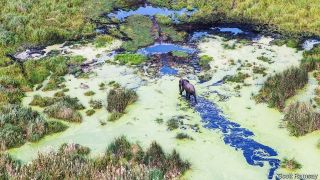
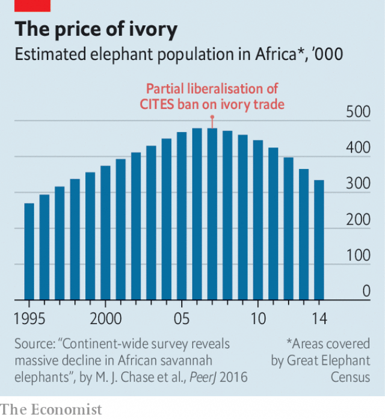

###### On the horns

# How to curb the trade in endangered species 

 

> print-edition iconPrint edition | International | Aug 10th 2019 

BROWSING PEACEFULLY at a waterhole, the herd of two dozen elephants seems oblivious to the car that has stopped 100 metres away and disgorged three visitors to gawp at them. The vast expanse of the Kafue National Park in western Zambia is quiet and deserted of other people. These humans are just curious, but potential killers would be hard to stop. An anti-poaching unit based about 20km away tries to protect the animals in the park’s 22,000 square kilometres, with just 27 rangers working shifts, and a few jeeps and rifles. Given the odds, and the rewards poaching brings, they have been remarkably successful. 

The park is home to leopards, rare antelope, hippos, pangolins, aardvarks and crocodiles as well as elephants, of which Kafue had about 60,000 in the 1960s, when it also had one of the world’s largest populations of black rhinos. But in the 1980s, the very last black rhino was poached. The elephant population has dwindled to 4,000. 

Elephants will be high on the agenda when the Convention on International Trade in Endangered Species of Wild Fauna and Flora (CITES), an agreement signed to date by 183 countries, convenes its triennial “conference of the parties” (COP)—its decision-making forum—in Geneva from August 17th-28th. WWF, a wildlife charity, estimates that around 20,000 African elephants are killed by people every year. 

The animals’ meat, hides and, above all, tusks are money-spinners. East Asia is the biggest market for ivory and for many illegally traded products, such as animal parts used in traditional Chinese medicine (TCM)—tiger bones, rhino horns, pangolin scales—or in its cuisine—pangolin meat, for example. In July the authorities in Singapore seized 8.8 tonnes, about 300 elephants’-worth, of ivory, along with 11.9 tonnes of pangolin scales, from some 2,000 of the anteaters, the world’s most widely trafficked endangered mammal. The annual profits of the trade in illegal wildlife products are estimated at between $7bn at the low end and $23bn. This makes it the fourth-most profitable criminal trafficking business, with links to others—slavery, narcotics and the arms trade. 

On the agenda in Geneva is a proposal from Zambia to shift its elephants from CITES’ Appendix I, which bans virtually all trade, as the species is deemed at threat of extinction, to the less restrictive Appendix II, to allow some trade, for example, in hunting trophies. Botswana, Namibia and Zimbabwe also want to trade some stockpiled ivory. Zambia argues that its elephant population has stabilised, at about 27,000 animals—just one-tenth of the number 50 years ago, but a marked increase on the estimated 18,000 that survived the poaching epidemic of the 1970s and 1980s. The animals have enough space and are not split into unsustainable subpopulations. 

Many local people would be quite happy to see elephant numbers decline. These beasts, protected in reserves and national parks such as Kafue, which cover around 30% of the country, can be destructive, trampling farmland and wrecking homes. 

Everybody involved in conservation agrees that the best protection for wildlife would be for local people to have an interest in their survival, but that is proving hard to bring about. In a village just outside Kafue, Gertrude Mwiba is one of those trying to rub along with the local megafauna. As a local organiser for a community-based natural-resource-management forum, she has been helping find ways to reduce poaching by promoting other livelihoods. Growing maize, soya beans and cassava, the local staples, are options; beekeeping deters elephants, which hate bees, as well as providing an income. But poaching is more profitable than any of them. Elephants are far from the only targets. Various types of antelope, buffaloes and even hippos are sought after as “bush-meat” in the capital, Lusaka, and abroad. 

Having big endangered beasts as neighbours brings in some money. Safari lodges dotted through the park attract tourists with a few hundred dollars a night to spend. But they do not create many jobs. Locals would have nothing against trophy-hunting—tourists paying to shoot animals—but believe they would see little of the proceeds. Of the money the government gets from safari operators, 20% is earmarked for local villages. But Ms Mwiba says disbursement can take two years, if it happens at all, and most is spent on anti-poaching activities anyway. Around the world, poor farmers like her are the front line of defence for some endangered species. Yet for them, wildlife protection brings no obvious benefits, just costs. 

Some conservationists believe that in order for locals to be given an interest in the survival of wildlife, a controlled market in products must be allowed. Trade is a relatively small danger to the world’s biodiversity. Far more important are loss of habitat and climate change. 

Others argue the opposite: that the trade in some products, such as ivory and rhino horn, has been a big factor in the threat to those species. In countries that lack sufficiently solid political institutions and law-enforcement agencies, the argument goes, trade will encourage short-term killing rather than long-term investment, and the existence of any legal market encourages and enables the illegal one. It makes it easier to launder illegal products and sustains the demand that fuels the trade. 

Vested interests on both sides distort the argument—those sitting on valuable stocks of ivory or rhino horn obviously stand to profit from trade; and some conservationist NGOs’ purpose and fundraising rely on a purist approach. But the numbers tend to support the abolitionists. 

After the ivory trade was banned in 1989, elephants’ fortunes turned around. The two camps squabble about whether that was mainly the result of falling demand or of better anti-poaching measures, as African governments came under pressure to do more to protect them. But a resurgence of poaching in the past decade seems linked to a partial liberalisation in 2007, when a one-off sale of some existing ivory stocks was permitted (see chart). Japan was approved as an authorised importer as its market seemed sufficiently well regulated. The result, say the abolitionists, is that it has become the centre of the illegal trade in worked ivory. The biggest seizures of smuggled artefacts these days are by Chinese customs of goods entering the country from Japan. 

 

The trend, within CITES, is towards stricter controls. At the previous COP, held in Johannesburg in 2016, more species were added to the appendices—all eight species of pangolin, for example, are now listed in Appendix I—and protection was enhanced for the African grey parrot, lion, cheetah, helmeted hornbill and totoaba (a fish whose bladder is used in Chinese medicine). CITES congratulated itself that wildlife was now “firmly embedded in the agendas of global enforcement, development and financing agencies”. 

There has indeed been progress since 2016, notably in making it harder for criminals to trade wildlife products on global internet platforms. And the issue has gained prominence, helped by a high-profile conference in London in 2018. The firms that unwittingly provide the infrastructure for the trade are getting better at monitoring it—haulage companies at checking cargo, banks at spotting suspicious flows of money. China has just taken over the chair of the Financial Action Task Force, a plurilateral body supposed to curb money-laundering. The new chairman, Liu Xiangmin, has listed going after the proceeds of wildlife crime as an objective. 

Some advances have also been made in curbing demand for the illegal products. What happens in China matters most. The emergence of hundreds of millions of Chinese with disposable incomes turned what were once niche products into a huge market. The Beijing metro has posters publicising the fight against wildlife crime. Yao Ming, a retired basketball star, has lent his name to campaigns to save elephants, sharks and rhinos. And at the end of 2017 China put into force a ban on all domestic trade in ivory. (Because of CITES, trading newly acquired ivory was already illegal.) 

Technology is also helping. In some parks in Zambia and elsewhere, rhinos and elephants are fitted with sensors and monitored by drones. DNA testing of seized ivory makes it possible to identify fairly precisely where the animal was killed. However, only 20% of large seizures are tested—“representing an important missed opportunity to better understand the criminal networks trafficking ivory”, says Matthew Collis of the International Fund for Animal Welfare, a charity. 

But ahead of the Geneva meeting, the mood among conservation NGOs is not upbeat. After all, about 5,800 animals and 30,000 species of plant are listed by CITES, and still more are likely to be added this year—such as some new species of shark, killed for the fins so prized in Chinese soups. 

And efforts to eliminate the trade offer an object lesson in the law of unintended consequences. Often, when demand is suppressed in one place, it pops up in another—especially in China’s neighbours such as Vietnam and Laos. China’s ban did cut the price of ivory. But that prompted some ivory poachers to turn to pangolins. 

Rhino horn is another example. China has banned its sale since 1993; and demand for its use in traditional Chinese medicine (for fevers, rheumatism and gout) has fallen. But it has picked up in Vietnam on nonsensical rumours it can cure cancer. Tiger-bone remedies are being replaced by lion- and leopard-bone ones. And so on. 

Moreover, although China is trying to curb illegal trade, it is also promoting TCM as one of its civilisation’s great contributions to the world. It has indeed made breakthroughs, such as artemisinin, now a widely used defence against malaria. Very few of its cures come from animals and the official pharmacopoeia has been purged of illegal (and useless) treatments such as rhino horn and tiger bone. But some TCM practitioners still prescribe them, so conservationists are alarmed that in May the World Health Organisation gave TCM respectability by including diagnoses for 400 conditions in its influential International Classification of Disease list. 

Efforts to cut demand for illegal products have had an impact, and attitudes are changing. Sharks’-fin soup, for example, is no longer a fixture at Chinese banquets, and more and more diners know it is at best a controversial taste. But as endangered species dwindle further, the market for many products is still robust. Trafficking in them remains, in Mr Collis’s phrase, “a low-risk, high-reward crime”. ■ 

-- 

 单词注释:

1.curb[kә:b]:n. 抑制, 勒马绳, 边石 vt. 抑制, 束缚, 勒住 

2.endanger[in'deindʒә]:vt. 危及 [法] 使危险, 危及 

3.specie['spi:ʃi]:n. 硬币 [经] 硬币 

4.Aug[]:abbr. 八月（August） 

5.browse[brauz]:v. 浏览, 吃草 n. 浏览, 吃草 [计] 浏览 

6.peacefully[]:adv. 平静地 

7.waterhole[]:n. 水坑, 水眼 

8.oblivious[ә'bliviәs]:a. 遗忘的, 健忘的, 不知不觉的 [法] 忘却的, 健忘的, 不在意的 

9.disgorge[dis'gɒ:dʒ]:vt. 吐出, 流注, 被迫交出 vi. 呕吐 

10.gawp[gɒ:p]:vi. 呆头呆脑地凝视 n. 呆人, 笨蛋 

11.expanse[ik'spæns]:n. 宽阔区域, 宽阔, 天空 

12.Kafue[kə'fu:ei]:n. 喀辅埃河（位于非洲） 

13.Zambia['zæmbiә]:n. 赞比亚 [经] 赞比亚 

14.killer['kilә]:n. (非正式)杀人者, 屠杀者, 猛兽, 致死(疾病), 杀手, 止痛药, 限制器, 瞄准器 [计] 删除程序; 断路器 

15.ranger['reinʒә]:n. 王室守林人, 骑警, 漫游者 

16.odds[ɒdz]:n. 可能性, 几率, 机会, 胜算, 不平等 

17.poach[pәutʃ]:vt. 水煮(蛋), 偷猎, 侵入, 窃取 vi. 偷猎, 陷入泥中 

18.remarkably[ri'mɑ:kәbli]:adv. 显著地, 引人注目地, 非常地 

19.leopard['lepәd]:n. 豹, 美洲豹 

20.antelope['æntilәup]:n. 羚羊 

21.hippo['hipәu]:n. 河马 [化] 吐根(的别名) 

22.pangolin[pæŋ'gәulin]:n. 穿山甲, 鲮鲤 

23.aardvark['ɑ:dvɑ:k]:n. 土豚 

24.crocodile['krɒkәdail]:n. 鳄鱼 

25.rhino['rainәu]:n. 钱, 现金, 犀牛 

26.dwindle['dwindl]:vi. 减少, 缩小, 衰落 vt. 使缩小 

27.fauna['fɒ:nә]:n. 动物群 [医] 动物区系 

28.flora['flɒ:rә]:n. 植物群 [医] 植物区系, 植物丛, 植物群, 菌丛 

29.cite[sait]:vt. 引用, 引证, 表彰 [建] 引证, 指引 

30.convene[kәn'vi:n]:vt. 集合, 召集, 召唤 vi. 聚集, 集合 

31.triennial[trai'eniәl]:a. 每三年一次的 n. 三年生植物, 三年发生一次的事 

32.Geneva[dʒi'ni:vә]:n. 日内瓦, (荷兰)杜松子酒 

33.wwf[]:abbr. 世界野生动物基金（World Wildlife Fund）；世界摔跤联合会（World Wrestling Federation）；雨天流量（Wet-Weather Flow） 

34.tusk[tʌsk]:n. 长牙, 獠牙, 尖物 vt. 以长牙刺戳, 以长牙掘 

35.ivory['aivәri]:n. 象牙, 乳白色 a. 象牙制的, 乳白色的 

36.illegally[]:[法] 非法地, 不合法地, 违法地 

37.Singapore[.siŋgә'pɒ:]:n. 新加坡 

38.tonne[tʌn]:n. 吨, 公吨 [经] 吨 

39.anteater['ænt.i:tә]:n. 食蚁动物 

40.traffick[]:[网络] 通行车辆；开放交通；非法交易 

41.mammal[mæmәl]:n. 哺乳动物 [化] 哺乳动物 

42.trafficking[ˈtræfikɪŋ]:n. 非法交易 

43.narcotic[nɑ:'kɒtik]:n. 麻醉药, 镇静剂 a. 麻醉的, 催眠的 

44.deem[di:m]:v. 认为, 相信 

45.extinction[ik'stiŋkʃәn]:n. 消失, 消灭, 废止 [化] 消光; 熄灭 

46.les[lei]:abbr. 发射脱离系统（Launch Escape System） 

47.restrictive[ri'striktiv]:a. 限制的, 约束的, 限定的 n. 限制词 

48.ii[]:abbr. 微光（Image Intensification） 

49.trophy['trәufi]:n. 战利品, 奖品 vt. 用战利品装饰 

50.botswana[bɔt'swɑ:nә]:n. 博茨瓦纳（非洲中南部国家） 

51.Namibia[nә'mi:biә]:n. 纳米比亚 

52.Zimbabwe[zim'bɑ:bwei]:n. 津巴布韦 

53.stockpile['stɒkpail]:n. 储蓄, 积蓄, 库存 vt. 储蓄, 贮存 

54.stabilise['steibilaiz]:vt.vi. (使)稳定, (使)安定, (使)坚固 vt. 装稳定器 

55.epidemic[.epi'demik]:n. 传染病, 流行病 a. 流行的, 传染性的 

56.unsustainable[,ʌnsәs'teinәbl]:a. 无法支撑的, 不能忍受的, 不可证实的 [法] 未能证实的, 不能成立的 

57.subpopulation['sʌb,pɔpjj'leiʃən]:n. (从其他人口分出或构成总人口的)分组人口 

58.trample['træmpl]:n. 践踏(声), 蹂躏 v. 践踏, 无视 

59.farmland['fɑ:mlænd]:n. 农田 

60.gertrude['ɡә:tru:d]:n. 婴儿内衣（无袖, 两肩常用纽扣） 

61.megafauna[me'ɡæfɔ:nə]:n. 巨型（土壤）动物 

62.forum['fɒ:rәm]:n. 论坛, 公开讨论的广场, 法庭, 讨论会 [法] 讨论会, 专题讨论, 公共论坛 

63.livelihood['laivlihud]:n. 生计, 营生, 生活 

64.maize[meiz]:n. 玉蜀黍, 黄色 a. 玉蜀黍色的, 黄色的 

65.soya['sɔiә]:[医] 大豆 

66.cassava[kә'sɑ:vә]:n. 木薯 [医] 木薯 

67.staple['steipl]:n. 主要产物, 常用品, 主要要素, 原料, 订书钉, 钩环 a. 主要的, 重要的 vt. 分级, 钉住 

68.beekeeping['bi:,ki:piŋ]:n. 养蜂 

69.deter[di'tә:]:vt. 制止, 吓住, 威慑 

70.buffaloe[]:[网络] 水牛 

71.lusaka[lu:'sɑ:kә]:n. 卢萨卡（赞比亚首都） 

72.safari[sә'fɑ:ri]:n. 旅行, 旅行队, 科学考察 

73.safari[sә'fɑ:ri]:n. 旅行, 旅行队, 科学考察 

74.earmark['iәmɑ:k]:n. 耳上记号, 特征, 记号, 标记 vt. 在耳朵上做记号, 标记, 指定...作特定用途 

75.disbursement[dis'bә:smәnt]:n. 支付, 支出 [经] 支付 

76.conservationist[,kәnsә'veiʃәnist]:n. 自然资源保护论者 

77.biodiversity[]:n. 生物多样性 

78.habitat['hæbitæt]:n. 栖息地, 居留地, 自生地, 聚集处 [医] 习生地, 产地, 生境, 栖所 

79.launder['lɒ:ndә]:n. 流水槽 v. 洗衣, 烫衣 

80.distort[dis'tɒ:t]:vt. 扭曲, 歪曲 [法] 歪区, 曲解, 纂改 

81.fundraising['fʌndˌreɪzɪŋ]:n. 筹款, 募款 a. 筹款的 

82.purist['pjuәrist]:n. 纯粹主义者 

83.abolitionist[.æbәu'liʃәnist]:n. 废除主义者, 废奴主义者 

84.squabble['skwɒbl]:vi. 争吵, 口角 n. 争吵, 口角 

85.resurgence[ri'sә:dʒәns]:n. 再起, 复活, 再现 

86.liberalisation[,libərəlai'zeiʃən, -li'z-]:n. 自由化；开放 

87.authorise['ɔ:θәraiz]:vt. 授权；批准；允许；委任（等于authorize） 

88.importer[im'pɒ:tә]:n. 输入者, 进口商 [法] 进口商, 输入者 

89.seizure['si:ʒә]:n. 捕获, 夺取, 占领, 捕获物, 没收, 充公 [医] 发作; 癫痫发作 

90.smuggle['smʌgl]:vt. 偷运, 走私, 私运 vi. 走私 

91.artefact['ɑ:tifækt]:n. 人工制品, 制造物, 人为现象, 膺象, 矫作物, 古代文物 [医] 人为现象, 人工产物 

92.cop[kɒp]:n. 警官 vt. 抓住 

93.Johannesburg[dʒәu'hænisbә:^]:约翰内斯堡[南非(阿扎尼亚)东北部城市] 

94.cheetah['tʃi:tә]:n. 猎豹 

95.helmeted[ˈhelmɪtɪd]: 头盔状的; 戴头盔 

96.hornbill['hɒ:nbil]:n. 犀鸟 

97.totoaba[]: 犬鱼 

98.bladder['blædә]:n. 膀胱, 囊 [医] 囊, 膀胱 

99.embed[im'bed]:vt. 使插入, 使嵌入, 使深留脑中 [计] 嵌入 

100.enforcement[in'fɒ:smәnt]:n. 执行, 强制 [法] 实施, 加强, 厉行 

101.notably['nәjtbәli]:adv. 显著地, 著名地, 尤其, 特别 

102.prominence['prɒminәns]:n. 突起, 突出, 显著, 突出物, 凸出 [医] 隆凸, 凸 

103.unwittingly[]:adv. 不知情地；不知不觉地；不经意地 

104.infrastructure['infrәstrʌktʃә]:n. 基础结构, 基础设施 [经] 基础设施 

105.plurilateral[]:[网络] 复边；诸边；为复边贸易协定 

106.emergence[i'mә:dʒәns]:n. 出现, 浮现, 发生 

107.disposable[dis'pәuzәbl]:a. 可任意处理的 [法] 可任意处理或处置的, 可自由使用的 

108.niche[nitʃ]:n. 壁龛 vt. 放入壁龛, 安顿 

109.metro['metrәu]:n. 地铁 

110.publicise['pʌblisaiz]:vt. 公布, 为...做广告, 宣传 

111.yao[jau]:n. 尧（传说中的中国古代父糸氏族社会后期部落联盟领袖） 

112.ming[miŋ]:n. 明朝 

113.sensor['sensә]:n. 传感器 [计] 检测器 

114.drone[drәun]:n. 雄蜂, 懒惰者, 嗡嗡的声音, 无人驾驶飞机(或船) vi. 嗡嗡作声, 混日子 vt. 低沉地说 

115.DNA[]:脱氧核糖核酸 [计] 无效数据, 数字网络体系结构, 分布式网络体系结构 

116.precisely[pri'saisli]:adv. 精确地, 明确地, 刻板地, 拘泥地, 正好, 恰恰, 对, 正是如此, 确实如此, 不错 

117.Matthew['mæθju:]:n. 马太, 马太福音 

118.Collis[]:科里斯（人名） 

119.ngos[]:abbr. non-government organization 非政府组织，非政府机构 

120.upbeat['ʌpbi:t]:n. 弱拍, 上升, 兴旺 a. 上升的, 乐观的 

121.fin[fin]:n. 鳍, 鱼翅, 鳍状物, 五元纸币 vi. 猛挥鳍 vt. 装上翅, 切除鳍 

122.unintended['ʌnin'tendid]:a. 不是存心的, 无心的, 非故意的 

123.suppress[sә'pres]:vt. 镇压, 使止住, 禁止, 抑制, 查禁 [法] 镇压, 平定, 禁止出版 

124.Vietnam[.vjet'næm]:n. 越南 

125.lao[lau, 'lɑ:әu]:n. 老挝语；老挝人 

126.poacher['pәutʃә]:n. 偷猎者, 侵入者, 炖蛋锅 

127.rhino['rainәu]:n. 钱, 现金, 犀牛 

128.rheumatism['ru:mәtizm]:n. 风湿病 [医] 风湿病 

129.gout[gaut]:n. 味, 趣味, 嗜好, 痛风, 麦秆病, 一滴, 一团 [医] 痛风 

130.nonsensical[nɒn'sensikl]:a. 无意义的, 荒谬的 

131.TCM[]:[计] 网络编码调制 

132.artemisinin[]:n. 青蒿素（抗疟药）；青蒿提取物 

133.malaria[mә'lєәriә]:n. 疟疾, 瘴气 [医] 疟[疾] 

134.pharmacopoeia[.fɑ:mәkә'pi:ә]:n. 药典, 一批备用药品 [化] 药典 

135.purge[pә:dʒ]:n. 净化, 清除, 泻药 v. (使)净化, 清除, (使)通便 [计] 服务器文件删除实用程序 

136.practitioner[præk'tiʃәnә]:n. 从业者, 开业者 [医] 行医者, 医师 

137.organisation[,ɔ: ^әnaizeiʃən; - ni'z-]:n. 组织, 团体, 体制, 编制 

138.respectability[rispektә'bilәti]:n. 可敬, 有社会地位, 高尚, 体面, 习俗 

139.diagnosis[.daiәg'nәusis]:n. 诊断 [计] 诊断 

140.fixture['fikstʃә]:n. 固定(状态), 固定物, 设备 [计] 夹具 

141.banquet['bæŋkwit]:n. 宴会 

142.diner['dainә]:n. 用餐者 

143.robust[rәu'bʌst]:a. 健康的, 强健的, 要用力气的, 坚定的, 粗野的 [计] 健壮性 

144.trafficking[ˈtræfikɪŋ]:n. 非法交易 

