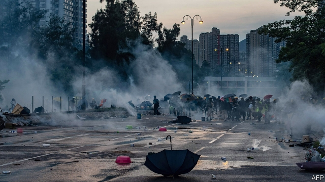

###### Staring into the abyss

# Chinese troops must stay off the streets of Hong Kong 

 

> print-edition iconPrint edition | Leaders | Aug 8th 2019 

IT IS SUMMER, and the heat is oppressive. Thousands of students have been protesting for weeks, demanding freedoms that the authorities are not prepared to countenance. Officials have warned them to go home, and they have paid no attention. Among the working population, going about its business, irritation combines with sympathy. Everybody is nervous about how this is going to end, but few expect an outcome as brutal as the massacre of hundreds and maybe thousands of citizens. 

Today, 30 years on, nobody knows how many were killed in and around Tiananmen Square, in that bloody culmination of student protests in Beijing on June 4th 1989. The Chinese regime’s blackout of information about that darkest of days is tacit admission of how momentous an event it was. But everybody knows that Tiananmen shaped the Chinese regime’s relations with the country and the world. Even a far less bloody intervention in Hong Kong would reverberate as widely (see article). 

What began as a movement against an extradition bill, which would have let criminal suspects in Hong Kong be handed over for trial by party-controlled courts in mainland China, has evolved into the biggest challenge from dissenters since Tiananmen. Activists are renewing demands for greater democracy in the territory. Some even want Hong Kong’s independence from China. Still more striking is the sheer size and persistence of the mass of ordinary people. A general strike called for August 5th disrupted the city’s airport and mass-transit network. Tens of thousands of civil servants defied their bosses to stage a peaceful public protest saying that they serve the people, not the current leadership. A very large number of mainstream Hong Kongers are signalling that they have no confidence in their rulers. 

As the protests have escalated, so has the rhetoric of China and the Hong Kong government. On August 5th Carrie Lam, the territory’s crippled leader, said that the territory was “on the verge of a very dangerous situation”. On August 6th an official from the Chinese government’s Hong Kong office felt the need to flesh out the implications. “We would like to make it clear to the very small group of unscrupulous and violent criminals and the dirty forces behind them: those who play with fire will perish by it.” Anybody wondering what this could mean should watch a video released by the Chinese army’s garrison in Hong Kong. It shows a soldier shouting “All consequences are at your own risk!” at rioters retreating before a phalanx of troops. 

The rhetoric is designed to scare the protesters off the streets. And yet the oppressive nature of Xi Jinping’s regime, the Communist Party’s ancient terror of unrest in the provinces and its historical willingness to use force, all point to the danger of something worse. If China were to send in the army, once an unthinkable idea, the risks would be not only to the demonstrators. 

Such an intervention would enrage Hong Kongers as much as the declaration of martial law in 1989 aroused the fury of Beijing’s residents. But the story would play out differently. The regime had more control over Beijing then than it does over Hong Kong now. In Beijing the party had cells in every workplace, with the power to terrorise those who had not been scared enough by the tanks. Its control over Hong Kong, where people have access to uncensored news, is much shakier. Some of the territory’s citizens would resist, directly or in a campaign of civil disobedience. The army could even end up using lethal force, even if that was not the original plan. 

With or without bloodshed, an intervention would undermine business confidence in Hong Kong and with it the fortunes of the many Chinese companies that rely on its stockmarket to raise capital. Hong Kong’s robust legal system, based on British common law, still makes it immensely valuable to a country that lacks credible courts of its own. The territory may account for a much smaller share of China’s GDP than when Britain handed it back to China in 1997, but it is still hugely important to the mainland. Cross-border bank lending booked in Hong Kong, much of it to Chinese companies, has more than doubled over the past two decades, and the number of multinational firms whose regional headquarters are in Hong Kong has risen by two-thirds. The sight of the army on the city’s streets would threaten to put an end to all that, as companies up sticks to calmer Asian bases. 

The intervention of the People’s Liberation Army would also change how the world sees Hong Kong. It would drive out many of the foreigners who have made Hong Kong their home, as well as Hong Kongers who, anticipating such an eventuality, have acquired emergency passports and boltholes elsewhere. And it would have a corrosive effect on China’s relations with the world. 

Hong Kong has already become a factor in the cold war that is developing between China and America. China is enraged by the high-level reception given in recent weeks to leading members of Hong Kong’s pro-democracy camp during visits to Washington. Their meetings with senior officials and members of Congress have been cited by China as evidence that America is a “black hand” behind the unrest, using it to pile pressure on the party as it battles with America over trade (a conflict that escalated this week, when China let its currency weaken—see article). 

Were the Chinese army to go so far as to shed protesters’ blood, relations would deteriorate further. American politicians would clamour for more sanctions, including suspension of the act that says Hong Kong should be treated as separate from the mainland, upon which its prosperity depends. China would hit back. Sino-American relations could go back to the dark days after Tiananmen, when the two countries struggled to remain on speaking terms and business ties slumped. Only this time, China is a great deal more powerful, and the tensions would be commensurately more alarming. 

None of this is inevitable. China has matured since 1989. It is more powerful, more confident and has an understanding of the role that prosperity plays in its stability—and of the role that Hong Kong plays in its prosperity. Certainly, the party remains as determined to retain power as it was 30 years ago. But Hong Kong is not Tiananmen Square, and 2019 is not 1989. Putting these protests down with the army would not reinforce China’s stability and prosperity. It would jeopardise them. ■ 
<<<<<<< HEAD

-- 

 单词注释:

1.abyss[ә'bis]:n. 深渊, 深邃, 地狱 

2.hong[hɔŋ]:n. （中国、日本的）行, 商行 

3.kong[kɔŋ]:n. 含锡砾石下的无矿基岩；钢 

4.Aug[]:abbr. 八月（August） 

5.oppressive[ә'presiv]:a. 压制性的, 压迫的, 沉重的 

6.countenance['kauntәnәns]:n. 面容, 面部表情, 支持, 镇定 

7.irritation[.iri'teiʃәn]:n. 刺激, 烦恼, 刺激物 [医] 刺激[作用], 兴奋 

8.brutal['bru:tәl]:a. 残忍的, 野蛮的, 不讲理的 

9.massacre['mæsәkә]:n. 大屠杀 vt. 大屠杀, 残杀 

10.bloody['blʌdi]:a. 血腥的, 嗜杀的, 有血的 

11.culmination[.kʌlmi'neiʃәn]:n. 顶点, 高潮, 最高点 

12.blackout['blækaut]:n. 灯火管制, 暂时的意识丧失, 灯火熄灭, 删除 [计] 电网掉电 

13.tacit['tæsit]:a. 沉默寡言的, 不苟言笑的, 缄默的 

14.momentous[mәu'mentәs]:a. 重大的, 重要的 

15.les[lei]:abbr. 发射脱离系统（Launch Escape System） 

16.intervention[.intә'venʃәn]:n. 插入, 介入, 调停 [经] 干预 

17.reverberate[ri'vә:bәreit]:vi. 回响, 反响, 被反射 vt. 使反响, 使回响, 反射 a. 回响的, 反射的 

18.extradition[.ekstrә'diʃәn]:n. 引渡逃犯, 亡命者送还本国 [法] 引渡 

19.dissenter[di'sentә]:n. 持异议者, 不同意者, 不顺从国教者 

20.activist['æktivist]:n. 激进主义分子 

21.sheer[ʃiә]:a. 绝对的, 全然的, 纯粹的, 透明的, 峻峭的 vi. 偏转, 偏航 vt. 使急转向, 使偏航 adv. 完全, 全然, 峻峭 n. 偏航 

22.persistence[pә'sistәns]:n. 固执, 坚持不懈, 持续(性), 存留(状态) [电] 持久 

23.disrupt[dis'rʌpt]:a. 分裂的, 中断的 vt. 使分裂, 使瓦解 

24.tens[]:十位 

25.defy[di'fai]:vt. 藐视, 挑衅, 使落空 n. 挑战 

26.mainstream['meinstri:m]:n. 主流 

27.escalate['eskәleit]:vi. 逐步扩大, 逐步升高, 逐步增强 vt. 使逐步上升 

28.rhetoric['retәrik]:n. 修辞, 修辞学, 雄辩(术) 

29.carrie['kæri]:n. 卡丽（女名, Caroline的昵称） 

30.lam[læm]:v. 打, 鞭笞, 逃脱 n. 逃亡 

31.verge[vә:dʒ]:n. 边缘, 边界, 起始点 vi. 处在边缘, 接近, 下沉, 趋向 

32.unscrupulous[.ʌn'skru:pjulәs]:a. 无道德原则的, 不审慎的, 肆无忌惮的 

33.perish['periʃ]:vi. 毁灭, 丧生, 凋谢, 颓丧, 死亡, 腐烂 vt. 毁坏, 使麻木, 使丧生, 耗尽 

34.garrison['gærisn]:n. 守备队, 驻军, 要塞 vt. 守备, 派兵驻守 

35.rioter['raiәtә]:n. 暴民, 暴徒, 纵情享乐者 [法] 暴徒, 骚乱者, 暴动者 

36.phalanx['fælæŋks]:n. 方阵, 密集队列, 密集的人群(或兽群), 指骨, 趾骨 [医] 指[趾]骨 

37.protester[]:n. 抗议者, 持异议者, 拒付者 [经] 反对者 

38.regime[rei'ʒi:m]:n. 政权, 当权期间, 政体, 社会制度, 体制, 情态 [医] 制度, 生活制度 

39.unthinkable[.ʌn'θiŋkәbl]:a. 不能考虑的, 不能想像的, 想像不到的, 不合理的 

40.demonstrator['demәnstreitә]:n. 论证者, 证明者, 指示者, 示威者 [医] 示教者 

41.enrage[in'reidʒ]:vt. 激怒, 使暴怒 

42.declaration[.deklә'reiʃәn]:n. 宣告, 说明, 宣布 [计] 说明 

43.martial['mɑ:ʃәl]:a. 战争的, 军事的, 尚武的, 威武的 [医] 含铁的 

44.fury['fjuri]:n. 愤怒, 狂暴, 狂怒的人 [医] 狂乱, 狂暴, 狂怒 

45.differently['difrentli]:adv. 差异, 不同, 各别, 各种 

46.terrorise['terәraiz]:vt. 使恐怖, 恐吓, 威胁, 胁迫 vi. 引起恐怖, 实行恐怖统治 

47.uncensored[.ʌn'sensәd]:a. 未经审查的, 无保留的 

48.shaky['ʃeiki]:a. 震动的, 摇晃的, 动摇的 

49.disobedience[.disә'bi:djәns]:n. 不服从, 不孝, 违反 

50.lethal['li:θәl]:a. 致命的 n. 致死因子 

51.bloodshed['blʌdʃed]:n. 流血 

52.undermine[.ʌndә'main]:vt. 在...下面挖, 渐渐破坏, 暗地里破坏 [法] 暗中破坏, 以阴谋中伤伤害 

53.stockmarket[s'tɒkmɑ:kɪt]: 证券市场; 证券交易所; 证券行情 

54.robust[rәu'bʌst]:a. 健康的, 强健的, 要用力气的, 坚定的, 粗野的 [计] 健壮性 

55.immensely[i'mensli]:adv. 无限地, 广大地, 庞大地 

56.credible['kredәbl]:a. 可信的, 可靠的 [法] 可信的, 可靠的 

57.hugely['hju:dʒli]:adv. 巨大地, 非常地 

58.multinational[.mʌlti'næʃәnl]:a. 多国的, 跨国公司的 n. 跨国公司 

59.regional['ri:dʒәnәl]:a. 地方的, 地域性的 [医] 区的, 部位的 

60.headquarter[,hed'kwɔ:tә]:vt. 将...的总部设在 

61.eventuality[i.ventʃu'æliti]:n. 可能发生的事, 可能性 

62.bolthole['bəʊlthəʊl]:n. 能躲避危险的地方 

63.corrosive[kә'rәusiv]:a. 腐蚀的, 腐蚀性的, 有害的 n. 腐蚀物, 腐蚀剂 

64.Washington['wɒʃiŋtn]:n. 华盛顿 

65.cite[sait]:vt. 引用, 引证, 表彰 [建] 引证, 指引 

66.deteriorate[di'tiәriәreit]:v. (使)恶化 

67.clamour['klæmә]:n. 喧闹 v. 大声地要求 

68.sanction['sæŋkʃәn]:n. 核准, 制裁, 处罚, 约束力 vt. 制定制裁规则, 认可, 核准, 同意 

69.slump[slʌmp]:n. 暴跌, 垂头弯腰的姿态 vi. 猛然掉落, 陷入, 衰落(经济等) 

70.commensurately[]:adv. 相当地, 相称地；同量地 

71.jeopardise[]:vt. 使受危险, 危及, 危害 [法] 使受危害, 使陷入危险, 危及 
=======
>>>>>>> 50f1fbac684ef65c788c2c3b1cb359dd2a904378

