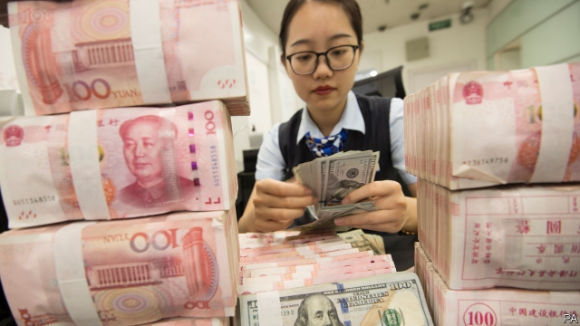
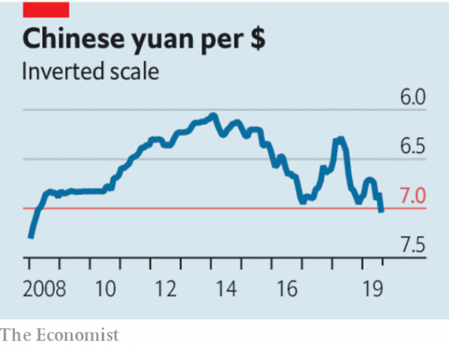

###### US-China trade

# Dangerous miscalculations 

 

> print-edition iconPrint edition | Leaders | Aug 8th 2019 

SINCE THE trade war began in 2018 the damage done to the global economy has been surprisingly slight. America has grown healthily and the rest of the world has muddled along. But this week the picture darkened as the confrontation between America and China escalated, with more tariffs threatened and a bitter row erupting over China’s exchange rate. Investors fear the dispute will trigger a recession, and there are ominous signs in the markets—share prices fell and government-bond yields sank to near-record lows. To avoid a downturn, both sides need to compromise. But for that to happen President Donald Trump and his advisers must rethink their strategy. If the realisation has not dawned yet, it soon should: America cannot have a cheap currency, a trade conflict and a thriving economy. 

The latest spike in tensions began on August 1st, when the White House threatened to impose a further round of duties on $300bn of Chinese exports by the start of September. China responded four days later by telling its state-run companies to stop buying American agricultural goods. On the same day it let its heavily managed currency pass through a rate of seven against the dollar, a threshold which may seem arbitrary but is symbolically important (see article). 

That lit a fuse beneath the Oval Office. Mr Trump has long claimed that other countries, including China, keep their currencies artificially cheap to boost their exports, hurting America. He has been griping about the strong dollar for months. In June he accused Mario Draghi, the head of the European Central Bank, of unfairly weakening the euro by hinting at rate cuts. Hours after the yuan dropped, America’s Treasury designated China a “currency manipulator” and promised to eliminate its “unfair competitive advantage”. As the hostilities rose, markets swooned, with ten-year bond yields in America reaching 1.71%, as investors judged that the Federal Reserve will slash interest rates to try to keep the expansion alive (see article). 

 

There is no denying that China has manipulated its exchange rate in the past. But today a different dynamic is playing out around the world. Mr Trump wants a booming economy, protected by tariffs and boosted by a cheap dollar, and when he doesn’t get them he lashes out. But economic reality makes these three objectives hard to reconcile. Tariffs hurt foreign exporters and dampen growth beyond America’s borders; weaker growth in turn leads to weaker currencies, as business becomes cautious and central banks ease policy in response. The effect is particularly pronounced when America is growing faster than other rich countries, as it has recently. The dollar’s enduring strength is a result, in part, of Mr Trump’s policies, not of a global conspiracy. 

Unless this fact sinks in soon, real harm will be done to the global economy. Faced with the uncertainty created by a vicious superpower brawl, firms in America and elsewhere are cutting investment, hurting growth further. Lower interest rates are making Europe’s rickety banks even more fragile. China could face a destabilising flood of money trying to leave its borders, as happened in 2015. And further escalation is possible as both sides reach for economic weapons that were considered unthinkable a few years ago. America could intervene to weaken the dollar, undermining its reputation for unfettered capital markets. China or America could impose sanctions on more of each other’s multinational firms, in the same way that America has blacklisted Huawei, or suspend the licences of banks that operate in both countries, causing havoc. 

As it pursues an ever more reckless trade confrontation, the White House may imagine that the Federal Reserve can ride to the rescue by cutting rates again. But that misunderstands the depth of unease now felt in factories, boardrooms and trading floors around the world. In September talks between America and China are set to resume. It is time for a settlement. The world economy cannot stand much more of this.■ 

-- 

 单词注释:

1.miscalculation[]:n. 算错, 失算, 估计错误 [计] 计算错误, 算错 

2.Aug[]:abbr. 八月（August） 

3.healthily['helθili]:adv. 健康地 

4.muddle['mʌdl]:vt. 混合, 使微醉, 使咬字不清晰 vi. 胡乱对付 n. 困惑, 混浊状态 

5.darken['dɑ:kn]:vt. 弄暗, 使模糊 vi. 暗下来, 颜色变深 

6.confrontation[.kɔnfrʌn'teiʃәn]:n. 对抗；对质；面对 

7.escalate['eskәleit]:vi. 逐步扩大, 逐步升高, 逐步增强 vt. 使逐步上升 

8.tariff['tærif]:n. 关税, 关税表, 价格表, 收费表 vt. 课以关税 [计] 价目表 

9.investor[in'vestә]:n. 投资者 [经] 投资者 

10.trigger['trigә]:n. 触发器, 扳机 vt. 触发, 发射, 引起 vi. 松开扳柄 [计] 切换开关 

11.recession[ri'seʃәn]:n. 后退, 凹处, 衰退, 归还 [医] 退缩 

12.ominous['ɒminәs]:a. 恶兆的, 不吉利的, 预兆的 

13.downturn['dauntә:n]:n. (尤指经济方面的)衰退, 下降趋势 [电] 低迷时期 

14.adviser[әd'vaizә]:n. 顾问, 劝告者, 指导教师 [法] 顾问, 劝告者 

15.rethink[ri:'θiŋk]:v. 再想, 重想 

16.realisation[.riәlai'zeiʃәn. ri:-. -li'z-]:n. 实现, 完成（等于realization） 

17.cannot['kænɒt]:aux. 无法, 不能 

18.spike[spaik]:n. 长钉, 鞋钉, 钉状物, 尖峰状物, 穗 vt. 以大钉钉牢, 用尖物刺穿, 阻止, 弃置不用 [计] 尖峰信号 

19.threshold['θreʃәuld]:n. 门槛, 入口, 开端, 阈 [计] 阈; 阈值 

20.symbolically[sɪm'bɒlɪklɪ]:adv. 象征性地 

21.fuse[fju:z]:n. 保险丝, 导火线 v. 熔化, 融合 

22.artificially[.ɑ:ti'fiʃәli]:adv. 人工地, 人为地, 不自然地 

23.gripe[graip]:n. 紧握, 柄, 把手, 控制 vt. 抓紧, 抱住, 使肠痛, 激怒 vi. 肠绞痛, 抱怨 

24.mario['mæriәj, 'mɑ:-]:n. 马里奥（男子名） 

25.Draghi[]:[网络] 行长德拉吉；总裁德拉吉；欧洲央行德拉吉 

26.unfairly[]:adv. 不正当地；不公平地 

27.euro['juәrәu]:n. 欧元（欧盟的统一货币单位） 

28.treasury['treʒәri]:n. 国库, 宝库, 财政部, 国库券 [经] 库存, 国库, 金库 

29.designate['dezigneit]:vt. 指定, 指明, 称呼 a. 已选出而未上任的 

30.manipulator[mә'nipjuleitә]:n. 操作者, 机械手 [化] 机械手 

31.hostility[hɒs'tiliti]:n. 敌意, 敌对, 反对 

32.swoon[swu:n]:n. 昏晕, 晕厥 vi. 昏晕, 着迷, 渐渐消失 

33.slash[slæʃ]:v. 猛砍, 乱砍 n. 猛砍, 乱砍, 删减 [计] 斜线 

34.manipulate[mә'nipjuleit]:vt. 操纵, 利用, 操作, 巧妙地处理, 假造 

35.lash[læʃ]:n. 鞭子, 鞭打, 睫毛, 责骂, 讽刺 vt. 鞭打, 摆动, 扎捆, 冲击, 讽刺, 煽动 vi. 冲洗, 鞭打, 责骂 

36.reconcile['rekәnsail]:vt. 使和解, 调停, 使和谐, 使一致, 使听从 [经] 对帐, 使一致 

37.exporter[ik'spɒ:tә]:n. 出口商, 输出者, 出口公司 [经] 出口商, 输出者 

38.dampen['dæmpәn]:vt. 弄湿, 使沮丧 vi. 变湿, 丧气 

39.conspiracy[kәn'spirәsi]:n. 同谋, 阴谋, 阴谋集团 [法] 阴谋, 通谋, 共谋 

40.uncertainty[.ʌn'sә:tnti]:n. 不确定, 不可靠, 不确定的事物 [化] 不确定度 

41.vicious['viʃәs]:a. 邪恶的, 堕落的, 品性不端的, 恶毒的, 恶性的, 有错误的 [医] 缺点的, 恶的 

42.superpower[.sju:pә'pauә]:n. 超级强权, 超级大国 [经] 超级大国 

43.brawl[brɒ:l]:n. 争吵 vi. 争吵, 哗哗地流水 

44.rickety['rikәti]:a. 患佝偻病的, 虚弱的, 摇摆的 [医] 佝偻病的 

45.destabilise[di:'steɪbɪlaɪz]:vt. 破坏政府的稳定 

46.escalation[.eskә'leiʃәn]:n. 扩大, 增加 [经] 调查, 价格调整 

47.unthinkable[.ʌn'θiŋkәbl]:a. 不能考虑的, 不能想像的, 想像不到的, 不合理的 

48.intervene[.intә'vi:n]:vi. 插入, 调停, 干涉 [经] 进场干预 

49.undermine[.ʌndә'main]:vt. 在...下面挖, 渐渐破坏, 暗地里破坏 [法] 暗中破坏, 以阴谋中伤伤害 

50.unfetter[.ʌn'fetә]:vt. 给...解开脚链, 释放, 使自由 [法] 除去...脚镣, 释放 

51.sanction['sæŋkʃәn]:n. 核准, 制裁, 处罚, 约束力 vt. 制定制裁规则, 认可, 核准, 同意 

52.multinational[.mʌlti'næʃәnl]:a. 多国的, 跨国公司的 n. 跨国公司 

53.blacklist['blæklist]:n. 黑名单 

54.huawei[]: 华为 

55.havoc['hævәk]:n. 大破坏, 蹂躏 vt. 严重破坏 

56.reckless['reklis]:a. 不介意的, 大意的, 鲁莽的, 不顾后果的 [法] 不注意的, 粗心大意的, 鲁莽的 

57.unease[.ʌn'i:z]:n. 不安 

58.boardroom['bɒ:drum]:n. 会议室, 证券交换场所 

