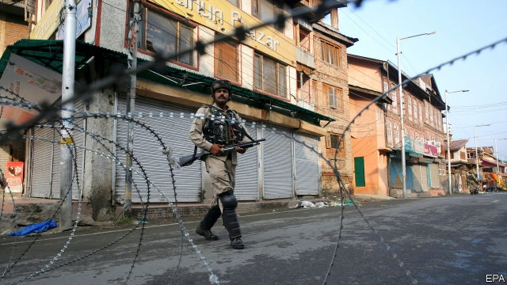

###### India’s constitution

# Modi’s revocation of Kashmir’s autonomy 

 

> print-edition iconPrint edition | Leaders | Aug 10th 2019 

WHEN THE princely state of Jammu & Kashmir joined the fledgling Indian union in October 1947, it had little choice in the matter. Pakistan-backed tribesmen had invaded; only Indian troops could repel them. The consolation was that Kashmir was promised a lot of autonomy. That came to include trappings of statehood—a separate constitution and flag—and more substantial differences, such as a ban on outsiders buying property. 

On August 5th the government of Narendra Modi, India’s prime minister, tore up this compact. That has electrified his Hindu-nationalist supporters, who want Kashmir, India’s only Muslim-majority state, brought to heel. But it is likely to unleash forces that do just the opposite. 

Mr Modi’s plan is far-reaching. Jammu & Kashmir, already split into two in 1947 when Pakistan grabbed one-third of it, has been divided further, with the high desert of Ladakh hived off into a separate entity. Both the new parts were demoted from constituents of a fully fledged state to mere “union territories”, ruled from New Delhi. And Article 370 of India’s constitution has been gutted, thus eliminating Kashmir’s autonomy at a stroke.  

The repeal of that provision has been a totemic issue to Hindu nationalists for decades. In their view, the state’s political privileges have fanned the flames of separatism by encouraging Kashmiris to view themselves as irredeemably different from other Indians. Direct rule would bypass Kashmir’s fossilised political dynasties, dragging the state into the political mainstream. 

That is a forlorn hope. For one thing, Mr Modi enacted the change through repression and subterfuge. Kashmiri political leaders were arrested, internet and phone networks were shut down and public assembly was forbidden. In the week before the move 30,000 troops were sent into the region, and another 8,000 afterwards. The government has also resorted to constitutional chicanery, exploiting the fact that Kashmir’s state legislature—which would normally have to assent to such changes—was dissolved over a year ago. India’s Supreme Court ought to look unkindly on such legal sleight of hand, which would allow any other state to be similarly conjured out of existence. 

Second, the move is likely to compound Kashmiris’ mistrust of the Indian government. The autonomy they were promised in the republic’s earliest years had already been whittled down. As early as the 1950s, the state’s independent-minded political leaders were occasionally jailed. The government’s rigging of an election in 1987 sparked an insurgency, stoked by Pakistan. Violence, which had subsided for many years, has ticked up recently, notably after the killing of a charismatic militant leader in 2016. Local people are angry and disillusioned. Turnout in this year’s national elections was less than 30% in Kashmir and a dismal 14% in the capital, Srinagar, compared with a national average of 62%. 

But, as Kashmir’s bloody history suggests, things can get much worse. The potential demographic impact of the loss of autonomy might be its most incendiary consequence. Many fear that the removal of restrictions on ownership of land and property by outsiders, which were embedded in its constitutional deal, will lead to an influx of Hindu immigration. The gloomiest Indian observers have drawn comparisons to China’s Sinicisation of Tibet and Xinjiang. 

Lastly, there may be ripples beyond Kashmir (see article). Those of India’s north-eastern states that also have been granted extra autonomy are worried that their own constitutional carve-outs may be under threat. And Pakistan has reacted to Mr Modi’s move with a promise to “exercise all possible options to counter the illegal steps”, which might include increasing support for jihadist groups. Although it is incumbent on Pakistan to clamp down on its proxies, the angrier Kashmiris are, the easier it is for Pakistani warmongers to recruit them. That increases the risk of military escalation—which, between two nuclear-armed states, is a frightening prospect. 

Mr Modi portrays himself as a leader who is willing to break boldly with convention—from the botched withdrawal in 2016 of most cash in circulation to the (commendable) abolition of instant Islamic divorce on July 30th. He is emboldened by a towering majority in parliament, won in an election earlier this year, and pliant opposition parties. Yet his shake-up of Kashmir is an unmistakable signal of how he intends to exercise that power. He might now turn to other Hindu nationalist fixations, such as the construction of a temple on the site of a mosque razed by a radical Hindu mob in 1992. Mr Modi is setting himself more firmly on the path of zealous nationalism, ideological purity and religious chauvinism. It will lead nowhere good. ■ 

