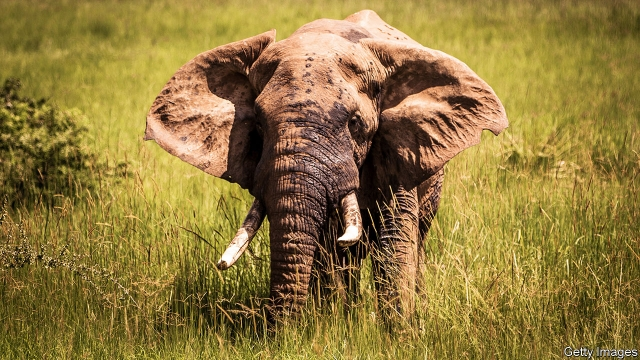

###### Elephant in the room

# The ban on trading ivory is unfair but necessary 

 

> print-edition iconPrint edition | Leaders | Aug 10th 2019 

NEARLY 6,000 species of animals and about 30,000 species of plants are listed in the various appendices of the Convention on International Trade in Endangered Species (CITES) to protect them against over-exploitation. But as CITES convenes its three-yearly decision-making conference in Geneva this month, one animal, as so often in the past, will attract much of the attention: the African elephant. 

The elephant is in many ways CITES’s mascot. It was rescued in 1989 from what seemed inevitable extinction after half the population had been wiped out by poaching in just a decade. That year elephants were included in CITES’s Appendix I, under which virtually all international trade in their products is banned. The slaughter slowed. This month’s meeting will consider competing proposals about how absolute the ban should be, since in some countries elephant populations have recovered (see article). Countries seeking a modest relaxation have a strong case to make. But it is not strong enough. The ban must stay. 

Understandably, countries that have done a good job protecting their elephants feel this is unfair. They point out that they have devoted huge resources to the elephant, through the costs of law enforcement alone. And the real burden of all this is borne by poor local people who are in competition with wildlife for resources, and sometimes in conflict with it—elephants can be destructive. People and governments, so the argument goes, need to have an economic stake in the elephants’ survival. The ivory trade would give them one. 

That’s why Zambia wants its elephants moved to the slightly less restrictive Appendix II, which would allow some trade in, for example, hunting trophies. Four other southern African countries (Botswana, Namibia, South Africa and Zimbabwe), whose elephants were moved to Appendix II 20 years ago, want to be allowed to trade in their products, which, despite the change in status, they have mostly been prohibited from doing. 

To understand why these reasonable-sounding proposals should be rejected, consider what has happened to elephant numbers since CITES most recently authorised some legal trade, when Botswana, Namibia and South Africa were allowed in 2007 to sell a fixed amount of ivory to Japan, as a one-off. Elephant numbers started falling again. A survey conducted in 2014-15 estimated that elephant numbers had fallen by 30% across 18 countries since 2007; another estimated a decline of over 100,000 elephants, a fifth of the total number, between 2006 and 2015. Increased poaching was at least partly to blame. 

These numbers suggest that the existence of even a small legal market increases the incentive for poaching. It allows black-marketeers to pass off illegal ivory as the legal variety, and it sustains demand. The biggest market is in China. Last year the government banned domestic sales of ivory, but its customs officials seize a lot of smuggled products—notably from Japan, which CITES licensed as a market in 2007. For the poachers, ivory is fungible. If it is hard to secure in Zambia or Botswana, another country’s elephants will be in the gun-sights. Congo, Mozambique and, especially, Tanzania, have seen sharp declines. Unfair though it is, countries with better-run conservation programmes are, in effect, paying for the failings of those with feeble institutions. 

In the long run technology can help make trade compatible with conservation. In better-resourced national parks, drones are used to make it easier for rangers to spot poachers. DNA testing of ivory shipments can establish where they came from, and thus whether they are legal. As prices fall and countries get richer, both technologies are likely to spread. 

The objection to trade in products of endangered species is not moral, it is pragmatic. When the world is confident that it will boost elephant numbers rather than wipe them out, the ivory trade should be encouraged. Regrettably, that point has not yet come. And until it does, the best hope for the elephant—and even more endangered species, such as rhinos—lies not in easing the ban on trading their products, but in enforcing it better. ■ 

-- 

 单词注释:

1.ivory['aivәri]:n. 象牙, 乳白色 a. 象牙制的, 乳白色的 

2.Aug[]:abbr. 八月（August） 

3.specie['spi:ʃi]:n. 硬币 [经] 硬币 

4.endanger[in'deindʒә]:vt. 危及 [法] 使危险, 危及 

5.cite[sait]:vt. 引用, 引证, 表彰 [建] 引证, 指引 

6.convene[kәn'vi:n]:vt. 集合, 召集, 召唤 vi. 聚集, 集合 

7.Geneva[dʒi'ni:vә]:n. 日内瓦, (荷兰)杜松子酒 

8.mascot['mæskәt]:n. 福神, 吉祥的东西 

9.extinction[ik'stiŋkʃәn]:n. 消失, 消灭, 废止 [化] 消光; 熄灭 

10.poach[pәutʃ]:vt. 水煮(蛋), 偷猎, 侵入, 窃取 vi. 偷猎, 陷入泥中 

11.slaughter['slɒ:tә]:n. 残杀, 屠杀, 杀戮 vt. 残杀, 屠杀, 亏本出售 

12.relaxation[.ri:læk'seiʃәn]:n. 松弛, 放松, 减轻, 缓和, 休息, 休养 [化] 松弛; 驰豫 

13.understandably[]:adv. 可懂, 可了解, 可理解 

14.enforcement[in'fɒ:smәnt]:n. 执行, 强制 [法] 实施, 加强, 厉行 

15.Zambia['zæmbiә]:n. 赞比亚 [经] 赞比亚 

16.les[lei]:abbr. 发射脱离系统（Launch Escape System） 

17.restrictive[ri'striktiv]:a. 限制的, 约束的, 限定的 n. 限制词 

18.ii[]:abbr. 微光（Image Intensification） 

19.trophy['trәufi]:n. 战利品, 奖品 vt. 用战利品装饰 

20.botswana[bɔt'swɑ:nә]:n. 博茨瓦纳（非洲中南部国家） 

21.Namibia[nә'mi:biә]:n. 纳米比亚 

22.Zimbabwe[zim'bɑ:bwei]:n. 津巴布韦 

23.statu[]:[网络] 状态查看；雕像；特级雪花白 

24.authorise['ɔ:θәraiz]:vt. 授权；批准；允许；委任（等于authorize） 

25.incentive[in'sentiv]:n. 动机 a. 激励的 

26.smuggle['smʌgl]:vt. 偷运, 走私, 私运 vi. 走私 

27.poacher['pәutʃә]:n. 偷猎者, 侵入者, 炖蛋锅 

28.fungible['fʌndʒibl]:a. 可取代的, 代替的 n. 代替物 

29.Congo['kɔŋ^әu]:n. 刚果, 刚果河, 工夫茶 [建] 刚果, 直接刚果红 

30.Mozambique[.mәuzәm'bi:k]:n. 莫桑比克 

31.Tanzania[.tænzә'ni:ә]:n. 坦桑尼亚 

32.failing['feiliŋ]:n. 失败, 缺点 prep. 如果没有... a. 失败的 

33.compatible[kәm'pætәbl]:a. 能共处的, 可并立的, 适合的 [计] 相容的; 兼容的 

34.drone[drәun]:n. 雄蜂, 懒惰者, 嗡嗡的声音, 无人驾驶飞机(或船) vi. 嗡嗡作声, 混日子 vt. 低沉地说 

35.ranger['reinʒә]:n. 王室守林人, 骑警, 漫游者 

36.DNA[]:脱氧核糖核酸 [计] 无效数据, 数字网络体系结构, 分布式网络体系结构 

37.shipment['ʃipmәnt]:n. 装船, 出货 [经] 运送, 运送(寄出)货物, 装载 

38.pragmatic[præ^'mætik]:a. 忙碌的, 爱管闲事的, 自负的, 固执己见的, 实际的, 务实的, 国事的, 国务的 [法] 闲断的, 固执己见的, 实用主义的 

39.regrettably[ri'^retәbli]:adv. 抱歉地, 遗憾地,可悲地 

